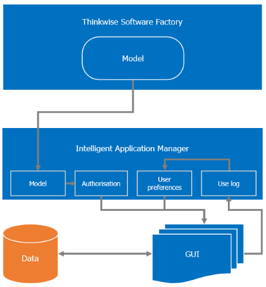

The Thinkwise Intelligent Application Manager (IAM) provides authorization, analysis and user preferences for applications developed with the Thinkwise Software Factory.

Users and user groups can be created manually or imported from Active Directory and assigned to roles, which define the required rights for a specific task. In addition, it is possible to define preferences for users and for user groups, such as themes, menus and prefilters.

*Intelligent Application Manager*

The runtime components of the Thinkwise platform interpret the model from the Intelligent Application Manager together with the authorization settings and user preferences, creating a personalized application for every user.

The *Administrator's guide* describes the steps required to make an application available via the Intelligent Application Manager and define the roles for an application in IAM. This is usually done by a developer as it requires detailed knowledge of the applications functionality.

The *Manager's guide* describes the process of creating users and user groups, and assigning roles to user groups. 

*The Intelligent Application Manager*

