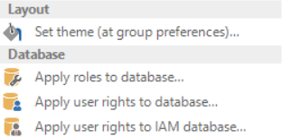

An application is a combination of a project with a project version, a server and a database that will appear as a standalone application in the GUI. A project version can therefore result in several applications on different servers and/or for different databases. Each application has its own authorisation and user preferences. These applications are prepared by the Application Administrator. The responsibility of the developer stops here and the task of the IAM administrator starts.

## Authorisation

The user groups are linked to the application on the authorisation tab. This can of course only take place after user groups have been created. This is described in paragraph 2.2.

*How is a user group linked in practice?*

When the groups are created they appear in a list view during the authorisation process. These are however printed in italics and light grey. The check mark in front of the name is unchecked. The roles are displayed in the list on the right of the screen.

*What are roles?*

Roles are created by the Head Administrator or the Project Administrator/Owner and include a set of system functions. For example, a process within an end product, such as the creation and sending of invoices can be a role. Since the roles have already been created by someone who has been involved with the development of the application it is easier for the IAM administrator to give the correct rights to a user group.

The IAM administrator can quickly set up the authorisation by selecting a user group on the Authorisation screen and then checking the roles to which this user group has rights on the right of the screen.

> This combination of roles and groups provides more logic when setting up the authorisation. There can be a user group 'HR' which includes the roles 'Hire employees', 'Approve vacation days' and 'Salary administration'. Which specific rights are assigned to which components for a role are no longer important for the IAM administrator. The administrator must be able to deduce the purpose of a role from its name.

## Application tasks

There are various tasks available within the Applications component.

### Setting up themes 

A default theme can be set up here as a group preference for all groups within one application.

### Apply roles and rights to the database 

Roles and rights can be implemented on the database so that they become available in the end product.

## Group preferences

A number of preferences can be set up for each group which apply for the entire group. If a user is a member of several groups and a conflict arises between different preferences from the different groups, such as a different layout, he will receive the preferences of the user group with the lowest number as priority. Priority 1 therefore takes precedence over priority 8. This priority is defined on the 'Form' tab.

### Platforms

Define here which theme and default menu should be started for each platform.

### Applications

Furthermore it can be defined whether the application is loaded at start up.

### Start objects

Start objects are components of an application that are automatically loaded during start up. The screens in which a user mostly works can be immediately started without having to select them in the menu. This can be set for tables, tasks, reports and processes.

When use is made of 'Start objects', the application, of which the start object forms a part, has to be loaded during the start up of the system. If this is not the case, then the start object will start when the application starts up.

### Default prefilters

The default prefilters can changed in this component. Prefilters that were disabled, can be enabled as default and prefilters that were enabled can be disabled as default.