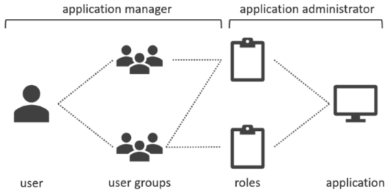
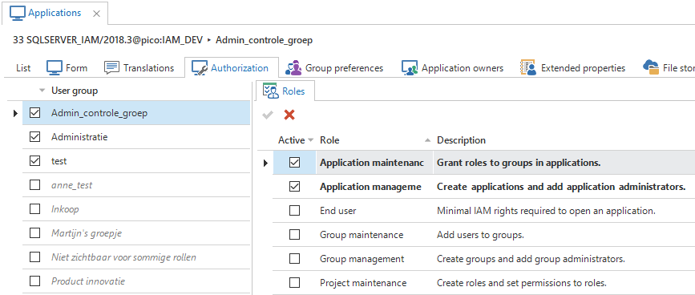

An application in the Intelligent Application Manager is a combination of a project version, a server and a database that will appear as a standalone application in the user interfaces. A project version can therefore result in several applications on different servers and/or for different databases. Each application has its own authorization and user preferences. 

Roles are distinct tasks or activities within an application. They are often named after the corresponding activity, like *Approve hours* or *Report a ticket*.

Applications and roles are created by the application **administrator**. The application **manager** is responsible for granting users access to those applications, by creating users and user groups and assigning roles for specific applications to those user groups. 


*Authorization overview*

## Authorization

User groups are linked to roles on the *Authorization* tab page of the *Applications* screen. Checkboxes next to the user group indicate if any roles are assigned to the user group.

To grant a user group access to the application, select a user group from the list and then check the roles to which this user group needs access on the right of the screen. 


*Linking roles to user groups*

### Apply rights

Tasks are available to apply the required rights to the databases:

| Task                                                         |                                                              |
| ------------------------------------------------------------ | ------------------------------------------------------------ |
|  Apply user rights | Creates the users and user groups on the application database |
|  Apply user rights to IAM | Creates the users on the IAM database                        |

To be able to apply the rights to a SQL Server database, an application manager that is not a database system administrator needs additional database rights. This can be done using the following code snippet:

```sql
use [iam_database]
go

grant alter any user to [login_name]
go

use [application_database]
go

grant alter any user to [login_name]
go

use master
go

grant alter any login to [login_name]
go
```

