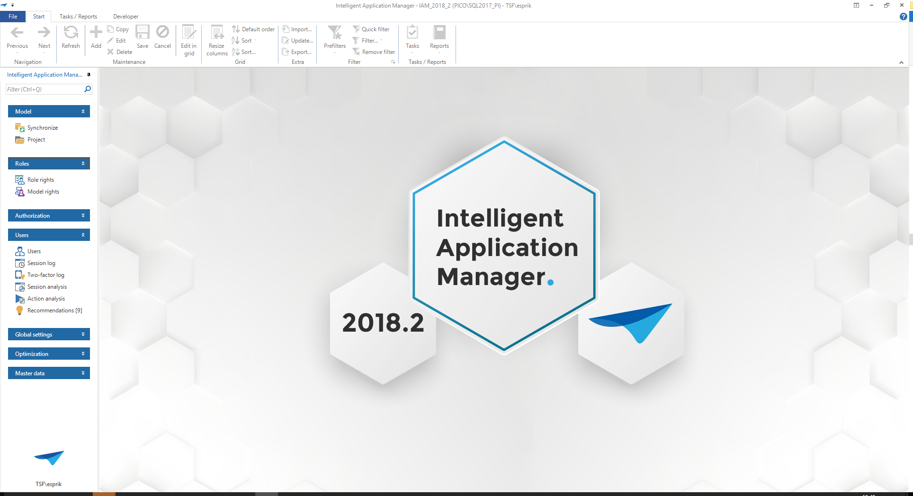

With the help of the Thinkwise Intelligent Application Manager applications developed with the Thinkwise Software Factory can be authorised, analysed and provided with user preferences.

User groups can be created, to which users can be added. These groups can be assigned to roles. These roles are provided with a set of rights. In addition, it is possible to define preferences for users and for user groups, such as layout, menu and prefilters.

Users get one user interface via the Intelligent Application Manager with which they can access all applications for which (via an users group) they are authorised. In addition, they can define their own user interface by means of user preferences.

The structure of this manual follows the same structure as is also specified in the Intelligent Application Manager. By following this structure an application is configured step by step and made available for the end user.

[](../assets/iam_dev/Figure 1: Intelligent Application Manager

Set up
======

The purpose of the administrator is to provide the user with access to the application. There are a number of important steps to achieve this. For instance, user groups must first be created, to which the users are linked. The rights are always assigned at group level and this will be further described in the coming chapters.

There are different types of administrators with different rights. This is done, so that the IAM can be set up by various people who can each organize matters for their components. The types of administrators that are recognized will be examined in the following paragraph.

### Types of administrator

The Intelligent Application Manager has different kinds of administrators. For example, some administrators may synchronize new project versions and other administrators are responsible for creating user groups and users. There are eight levels defined to set up the rights for each administrator. Which are described in the section below.

In this manual it is assumed that the IAM administrator has the rights on the following roles:

-   Application Owner

-   Group Administrator

-   Group Owner

-   User Administrator

-   Simulator

This implies that this administrator is not involved with the first four roles, within which among other things the synchronization of new project versions and creating new applications fall. We briefly mention this in this manual to outline a total picture of the possible administrator types.

[](../assets/iam_dev/Figure 2: Administrator\'s overview

The above figure comes from the menu component 'Users' under the tab 'Administrators'. The type of administrators are here assigned to a user.

#### Head Administrator

This type of administrator has rights on all components within the IAM. This implies that he is responsible for the synchronization of new project versions, but he can also define new roles, applications, groups and users.

#### Project Administrator

The Project Administrator may synchronize new projects and create roles. In addition, he can also define Project Owners.

#### Project Owner

The Project Owner may administer new roles for his own projects. This implies that he can create, modify and delete roles for the projects for which he is the owner.

#### Application Administrator

The Application Administrator may create new applications and link the roles that have been created by the Project Owner or Administrator to groups. These groups must first have been created by the Group Administrator. In addition, he can also define Application Owners.

The following administrator types are available for this IAM administrator:

#### Application Owner

The Application Owner can link roles that have been created by the Project Owner or Administrator to groups within the application for which he is the owner. These groups must first have been created by the Group Administrator.

#### Group Administrator

The Group Administrator may create new groups and link users to them. These users must first be created by the User Administrator. In addition, he can also define Group Owners.

#### Group Owner

The Group Owner may link users to the groups for which he is the owner.

#### User Administrator

The User Administrator can create new users.

#### Simulator

The simulator is a special function. This function is able to simulate other users.

To check the specified user preferences or to answer questions from a user, the administrator can log in to simulate a specific user. This is done by logging in with the administrator\'s user name and password and then by pressing the button next to the password.

[](../assets/iam_dev/Figure 3: Simulate users

An extra option appears to enter the user name of the user, who must be simulated.

[](../assets/iam_dev/Figure 4: Simulate users part 2

**Tip**

To simulate users, it is necessary that the pop-up is displayed. When this normally speaking does not occur because a Windows authentication is used then this can still be called by starting the user interface with the Ctrl-key pressed

Applications
------------

An application is a combination of a project with a project version, a server and a database that will appear as a standalone application in the GUI. A project version can therefore result in several applications on different servers and/or for different databases. Each application has its own authorisation and user preferences. These applications are prepared by the Application Administrator. The responsibility of the developer stops here and the task of the IAM administrator starts.

### Authorisation

The user groups are linked to the application on the authorisation tab. This can of course only take place after user groups have been created. This is described in paragraph 2.2.

*How is a user group linked in practice?*

When the groups are created they appear in a list view during the authorisation process. These are however printed in italics and light grey. The check mark in front of the name is unchecked. The roles are displayed in the list on the right of the screen.

*What are roles?*

Roles are created by the Head Administrator or the Project Administrator/Owner and include a set of system functions. For example, a process within an end product, such as the creation and sending of invoices can be a role. Since the roles have already been created by someone who has been involved with the development of the application it is easier for the IAM administrator to give the correct rights to a user group.

The IAM administrator can quickly set up the authorisation by selecting a user group on the Authorisation screen and then checking the roles to which this user group has rights on the right of the screen.

**EXAMPLE**

This combination of roles and groups provides more logic when setting up the authorisation. There can be a user group 'HR' which includes the roles 'Hire employees', 'Approve vacation days' and 'Salary administration'. Which specific rights are assigned to which components for a role are no longer important for the IAM administrator. The administrator must be able to deduce the purpose of a role from its name.

### Application tasks

There are various tasks available within the Applications component.

[](../assets/iam_dev/Figure 5: Various available tasks

#### Setting up themes 

A default theme can be set up here as a group preference for all groups within one application.

#### Apply roles and rights to the database 

Roles and rights can be implemented on the database so that they become available in the end product.

### Group preferences

A number of preferences can be set up for each group which apply for the entire group. If a user is a member of several groups and a conflict arises between different preferences from the different groups, such as a different layout, he will receive the preferences of the user group with the lowest number as priority. Priority 1 therefore takes precedence over priority 8. This priority is defined on the 'Form' tab.

#### Platforms

Define here which theme and default menu should be started for each platform.

#### Applications

Furthermore it can be defined whether the application is loaded at start up.

#### Start objects

Start objects are components of an application that are automatically loaded during start up. The screens in which a user mostly works can be immediately started without having to select them in the menu. This can be set for tables, tasks, reports and processes.

When use is made of 'Start objects', the application, of which the start object forms a part, has to be loaded during the start up of the system. If this is not the case, then the start object will start when the application starts up.

#### Default prefilters

The default prefilters can changed in this component. Prefilters that were disabled, can be enabled as default and prefilters that were enabled can be disabled as default.

User groups
-----------

User groups exist in IAM to make the link between a user and what he may and can do within the end product. On the one hand the users are linked to a user group and on the other hand various roles, as described in the previous paragraph, are linked to a user group.

A user group is often a department within an organization. For example, there can be a user group for purchasing or sales. However a group also frequently refers to a more specific group within a department, such as the group of purchasers and group of purchasing managers.

What is not intended is that the groups are defined at a task or process level. This is namely the role level and makes the application very complex. If we take one of the groups from our example above then we could get the following structure:

Group: Project manager

Roles:

-   Setting up projects

-   Assign employees

-   Schedule employees

-   Check the progress of the project

-   Check the hours

What we see in the above structure is that one group almost always gets several roles assigned. Because these roles are already defined by the developer it is the administrator\'s job to distribute the correct roles across the groups.

Since in many organizations an employee is often involved with several departments or is involved within a department with various processes it is possible to also link a user to several groups. When this has been done he gets the rights to a combination of all roles that fall under the groups of which he is a member. Particularly when the above mentioned structure is used an employee will often be assigned in several groups.

**TIP**

You can also link all users to a general group for roles that may be carried out by everybody, for example, an "All employees" group with the roles "Enter hours", "Report issues"

The advantage of configuring user groups at a department level is that this makes the addition of a user much easier, because in all probability there are fewer departments to which the user must be linked. Furthermore, when use is made of Active Directory groups within the organization, it is possible to take over this structure in the IAM via 'Update Active Directory group'.

[](../assets/iam_dev/Figure 6: Update Active Directory group

**Note**

Importing Windows groups is only possible on an SQL Server database. To be able to use this functionality Ad hoc Distributed Queries must be installed in the database

### Create user groups

Creating user groups takes place in the 'User groups' component.

 database using the 'Specific' option.

-   Windows domain; using this option the users in this group are administered via the Windows domain. After adding or modifying users the 'Update Active Directory group ...' must be executed. This task updates the Active Directory data with the user group, reads the users from the Windows domain, creates these users in IAM and adds them to the user group. When there are already users linked in the group, these will first be removed from the group.

### Authorisation

When the user groups have been created the roles can then be linked to them. This is done on the 'Authorisation' tab.

There is a list of the applications on the left and a list of the roles on the right. When we now select an application we can check which roles belong with this group in the role list. This application is now no longer shown in italics and the check mark for the group is checked.

[](../assets/iam_dev/Figure 8: Authorisation

### Add users to user group

The last step is now to also link the users to the user group. Users must first be created in IAM before this can happen. This is described in the following chapter.

If the users are already available in IAM, then they can be added to the groups on this screen. We add 'new' users with the plus button.

When adding a user to a group the start and end date of the membership of this user group can also be defined. When a user is a temporary member of a group then this function can be used for this. When the period expires the membership also expires and the user is set to inactive.

[](../assets/iam_dev/Figure 9: Set up membership period

### Group Owners

When several owners can administer this group, they can be added as group owner to the selected group. They may now add new users to this group.

[](../assets/iam_dev/Figure 10: Set up Group Owners

Users
=====

This chapter deals with the users component. It discusses how users must be added and which settings can be provided for each user.

Users 
------

Users are persons who make use of the end application. They must be added in IAM to make sure that they have the correct rights on the end application. They will not be able to login without first adding them in IAM.

### Add users

A number of details have to be entered when adding a user. Among others the user id is entered under the component 'General'. This the Windows domain login, database user, Kerberos user or an identifying name. The first name and surname are then entered.

[](../assets/iam_dev/Figure 11: Add users

There are 4 methods with which authentication can be obtained; RDBMS, Windows, Kerberos and IAM.

With IAM authentication users can only log in via the Web GUI and Mobile GUI. IAM authentication is intended to simplify the administration of large numbers of Intelligent Application Manager users. IAM authentication users are only registered in the Intelligent Application Manager and not in the database. During login the account details are validated in the Intelligent Application Manager instead of in the database. The password is irreversibly encrypted in the database. This can be changed with the task 'Modify password'.

If the choice is made for RDBMS or IAM then additional settings are displayed for the password administration. An initial password can be given for RDBMS.

This password is used to generate a script for creating users on the database. Furthermore it can be used to keep track of the initial password and communicate this to users. This password is **not** used automatically. For RDBMS authentication the password must be changed in the database itself and for IAM authentication the "Change Password" task must be used.

The "Changes allowed" check mark indicates whether users are allowed to change their password from the GUI. If users are allowed to change their password, there are three options for the status of the password:

-   Not expired:

    -   The user can simply use the current password;

-   Change after login:

    -   After the user has logged in with his current password, he must change the password;

-   Reset before login:

    -   When the user logs in, the password is not validated. The user has to change his password, as is done when resetting the password. In other words he has to enter a generated code, receive an email, enter the validation code given in the email and specify a new password.

The system keeps track of how often a password is changed or forgotten. This number is incremented every time the user requests a new password or changes his password from the GUI. The number of times the user has forgotten his password is also incremented if the password is changed by the administrator.

Under the heading user preferences is indicated which language will be used as default when starting the application. In addition, it can indicated here which type of user preferences will be applied for this user. Because it is not always desirable to set up user preferences separately for every user it is possible to create a set, or several sets, of preferences. These can be linked to all users when a user is added in IAM.

**TIP**

A [non](../assets/iam_dev/ System Admin user who want to allocate the users to the database will need some extra rights. By using the next script this is arranged:

use \[IAM\]

GO

GRANT ALTER ANY USER TO \[LOGIN\_NAME\]

GO

use \[END PRODUCT\]

GO

GRANT ALTER ANY USER TO \[LOGIN\_NAME\]

GO

use \[MASTER\]

GO

GRANT ALTER ANY LOGIN TO \[LOGIN\_NAME\]

GO

Under the heading 'Login verification' it is indicated which authentication method is used. There are 4 options:

-   Only password; user log in by using only their password.

-   Password + email; users
-    log in by using their password and a code that is sent to them by email.

-   Password + SMS; users log in by using their password and a code that is sent to them by SMS.

-   Password + TOTP; users log in by using their password and a code that is generated by an TOTP authenticator.

#### Login with email

To use email two-factor authentication in the Web GUI the settings below need to be configured in the settings.ini file or in IAM. For the Mobile GUI, the settings below need to be configured in the appsettings of the Web.config file of the application service used by the Mobile GUI.

  Parameter                      Description
  ------------------------------ ---------------------------------------------------------------------------------------------------------------------------------------------------------------------------------------------------------------------
  TwoFactorEmailMessageService   This parameter indicates which email implementation is used for Email two-factor authentication. Additional implementations may be added in the future, but for now, the only valid value is TSFSmtpMessageService.
  SmtpServer                     The address of the SMTP server used to send the email.
  SmtpPort                       The port which the SMTP server listens on.
  SmtpEnableSSL                  Whether SSL will be used to provide transport-level encryption (yes/no).
  SmtpUser                       The username used to authenticate with the SMTP server.
  SmtpPassword                   The password used to authenticate with the SMTP server.
  SmtpFrom                       The email address used to send the email to the user.
  SmtpFromDisplayName            The display name shown to the user as the sender of the email.

#### Login with SMS

To use SMS two-factor authentication in the Web GUI the settings below need to be configured in the settings.ini file or in IAM. For the Mobile GUI, the settings below need to be configured in the appsettings of the Web.config file of the application service used by the Mobile GUI.

  Parameter                    Description
  ---------------------------- ----------------------------------------------------------------------------------------------------------------------------------------------------------------------------------------------------------------------------------
  TwoFactorSmsMessageService   This parameter indicates which service implementation is used for SMS two-factor authentication. Additional service implementations may be added in the future, but for now, the only valid value is TSFTwilioSmsMessageService.
  TwilioAccountSid             The *SID* of your Twilio account. This information can be found in Twilio's Console Dashboard.
  TwilioAccountAuthToken       The *Auth Token* of your Twilio account. This information can be found in Twilio's Console Dashboard.
  TwilioFromNumber             The Twilio phone number used to send the SMS message to the user.

#### Login with TOTP (2-factor authentication)

It is possible to enable 2-factor authentication based on TOTP (time-based one-time password). This can be set for each user, under the "Authentication" header.

[](../assets/iam_dev/Figure 12: User with TOTP token verification

It is possible to allow a fallback two-factor authentication for a user, in case they lose the phone they use for TOTP. This can be allowed by enabling "Allow change TOTP device". If enabled, users can authenticate using their email, upon which they are prompted to reconfigure TOTP. If the user has successfully registered their TOTP device, the "TOTP device registered" checkbox will be checked.      

When the mobile device is lost, it is possible to disconnect this device with the task "Reset TOTP device".

### User preferences sets

To give the users the option of storing their user preferences a configuration must be selected under 'Configuration id' within the form group \'User preferences\'. Five configurations are provided as default: None, Resize, Move, On\_Off, Complete. These configurations succeed each other with regard to the possibilities that the user has.

[](../assets/iam_dev/Figure 13: User authentication settings

#### None

This is the default setting, unless this is modified by the administrator. Users cannot modify user preferences. The entire user preferences ribbon is not visible for the users.

#### Resize

Users can collapse and expand their menu and ribbon. Furthermore they can change the sort sequence and column width in a grid view.

#### Move

The user has the same possibilities as in the 'Resize' configuration plus the possibility to determine their own start objects and set the sort sequence of all components.

#### On\_Off

With this option the user has all options available, including changing the application language. The only option that is not available, is changing his screen types.

#### Complete

As the name already indicates the user can change all user settings.

Own configurations can be created together with the predefined configurations.

One of the configurations can be defined as default for all users so that this set up is applied when adding a new user.

[](../assets/iam_dev/Figure 14: UP availability

Under the heading 'Period' it can be indicated for a user when access to the applications begins and ends. After this end date has elapsed access for the user to the end application will be automatically denied.

The last heading is 'Additional information'. If the organization uses employee numbers this number can be entered in the appropriate field.

 are settings to modify the application in accordance with personal preferences. These settings are registered in the Intelligent Application Manager so that they are available on all platforms.

[](../assets/iam_dev/Figure 16: Set up user preferences

#### Global

It can be specified here for each user whether the ribbon and a menubar should be displayed.

#### Platform

Define here which theme and default menu should be started for each platform.

#### Applications

Furthermore, you can define whether the application is loaded at start up and which position it takes in the quick launch toolbar.

#### Quick launch toolbar groups

It can be defined in this component whether, and which, quick launch toolbar group is opened when starting up the GUI application and in which sequence the quick launch toolbar groups are displayed in the quick launch toolbar.

#### Module groups

Whether, and which, Module Group is opened when starting up the application and in which sequence the module groups are displayed in the menu bar can be defined in this component

#### Start objects

Start objects are components of an application that are automatically loaded during start up. The screens in which a user mainly works can be immediately started without having to select them in the quick launch toolbar. This can be set for tables, tasks, reports and processes.

When use is made of 'Start objects', the application, of which the start object forms a part, has to be loaded during the start up of the system. If this is not the case, then the start object will start when the application starts up.

#### Tables

The tables component under user preferences controls the visualization of tables.

For example, it is possible to deviate from the default screen type. Furthermore the choice can be made to open the list empty with a filter. How many columns are fixed can be specified for each table. These will always be displayed, even if you scroll to the right.

#### Columns

A number of settings for each user can be defined for the columns under the user preferences for the columns. For example, the sort sequence can be modified, the width of the grid can be set and the sequence of the columns in the grid can be determined.

It can also be indicated whether, as default, fields must be present in the filter, in which sequence and with which default condition.

The same can also be specified for the search screen.

#### Screen components

The heights and widths of the screen components are specified in this component.

#### Detail tabs

This is where the settings are set for the detail tabs. These are the sequence and the visibility.

#### Prefilters

In this section prefilters can be created which apply to a particular user but not for the entire application.

In the tab 'Prefilters' you can indicate the application and table to which the prefilter refers and you can specify a name for the prefilter. Furthermore, via a query, data in the list or the form can be filtered manually.

Which column the prefilter should filter and which values the data needs to satisfy can be specified in the 'Prefilter columns' component. A filter condition can also be provided and the values this condition needs to satisfy can be defined.

#### Default prefilters

The default prefilters can changed in this component. Prefilters that were disabled, can be enabled as default and prefilters that were enabled can be disabled as default.

#### Cubes

Which cube view is displayed as default can be indicated in this component.

#### Cube views

The cube view that the user has himself created is displayed in this component. It is also indicated which fields, constant lines, filters, field totals and conditional formatting are associated with the cube view. New cube views can only be created from the GUI and cannot be set up by the administrator.

### Administrators

On the Administrators tab it is indicated for each user what type of administrator they are. Furthermore a user can also be defined as an Application Manager or Group Administrator. An overview of the types of administrators is given in the introduction to chapter 2.

### User groups

Here is an overview of the user groups to which the selected user is linked. It is furthermore also possible here to link users to new groups.

### Session log

It is indicated on this tab for each user when he logged into the end application and whether he is still logged in. The session log is also available from the menu, however in that case an overview of all users is displayed.

The question that often arises here is whether users can also be forcibly logged out of the end application due to, for instance, an update to a new version.

This is not possible here because this is only a log table. It is possible on the Applications tab, accessible via the menu, to make an application inactive by unchecking the active check mark. Since the system checks every 5 minutes whether an application is still active, after a maximum of 5 minutes there will no longer be any users in the system. Since no message about this is sent to the users it is perhaps advisable to inform the users in advance about any updates for which the system must be offline.

### Two-factor log

A log of when a user is logged in via this method is maintained in the 'Two-factor log'. It is also indicated whether use is made of the sms, email or TOTP protocol.

### Open id

Alternative login details of an authentication method can be entered in the \'Open id\' tab. It is possible to log into the application by making use of a login check with an external source. For more information about the Open id protocol please refer to: https://en.wikipedia.org/wiki/OpenID

### Countries

When the organization is spread across several countries then these can be entered and the users linked to them. This is of particular interest with certain analyses, such as the question of which rights are available within a specific country.

### Functions

Users can be specified here for each function. This is of particular interest in certain analyses, such as the question of which rights are available within which functions.

### Locations

When an organization is spread across several locations these can be entered and the users linked to them. This is of particular interest with certain analyses, such as the question of which rights are available at a specific location. With a cube the rights for each location are displayed in one overview.

### Departments

When an organisation consists of several departments these can be entered and the users linked to them. This is of particular interest with certain analyses, such as the question of which rights are available within a specific department. With a cube the rights for each department are displayed in one overview.

, then this can be added under tags. A tag is then first created and this is then linked (possibly with a value) to users.
