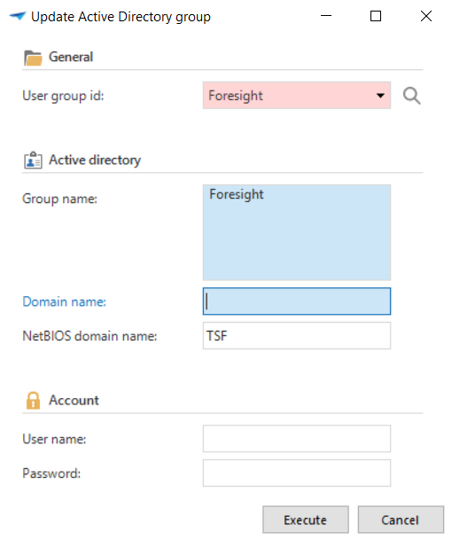
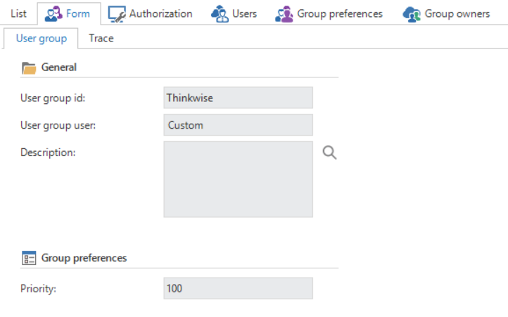
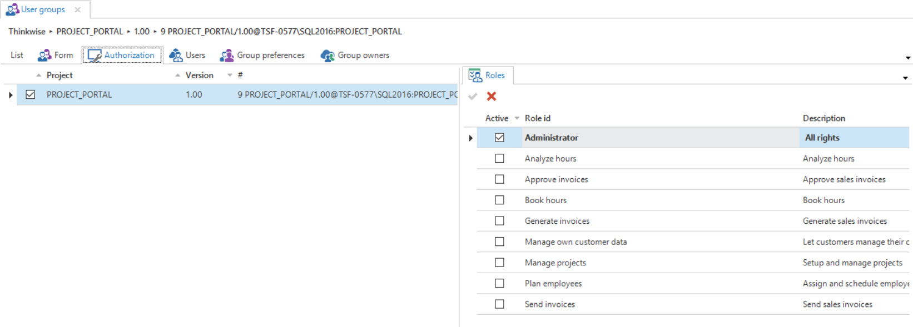
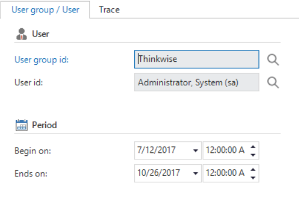
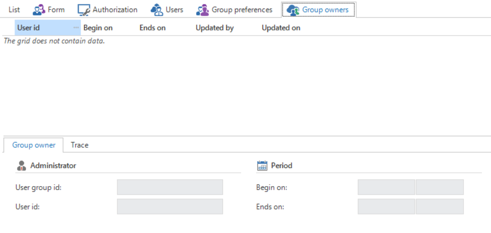

User groups exist in IAM to make the link between a user and what he may and can do within the end product. On the one hand the users are linked to a user group and on the other hand various roles, as described in the previous paragraph, are linked to a user group.

A user group is often a department within an organization. For example, there can be a user group for purchasing or sales. However a group also frequently refers to a more specific group within a department, such as the group of purchasers and group of purchasing managers.

What is not intended is that the groups are defined at a task or process level. This is namely the role level and makes the application very complex. If we take one of the groups from our example above then we could get the following structure:

Group: Project manager

Roles:

- Setting up projects

- Assign employees

- Schedule employees

- Check the progress of the project

- Check the hours

What we see in the above structure is that one group almost always gets several roles assigned. Because these roles are already defined by the developer it is the administrator\'s job to distribute the correct roles across the groups.

Since in many organizations an employee is often involved with several departments or is involved within a department with various processes it is possible to also link a user to several groups. When this has been done he gets the rights to a combination of all roles that fall under the groups of which he is a member. Particularly when the above mentioned structure is used an employee will often be assigned in several groups.

> You can also link all users to a general group for roles that may be carried out by everybody, for example, an "All employees" group with the roles "Enter hours", "Report issues"

The advantage of configuring user groups at a department level is that this makes the addition of a user much easier, because in all probability there are fewer departments to which the user must be linked. Furthermore, when use is made of Active Directory groups within the organization, it is possible to take over this structure in the IAM via 'Update Active Directory group'.

> Importing Windows groups is only possible on an SQL Server database. To be able to use this functionality Ad hoc Distributed Queries must be installed in the database

### Create user groups

Creating user groups takes place in the 'User groups' component.

The following types of user groups are available:

- Specific; the users of the user groups are administered via the (Intelligent Application Manager) database using the 'Specific' option.

- Windows domain; using this option the users in this group are administered via the Windows domain. After adding or modifying users the 'Update Active Directory group ...' must be executed. This task updates the Active Directory data with the user group, reads the users from the Windows domain, creates these users in IAM and adds them to the user group. When there are already users linked in the group, these will first be removed from the group.

### Authorisation

When the user groups have been created the roles can then be linked to them. This is done on the 'Authorisation' tab.

There is a list of the applications on the left and a list of the roles on the right. When we now select an application we can check which roles belong with this group in the role list. This application is now no longer shown in italics and the check mark for the group is checked.

### Add users to user group

The last step is now to also link the users to the user group. Users must first be created in IAM before this can happen. This is described in the following chapter.

If the users are already available in IAM, then they can be added to the groups on this screen. We add 'new' users with the plus button.

When adding a user to a group the start and end date of the membership of this user group can also be defined. When a user is a temporary member of a group then this function can be used for this. When the period expires the membership also expires and the user is set to inactive.

### Group Owners

When several owners can administer this group, they can be added as group owner to the selected group. They may now add new users to this group.

