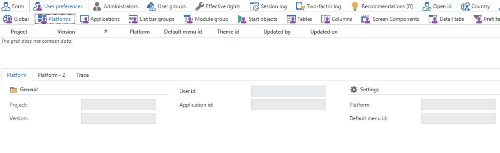

This component is only available for the Head Administrator.

User preferences (UP) are settings to modify the application in accordance with personal preferences. These settings are registered in the Intelligent Application Manager so that they are available on all platforms.

### Global

It can be specified here for each user whether the ribbon and a menubar should be displayed.

### Platform

Define here which theme and default menu should be started for each platform.

### Applications

Furthermore, you can define whether the application is loaded at start up and which position it takes in the quick launch toolbar.

### Quick launch toolbar groups

It can be defined in this component whether, and which, quick launch toolbar group is opened when starting up the GUI application and in which sequence the quick launch toolbar groups are displayed in the quick launch toolbar.

### Module groups

Whether, and which, Module Group is opened when starting up the application and in which sequence the module groups are displayed in the menu bar can be defined in this component

### Start objects

Start objects are components of an application that are automatically loaded during start up. The screens in which a user mainly works can be immediately started without having to select them in the quick launch toolbar. This can be set for tables, tasks, reports and processes.

When use is made of 'Start objects', the application, of which the start object forms a part, has to be loaded during the start up of the system. If this is not the case, then the start object will start when the application starts up.

### Tables

The tables component under user preferences controls the visualization of tables.

For example, it is possible to deviate from the default screen type. Furthermore the choice can be made to open the list empty with a filter. How many columns are fixed can be specified for each table. These will always be displayed, even if you scroll to the right.

### Columns

A number of settings for each user can be defined for the columns under the user preferences for the columns. For example, the sort sequence can be modified, the width of the grid can be set and the sequence of the columns in the grid can be determined.

It can also be indicated whether, as default, fields must be present in the filter, in which sequence and with which default condition.

The same can also be specified for the search screen.

### Screen components

The heights and widths of the screen components are specified in this component.

### Detail tabs

This is where the settings are set for the detail tabs. These are the sequence and the visibility.

### Prefilters

In this section prefilters can be created which apply to a particular user but not for the entire application.

In the tab 'Prefilters' you can indicate the application and table to which the prefilter refers and you can specify a name for the prefilter. Furthermore, via a query, data in the list or the form can be filtered manually.

Which column the prefilter should filter and which values the data needs to satisfy can be specified in the 'Prefilter columns' component. A filter condition can also be provided and the values this condition needs to satisfy can be defined.

### Default prefilters

The default prefilters can changed in this component. Prefilters that were disabled, can be enabled as default and prefilters that were enabled can be disabled as default.

### Cubes

Which cube view is displayed as default can be indicated in this component.

### Cube views

The cube view that the user has himself created is displayed in this component. It is also indicated which fields, constant lines, filters, field totals and conditional formatting are associated with the cube view. New cube views can only be created from the GUI and cannot be set up by the administrator.
