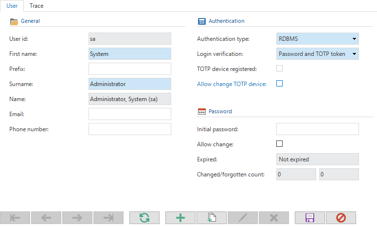
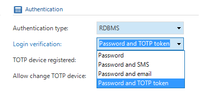
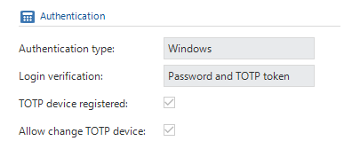
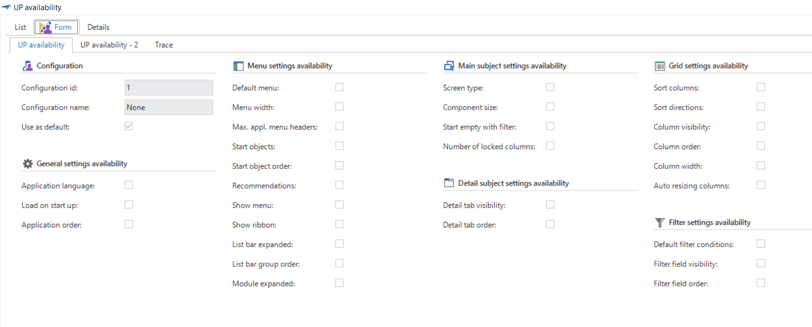
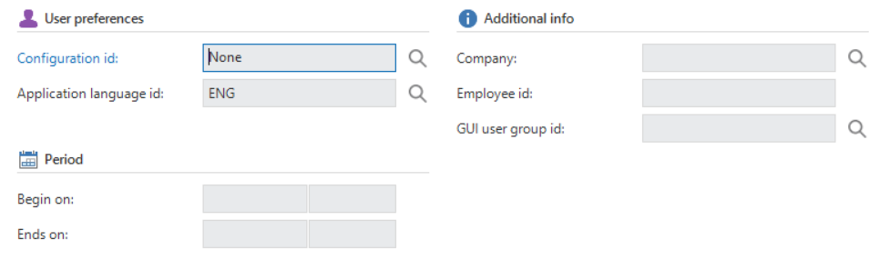
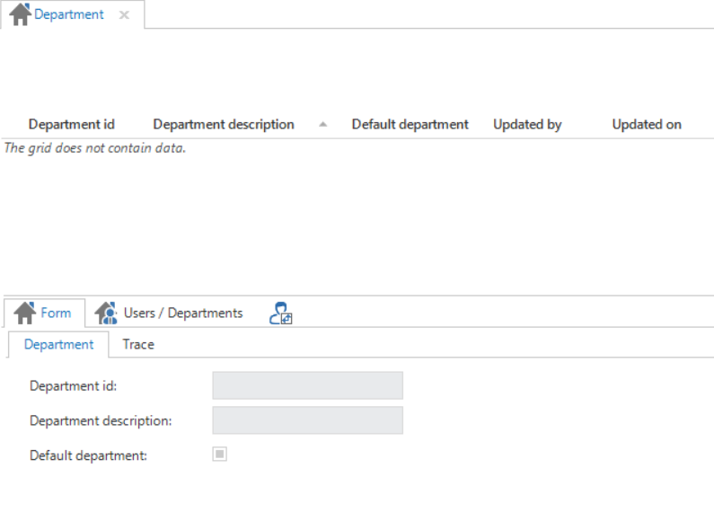

This chapter deals with the users component. It discusses how users must be added and which settings can be provided for each user.

Users are persons who make use of the end application. They must be added in IAM to make sure that they have the correct rights on the end application. They will not be able to login without first adding them in IAM.

## Adding users

A number of details have to be entered when adding a user. Among others the user id is entered under the component 'General'. This the Windows domain login, database user, Kerberos user or an identifying name. The first name and surname are then entered.




There are 4 methods with which authentication can be obtained; RDBMS, Windows, Kerberos and IAM.

With IAM authentication users can only log in via the Web GUI and Mobile GUI. IAM authentication is intended to simplify the administration of large numbers of Intelligent Application Manager users. IAM authentication users are only registered in the Intelligent Application Manager and not in the database. During login the account details are validated in the Intelligent Application Manager instead of in the database. The password is irreversibly encrypted in the database. This can be changed with the task 'Modify password'.

If the choice is made for RDBMS or IAM then additional settings are displayed for the password administration. An initial password can be given for RDBMS.

This password is used to generate a script for creating users on the database. Furthermore it can be used to keep track of the initial password and communicate this to users. This password is **not** used automatically. For RDBMS authentication the password must be changed in the database itself and for IAM authentication the "Change Password" task must be used.

The "Changes allowed" check mark indicates whether users are allowed to change their password from the GUI. If users are allowed to change their password, there are three options for the status of the password:

- Not expired:

- The user can simply use the current password;

- Change after login:

- After the user has logged in with his current password, he must change the password;

- Reset before login:

- When the user logs in, the password is not validated. The user has to change his password, as is done when resetting the password. In other words he has to enter a generated code, receive an email, enter the validation code given in the email and specify a new password.

The system keeps track of how often a password is changed or forgotten. This number is incremented every time the user requests a new password or changes his password from the GUI. The number of times the user has forgotten his password is also incremented if the password is changed by the administrator.

Under the heading user preferences is indicated which language will be used as default when starting the application. In addition, it can indicated here which type of user preferences will be applied for this user. Because it is not always desirable to set up user preferences separately for every user it is possible to create a set, or several sets, of preferences. These can be linked to all users when a user is added in IAM.

> A non-system admin user needs extra rights to be able to create database users. This can be set using the following script:
> 
> ```sql
>USE [IAM_DB]
>GO
>GRANT ALTER ANY USER TO [LOGIN_NAME]
>GO
>USE [END_PRODUCT_DB]
>GO
>GRANT ALTER ANY USER TO [LOGIN_NAME]
>GO
>USE MASTER
>GO
>GRANT ALTER ANY LOGIN TO [LOGIN_NAME]
>GO
>```

Under the heading 'Login verification' it is indicated which authentication method is used. There are 4 options:

- Only password; user log in by using only their password.
- Password + email; users
- log in by using their password and a code that is sent to them by email.
- Password + SMS; users log in by using their password and a code that is sent to them by SMS.
- Password + TOTP; users log in by using their password and a code that is generated by an TOTP authenticator.

### Login with email

To use email two-factor authentication in the Web GUI the settings below need to be configured in the settings.ini file or in IAM. For the Mobile GUI, the settings below need to be configured in the appsettings of the Web.config file of the application service used by the Mobile GUI.

  | Parameter                    | Description                                                                                                                                                                                                         |
  | ---------------------------- | ------------------------------------------------------------------------------------------------------------------------------------------------------------------------------------------------------------------- |
  | TwoFactorEmailMessageService | This parameter indicates which email implementation is used for Email two-factor authentication. Additional implementations may be added in the future, but for now, the only valid value is TSFSmtpMessageService. |
  | SmtpServer                   | The address of the SMTP server used to send the email.                                                                                                                                                              |
  | SmtpPort                     | The port which the SMTP server listens on.                                                                                                                                                                          |
  | SmtpEnableSSL                | Whether SSL will be used to provide transport-level encryption (yes/no).                                                                                                                                            |
  | SmtpUser                     | The username used to authenticate with the SMTP server.                                                                                                                                                             |
  | SmtpPassword                 | The password used to authenticate with the SMTP server.                                                                                                                                                             |
  | SmtpFrom                     | The email address used to send the email to the user.                                                                                                                                                               |
  | SmtpFromDisplayName          | The display name shown to the user as the sender of the email.                                                                                                                                                      |

### Login with SMS

To use SMS two-factor authentication in the Web GUI the settings below need to be configured in the settings.ini file or in IAM. For the Mobile GUI, the settings below need to be configured in the appsettings of the Web.config file of the application service used by the Mobile GUI.

  | Parameter                  | Description                                                                                                                                                                                                                      |
  | -------------------------- | -------------------------------------------------------------------------------------------------------------------------------------------------------------------------------------------------------------------------------- |
  | TwoFactorSmsMessageService | This parameter indicates which service implementation is used for SMS two-factor authentication. Additional service implementations may be added in the future, but for now, the only valid value is TSFTwilioSmsMessageService. |
  | TwilioAccountSid           | The *SID* of your Twilio account. This information can be found in Twilio's Console Dashboard.                                                                                                                                   |
  | TwilioAccountAuthToken     | The *Auth Token* of your Twilio account. This information can be found in Twilio's Console Dashboard.                                                                                                                            |
  | TwilioFromNumber           | The Twilio phone number used to send the SMS message to the user.                                                                                                                                                                |

### Login with TOTP (2-factor authentication)

It is possible to enable 2-factor authentication based on TOTP (time-based one-time password). This can be set for each user, under the "Authentication" header.



It is possible to allow a fallback two-factor authentication for a user, in case they lose the phone they use for TOTP. This can be allowed by enabling "Allow change TOTP device". If enabled, users can authenticate using their email, upon which they are prompted to reconfigure TOTP. If the user has successfully registered their TOTP device, the "TOTP device registered" checkbox will be checked.      

When the mobile device is lost, it is possible to disconnect this device with the task "Reset TOTP device".

## User preferences sets

To give the users the option of storing their user preferences a configuration must be selected under 'Configuration id' within the form group \'User preferences\'. Five configurations are provided as default: None, Resize, Move, On_Off, Complete. These configurations succeed each other with regard to the possibilities that the user has.



### None

This is the default setting, unless this is modified by the administrator. Users cannot modify user preferences. The entire user preferences ribbon is not visible for the users.

### Resize

Users can collapse and expand their menu and ribbon. Furthermore they can change the sort sequence and column width in a grid view.

### Move

The user has the same possibilities as in the 'Resize' configuration plus the possibility to determine their own start objects and set the sort sequence of all components.

### On_Off

With this option the user has all options available, including changing the application language. The only option that is not available, is changing his screen types.

### Complete

As the name already indicates the user can change all user settings.

Own configurations can be created together with the predefined configurations.

One of the configurations can be defined as default for all users so that this set up is applied when adding a new user.



Under the heading 'Period' it can be indicated for a user when access to the applications begins and ends. After this end date has elapsed access for the user to the end application will be automatically denied.

The last heading is 'Additional information'. If the organization uses employee numbers this number can be entered in the appropriate field.



## User prefilters

Two prefilters are available under the user tab that support the Application administrator during the set up.

- Users without a user group; users who are not linked to a user group

- Inactive users; users who have never logged before

## Administrators

On the Administrators tab it is indicated for each user what type of administrator they are. Furthermore a user can also be defined as an Application Manager or Group administrator. An overview of the types of administrators is given in the introduction to chapter 2.

## User groups

Here is an overview of the user groups to which the selected user is linked. It is furthermore also possible here to link users to new groups.

## Session log

It is indicated on this tab for each user when he logged into the end application and whether he is still logged in. The session log is also available from the menu, however in that case an overview of all users is displayed.

The question that often arises here is whether users can also be forcibly logged out of the end application due to, for instance, an update to a new version.

This is not possible here because this is only a log table. It is possible on the Applications tab, accessible via the menu, to make an application inactive by unchecking the active check mark. Since the system checks every 5 minutes whether an application is still active, after a maximum of 5 minutes there will no longer be any users in the system. Since no message about this is sent to the users it is perhaps advisable to inform the users in advance about any updates for which the system must be offline.

## Two-factor log

A log of when a user is logged in via this method is maintained in the 'Two-factor log'. It is also indicated whether use is made of the sms, email or TOTP protocol.

## Open id

Alternative login details of an authentication method can be entered in the \'Open id\' tab. It is possible to log into the application by making use of a login check with an external source. For more information about the Open id protocol please refer to: https://en.wikipedia.org/wiki/OpenID

## Countries

When the organization is spread across several countries then these can be entered and the users linked to them. This is of particular interest with certain analyses, such as the question of which rights are available within a specific country.

## Functions

Users can be specified here for each function. This is of particular interest in certain analyses, such as the question of which rights are available within which functions.

## Locations

When an organization is spread across several locations these can be entered and the users linked to them. This is of particular interest with certain analyses, such as the question of which rights are available at a specific location. With a cube the rights for each location are displayed in one overview.

## Departments

When an organisation consists of several departments these can be entered and the users linked to them. This is of particular interest with certain analyses, such as the question of which rights are available within a specific department. With a cube the rights for each department are displayed in one overview.



## Tags

When more information about the users needs to be maintained, and this cannot be normally stored in the Intelligent Application Manager under, for example, the above mentioned components (countries, departments etc.), then this can be added under tags. A tag is then first created and this is then linked (possibly with a value) to users.
