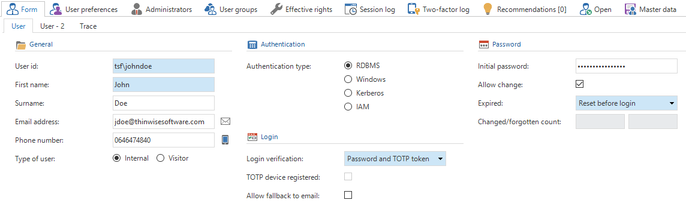

The *Users* screen contains an overview of all users and user-related information, such as group memberships, effective rights and session logs. To grant a user access to a Thinkwise application, the user needs to be added to the Intelligent Application Manager first. 

## Add users

New users can be added from the *Form* tab page in the *Users* screen. 

*Add a new user*

### General

The user ID is the login name of the user. Depending on the Authentication type, this could be the Windows domain user, database user, Kerberos user or an identifying name. 

### Authentication

The Thinkwise Platform provides four authentication types: RDBMS, Windows, Kerberos and IAM.

IAM authentication is intended to simplify the administration of large numbers of Intelligent Application Manager users. IAM authentication users are only registered in the Intelligent Application Manager and not in the database. During login, the account details are validated in the Intelligent Application Manager. The password is securely stored in the IAM database. The *Update password* task can be used by an administrator to set or update this password.

### Login

The *Login verification* option determines if a user is required to use two-factor authentication:

* Password - the user logs in with a password only
* Password and SMS - the user logs in with a password and a code that is sent by SMS
* Password and email - the user logs in with a password and a code that is sent by email
* Password and TOTP token - the user logs in with a password and a code that is generated by a TOTP authenticator

#### SMS

To use email two-factor authentication in the Web user interface, the settings below need to be configured in the `settings.ini` file or using IAM extended properties. For the Mobile user interface, the settings below need to be configured in the `appsettings.json` file of the application tier.

| Parameter                  | Description                                                  |
| -------------------------- | ------------------------------------------------------------ |
| TwoFactorSmsMessageService | This parameter indicates which service implementation is used for SMS two-factor authentication. Additional service implementations may be added in the future, but for now the only valid value is TSFTwilioSmsMessageService. |
| TwilioAccountSid           | The *SID* of your Twilio account. This information can be found in Twilio's Console Dashboard. |
| TwilioAccountAuthToken     | The *Auth Token* of your Twilio account. This information can be found in Twilio's Console Dashboard. |
| TwilioFromNumber           | The Twilio phone number used to send the SMS message to the user. |

#### Email

To use email two-factor authentication in the Web user interface, the settings below need to be configured in the `settings.ini` file or using IAM extended properties. For the Mobile user interface, the settings below need to be configured in the `appsettings.json` file of the application tier.

| Parameter                    | Description                                                  |
| ---------------------------- | ------------------------------------------------------------ |
| TwoFactorEmailMessageService | This parameter indicates which email implementation is used for Email two-factor authentication. Additional implementations may be added in the future, but for now the only valid value is TSFSmtpMessageService. |
| SmtpServer                   | The address of the SMTP server used to send the email.       |
| SmtpPort                     | The port on which the SMTP server listens.                   |
| SmtpEnableSSL                | Whether SSL will be used to provide transport-level encryption (yes/no). |
| SmtpUser                     | The username used to authenticate with the SMTP server.      |
| SmtpPassword                 | The password used to authenticate with the SMTP server.      |
| SmtpFrom                     | The email address used to send the email to the user.        |
| SmtpFromDisplayName          | The display name shown to the user as the sender of the email. |

#### TOTP

If [TOTP](https://en.wikipedia.org/wiki/Time-based_One-time_Password_algorithm) authentication is used, the user receives a secret key code on first login. This code needs to be registered in a TOTP authenticator app, like [Google Authenticator](https://support.google.com/accounts/answer/1066447?co=GENIE.Platform%3DAndroid&hl=en) or [Microsoft Authenticator](https://www.microsoft.com/en-us/account/authenticator), by entering the key or scanning the QR code. If the user has successfully registered their TOTP device, the *TOTP device registered* checkbox will be checked.

Every time the user wants to log in, they need to enter the time-based code generated by the TOTP authenticator app. To allow a fallback to email-based two-factor authentication, for example if the user does not have access to their smartphone, check the *Allow email fallback* option. 

The *Reset TOTP device* task can be used to reset the TOTP secret key, for example when a user's smartphone is stolen.

### Password

For RDBMS and IAM authentication it is possible to specify an initial password. This password is used to generate a script for creating users on the database. It can be used to keep track of the initial password and communicate this password to the users. This password **cannot** be used to log on to the application. Make sure to clear this field after RDBMS users are created or the password for IAM users is updated.

The *Allow change* option indicates whether users are allowed to change their password from the user interfaces. Use the *Expired* option to set the initial state of the password: 

* Not expired - The user can simply use the current password

- Change after login - After the user has logged in with their current password, they must change the password

- Reset before login - The user has to reset their password before they are allowed to log in

The system keeps track of how often a password is changed or reset. This number is incremented every time the user requests a new password or changes their password, and when the password is changed by the administrator.

### Password strength

The minimum password strength for IAM authenticated users can be set in the global settings. 

The following calculation is used to determine the password strength:
- The total password length gives up to 3 points (at 10 characters)
- Two uppercase characters and two lowercase characters gives 0.6 points
- Two numbers gives 0.6 points
- Two symbols gives 0.8 points

Setting the minimum password strength to 5 will require the user to match all the password requirements.
Setting the minimum password strength to 4 allows the user to skip either symbols, numbers or varying casing.

When the user attempts a password change and the password strength is insufficient, the user will be notified of the shortcomings of the desired password.

Password strength requirements for RDBMS accounts or Windows accounts is delegated to the database server or active directory.

### User preferences

Here you can specify the default language for the user and which level of user preferences are available to the user. 

Select one of the predefined User preferences configurations or create a new configuration using the pop-up. Available configurations are:

* None - No user preferences are stored and the user preferences ribbon is hidden.
* Resize - Users can collapse and expand their menu and ribbon. Furthermore, they can change the sort sequence and column width in a grid view.
* Move - *Resize* plus the option to configure their own start objects and set the sort sequence of all subjects.
* OnOff - All options except for changing screen types.
* Complete - All user preferences options are available to the user.

*User preferences configuration*

### Period

By specifying a period, it is possible to set a start and end date for a user. Access to all of the application will automatically be denied when the end date is reached.

### Additional information

Here you can provide additional user information, such as the company a user belongs to and the company-specific employee ID.

## User information

### User preferences

Contains the stored user preferences of the selected user.

> The *User preferences* tab page in the *Users* screen is only available to Main administrators.

*User preferences*

### Administrators

Overview of the IAM administrator roles of the selected user. 

### User groups

An overview of the user groups of which the current user is a member. 

### Session log

A log of all user sessions for the selected user. The session log is also available from the menu, in which case an overview of all users is displayed.

### Two-factor log

A log of when a user is logged in using SMS, email or TOTP two-factor authentication.

### Open id

A user's [Open ID](https://en.wikipedia.org/wiki/OpenID) login.  

### Master data

Contains information about the user's country, location or department. This information is also available in the IAM analysis tools.

The *Tags* tab page can be used when information about users that is not already available in the Intelligent Application Manager needs to be maintained.