Applications developed with the Thinkwise Software Factory can be authorised with the help of the Thinkwise Intelligent Application Manager.

User groups can be created, to which users can be added. These groups can be assigned to roles. These roles are provided with a set of rights as is further explained in chapter 3. In addition, it is possible to define preferences for users and for user groups, such as layout, menu and prefilters.

Users get one user interface via the Intelligent Application Manager with which they can access all applications for which (via an users group) they are authorised. In addition, they can define their own user interface by means of user preferences.

The structure of this manual follows the same structure as is also specified in the Intelligent Application Manager. By following this structure an application is configured step by step and made available for the end user.

Intelligent Application Manager

It is assumed in this manual that the administrator is authorised for a number of rights which arise from the types of administrators that are available. The types of administrators that are recognized will be examined in the following paragraph.

### Administrator type

The Intelligent Application Manager has different kinds of administrators. For example, some administrators may synchronize new project versions and other administrators are responsible for creating user groups and users. There are eight levels defined to be used to set up the rights for each administrator.

It is assumed in this manual that the IAM administrator has the rights for the roles:

-   Project Administrator

-   Project Owner

-   Application Administrator

This implies that this administrator is engaged in the synchronization of new project versions, the creation of roles and the creation and authorisation of applications. Creating user groups and users, that are linked to the roles therefore falls outside the scope of this administrator. We briefly mention this in this manual to outline a total picture of the possible administrator types.

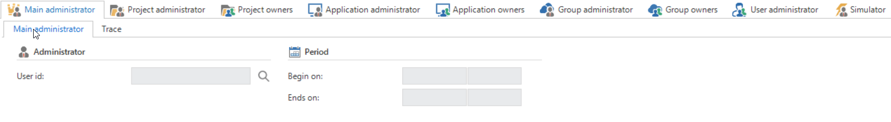

Administrator\'s overview

The above figure comes from the menu component 'Users' under the tab 'Administrators'. The type of administrators are here assigned to a user.

#### Head Administrator

This type of administrator has rights on all components within the IAM. This implies that he is responsible for the synchronization of new project versions, but he can also define new roles, applications, groups and users.

#### Project Administrator

The Project Administrator may synchronize new projects and create roles. In addition, he can also define Project Owners.

#### Project Owner

The Project Owner may administer new roles for his own projects. This implies that he can create, modify and delete roles for the projects for which he is the owner.

#### Application Administrator

The Application Administrator may create new applications and link the roles that have been created by the Project Owner or Administrator to groups. These groups must first have been created by the Group Administrator. In addition, he can also define Application Owners.

The following administrator types are not applicable for this IAM administrator:

#### Application Owner

The Application Owner can link roles that have been created by the Project Owner or Administrator to groups within the application for which he is the owner. These groups must first have been created by the Group Administrator.

#### Group Administrator

The Group Administrator may create new groups and link users to them. These users must first be created by the User Administrator. In addition, he can also define Group Owners.

#### Group Owner

The Group Owner may link users to the groups for which he is the owner.

#### User Administrator

The User Administrator can create new users.

#### Simulator

The simulator is a special function. This function is able to simulate other users.

Model
=====

Applications are developed with the Thinkwise Software Factory. The Intelligent Application Manager (IAM) retrieves a copy of the (GUI) model from the Software Factory database. On the basis of this model the authorisation is set up via roles, user preferences can be defined and use of the GUI is registered.

The abstract Thinkwise GUIs interpret the GUI model from the Intelligent Application Manager together with the authorisation and user preferences, so that each user gets his own personal application.

The following diagram gives a schematic view of the operation and positioning of the Intelligent Application Manager.

The position of IAM in a schematic view

Synchronize
-----------

To include a new or existing project version as an application in the Intelligent Application Manager it is necessary to synchronize it with the Software Factory. This means that the blueprint is copied from the Software Factory to the Intelligent Application Manager. As soon as this has occurred, then the project becomes available in the Intelligent Application Manager. An application can be linked to this together with the roles and user groups. Synchronization is accomplished via the \'Synchronization\' task. This task is available in the menu under the group 'Model'.

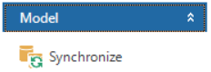

Synchronize

In order to synchronize you have to first establish a connection with the Software Factory in which the project that has to be synchronized is located. The following popup indicates the Software Factory database you have to connect to.

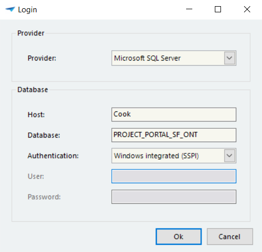

Logging in on the server

### Select project version

After the connection has been established the required project and project version is selected.

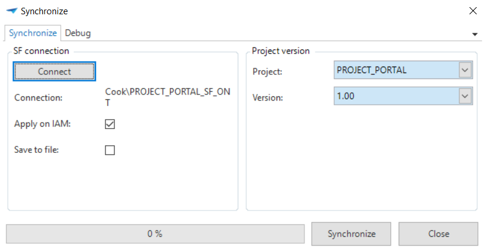

Synchronize project version

#### Determine target

By default, the synchronization will have an effect on the Intelligent Application Manager. The choice can be made to write the synchronization to disk by checking the 'Save in file' check mark.

This ensures that the synchronization does not have a direct effect on the Intelligent Application Manager. The SQL code that is normally executed during the synchronization on the Intelligent Application Manager will now be written to the specified file. And the SQL script can be executed manually on the Intelligent Application Manager database.

The SQL script can become so large that it is not possible to execute it via SQL Server Management Studio. SQL Server Management Studio gives the warning "Query completed with errors" without any further messages. In order to run the script you should in this case use the sqlcmd utility.

When using System-I Navigator to run the script, it is recommended to checkmark the options *Defer Run History* or *Defer Execution History*. This option makes the throughput of a lot of instructions much faster.

### Validation

When synchronization is now clicked on the system will first carry out a validation on the project. This checks whether the project satisfies all requirements to be able to later operate as an end application. When all validations have already been checked by the developer in the Software Factory then the check in the IAM should not produce any problems.

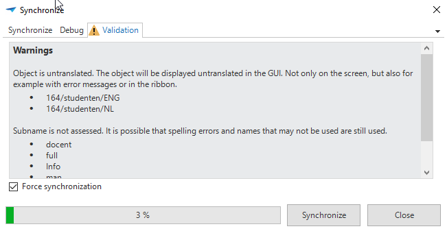

Force synchronization

Whenever an error is discovered this must first be resolved by the developer. It can however also occur that messages are displayed that we want to ignore for now. If this is the case then the 'Force synchronization' check mark can be checked. This ensures, despite the validation messages, that the project is synchronized.

### Result

As soon as the project version is synchronized the model is available in the Intelligent Application Manager. An application can now be created for this, which can subsequently be configured and authorised.

Projects
--------

The 'Projects' component contains an overview of all the projects that have been synchronized to the Intelligent Application Manager.

We also see here the 'Project Administrators' tab. Persons can be linked to this and start work as an administrator for the selected project. This implies that this administrator can create roles for the project for which he is responsible. Under the heading 'Period' it can be indicated when someone\'s administration function expires. This function is useful if a person only has a specific administrators task temporarily, for instance, due to the vacation of a colleague who is normally the administrator.

Roles
=====

This chapter examines the creation of roles.

Roles can be regarded as separate items of functionality, user tasks, processes or modules of an application. It is important for the developer to closely assess these separate items, so that there is no overlap in rights between different roles. Furthermore the nomenclature of the roles must be clear for IAM administrators who must set up the authorisation of an application with these roles. They have no knowledge of the functionality and therefore have to deduce the purpose of the roles only from the roll names.

For example 'Visitor registration', that comprises checking whether customers are in the system, whether customers have an appointment, issue visitor tags and informing the colleague who invited the customer. This role is subsequently linked by an administrator to the group administration. However, along with this role the group administration perhaps also gets the role 'Report illness', 'Absence requests' and 'Invoice hours'.

**EXAMPLE**

This combination of roles and groups provides more simplicity when setting up the authorisation. There can be a user group 'HR' which includes the roles 'Hire employees', 'Approve vacation days' and 'Salary administration'. Which specific rights are assigned to which components for a role are no longer important for the application administrator. The application administrator must be able to deduce the purpose of a role from its name

Creating roles will be discussed in paragraph 3.1 'Role rights' and paragraph 3.2 'Model rights'. The difference between these paragraphs is the method of set up. For example, the set up can be done for each role, which is logical when creating new roles, but these can also be set up from the model. This is logical with an upgrade of the model, when a newly added component has to be linked to a number of existing roles. But more about this in the following paragraphs.

Role rights
-----------

### Project version

On the 'Project version' tab is an overview of all synchronized projects with their version. There are also two tasks available here that help when setting up the roles after an upgrade of a project version or when copying roles from one IAM to another IAM.

#### Copy roles of a project version 

When a new project version is synchronized in the Intelligent Application Manager, for which an earlier version has already been configured, most of the rights of the previous version can be reused. This is done with the task 'Copy roles of a project version'.

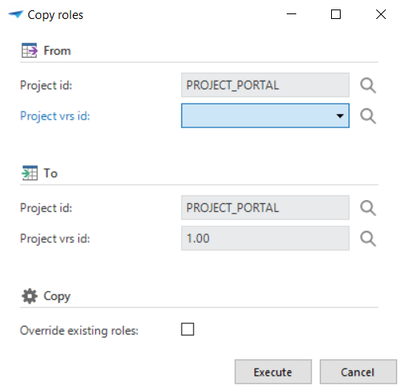

Copy rights

#### Import roles from another IAM 

When use is made of different IAMs, for example for a DTAP environment, then it is possible to copy the roles created in one IAM to another IAM. In this way the roles do not need to be created again. Copying these roles is possible with the task 'Import roles from another IAM'. . It is also possible to write the import of roles to disk. This is done to execute the roles on an IAM that is not immediately accessible.

**NOTE**

The roles are completely overwritten when importing roles. The current rights assigned to the roles elapse

#### Relink files

In order to easily change all file paths in a Software Factory model to the desired configuration for the production environment, a task has been added with which file paths can be replaced.

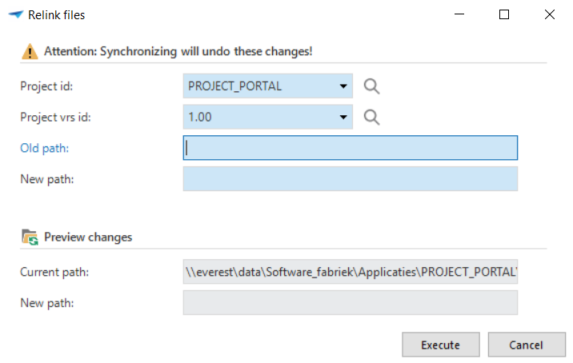

Re link files

#### Import existing role

Using this task roles can be copied from another project to the present project. Pay attention that roles with the same nomenclature are overwritten.

#### Assign new rights

This task can be used when tables, columns, tasks, etc. are added within a new version that all have to be assigned to one role. In practice this will not often happen, because new project versions often include a broader upgrade, which are distributed across several roles.

#### Apply roles to the database 

This task ensures that the created role or roles are written to the database. As soon as this has happened they are also available for use in the end product.

### Roles

The roles are created and set up on this tab.

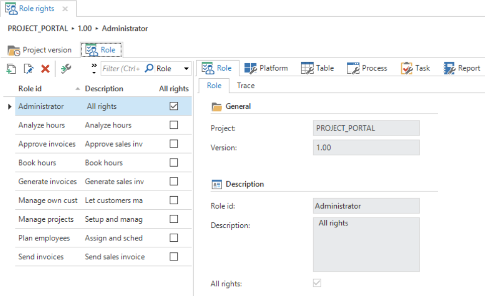

Role rights

#### Create a role

The first step when setting up roles is creating a new role. It can be that roles already exist in another project, then these can be read in with the task 'Copy roles'.

When a new role is added this must be given a name and description. It is also possible here to check the All Rights check mark. In practice, this will not often have to occur, since you then provide this role with all application rights. This goes against the above mentioned principle that a role only has the tasks that belong to that one role.

#### Provide role with rights

Once a role has been created then it can be set up.

When we select a role in the list on the left we can indicate on the right of the screen all the rights that this role has. The various components are divided into the following sub-headings:

-   Platforms; on which platforms can you log in.

-   Tables; which tables are available for this role? It can be indicated here for every GUI component whether this is available. For example, a role may read a table and add records to it, but then subsequently not be able to remove or export them.

Under the sub-heading Tables there are a number of tabs about, for instance, the columns within the selected table, the prefilters within the table, but also the tasks, reports and cubes. It can be indicated for every component whether or not it must be available for this table.

-   Customized screens; which customized screens are available.

-   Tasks; which tasks and task parameters are available.

-   Reports; which reports and report parameters are available.

-   Cubes; which cubes and cube views are available.

-   Menus; which menus, quick launch toolbar groups, module groups and/or tile groups are available. Plus the underlying items.

-   Process flows; which process flows and process actions are available.

-   Subroutines; which subroutines are available.

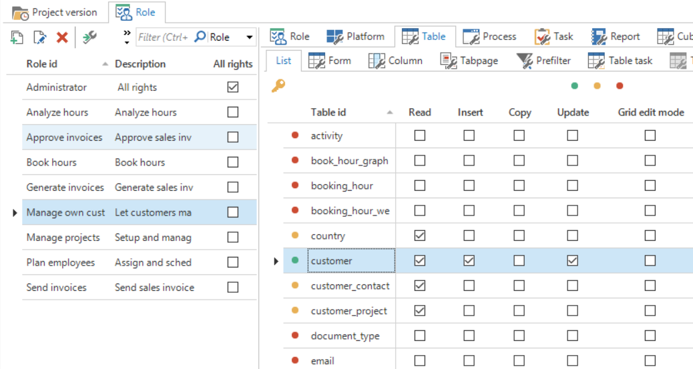

Set up a role

As can be seen every aspect of the application can be made available or not for a role. There are however a few ground rules for this. For example, a process flow in its totality will not be available if one of the process steps is not available. And a cube will also not be available if one of the components of the cube is not available. A second ground rule is that the higher level subject must always be available to be able to display the underlying subject. For instance, to be able to see a menu item the associated menu group and the menu itself must also be made available. This sounds logical, but it is sometimes difficult when setting things up. To support this the task 'Assign rights'  is available in the application. By clicking on this task the system will make that component plus the higher lying components available. Pay attention to the fact that this may cause the release of other components. If we again take the menu example, then making the menu group available can also result in the other menu items in the same group also becoming available. It must then be explicitly stated that this item may not become available. In the figure below it can be seen how, when using the task 'Assign rights', the choice can be made to also make available the higher level rights and the underlying rights.

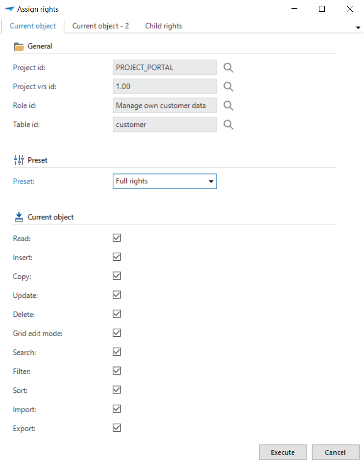

Assign role rights

[]

Model rights
------------

As already indicated at the beginning of this chapter you can set up roles in two ways. The first manner is discussed in the previous paragraph. This is the most logical manner when a new role is added.

The second method is used more often if it is not a role that is added, but that the model is modified. For example, a new table is added in the model. This table must now be added to a number of roles. The required table can now be looked up in this tab after which it can be indicated for each role whether the role may act in some way on this table. The way of thinking is therefore in fact reversed.

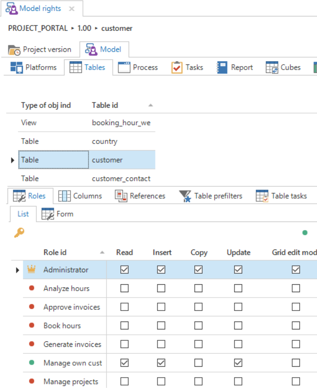

Model rights

### New objects

The tab page 'New objects' shows the objects that are new in this project version. With the task \"Set previous version\" it is possible to set the version to be compared.

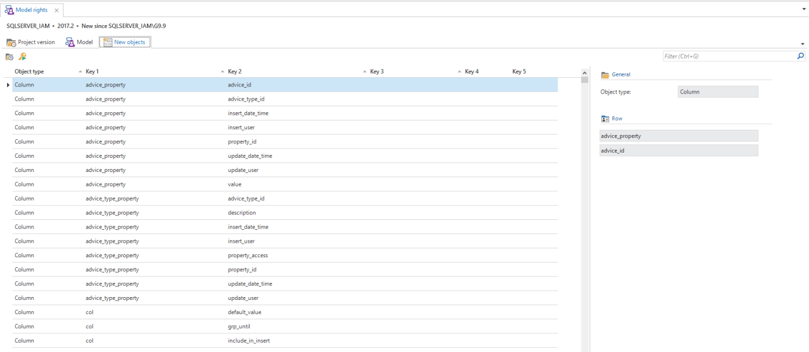

Figure 14: New objects in IAM

With the task \"Assign rights\" a process flow will move the focus to the object in the model tab page, so that the rights can be assigned. This only works when the screen is a detail (and not zoomed in).

Setting up
==========

The Applications are created for a Project Version in the menu 'Setting up'. This application, together with the created roles and the user groups constitute the entire authorisation.

Applications
------------

An application is a combination of a project with a project version, a server and a database that will appear as a standalone application in the GUI. A project version can therefore result in several applications on different servers and/or for different databases. Each application has its own authorisation and user preferences.

### Create an application

A new application can be created via the applications screen.

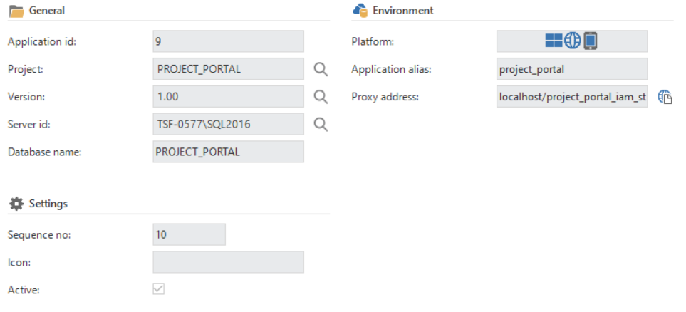

Add application

As can be seen in Figure 14 a number of things must be completed to achieve this. A number of these things including the Project, the Version and the Server id can be selected from a drop down list. These have already been prepared by the IAM developer. The database will fill itself automatically with the name of the database in which the end product is located. If this is not filled automatically then it must be completed manually.

Under the component 'Settings' an icon can be assigned to the application and the application can be set to active. Making the application active implies that the users who are linked to it can log in. If setting up of the application has not yet been completed then it is recommended to leave this check mark unchecked.

In the last component, 'Environment', it is shown for which platforms the application is available and which proxy address will be used. This will also have to be completed manually when it remains empty.

### Application tasks

There are various tasks available within the Applications component.

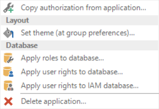

Various available tasks

#### Copy authorisation of application 

These tasks, among other things, make it possible to copy authorisation from one application to another. This is desirable when working in a DTAP principle whereby the Test Server is configured and now has to be implemented on the Acceptance or Production Server.

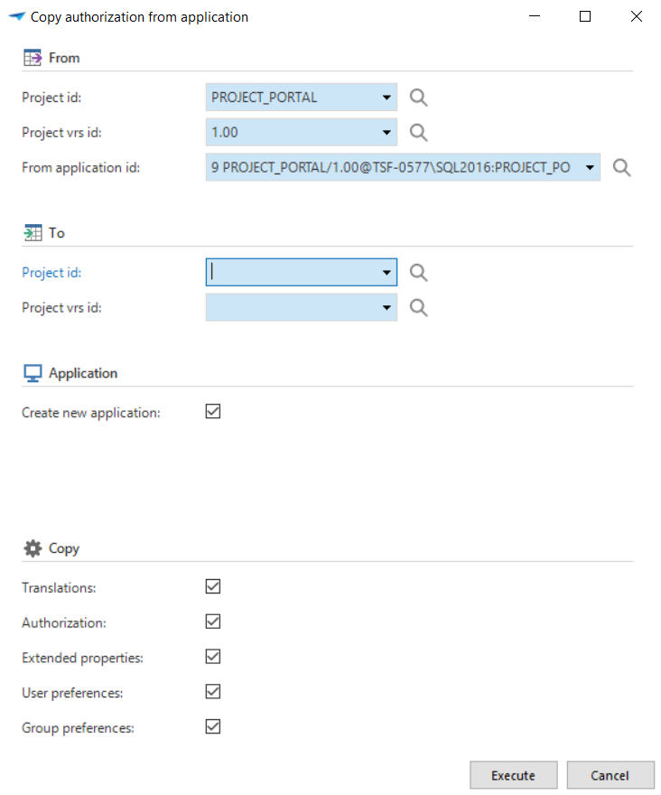

Copy authorisation of application

#### Setting up themes

A default theme can be set up here as a group preference for all groups within one application.

#### Apply roles and rights to the database

Roles and rights can be implemented on the database so that they become available in the end product.

**TIP**

A [non] System Admin user who want to allocate the rights to the database will need some extra rights. By using the next script this is arranged:

use \[master\]

GO

GRANT VIEW SERVER STATE TO \[LOGIN\_NAME\]

GO

#### Delete an application 

It is possible to delete the applications, when they are no longer in use. The entire structure that is created is then deleted. This takes place with the task 'Delete application'. Make sure that this is not done when the authorisation still has to be copied to a new application.

**Tip**

By keeping IAM tidy, the performance will remain good.

### Translations

The application translations are specified in this section.

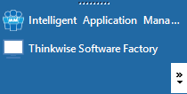

Translating the application name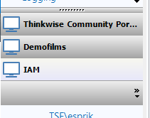

A tooltip text can also be added. A longer name or additional information can be added. If the tooltip is not translated, no name will be displayed.

Master data
===========
Servers
-------

Here is an overview of all the servers that are available to synchronize projects to. New servers can also be added here.

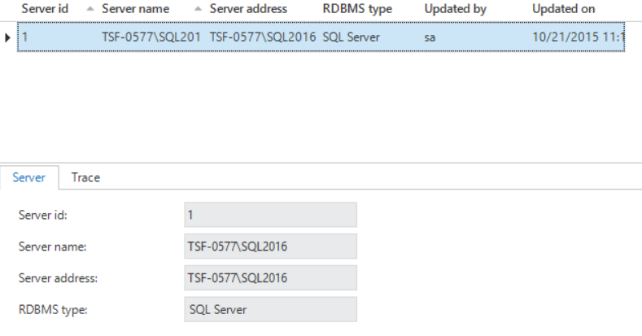
