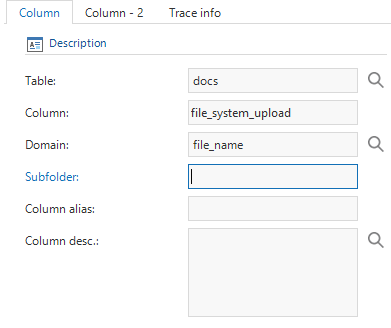
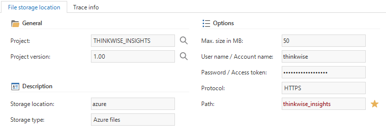
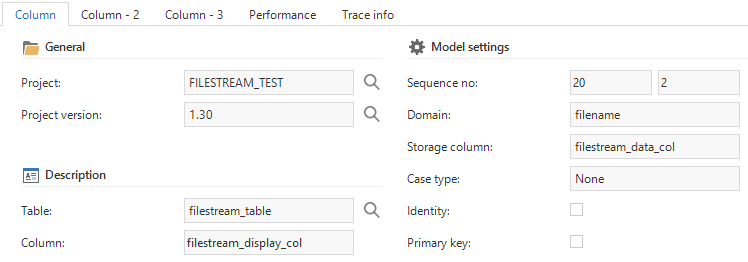
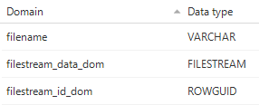

The Thinkwise Platform provides several options for storing files, like documents and photos, with your application.

File storage locations can be configured in the *File storage locations* tab page of the *Overview* screen. Four different file storage types are available:

- Azure files - Microsoft Azure file storage
- Database - Binary data in the database (*BLOBs* or SQL Server *FileStreams*)
- FTP - File Transfer Protocol
- File system - On the file system

File storage locations can be linked to domains with *File*, *Image* (including *Signature*) and *Folder* controls. All storage types except *Database* are specified as an additional subfolder within the file storage location per column. Thus, a column inherits the main storage location from its domain, but files can be stored in a subfolder by setting the subfolder column property.

*Subfolder column property*

## File storage types

### Azure files

Azure files works with Microsofts [Azure File Storage](https://azure.microsoft.com/en-us/services/storage/files/). Azure files has the same structure as any file system and allows for a nested folder hierarchy, i.e., `https://storageaccount.file.core.windows.net/files/image/image.png`

To create an account for Azure file storage, log in to <https://portal.azure.com.> Select the *Storage Account* service and add or use an existing storage account. To find the login settings to be used in the Software Factory, select the storage account and click on *Access Keys*. The *storage account name* and *key 1* values need to be set within the Software Factory as *Username / Account name* and *Password / Access token* respectively.

*Azure storage location*

### Database

Database storage will store the data in a column on the database. Database storage needs two fields: a field to save the file name of the uploaded file, and a field to store the contents of the file. The storage column needs to be a large enough (unicode) text or binary field, for example *nvarchar(max)* or *nvarbinary(max)* on SQL Server.

*A database file column definition*

SQL Server provides an additional way to store files in the database using [FileStreams](https://docs.microsoft.com/en-us/sql/relational-databases/blob/filestream-sql-server?view=sql-server-2017). To use filestream storage, the storage column needs to have a domain with datatype *FILESTREAM*. In addition, the database requires the table to have a *ROWGUID* column as well.

*Required column datatypes for FileStreams*

### File system

File system storage stores the files in the specified path. The path property can either be a network location or a drive. Be aware that it must be a full (rooted) path, for example `\networklocation\files\` or `C:\files\` and that the location is accessible by the user interfaces or the Indicium application tier.

### FTP

To use FTP storage, fill in the server name with the FTP server address, for example `ftp://ftp.thinkwisesoftware.com`. Notice that in contrast to File system storage, the *Path* property must be relative from the server address, for example `files/`.

## Runtime configurations

It is possible to use different file storage locations for different runtime configurations. This allows you to, for instance, specify different locations for your development, test, acceptance and production environments. For more information, see [runtime configurations](runtime_configuration).