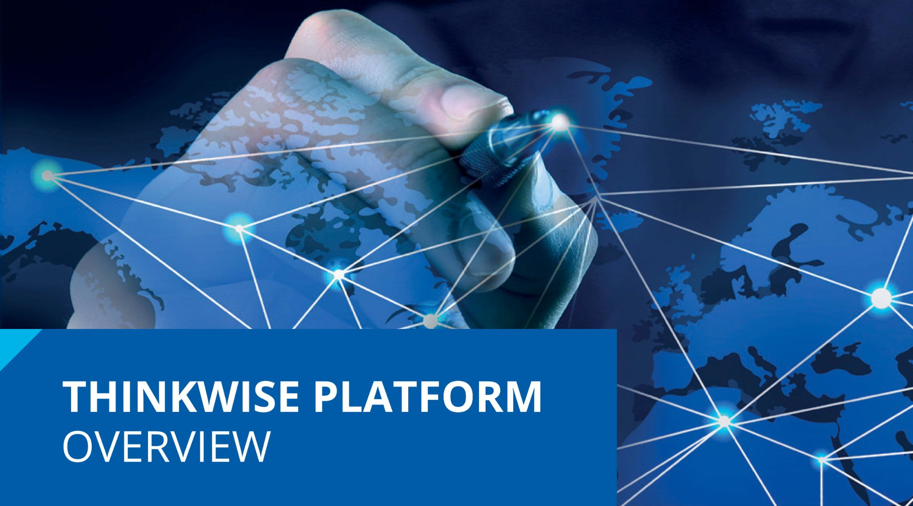
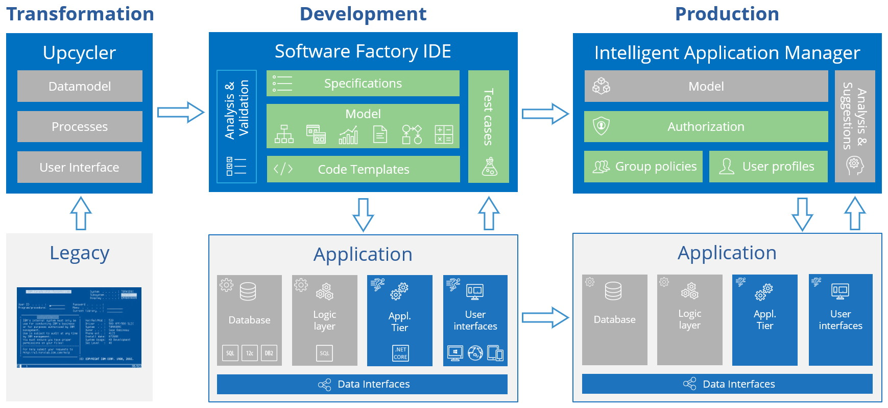
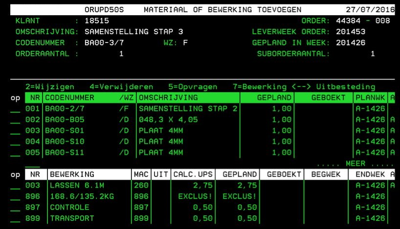
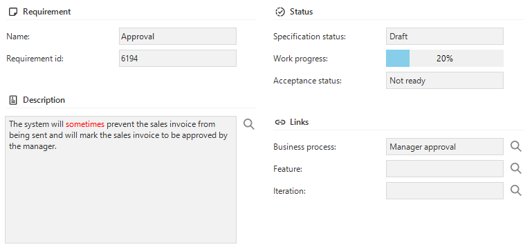
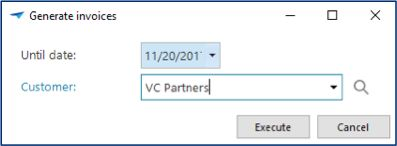

This document provides a high-level overview of the Thinkwise Platform, comprising the Software Factory development environment,
the Intelligent Application Manager, the Indicium Application Tier and the various adaptive user interfaces.

## Introduction

**The Thinkwise Platform is an integrated software development environment to develop new software applications and modernize existing applications.
These applications consist of a database, business logic, service tier, user interfaces and, if necessary, data interfaces to other applications.**

Applications developed with the Thinkwise Platform environment are easily kept up-to-date both technologically and functionally.
The productivity of the development process amounts to 0.5 hours per function point where currently the market average for traditional software development is 8 to 10 hours per function point and the market average for other low-code platforms is approximately 2.5 hours per function point (see 6.3).

### Thinkwise Platform components

The Thinkwise Platform consists of the following components:

1. Software Factory (SF)
1. Intelligent Application Manager (IAM)
1. Abstract User Interfaces
1. Indicium Application Tier
1. Upcycler

The positioning of the various Thinkwise components is presented in the diagram below.
The components that are included in the Thinkwise Platform are shown in **blue**. The **green** components are created by the developer or application manager using the Thinkwise Platform, while the parts in **gray** are created automatically by the Thinkwise Platform.

*Thinkwise Platform overview*

The Software Factory is used during the development and test phase to develop an application on the basis of a model (blueprint). The user interfaces interpret the model during runtime so that the user can work directly with the application. Once the development is completed, the model is transferred to the Intelligent Application Manager in the production environment.

The Intelligent Application Manager manages all the models of applications that are in the acceptance and production phases. The application managers can also set up authorizations using IAM. The presentation for the user is again provided by the user interfaces. End users can set up their own user preferences via the user interfaces and get suggestions from IAM to optimize their user experience.

The user interfaces are available under Windows, Web and Mobile (smartphone and tablet). The capabilities of the various user interfaces are very extensive and almost identical, to the extent that this is technologically possible.

The modernization of software applications takes place with the Thinkwise Upcycler. This tool is only deployed by Thinkwise itself and is not described in this document.

Each product is discussed separately in the following chapters.

Extensive [online documentation](https://docs.thinkwisesoftware.com/) is available for the Software Factory, Intelligent Application Manager, user interfaces and Indicium Application Tier. The requirements for their installation are also described in the documentation.

### Examples

An example of a Legacy application that can be modernized to a Windows, Web and/or Mobile application using the Thinkwise Platform is given below:

*Example of a legacy application*

Subsequently, the modernized screen in a Windows environment:

*Example of a modernized application*

### Application architecture

Thinkwise applications consist of a data tier, an application tier (Indicium Application Tier) and a presentation tier (user interfaces).

In addition to the Thinkwise user interfaces, it is also possible to connect custom built or third party user interfaces or applications to the Thinkwise API to access the data, processes and business logic of Thinkwise applications.

The business logic, which contains customer-specific functionality, is included in the data tier in the form of SQL
procedures. Through the Thinkwise Application Tier, it is also possible to connect external services to integrate external or custom built business logic in a wide range of programming languages and protocols.

*Thinkwise Application Architecture*

## Software Factory

The process of development with the Software Factory consists of the following phases:

1. Specification
1. Modeling
   1. Data
   1. User Interface
   1. Processes
   1. Business Logic
1. Quality control
1. Access control
1. Deployment

This is presented in the figure below:

*Development in multiple phases*

These phases correspond to the menu in the Software Factory development environment.
The development team has access to the components of these phases via the menu on the left-hand side of the screen.

*Start screen of the Software Factory*

### Specification

*Business processes* can be defined in the Software Factory to gain a deeper understanding of the scope and context of the application(s) that will be built.
*Requirements* can be seen as a contract between the business and the developers, with which the scope of the project is
continuously monitored. *Work items* are created for requirements to guide the developers during the development phase.

#### Business processes

During the analysis phase, the function flow diagrams are designed first. The relationship between a business process
and the functional entities, such as departments, are specified there.
These functional entities are displayed on the horizontal strips. The function flow diagrams are often designed based on interviews with the interested parties of the project.
Other elicitation methods can be applied such as analysis of the existing application, documentation, observation of end users, etc.

*Example of a function flow diagam*

#### Requirements

The user and system requirements are subsequently specified for each process. Using the integrated stakeholder portal,
stakeholders can review and comment on flow diagrams and requirements before accepting.

*Example of a requirement*

### Features and iterations

Requirements and work items can be organized using features and iterations. Features can help categorize the work more
efficiently while iterations facilitate the planning process.
Features and iterations can be configured completely to your wishes, for example using *applications*, *modules* and *sub-modules* to group features or by using *releases* and *sprints* as iterations.

### Work and kanban board

Development teams can leverage work items to describe, plan and keep track of development activities.
A work item describes what changes to a model or business logic need to be done. The kanban board allows developers to keep track of, and update the status of, their work.

*Work on the kanban board*

### Modeling and Validation

During the modeling phase, the following models are specified:

- Data
  - Data model
  - Dynamic model
- User Interface
  - Menus
  - Screen types
  - Subjects
  - Cubes (Business Intelligence)
  - Themes
  - Messages
  - Translations
  - Icons
  - Help
- Processes
  - Process flows
  - Tasks
  - Reports
  - Custom screens

All these components form the basis for the application without it being necessary to have to program them. Only the model has to be created.
This takes place based on the requirements and work as drawn up in the previous phase.

The quality of the model is monitored with the Validator. Thinkwise provides hundreds of validation rules, but company specific validation rules can also be added.

*Example validation rules*

When the model is created, a demonstration can be given to the business to show at an early stage what the application will look like and how it will work. This demonstration helps build a bridge between the business and IT.

#### Data model

The database of the application is designed using the data model which is presented graphically, as shown in the figure below.

*Example of a graphical data model in the Software Factory*

#### User Interface

The user interface is also designed without programming. The design is flexible so that screens automatically adjust themselves to the various resolutions. By linking (self-designed) screen types to the subjects of your model, a user interface can quickly be developed for hundreds of objects.

The user interface is multilingual and contains possibilities for integrated Business Intelligence, both pivot tables as well as graphs.
In addition, graphical plans and geographic presentations are easy to integrate.

*Modeling a screen type*

#### Tasks

Batch or interactive tasks (jobs) can be modeled, for instance, to execute a calculation or generate invoices. These tasks can be started automatically by a scheduler or manually via the user interfaces. Interactive tasks can request the user for input before they start.

*Example of a task popup*

#### Reports

For the generation of reports, a connection can be made to various reporting tools, such as DevExpress Reports, Crystal Reports, Microsoft Word, SQL Server Reports and i-net Clear Reports. These reports can be viewed, printed, mailed and exported to various formats automatically or via the user interfaces.

#### Business Intelligence

The Thinkwise user interfaces include integrated Business Intelligence functionality for the presentation of interactive pivot tables and graphs, whereby operational management information can be made available in a simple manner. It is also possible to connect with Microsoft OLAP (SQL Server Analysis Services).

*Example of integrated charts*

#### Process flows

End users are automatically guided through the application with the help of process flows, where the subsequent process steps that must be acted upon are presented to them. Process flows are designed graphically, as seen below.

*Example of a process flow*

Scheduling of process flows allows applications to autonomically operate on the background without requiring any user interaction.

#### Help

Help text can also be defined in the Software Factory, for each process as well as for each object. The help text can be set up fully multilingual. The user interfaces are context sensitive and immediately display the relevant part of the help text.

*Example of the help text*

#### Dynamic model

By including meta procedures in the generation process, the model can be automatically extended. This particularly concerns aspects of the data model and user interfaces model that form a main theme throughout the application.

The following are examples of this:

1. Adding trace columns (added on/by, changed on/by) to all tables and display on a separate tab in the user interfaces.
2. Add an update counter column to tables which are updated.
3. Create indices on standard forms of the user interfaces

As soon as a meta procedure is added, the aspect is automatically added and requires no more maintenance if the model is modified or extended.
SQL code must be programmed once for each meta procedure and requires knowledge of the Software Factory metadata and its concepts.

### Development and Testing

The last phase of the project consists of programming and testing the business logic.

#### Development

Code templates are written according to the design specifications. This is the only component that is actually programmed.
Templates are woven into the correct position in the business logic layer, based on the definitions in the model.

*Architecture of the programmed business logic*

#### Testing

The programmed templates can be tested automatically with unit tests and process tests, that are stored in the Software Factory.

Unit tests can be used to test individual business rules. Any data that is required for a unit test (mock data) can be specified as part of the unit test.

Process tests are used to test processes in the context of a user. Process tests can be created in three ways:

1. Recorded via the user interfaces.
2. Modelled via the Software Factory.
3. Automatically derived from the existing model.

Process tests are executed by the user interfaces and the test results are stored in the Software Factory.

*Recording test cases via the user interfaces*

The test results are also analyzed there.

*Analysis of the test results*

With the integrated test tooling, a test only needs to be specified once and can thereafter be executed automatically.
This guarantees that existing functionality continues to work after any additions and modifications.

### Developer tools

Along with the development tools, Thinkwise also offers tools to analyze the model and convert it to an actual application.
These tools can be found under the *Projects*, *Deployment* and *Analysis* menus.

#### Version control

The continued development of the model of an application takes place in the Software Factory on a version by version basis. By performing a difference analysis between two versions, it is automatically determined what must be modified in the database and business logic. The data in the database is retained and will automatically be converted to the new structure.

#### DTAP

Usually a DTAP street is used during development. DTAP stands for the Development - Test - Acceptance - Production process of which every version must pass through. By working in versions and utilizing *Runtime configurations*, the Thinkwise Platform is extremely suitable for this.

#### Working in teams

A model for an application can be split into one or more branches. This allows different teams
to work on the same application (within their own branch) without getting in each other’s way.

Finally, the modifications and expansions of a branch are combined (merged) with the trunk (the production version).
Conflicts can possibly occur during merging, but these are automatically detected by the Thinkwise Platform and presented to the developer.

*Example of branching and merging*

## Intelligent Application Manager

**With the help of the Intelligent Application Manager, applications are provided with authentication, authorization and user preferences in a simple and well-organized manner.**

Users get one user interface with which they can obtain access to all applications to which they
are authorized. These applications can even be located on different servers and RDBMSs.

*Start screen of the Intelligent Application Manager*

The Intelligent Application Manager has the following components:

### Synchronization

To include a new or existing project version as an application in the IAM, it is necessary to synchronize it with the SF. This means that the blueprint is copied from the SF to the IAM. As soon as this has taken place, the authorization for this application can be set up via the IAM.

### Authorization

Authorization is linked to roles and user groups using Role Based Access Control. A user group contains several users, but a user may also be a member of several user groups. If required, a membership is time-related so that access rights automatically expire after a period of time (for example with temporary contracts). Authorization can be defined down to field level and on cross-sections of data.

Users can be authenticated via Active Directory, the RDBMS, IAM authentication or Open ID.

Two-factor authentication using e-mail, SMS or TOTP can be leveraged as an extra layer of protection.

The Thinkwise Platform can be used as OpenID provider. This will allow users of third-party web applications to login using the same credentials they use to access Thinkwise applications.

### User preferences

In addition, it is possible to set user preferences. For example, splitter positions can be retained,
positions of columns modified and even entire screen types can be changed.

Everything a user can do with regard to user preferences can be authorized.

### Self-learning

For each user, the application manager can specify whether specific (or all) actions of the user
are registered in the user interfaces.

Through analysis of the user’s method of working, the user preferences for the user in question can be optimized automatically by IAM.

> **Example**
>
> If a user frequently opens the customer screen and then filters on a customer, IAM can recommend opening the customer screen with the application.
> This will not immediately retrieve the customer details from the database, but firstly display the filter screen.
> This leads to fewer user actions and a lower load for the server.
>
> The analysis can also be reason to provide the user with additional training.

### Simulation to provide support

Because the user interfaces can differ for each user through authorization and user preferences, support employees can start an application using the settings and authorization of a specific user.
This way, the support desk employee sees the same user interfaces and user preferences, and can provide better support to the user.

### Logging

All changes regarding authorization are logged automatically. This logging helps to keep the application SOx Compliant and satisfy important guidelines with regard to control.

## User Interfaces

**The user interfaces are available in various technologies such as Windows, Web and mobile devices. These can also be deployed alongside each other in one application. Thinkwise ensures that the user interfaces will also become available for future technologies so that the applications automatically remain up-to-date.**

The user interfaces does not have to be programmed. It is completely built up during runtime on the basis of:

1. Model
   - contains the definition of the user interfaces.
   - is defined in the SF and synchronized with IAM.
2. Authorization
   - omits everything for which a user is not authorized.
   - is defined in the IAM.
3. Theme
   - consists of color scheme, logos, etc. and can, for instance, differ for users of a customer in a customer portal.
   - is defined in the SF and selected in the IAM.
4. User preferences
   - provide an individual display of the things that a user is authorized for.
   - is provided from the user interface and recorded in the IAM.

The user interfaces are fully multilingual and communicate with the same business logic layer.

A brief summary of the functionality for each type of user interface is given below. A comprehensive description is given in the various manuals. The screen examples come from the Insights application that is used by Thinkwise for training purposes.

### Windows

#### Functionality

The Windows user interface provides a wide range of default functionality, available through the integrated ribbon, button bars and the context menu.

Data can be visualized in hierarchically structured screens with multiple subjects, using grids, forms, maps, charts and pivottables, document previews, dashboards, gantt charts and more.

The user interface supports different reporting options and import, export and mass update of Excel and csv files.

Data can be added, updated and deleted using forms, inline editing in grids and task popups.

Individual fields can be displayed and edited using regular text- and numeric controls, calculators, calendars, checkboxes, links, barcodes, rich text and html controls, progressbars, radiobuttons and more.

Extensive search and filter options are available using predefined filters, Excel-style filtering, a powerful search box and an advanced filter popup to create complex filterconditions.

The userinterface also supports drag-drop of rows and files, clipboard actions, window docking
and multiple windows.

*Example screen of the Windows user interface*

#### Deployment

The Windows user interface can be deployed centrally with the help of the Thinkwise Clickstart tool.
If the user interface is started on a desktop, it is first checked whether a newer version is available centrally. If this is the case then this version is copied to the client and only then started up.

A new version is only required if Thinkwise has expanded the standard user interface functionality,
and not if the application itself has been modified. This takes place via the model.

The Windows user interface can also be run under Citrix, Terminal Server and VDI.

### Web

The web user interface does not require any browser plug-ins and supports the following browsers:

1. Internet Explorer (version 11 or higher)
2. Mozilla Firefox
3. Google Chrome
4. Apple Safari
5. Microsoft Edge

The functionality of the Web user interface is identical to that of the Windows user interface.

*Example screen of the Web user interface*

### Mobile

**The User Experience of working with a mobile device is completely different (for example swiping) than working with Windows or Web user interface. To optimally use the smaller screen the user interface utilizes a different screen structure. It is however driven by the exact same model.**

In addition, the user interface for the mobile devices contains possibilities for working offline. The data can be stored locally and synchronized with the central application as soon as the device is online again. If business logic is required in the offline mode, this is programmed separately, as the central set of rules is not accessible.

The Mobile user interface is suitable for Apple iOS and Google Android.

#### Tablet

An example of a tablet display is given below:

*Example screen of the tablet user interface*

#### Smartphone

An example of a smartphone display is given below:

*Example screen of the smartphone user interface*

### Universal

The Thinkwise Universal user interface is the latest Thinkwise interface, providing an ultra-modern user experience on mobile devices, desktop and web.
It has been redesigned from the ground up, along with the Indicium service tier, with an emphasis on performance, security and user experience.

The Universal user interface is a [Progressive Web App (PWA)](https://ymedialabs.com/progressive-web-apps), built using [React](https://reactjs.org/) and following the [Material Design](https://material.io/) guidelines, a comprehensive guide for visual, motion, and interaction design across platforms.

*Example screen of the Universal user interface on a tablet*

The Universal user interface is a fully responsive Web App that runs on any device and automatically adapts to the device's characteristics, such as the screen size and input method. The Universal user interface is deployed as a web application but, being a Progressive Web App, it can be easily installed to the user's device, just like a native desktop or mobile app. It can leverage native device features, such as the camera and location services, and can even work offline.

*Example screen of the Universal user interface on a smartphone in a light and dark theme*

Currently, the Universal user interface is in beta. It can already be used for basic Thinkwise applications, but not all functions provided by the other Thinkwise user interfaces are available yet. A new version of the Universal user interface with additional features is released every three weeks, and by the end of 2020, the Universal user interface will include all features of the current user interfaces.

## Indicium Application Tier

**The Thinkwise Indicium Application Tier is the central integration hub of the Thinkwise Platform.  
It provides secure access to the data, processes and business logic of Thinkwise applications through an open REST API.**

*Thinkwise Indicium Application Tier*

### Connectivity

The Thinkwise Indicium Application Tier provides a solution for all integration challenges. With automated processes and a range of default connectors, the Thinkwise Platform can connect to a wide range of third party services and applications, like:

- Artificial Intelligence services (Bots, Virtual Assistants, Machine Learning,
Image recognition)
- Big Data solutions (Search, Analytics, Internet of Things)
- Office integration (Exchange, Office 365, SharePoint)
- Third party applications (custom user interfaces, financial applications, Power BI)

Third party applications and services in turn can connect to Thinkwise applications with minimal effort using the provided webhooks and REST API. The Thinkwise Application Tier uses the OData protocol for its API, one of the most widely used standards for RESTful web
services.

Here are a few examples:

#### Exchange Connector

Thinkwise applications can synchronize appointments, tasks, e-mails and contacts with Exchange.

*The Thinkwise Exchange connector*

Incoming and outgoing e-mails can be enriched in the application so that the exchange with a customer or supplier is fully and quickly transparent.
Appointments and tasks can be made in the application, then dealt with in Outlook whereupon any changes are passed on to the application.

Business Intelligence can then be applied to e-mails, appointments and tasks.

#### Web services

SOAP and JSON/REST services can be called, for instance, to retrieve distances, postal codes and CoC details. Furthermore, all data, processes and business logic of Thinkwise applications is available through web services and can be used by other applications and services.

#### Maps

The user interfaces can visualize geographic data such as locations and routes on maps from various providers, such as Google Maps, MapQuest and Here Maps.

*Example of maps integration*

### Security

The Thinkwise Platform is designed with security in mind, following the Security by Design principles. It provides controls to protect the confidentiality and integrity of information and to ensure the availability to authorized users. The Thinkwise Platform supports different authentication protocols, like OpenID and ADFS, Single Sign-on and multi-factor authentication.

The Thinkwise Intelligent Application Manager provides role-based access control and entity-, row- and field-level
authorization, while the Application Tier ensures that business rules are respected at all times, even when bulk
importing data or when interfacing with third party applications.

### Scalability

The Thinkwise Platform is optimized for speed and scalability. The stateless Application Tier can easily be horizontally scaled for load balancing and failover purposes. This allows optimal use of the power of cloud platforms, such as Microsoft Azure, Amazon Web Services, Google Cloud or IBM Cloud.

The Application Tier is developed with the .NET Core framework, making it cross platform and highly optimized for running in (Docker) containers.

## Upcycler

With the Thinkwise Upcycler, a model can be derived from your existing legacy application and imported into the Software Factory.
Depending on the legacy technology and the available metadata, the derived model already contains tables, columns, domains, controls,
references, translations, screen types, and more.

The upcycler will also determine which parts of the legacy software are not used anymore and eliminate those parts automatically.
Next to that, the remaining model can be enriched by analyzing the data combined with the best practices of Thinkwise.

If your legacy software didn’t enforce referential integrity, there may be inconsistencies in your data.
The Upcycler will automatically detect any data inconsistencies, so these issues can be resolved immediately.

Because the data model has been derived from your legacy software. the Thinkwise Software Factory is able to automatically transform
and import the data from your legacy application into your new Thinkwise application.

The Upcycler supports the modernization of more than 30 legacy technologies.

## Appendices

The appendices consist of the following components:

1. A summary of important properties in the factsheet.
2. A selection of reference customers that have purchased an application that is built with the Thinkwise Platform or have purchased a license for the Thinkwise Platform.
3. An overview of the measured productivity.

### Factsheet

| Group            | Property               | Values                                      |
| ---------------- | ---------------------- | ------------------------------------------- |
| **Technology**   | RDBMS                  | SQL server, Oracle, DB2                     |
|                  | Business rules         | SQL, C#, Java, Javascript (offline mobile)  |
|                  | Modernized             | RPG, Cobol, Foxpro, Access, Excel, VB6      |
| **Productivity** | ERP                    | < 1.0 hour per function point               |
|                  | Peripheral application | < 0.5 hour per function point               |
| **Connectivity** | Financial              | SAP, Exact, Navision, Muis, AFAS, Davilex   |
|                  | Email                  | Exchange                                    |
|                  | BPM                    | BizzDesign                                  |
|                  | Workflow               | Bonita                                      |
|                  | Requirements           | CogNIAM                                     |
|                  | Other                  | Via web services                            |

### References

The following companies are some of our references.
On our website you will find an extensive list of our customers.

### Productivity

#### Function Point Analysis

Function Point Analysis ([FPA](https://nesma.org/freedocs/fpa-according-to-nesma-and-ifpug)) is a method to measure the functional scope of an information system. FPA measures this functional scope by examining the functions and (logical) data collections that are relevant for users.The measurement unit is the *function point* (fp), and so the scope of a system is expressed in number of function points.

Function points are a good measure of the size of a system. The function point measurement unit can be used in several ways. An often-used application of FPA is the estimation of system development. The costs of developing a system are related to its size. The larger the system, the more expensive it will be. FPA can be used both for new development and for maintenance projects.

From previous experiences, it is known how many hours on average are needed to develop one function point. This defines the productivity. Size (number of function points) x productivity (required hours per function point) provides a basis for the project budget.

FPA is a objective method that does not require IT knowledge. With sufficient documentation,
an FPA count for a system of 1000 development hours can be made in approximately 1 hour.

| Programming language     | Hours per function point |
| ------------------------ | :----------------------: |
| Java                     |           10.6           |
| C#                       |           15.5           |
| SQL                      |           10.8           |
| ABAP                     |           19.9           |
| Other low-code platforms |           2.5            |
*Market average for each technology*

The Software Factory automatically counts the function points of an application. This point count is officially calibrated by the QSM authority. In addition, Thinkwise is a member of NESMA (Dutch Software Metrics Users Association).

| Thinkwise Customer | Hours per function point | Function points | Time in hours |
| ------------------ | :----------------------: | :-------------: | :-----------: |
| Combifloat         |           0.25           |      5536       |     1401      |
| DinZ               |           0.10           |      53437      |     5312      |
| Foresight          |           0.10           |      8938       |      851      |
| Laura Metaal       |           0.14           |      15306      |     2124      |
| Manter             |           0.55           |      4604       |     2546      |
| Paul Meijering     |           0.26           |      14318      |     3674      |
| Vacansoleil        |           0.39           |      16104      |     6243      |
| VDL                |           0.56           |      22563      |     12594     |
| WEC Lines          |           0.31           |      6730       |     2064      |
*Function Point measurements of Thinkwise projects*

> The time spent in hours includes the design, development and test phase of the applications. The mentioned function points are based on one user interface technology only.
