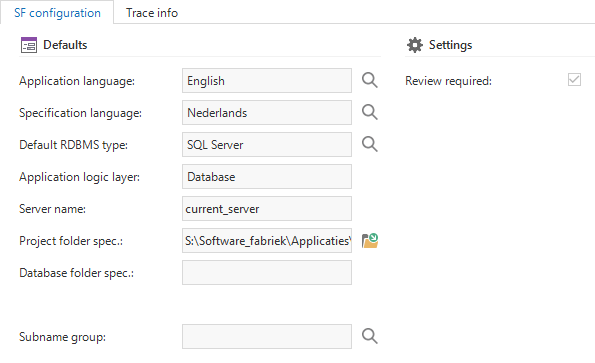

The *Advanced menu* (right click on the menu and select *Advanced menu* to open) provides access to options that are not available via the standard menu.

## Project management

The *Project management* menu group gives an overview of several subjects, like tables, columns and prefilters, outside the context of projects and versions. This can be helpful to, for example, compare different versions of your application.

*Prefilters accessed from the Advanced menu*

## Master data

The *Master data* menu group provides access to Software Factory settings and master data. 

### Software Factory

#### Users

Shows the registered Software Factory users and their roles (*Analyst, Designer, Developer, Reviewer, Tester*).

#### SF configuration

Contains a number of default settings for new projects and project versions, such as the database, application logic layer, folder and subname group. Here you can also specify which platforms (Windows, Web, Mobile) must be available by default for new project versions and . In addition, you can specify which languages must be added as default to new project versions. 

*SF configuration*

#### SF info

Contains information about the Software Factory version and when it was created.

#### Hotfixes

Shows the installed hotfixes.

#### Import master data

Re-imports master data and base projects. Only execute this task if instructed by a Thinkwise consultant.

#### Optimize indexes

Maintenance task to optimize SQL Server indexes and statistics.

### Model

#### Application languages

This screen provides an overview of the languages that are available within the Software Factory. 

#### Controls

This screen provides an overview of the Controls that are available within the Software Factory.

#### Shift codes

This is an overview of the shift codes that are available for defining key combinations.

#### ASCII codes

This is an overview of the ASCII codes that are available for defining key combinations.

#### Font faces

Here are the font faces that can be used in the layout of the application. Additional font faces can be added here. Make sure these fonts are available in the operating systems.

#### Task types

The task types that are currently supported within the Software Factory, are stored here. All tasks that are linked to this can be viewed for each task type.

#### Report types

Here are the report types that are currently supported in the Software Factory. Which reports are linked to this type is specified for each report type.

#### Screen component types

This component provides an overview of all the available screen component types in the Software Factory. It is visible for each screen component in which screen type this component will be used.

#### Conflict types

The conflict types that can be recognized from a merge session are displayed in this component.

#### Extender types

Provides an overview of the registered extender types.

#### Business process

Definitions of the different node and link styles and shapes in the Business Process modeler.

### Software

#### RDBMS

This screen provides an overview of the currently available database management systems for which an end product can be created.

#### Programming languages

This component provides an overview of the available programming languages. This is also where programming languages may be added.

#### Data types

This component provides an overview of the possible data types and the domains in which they are used. A conversion can also be done from and to another programming language for each data type.

#### Data type conversions

An overview of the conversions between data types from one programming language to another. 

#### Program object types

Here is an overview of the available program objects that are used within the Software Factory.

#### Subroutine types

Here is an overview of the available subroutine types that are used within the Software Factory.

#### Sample data sets

Data sets used for data anonymization.

#### Data sensitive keywords

Keywords used to determine possible sensitive columns.

### Hardware

#### Printers

An overview of the available printers. These may, for instance, be used as default printer for printing reports.

#### Printer types

Here is an overview of the available printer types.
