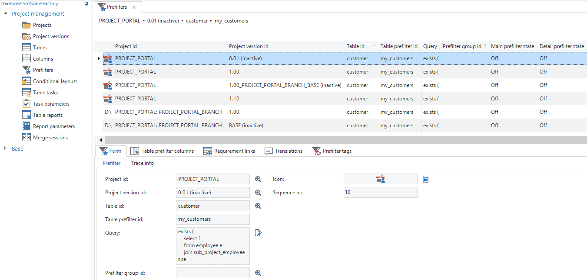
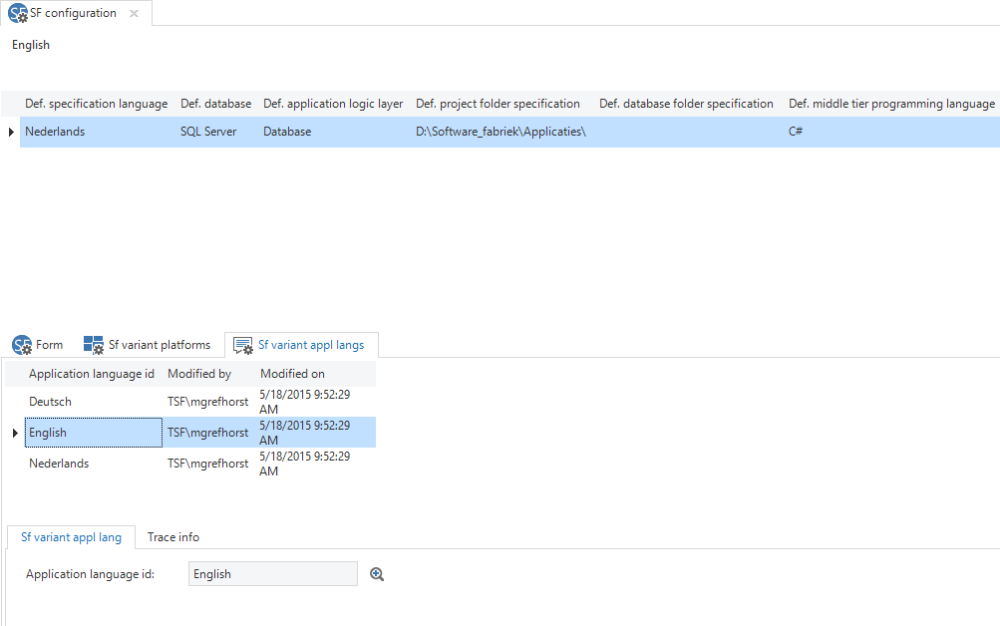
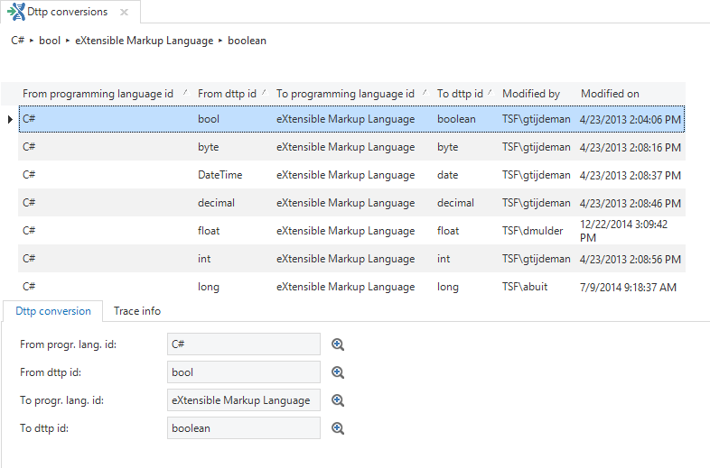

Via the alternative menu (right click on *Advanced menu*) options and base data are available that are not accessible via the standard menu.

The settings of the Software Factory development environment can be modified in the base data.

## Administration

In this tab it is possible to view overviews of subjects outside the context of the project/version. For example, it is possible to get an overview of all projects, project versions, tables, columns, prefilters, conditional formatting, tasks and reports.

These screens do not use the project version selector and could therefore also be opened from the Web GUI.

Figure 241: Prefilters accessed from the 'Advanced menu*

## Settings

### Software Factory

#### SF configuration

This component contains a number of default settings for new projects and project versions, such as the database, application logic layer, folder and subname group. Here you can also specify which platforms (Windows, Web, Mobile) must be available by default for new project versions. In addition, you can specify which languages must be added as default to new project versions. Each project version can deviate from this.

Figure 242: Setting Application Languages via the 'FS configuration' in the 'Advanced menu'

#### SF info

This contains information about the Software Factory version and when it was created.

### Model

*Application languages*

This screen provides an overview of the languages that are available within the Software Factory.

#### Controls

This screen provides an overview of the Controls that are available within the Software Factory.

#### Shift codes

This is an overview of the shift codes that are available for defining key combinations.

#### ASCII codes

This is an overview of the ASCII codes that are available for defining key combinations.

#### Font faces

Here are the font faces that can be used in the layout of the application. Additional font faces can be added here. Make sure these are available in the operating system.

#### Task types

The task types that are currently supported within the Software Factory, are stored here. All tasks that are linked to this can be viewed for each task type.

#### Report types

Here are the report types that are currently supported in the Software Factory. Which reports are linked to this type is specified for each report type.

#### Screen component types

This component provides an overview of all the available screen component types in the Software Factory. It is visible for each screen component in which screen type this component will be used.

#### Requirements model

This shows the four levels of requirements stored with their various options.

#### Conflict types

The conflict types that can be recognized from a merge session are displayed in this component.

### Software

#### RDBMSs

This screen provides an overview of the currently available RDBMSs for which an end product can be created.

#### Programming languages

This component provides an overview of the available programming languages. This is also where programming languages may be added.

*Data types*

This component provides an overview of the possible data types and the domains in which they are used. A conversion can also be done from and to another programming language for each data type.

#### Data type conversions

This is an overview of the *translations* of data types from one programming language to another. For instance, what is a VARCHAR in T-SQL called in PL-SQL?

Figure 243: Translations from Transact-SQL to PL-SQL

#### Program object types

Here is an overview of the available program objects that are used within the Software Factory.

#### Subroutine

Here is an overview of the available subroutine types that are used within the Software Factory.

### Hardware

#### Printers

Here is an overview of the available printers. These may, for instance, be used as default printer for printing reports.

#### Printer types

Here is an overview of the available printer types.
