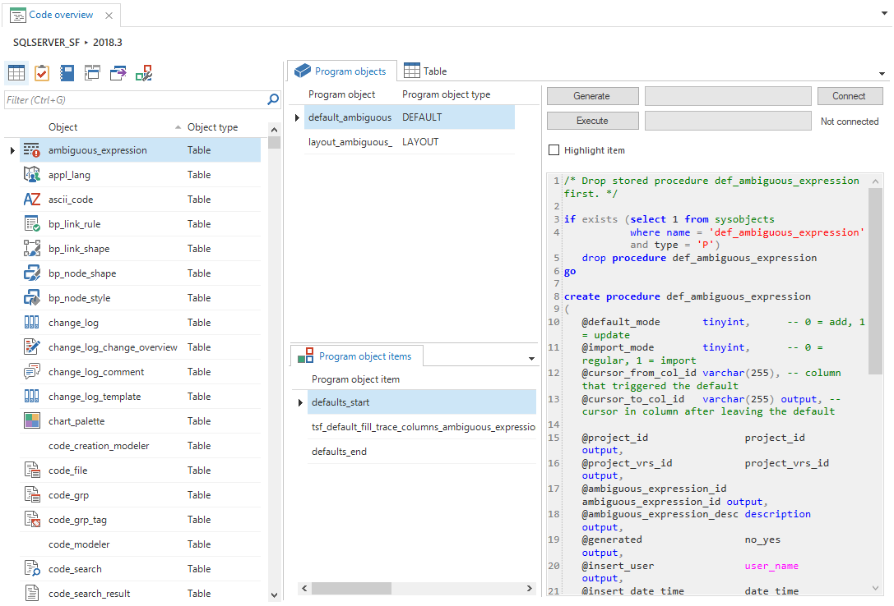

The *Code overview* screen shows an overview of all program objects containing business logic for tables, views, tasks, reports, process flows and actions, and subroutines. It allows you to easily find, re-generate and apply these business logic concepts for specific entities.

*Code overview*

