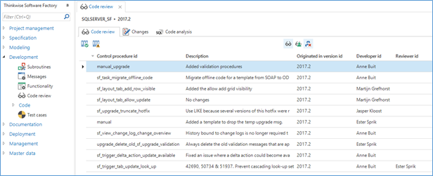
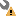
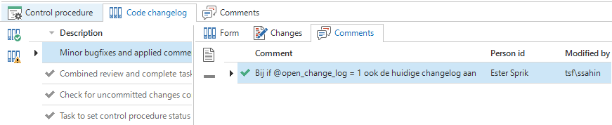
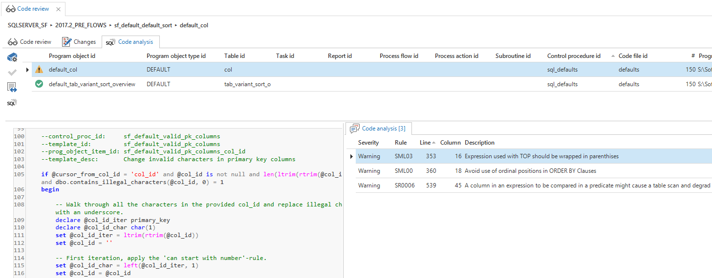

The *Code review* screen shows the control procedures and templates marked for review.

The *Changes* tab page shows the control procedure code and/or template code that has changed. Using the *Compare control procedure* and *Compare template* tasks you can preview the changes using an external compare tool like *WinMerge*. 

You can add comments to inform the developer of any errors or possible optimizations in the code.

Tasks are available to approve or disapprove the changes. When approved, the control procedure will be set to completed. When disapproved, a comment will be required as review feedback and the control procedure will be set back to development. 

*Code review*

### Resolving comments

Icons in the *Functionality screen* indicate the development and review status of control procedures:

| Icon                           | Description                                                  |
| ------------------------------ | ------------------------------------------------------------ |
|  | Currently in development by another developer                |
|  | Currently in development by current developer                |
|  | Changes are disapproved, in development by current developer |
|  | Waiting for review, developed by current developer           |
|  | Ready for review, developed by another developer             |

Any comments made by the reviewer are also available in the *Functionality screen*, linked to the changelog. The developer can choose to resolve the comments or mark the comment as *won't fix* and optionally explain the decision made by replying with a comment. When done, the developer can set the procedure to review again.

*Review comments*

## Code analysis

The *Code analysis* tab page allows you to perform an automated static code analysis on the generated T-SQL code. 

After running the Code Analysis task for a specific control procedure, icons show whether there are any warnings or errors for every program object. At the moment, any issues that have to be resolved before code changes are approved are to be manually added to the code review comments. The analysis capabilities will be extended in future versions of the Software Factory.

*Code analysis*

The code analysis will check over 60 rules, covering for instance:

- Type checking
- Use of patterns in LIKE predicates
- Potential SQL Injection Issue
- Avoid cross server joins
- Deprecated JOIN syntax
- Use two part naming
- Use of nolock / UNCOMMITTED READS
- Use of Table / Query hints
- Use of Select \*
- Explicit Conversion of Columnar data – Non Sargable predicates
- Ordinal positions in ORDER BY Clauses
- Change Of DateFormat and DateFirst
- SET ROWCOUNT
- Missing Column specifications on insert
- SET OPTION usage
- Use 2 part naming in EXECUTE statements
- SET IDENTITY_INSERT
- Use of RANGE windows in SQL Server 2012
- Create table statements should specify schema
- View created with ORDER
- Writable cursors
- SET NOCOUNT ON should be included inside stored procedures
- COUNT(\*) used when EXISTS/NOT EXISTS can be more performant
- Use of TOP(100) percent or TOP(\>9999) in a derived table