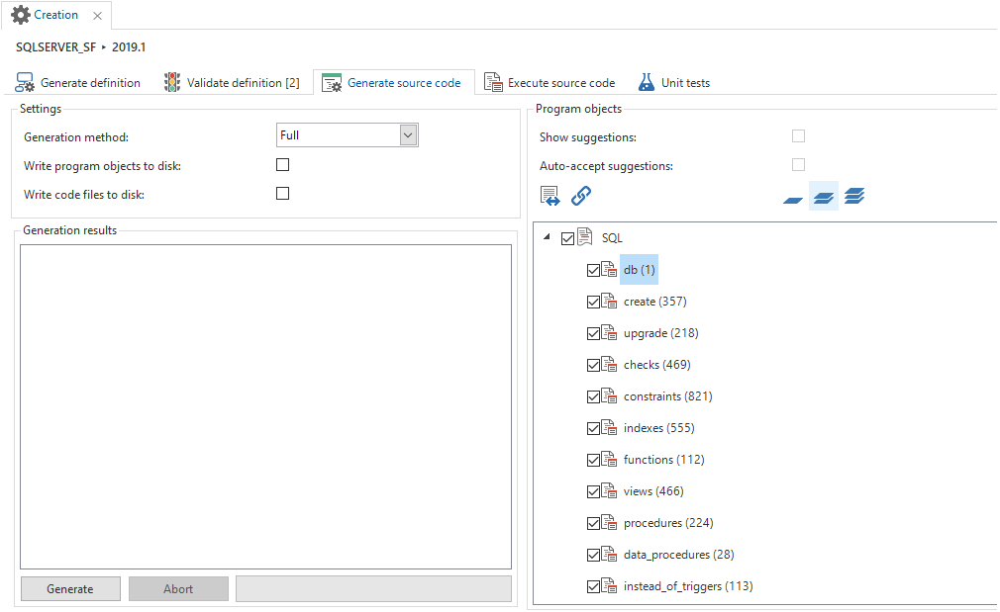
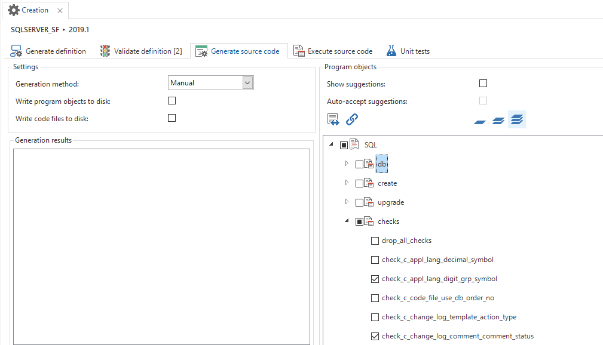

The objective of the *Deployment* component is the execution of generic concepts, including extending the model, the trace functionality, the logging, etc. Furthermore the objective is to generate code to create the database and service layer. The model is transformed here to code. This takes place in a number of steps that are explained in the following paragraphs.

## Creation

The creation has various purposes:

- The model is filled

- The model is validated

The code for the database and any service layers is compiled.

The creation process consists of four steps:

1.  Generate definition

2.  Validate definition

3.  Generate source code

4.  Execute source code

In order to be able to successfully generate (a part of) the data model must first be modelled. This data model is subsequently used to build a database.

**Note**

When, the data model has been put into operation with step 4, no more data model modifications can be carried out in the current project version. A new version will have to be made for this.

When a new version has been put into operation, it may be that new functionality will have to be created. A new version must first be created before any data model changes can be made. While generating the code, queries will be produced to convert data from the tables in the old version to the tables in the new version.

When data model changes are made in a version that is already in use, the correct conversion queries will not be produced for those changes. Creating a new version is therefore very important. An exception is when the current data in the end product is not relevant. The old database can then be deleted and subsequently created again empty according to the new structure.

### Generate definition

To fully generate the definition, all check marks must be enabled in the first tab.

Optionally the following check marks may be disabled:

##### Incl. control procedures in development

Disable this option if control procedures that are not yet completed, do not need to be included. However, take care that the other control procedures do have the status Completed.

##### Delete generated specifications.

Some objects (such as columns, tables, tasks) have generated a check mark. These are deleted during the generation process and then created again. In addition, the program objects with items and parameters are deleted and created again.

##### Copying base projects.

The data and information from the base projects will be copied into the current project so these can be used again.

##### Generating specifications

After the base projects have been copied, the code of all control procedures is executed. The static assignment is also generated.

Figure 231: The *Definition generation* of a project

Figure 232: The result of the *Definition generation*

Only one generation for each project version can be carried out at the same time. This avoids conflicts during the generation. If during a generation a second generation is started, a message is displayed that the generation of the respective project version is locked.

If desired, the project version lock can be cancelled via the *reset lock* task in the ribbon or via the context menu.

Figure 233: 'Reset lock' task via the ribbon menu.

### Validate definition

After the generation, the definition must be validated. It is important that all validation messages of the type 'Error' are resolved before the source code is generated. If this requires modifications to the model, the definition generation must be executed again.

See chapter 7.13 for more information about the validation.

### Generate source code

After the definition has been generated and validated, the actual source code can be generated.

Figure 234: The 'Generating source code' tab in 'Creation'

The composite code is stored in the Software Factory. The code can also be written to disk, which is important when generating a C\# or Java service layer.

- When *Write program objects to disk* is enabled, the composite program objects are placed in the folder *.\\Source\_code\\Program\_objects*.

- When *Write code files to disk* is enabled, the code files are written to the *.\\Source\_code\\Group* folder. The C\# service tier is placed in .\\Source\_code\\CSharp and the Java service tier in .\\Source\_code\\Java.

#### Program object filter

The filters at the program objects determine the level of detail where you can view and enable or disable the code. The most detailed level might cost some time to load, depending on the size of the model.

#### Generation method

There are three options for generating the code, depending on the situation.

*  
*

##### Complete

This option is desired when the end product database still has to be created or still has to be brought in line with the model and the end product database does not correspond with a previous version of the model.

The program code of all the objects is assembled. Subsequently, all program objects are used for compiling the code files.

**Note**

All the database objects that are not defined in the model, for example, indexes and procedures, are removed.

##### Smart

With this option only modified objects are reapplied to the database. However, this option can only be used when the end product database is the same as the previous version of the model. This is often the case when upgrading a production version. The smart way of generating, significantly speeds up the upgrading process, for example because unmodified indexes are not rebuilt and it reduces the risk of an upgrade.

The program code of all the objects is assembled. An analysis is performed to determine which program objects are actually used during the compilation of the code files.

The condition for performing the analysis is that the program objects of the previous version of the model are available and compiled to code. This is because the analysis looks among other things at the modified code in program objects.

**Note**

If you do a smart upgrade, make sure that the previous version is fully generated. For example, generated objects may have been deleted during the implementation of a branch. These then appear as newly installed objects during the difference analysis.

##### Manual

Manual generation can be applied when it is exactly clear what needs to be executed on the database. For example, during the development phase, when a view and all the associated logic have to be executed on a database.

A manual generation offers the opportunity to check mark program objects that have to be executed. Only the checked program objects are used in the compilation of the code files.

It is possible to use the *Smart* generation first and subsequently expand or restrict the selection using *Manual* generation.

Figure 235: Checking and unchecking components when generating manually.

Tip

It is possible to group the tree with program objects for each model object. In this way all code of a view or a table can be quickly executed.

When performing a manual upgrade of an individual table, pay attention to the program objects in “Other” such as deleting dependent objects or renaming the old table.

### Archive code

After complete generation the generated code is written to an archive. When subsequently a sub-generation is done, then the code remains stored in the archive. With a smart upgrade the code of the current version is compared with the archive of the previous version. The archiving takes place fully automatically and nothing in the method of working needs to be adjusted.

### Execute source code

When all source code is generated, it must be activated on the database. This is done in the tab "Execute source code". It is recommended to always make a backup of the end product before this step is executed.

1.  Connect to the server with the *Connect* button at the top right.

2.  The required code files are check marked by default after connecting. It is optionally possible to uncheck code files.
    
    1.  When the 'db' code file is present, it is automatically check marked if the database does not yet exist.
    
    2.  When the *upgrade* code file is present it is automatically check marked when the database already exists and the product information in this database indicates that an upgrade should take place.

3.  Start the process with the 'Execute' button. The entire architecture will be built.

Figure 236: Overview of the *Execute source code* tab in 'Creation'

**Note**

The code files may have been written to the disk while generating the source code. However, the code on the disk is **not** used when executing code files on the database from this screen. Changes to the code files on disk have no effect\!

When the model of a table is changed, the old table will be renamed and a new table will be created. The upgrade script ensures that the data is imported from the renamed table to the new table. Lastly, the (now superfluous) renamed table is deleted. Next, the business functionality is applied again immediately.

When the generation has been carried out and all code has been executed and/or compiled, the end product is ready to be used. For this, the ini must be modified so that it uses the new project version and the status of the project version can be set to Production.

When an existing database is upgraded, it is possible that not all data conforms to the (new) checks and constraints. To check the database, the base project SQLSERVER\_VERIFICATION, DB2\_VERIFICATION or ORACLE\_VERIFICATION can be linked. After having carried out all the steps again, an extra code file with controls will have been generated, which can be executed on the database.

It is also possible to implement offline logic. Modifications in JavaScript templates have no effect until these actions are executed. When implementing offline logic the JavaScript code is retained as it was at the moment of execution.

Besides implementing modifications in the database and the offline logic, it is possible to develop the C\# service layer and/or the Java service layer from the 'Execute source code' screen. In contrast to the code files that are used for the database and the offline logic, the code files on disk are used here. It is therefore necessary that when performing 'Generate source code' the code files are written to disk. See chapter 15 for more information about the service layers.

#### Developer ribbon 

When the end product is started up in developer mode, extra options become available in the developer ribbon. These options are

Figure 237: Developer ribbon

- Refresh model (Ctrl Alt F5); The object model is refreshed with 'refresh model', in which modifications in the end product are immediately visible. This concerns GUI model modifications. For data model modifications, an upgrade is required and Functionality changes are made to the database and are immediately available.

- Debug; In the debug screen, the events are displayed that are performed on the database, such as look-up queries, views, defaults, layouts, etc. and more information about error messages from the database. Filtering on events can be done in the filter at the top left.

- Version control; With the version check, it is checked whether the versions of all the required DLLs \[15\] are correct, such as database drivers and Crystal Reports.

- Open folder; Opens the GUI folder.

- Location (Alt F1); Indicate the location of the developer on the screen.

Figure 238: Popup that appears if the location is called up in the end product.

- Translate; With "Translate" the user can switch between the translated and untranslated menu names, and it is indicated whether new screens open translated or untranslated.

- Test Console; Opens the screen with the test information, test suites and test cases.

- Test case recorder; This makes it possible to record manual tests.

**Note**

Refreshing the shortcut key of the object model (Ctrl Alt + F5) can be prevented by the graphical settings of your system. First disable this to use this option in the GUI.

In developer mode error messages about defaults/layouts/context procedures are displayed in the Windows GUI in the info panel. The GUI also still calls the default/layout/context procedure with the existing parameters, so that the existing functionality continues to work after, for example, adding or removing a field or reference. In end-user mode, they are however, displayed as blocking popups.

Thinkwise provides a separate manual, in which all GUI options are explained. The Windows, Web and Mobile GUIs are explained in more detail in this manual.
