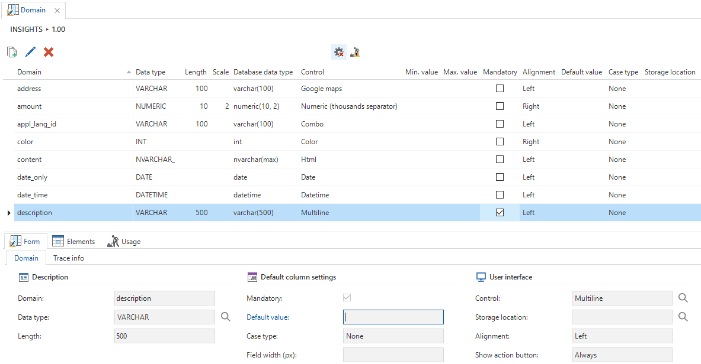

A logical data model in the Software Factory consists of three components, which will be explained in more detail in the following paragraphs:

### Domains 

These are abstract data types. Domains are mandatory and are displayed in a column. A domain has optional elements. They can therefore offer the user a pre-defined selection. Consider, for example, gender: man/woman. This is explained in more detail further on in this chapter in paragraph 7.1.

### Tables

Rows (records) can be stored in a table. Each row consists of fields (columns). **Views** can also be included in a data model along with physical tables. A view gives a runtime presentation of data from one or more tables in one concentrated overview and is therefore always up-to-date. There are no rows stored in a view. With DB2 and Oracle it is also possible to define a **Snapshot**. In a snapshot, just as in a view, data from one or more tables can be combined, but in a snapshot this data is actually saved. This can considerably improve performance. The RDBMS has provisions to easily refresh the data in a snapshot (and sometimes even automatically).

### References

A reference is a relation between tables. The integrity between these tables is automatically guaranteed on the basis of a column comparison. A reference consists of a target and source table. The source table is the lookup table.

The data model is accessible via the Data Model screen in the quick launch toolbar under the Modelling group.

Overview of the *Data Model* screen

## Diagram

Since a data model can consist of many tables with columns an overview can quickly become very unclear. To avoid this it is possible to produce several diagrams each describing a subset of the complete model. A task is available to produce one's own diagram. This diagram is always at the top of the list of diagrams and can only be used by the user who is logged in. This prevents two developers getting in each other's way when designing.

## Design

Diagrams, and therefore the data model, can be designed graphically via the *Design* tab

Figure 63: Tables and Views in the 'Design' screen

This screen has a number of functions that help when designing the data model. A list is visible in the left hand column with all the tables and views. Behind this there is a similar list with all the references. These can be checked and unchecked to use them within the diagram.

Under this list there is an overview of the diagram and there are a number of standard parameters that can be modified.

Tasks are available above the tables to automatically add extra levels or link tables to the diagram.

The *One level deeper* and *One level higher* tasks select all linked tables above or below the selected table. This allows fast development of a diagram, which displays linked tables.

The *Link table* task automatically creates a link table between two tables. It can be indicated in the popup which table is the main table and which is the subordinate.

> When a link table is created, then both tables must have a primary key. Otherwise it is not a link table and an error message is given.

Figure 64: Three tasks in the Diagram

The tables and references are displayed graphically on the work sheet.

The context menu (right-hand mouse button in the work sheet) offers the following options:

- Refresh: re-load the data model, for instance, to see modifications from other designers.

- Diagram: has a sub-menu to save, load and rename diagrams.

- Arranging: produces a graphical display by manually positioning the tables yourself. The distance is determined through an option in Settings.

- Arrange references: leave the tables alone, but position the references so that they do not run through the tables.

- Fit to screen: remove the white edges around the data model.

- Align: has a sub-menu to align selected objects in various directions.

- Print: the data model is printed on the standard printer.

- Print preview: displays a print preview.

- Export: has a sub-menu to export the graphical data model to various formats such as GIF, PNG, PDF, etc.

- Normal/Reference: switch between *Normal* and *References*. If *References* is selected it is possible to draw references between columns.

- Add: a table or reference can be directly added to the model.

- Delete: Delete a table or reference from the diagram and/or model. With delete table, the table is not deleted but only removed from the data model. With delete reference there is a choice between removing the reference just from the diagram or also from the model.

Adding new domains, tables and views is available in the tabs behind the subject field, but can also be easily done via the tasks above the subject field.

Figure 66: Screen shot of a component of the design screen

## Domains

With a domain a data type is defined that is copied to one or more columns. If the definition of a domain is changed, then all columns and parameters that use this domain will also be changed. Domains can also be used in T-SQL, so even declarations of variables automatically change as well.

An example of a domain is *sales\_order\_no*. Everywhere in the data model that a field sales order number is used, that field must be linked to this domain. In some RDBMS a domain is sometimes also called a *reference field* or *user-defined data type*.

A domain always contains a data type and possibly a length and precision. Domains can also have a control that is used to visualize the linked fields in the user interface. All possible controls are explained later in this paragraph.

**Example**

A *Google maps control id* with employees provides the possibility, with one click on the button, to start the web browser with Google maps with a *pin* on the entered location.

In addition, several standard settings for columns can also be provided. An example of this is the *Mandatory* field. If this is checked new columns that are linked to this domain are also mandatory as standard. This can be deviated from for each column.

Figure 67: Overview of the *Domains* tab

Figure 68: Adding 'Elements' to a domain

### Control action buttons

Some fields are used only to show data and not to mutate. It is possible to hide the control action button per domain. There are three options:

- Never

- When editable

- Always

Figure 69: Control with action button “Always”

Figure 70: Show action button

## Tables

As indicated earlier the tables are accessible via the *Tables* tab.

Figure 71: Overview of the 'Tables' tab, containing a number of tables and views

The columns are defined within a table under the *columns* tab. A column has the following properties:

Figure 72: 'Columns' tab within 'Tables'

### General

- Project id: of the current project.

- Version id: of the current project version.

- Table id: the table within which the column is created.

### Description

- Column id: the column name in the database.

- Domain id: determines the data type and control of the field.

- Column alias id: a column alias can be optionally added here.

- Column description: a description of the column can be optionally placed here.

### Model settings

- Sequence number: determines the physical sequence in the database.

- Case type: determines whether this field is only filled with upper case letters, lower case letters or a combination of both.

- Identity: the database will automatically issue a number for this field.
    
      - Seed: begin value of the number.
    
      - Increment: steps with which the number is increased.

- Primary key: indicates whether the field is part of the primary key.

- Type of column: determines how the column is displayed (Normal / Read only / Hidden).

- Mandatory: determines whether a field is mandatory or optional.

- Default value: fixed value that is filled in when adding a record, with a change this value is not filled in.

- Foreign key: indicates whether a field is a foreign key from another table.

### Calculated field

- Type of calculation: indicates with which calculation the field is filled. A choice can be made from:-
    
      - None: the user enters a value himself
    
      - Expression: the GUI executes the calculations. This is not stored in the database. The column itself is also not stored in the database:
    
      - Calculated column: the database executes the calculation and stores this in the table.
    
      - Calculated column (function): the database executes the calculation with the help of a function.

- Query calculated field: in which a query can be specified to have a value in this field calculated by the GUI or database, for instance *price \* quantity*. This value is not stored in the database.

### Other options

- Alias: is used in DB2 to give a short name for a table, that can be used in RPG software.

### Expression dependencies

It is possible in the Software Factory to define virtual fields that are not stored in the database but are evaluated by the user interfaces. This type of field is called an *expression field*. For these expression fields, that are sometimes also called look-up info fields, no upgrade of the end product is necessary.

**Example**

A person can be displayed as first name + prefix + surname. This name is composed and therefore does not have to be stored in the database, but is often used in the GUI.

With calculated fields a query must be provided with which the value is retrieved by the user interface. For instance, this can be a composition of several fields, a (range) function or a subquery. Reference can be made in the query to other fields from the table by using the alias t1.

The query that is provided with expression fields will be added to the select clause of the query. For example:

1.  **select **

2.  t1.\[customer\_id\], 

3.  t1.\[customer\_naam\], 

4.  (**select **t1.street + t1.number\_number + c.name 

5.  **from **country c 

6.  **where** c.country\_id = t1.country\_id) **as** t1.\[address\]

7.  **from **customer t1 

The columns on which the expression is dependent are shown on the *Expression dependencies* tab . If one of these columns changes in the end application, then the expression field will also be updated. If, for instance, *street* changes, then the composite address must use the new street.

Figure 73: Calculated field with a Query

**Warning**

In queries, for example, of the prefilters and expression fields all tables must be given an alias if use is made of the C\# Service Tier. The reason for this is that otherwise NHibernate cannot handle the queries.

Example of an incorrect expression:

t1.code + (select name from country where code = t1.code)

 Interpretation from NHibernate:

\_this.code + (select \_this.name from country where \_this.code = \_this.code)

 Correct notation:

t1.code + (select c.name from country c where c.code = t1.code)

## Views

A view is a logical table that is composed from fields from other tables. The data in a view is not stored in the database, but composed at runtime on the basis of a query.

A view is created in the same manner as a table and has a number of additional options. One of these options is the choice in which way the view must be created. There are three options available for this.

### Automatic

This method is used when only data from the linked (source) tables need to be used in the view.

The *from clause* is created automatically. This is generated but it can also be forced by executing the *Generate view from clause* task.

### Modifiable

Use this method to be able to modify the *from clause*, *where clause*, *group by clause* or *having clause* of the view. The *select clause* is built up on the basis of the *view table* and *view column* fields in the columns.

### Template

The last option provides the possibility to write a template in which the entire select query is written, which then needs to be woven into the view.

The *Template* option provides the freedom to use the most complex selection structures or to construct them dynamically. Creating this template is explained in paragraph 0

## Copy columns 

All columns are available for copying to the created view in the *copy columns* tab. The selected columns are copied to the view using the *Copy* button.

Figure 74: A view with the option to copy columns

When this takes place, a popup screen appears with the option to enter a prefix. This prefix is placed before the name of the copied column. For example, the name column can be copied from the employee table with the prefix *employee*. *Name* is now displayed in the view as *employee\_name*. When the column name starts with the prefix then the prefix is not added for a second time.

Figure 75: Popup that appears when tables are copied

After all columns are defined and/or copied and *Automatic* or *Modifiable* is chosen for the view option then the *from clause* of the view can be constructed by executing the *Generate view from clause* task. 

## References

A reference is a relation between two tables. The target table has one or more fields (the foreign key) of which the combined values must appear as the primary key in the source table. This column comparison is specified in the reference columns.

Figure 76: Tables and views in the 'Design' tab without references

References can be created by means of *drag & drop* in the *Reference* status. In the *Normal* status the *Reference* status can be temporarily activated by holding down the Ctrl key. This makes it possible to create a reference by dragging with the mouse from the source to the target table. A popup then appears in which the column comparison is presented.

The column comparison is based on the primary key of the source table: which therefore has to be present. If a column from the source table does not appear in the target table then a check mark appears in front of the column to indicate that this column will be created. This check mark can be unchecked whereupon an existing column from the target table must be chosen. Only columns that have the same domain as the column in the source table can be linked.

When adding or modifying a reference it can also be indicated whether the reference must be used as detail and/or as look-up.

Figure 77: Popup for creating references

It is possible to switch off the integrity check of the reference by the RDBMS by the unchecking the check mark next to *Check integrity*. The reference then only serves to display details or look-ups in the user interfaces.

Incidentally, just the integrity between tables can be checked. When the source or target table is a view, the *Check integrity* option is turned off as a default.

## Validation

Validating the data model is possible in the *Validation* tab. Through this errors can already be identified at an early stage. The *Validation* component is explained in more detail in paragraph 7.13.

Figure 78: Example of the validation screen

## Creating the database

When the data model is completed the database can be created, this is described in chapter 10. Since there is still no user interface set up there is nothing visible in the end product. The tables are accessible after the menu has been set up. This is explained in more detail in paragraph 7.3.

## User interface

Starting the user interface is possible once the database has been created, this is explained in more detail in chapter 10, or through the use of the RDBMS with the Mock ini parameter with which the user interface does not need a database but generates dummy data for itself.

The paragraphs (7.3 to 7.10) describe the possibilities and set up of the user interface model.

