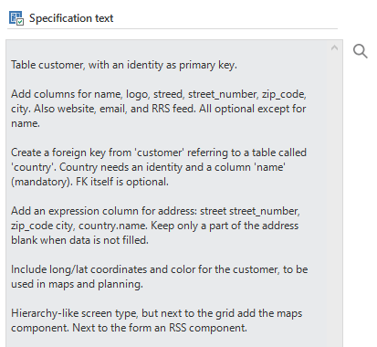
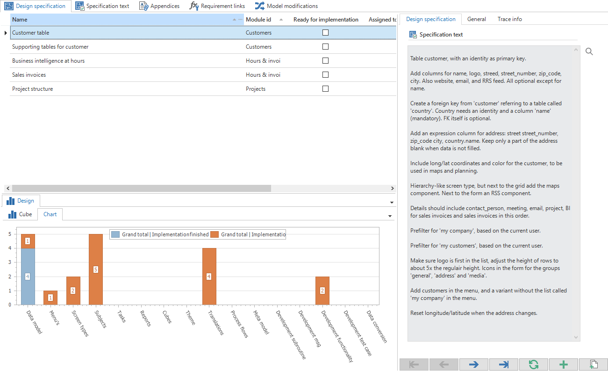
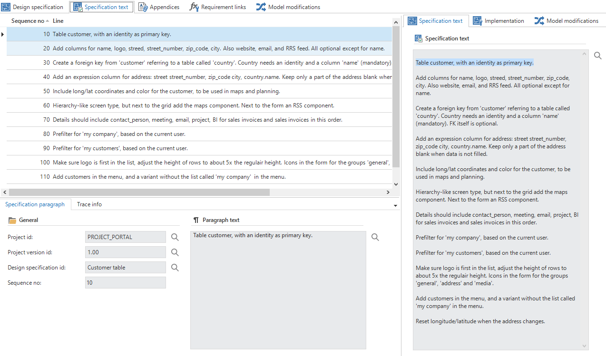
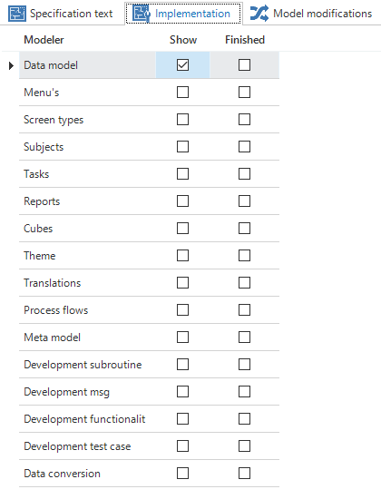
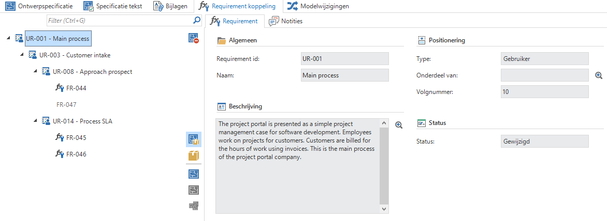
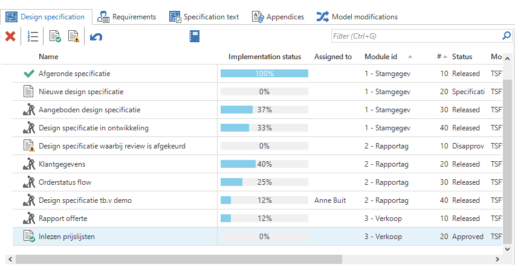
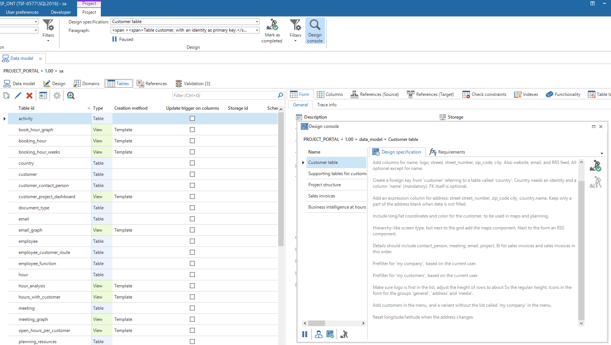

Now the business processes and requirements are complete there is a clear overview of the processes to be developed. The target group for requirements is the business. However, the functional requirements must be implemented. The translation of functional descriptions to the technical implementation is achieved through design specifications. Where in the functional requirements terms such as table, column and button may not be used, the design specifications focus exactly on these items. The target group of design specifications is therefore the developers. The design specifications therefore constitute the actual to-do list for the developers.

*Specification text*

Each of the paragraphs in the example above is a specification for the developer. These specifications together often belong with a table or task. One or more system requirements can be linked to these specifications.

## Setting up design specifications

*Design specifications*

As can be seen in the above illustration the design specifications can be specified on the *Design specifications* tab. The specification texts are presented in the form of paragraphs behind each of these specifications. These are therefore completed for each paragraph.

*Specification texts*

It can then be indicated on the *Implementation* tab where this specification must be made available. A specification can be displayed for a specific subject, including data modeling, process flows and translations.

*Design specification implementation*

In addition, the system requirements can be linked to the design specification on the *Requirement link* tab.

*Requirement link*

### Design specification flow

When design specifications are created they can be submitted for review. They can be approved or disapproved. Notes can be added when a specification is disapproved. Once a design specification is approved, the specification can be released for implementation.

*Design specification*

## Design specifications in modelers

The list with open design specifications can be seen in each modeler via the ribbon. This list can be used by the developers as a checklist during modeling and development. By opening the design console the developer gets a complete overview of the open design specifications.

As soon as a design specification is selected then all additions and modifications that are done starting from that moment are linked to the design specification. When the requirements of the design specification are satisfied these are reported as completed with the help of the check mark under the design specification name. The following design specification will then appear.

The registration of updates can be paused using the pause button.

*Overview of the 'Project ribbon' with the requirements*

