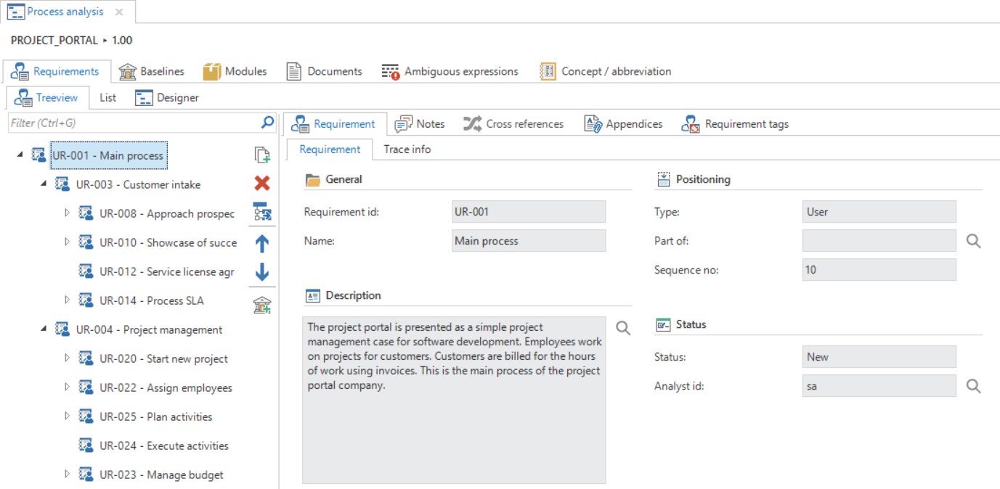
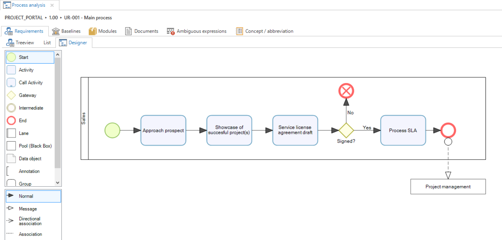
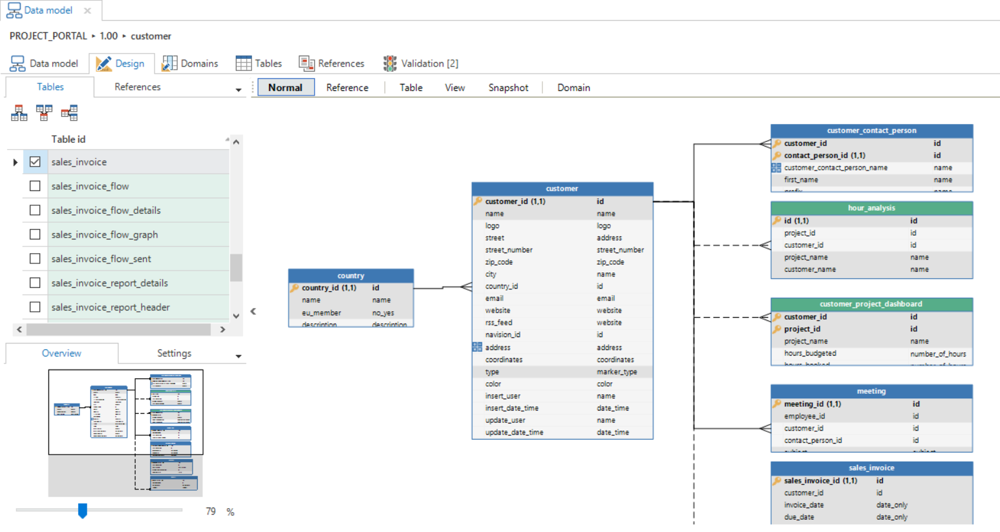
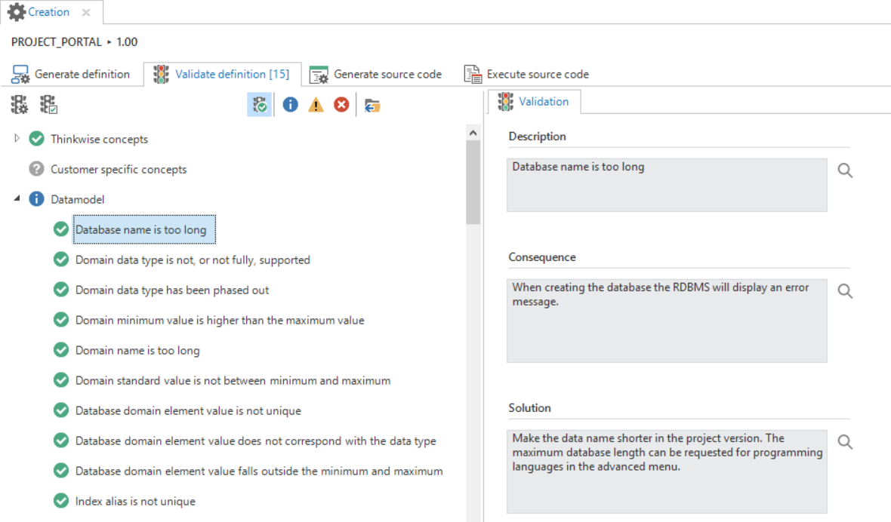
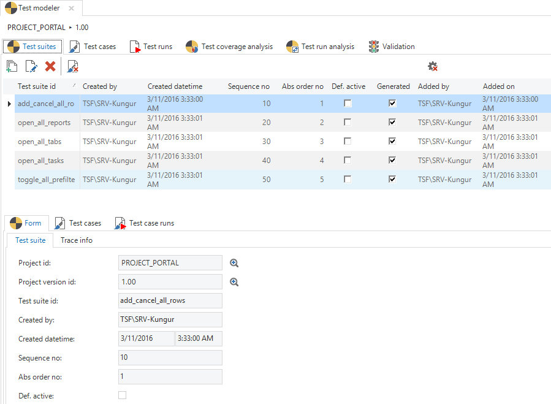
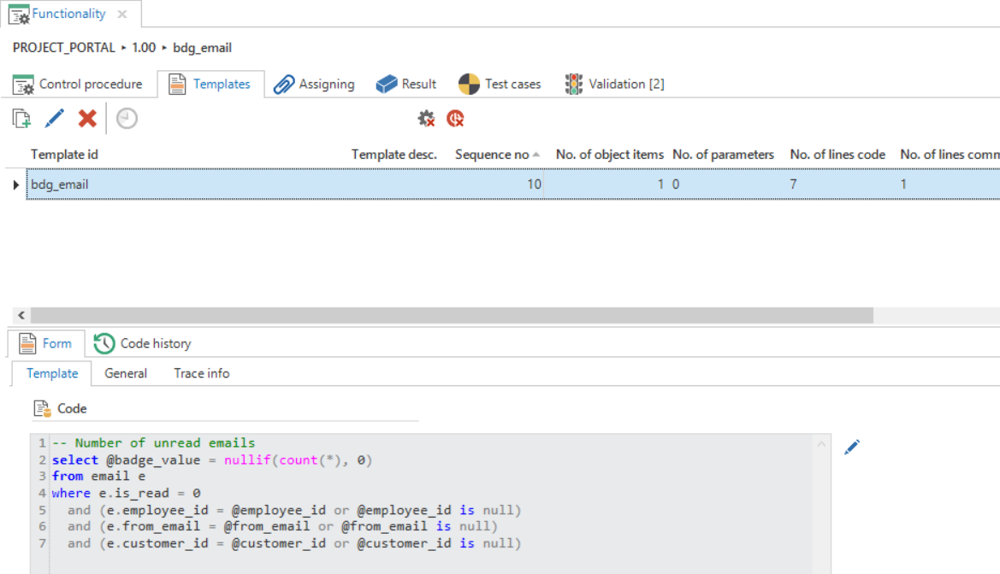
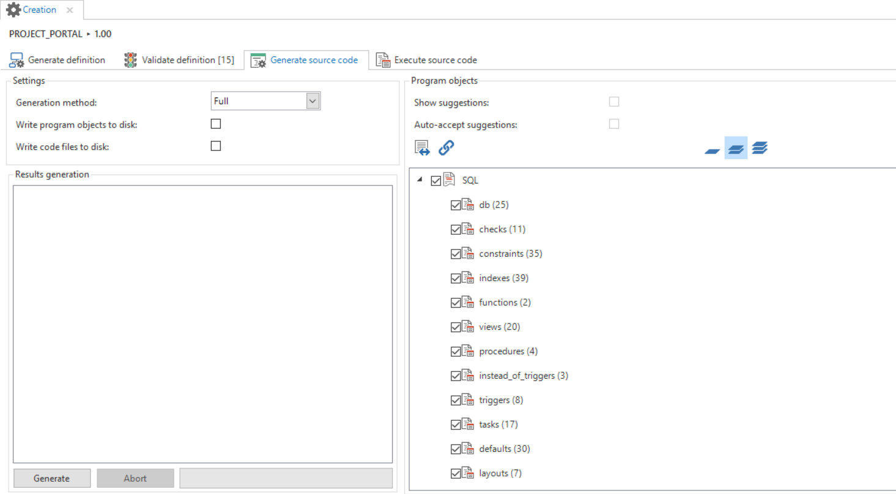

The process of development with the Thinkwise Software Factory consists of the following phases, which are explained in more detail in the following pages:

- [Project management](overview.html) - creating a project or project version
- [Specification](process_analysis) - drawing up requirements and modeling the business process
- [Modeling](data_model.html) - for instance the [data model](data_model.html), [user interface](menus.html) and [processes](process_flows.html)
- [Documentation](help.html) - drawing up help documentation
- [Business logic](functionality.html) - creating the required functionality 
- [Quality control](code_review.html) - by [validating](validation.html) and [testing](test_cases.html) the model and business logic
- [Deployment](creation.html) - putting the end product into production

The menu within the Software Factory is built up in the same manner and therefore corresponds with the structure of the manual.

The last chapters include other information about the Software Factory that, by definition, is not necessary for the development of an end product. To create an optimal end product Thinkwise recommends reading these chapters prior to starting development with the Software Factory.

One characteristic of developing an application with the Thinkwise Software Factory is that after completing the modeling phase a working prototype of the application can already be demonstrated. This is due to the phased structure of the development process and because no lines of code need to be written for the prototype. The stakeholders can therefore already see a working end product at an early stage and they acquire a good idea about where the product is going.

The prototype serves as the basis for further development and adding functionality and documentation.

Help functionality that supports the developer with the development of a project is available within the Software Factory via the F1 key. All topics of the Software Factory are described within this functionality. As default, the help functionality opens with the component that is selected at that time.

## Projects

The *Projects* menu contains information about all available projects, versions and branches.

The *Overview* screen contains all projects that have been produced in the Software Factory. New projects are also created here. Along with the basic information about the project, the versions and branches of the projects can also be viewed here. *Full model* gives access to the complete model of a specific project version. With *Merging* branches can be created, conflicts between branches analyzed and resolved and it is possible to remerge broken branches. The last component within administration is the component on *Difference analysis*. This displays the differences between different project versions.

*An overview of the *Projects* screen*

## Specification

The business processes and requirements are specified during the analysis phase. This describes exactly which requirements and wishes are placed on the system. The business processes indicate in a diagram which processes need to be produced in the project. The requirements can be seen as a contract with the business, with which the scope of the project can be continuously monitored. In addition, the requirements provide a to-do list for the modeling phase and the Software Factory automatically maintains the traceability between the requirements and the model. It is therefore strongly recommended to specify the requirements within the Software Factory, even though this is not compulsory. The business processes and requirements can be linked to each other, so that both change with each other when something changes in either one of them.

*Overview of the *Requirements* tab*

*Overview of a business process*

## Modeling 

The following components are specified during the modeling phase:

- Data model
- User interface
- Help
- Processes
- Dynamic model (expert mode)

These components form the basis for the end product without it being necessary to program them. Only the model has to be completed. This takes place on the basis of the requirements as drawn up in the previous phase. On the basis of the completed model a demo can be given to the business to demonstrate at an early stage what the end product will look like and how it will work. A bridge is built between the business and IT with the help of this demo.

*A completed diagram in the *Data model* tab*

## Quality control

### Validation

The project can be validated completely or per component with the Validator. The Software Factory is delivered with hundreds of standard validations, however company specific validations can also be added. Executing the validations automatically guarantees the quality of the models.

*Validations executed for one of the modelers*

### Test cases

The programmed templates can be tested automatically with test cases that are stored in the Software Factory. A test case can be created in three ways:

- Recorded via the GUI
- Input via the Software Factory
- Automatically derived from the existing model

A test case is coupled to the templates that are then used for testing. Checks are included in a test case to examine whether the templates work correctly. A test case can subsequently be executed automatically and the test results stored in the Software Factory.

Test cases only need entering once and can subsequently be executed automatically with every new project version. This guarantees that existing functionality continues to work despite any additions and modifications.

*Overview of the Test cases screen with a number of test suites*

## Business logic

This phase of the project consists of writing source code templates with business rules. These templates are woven into the correct position in the end product on the basis of definitions from the model.

*An overview of a completed template on the 'Functionality' screen.*

## Creation

The end product is taken into use during this phase. This phase has a special place within the entire project. Where logically the creation phase would be the last phase, since the end product is taken into production during this phase, this does not have to be the last phase with the Software Factory. An application can already be created after modeling and validating the data model.

*Generating source code during the code generation*