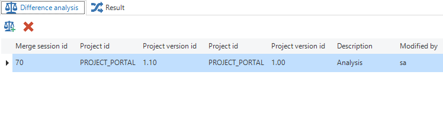
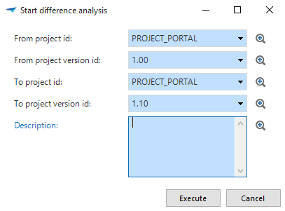
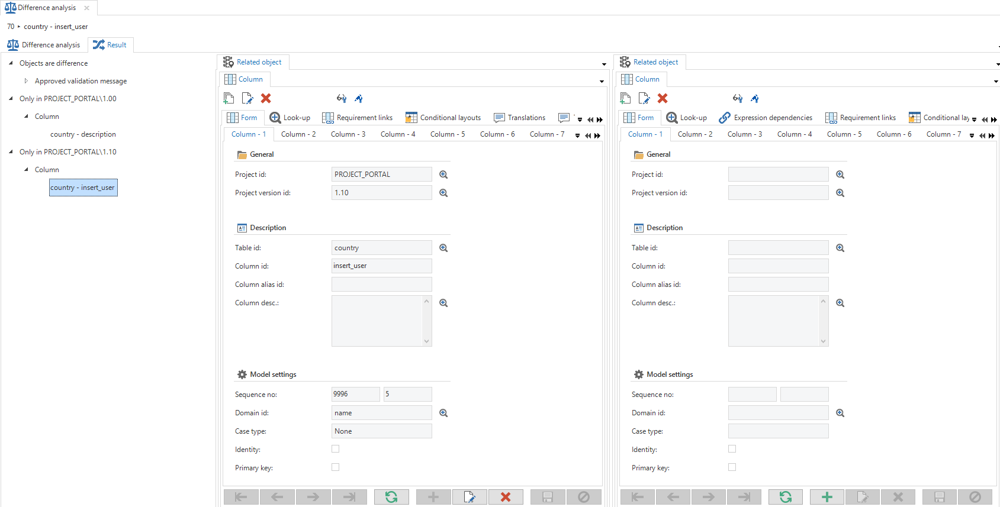

The *Difference analysys* screen allows you to analyze the differences between multiple versions.

*Difference analysis*

A difference analysis can be run using the *Start difference analysis* task.

*Start difference analysis*

The differences can be examined under *Results*. Differences with associated objects can be immediately adjusted if they are incorrect. However, the analysis is static and will not assess these differences again. 

*Difference analysis result*