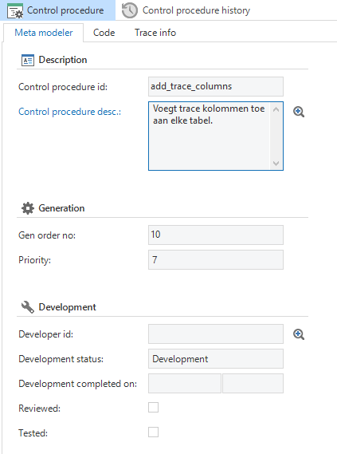

In the Dynamic model component the model of the application can be modified via SQL code. We call this *meta control procedures*. The entire model can be expanded with specific functionality without this having to be set up for each table separately. The model can automatically be kept consistent with these procedures.

Figure 198: The 'Control procedure' tab in the 'Dynamic model'.

In meta control procedures, which affect the data model, queries are written that enrich the model of the Software Factory on the database. Because this type of meta control procedure concerns a modification of the data model, version control needs to be set up for this. This can also be done via queries.

**  
**

**Example Data Model**

Adding trace columns to all tables.

Add an update counter column to tables which are updated.

Create indexes on standard sorts of the GUI.

Along with meta control procedures, which affect the data model, there can also be a meta control procedure that only affects things that occur in the GUI. A number of examples of this type are listed below.

**Examples of a GUI model**

Table option *Automatically resize columns* (in the grid)

Trace columns

Hide in the grid

*Information* in a form on a separate tab

Turn off Search and Filter

Turn off *Look-up is combo* table option on the basis of the number of records in the table

*Start empty with filter* table option on the basis of the number of records in table

*Include in copy* column option with read only and hidden fields

If a table has no default sort, create one on the basis of the presentation field

Default *Current* prefilter if a table has an *Archive* column

Length of fields in the form and the grid on the basis of the data type length

Combinations of fields on the same row:

Number of units and Unit

Currency and Amount

### Because this type of procedure only modifies the GUI definitions it is not necessary to set up version control. 
