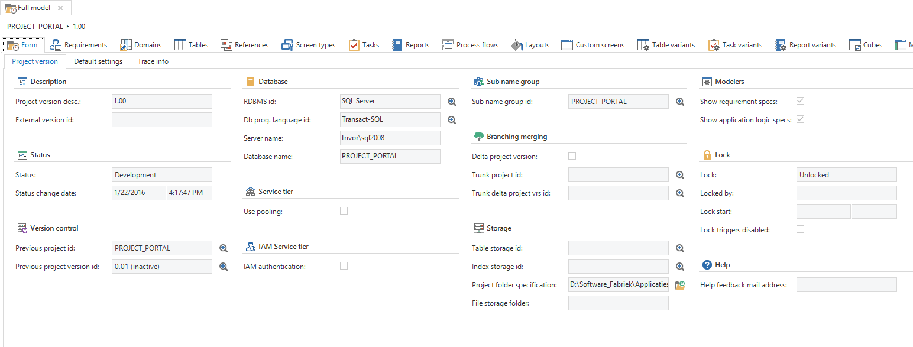
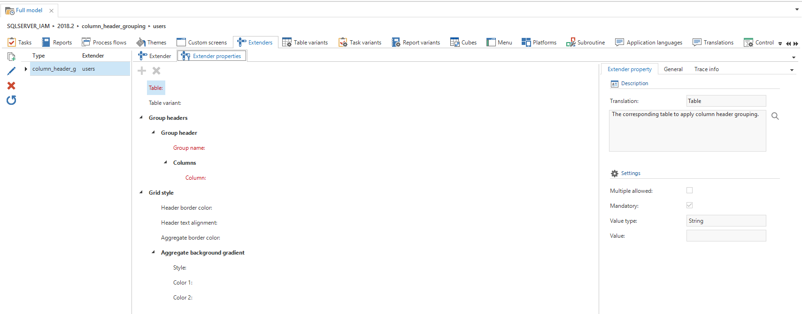
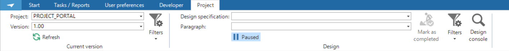
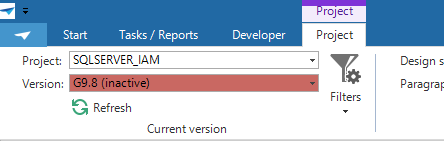
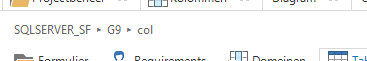

The full model of a project version is available via this screen, but it is advised to work as far as possible with the specific modellers. The full model is intended for the advanced user.

Figure 25: Overview of the 'Full model' screen

### Extenders

Some features are implemented in a GUI, but are not yet available in the Software Factory and IAM. The code to activate this features is written in special GUI extenders and are shown on the tab page “*Extenders*”. Here an extender can be configured and implemented in the project.

Extenders can be difficult to implements. Please contact your Thinkwise contact person for assistance when needed.

Figure 26: Extenders

### Project Version selection

A tab named *Project* is available in the ribbon, within which the project version for the screen can be selected. This applies for all the tooling screens of the Software Factory with which work is performed within the context of a project version.

Figure 27: The Project ribbon

Non-development project versions are highlighted in red to make it clear that you should not be using this version.

Figure 28: Project version selector

The Software Factory keeps track of which project and version was selected last and will automatically select them when the user logs in again.

To clearly indicate in which project and version the developer is working a *breadcrumb trail* is available on every screen, in which the project, the version and any additional information about the location is displayed.

Figure 29: An example of the 'breadcrumb trail'
