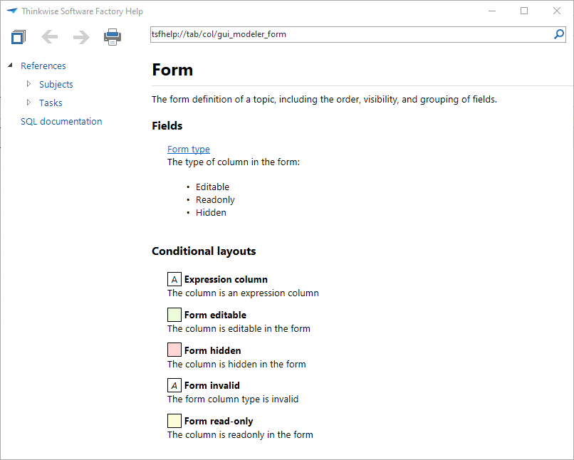

Pressing the F1 key in a Thinkwise user interface opens the application's *Help* dialog, where information about the current subject or field can be found. A user can only access the help text for objects he is able to access in the application. 

*Help dialog of the Software Factory application*

## Creating help texts

The help text for a an object, like a table, task, report, column or parameter, can be specified at the translation of the object to which this help text applies. The user interfaces automatically combine the help text of for instance the columns of a table to create the table's help text.

*Providing help text in English for the *project* table*

The input fields of the help texts is a *rich text* data type, providing the possibly to use formatting options such as **bold**, *italic* and underlined. It is also possible to add images, which are stored in the HTML. 

*An example of a help text*

## Creating the table of contents

The table of contents of the help is built as a tree structure. Help pages can be added manually and provided with text. 

References to tables, tasks and reports can be added by creating a new page and checking the *Dynamic* option. The option whether to add tables, tasks or reports will then appear. The user interfaces will automatically add all tables, reports or tasks in the table of contents. 

*Dynamic reference to tables*