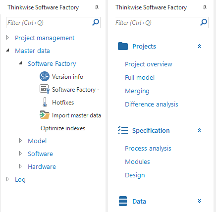

The menu of an application provides access to the screens (tables), tasks and reports of the application. There are three different kinds of menus available, a quick launch menu, a tree menu and a tiles menu. It is possible to create different menus for different platforms.

When a new menu is created, menu groups must first be created within this menu. These groups work as headings for the underlying menu items. Menu-items can be added to a group, which refer to a specific table (variant), task (version), report (version) or custom screen. Whether or not an icon is shown in the menu can be specified in the theme settings.

The image below shows an example of a tree menu on the left and a quick launch menu on the righ.

*Overview of the tree menu and quick launch menu*

By setting the *Show filter* checkbox in the Menu tab it is possible to show a filter bar on these menus. This makes it is easy to find a desired menu item in the menu.

*Setting the filter option*

*Filtering in the menu*

## Tiles menu

For the tiles menu, along with creating the groups with items, the size at which the items must be displayed can also be defined. A choice can be made from four size.

*Tile sizes*

During set up the groups and items are created and it is indicated how large the items have to be and, in addition, a different image can be selected for each tile. This can be done in the *Tile group* tab page. Subsequently, the GUI will itself organize the items from top left to bottom right according to the room that the screen has available.

## Platforms

The *Platforms* tab page allows you to specify which menu's are available for a platform (Windows, Web, Mobile) and what menu is the default menu.

In this way, for example, a different menu can be created for Mobile for which the menu items, where necessary, use variants that are optimized for Mobile.

The platforms are initially determined in the Software Factory, but can also be authorized later in the Intelligent Application Manager. It is therefore possible to make a GUI application for specific user groups available via Windows, Web or Mobile.

*Platform tab page*

## Accessible objects

Via the tab *Accessible objects* tab page, the developer can see via which routes a specific object, task or report can be accessed in the system. This can also support the developer when checking authorization, for instance, whether a table is accessible that should not be accessible.

*Accessible objects tab page*

By clicking on the *Investigate accessible objects*  task the popup below opens. It can be indicated here for which platform the shortest path must be determined to a table, report, task or variant.

*Task to determine the shortest path to an object*

The result then shows via which steps the object can be accessed.

*Steps when determining the shortest path*

By clicking on the table, information about this table appears on the right and this can be modified. An additional function that becomes available when this table is selected is the *Expand*  task. By clicking on this the following tasks, details, look-ups and reports of the selected table are displayed.

*Expanding a path*

Sometimes you know until what level you want to expend. If this is the case it is possible to insert the depth in the pop-up.

It is possible to expand to up to 9 levels. However, when a new level would cause the amount of nodes introduced in the tree to be more than 1000, the expansion will be stopped at the current level.

*Investigate reachable objects*