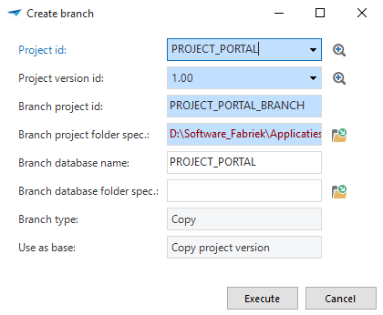
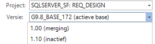
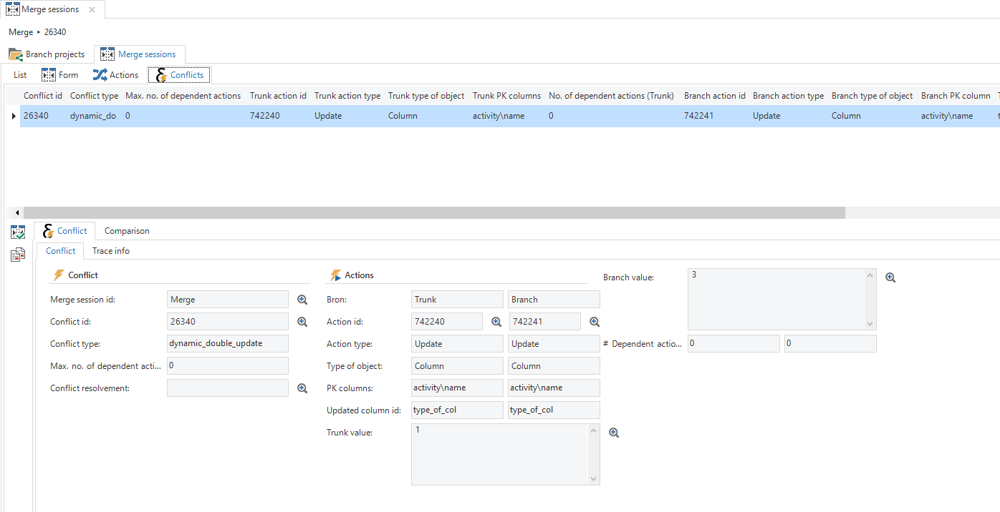
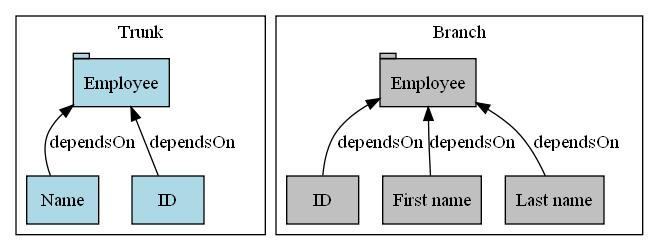
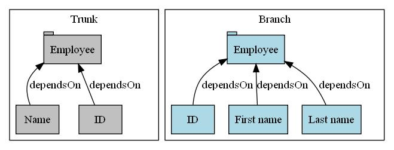
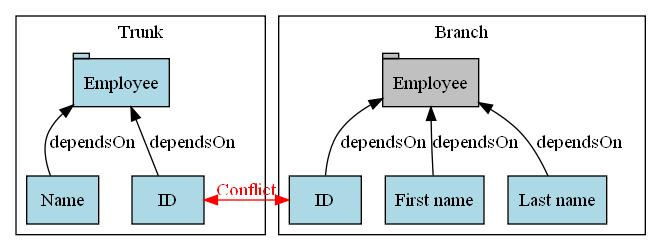
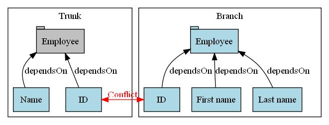
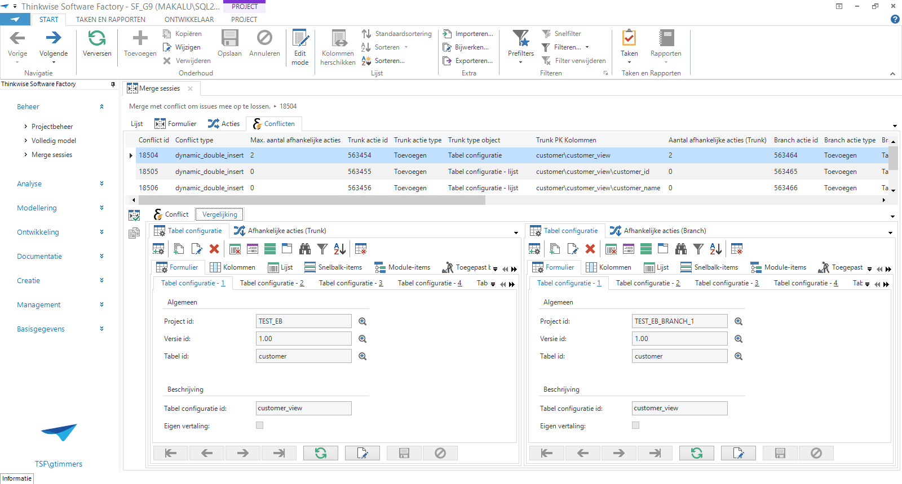

When several developers or teams work on different features of an application, branches of a project version can be made for these features via the *Project overview* screen. Each feature can be further developed separately and, as soon as a feature is completed, it can be combined (merged) with the main project version (trunk) via the *Merging* screen. This way, a new feature can be developed and tested entirely independently from the rest of the project.

## Creating a branch

A branch can be created in the *Project overview* screen using the *Create Branch* task.

This task opens the following pop-up.

*Pop-up for creating a branch*

It must be indicated for which project and project version a branch has to be created. The name of the branch project can then be entered and a location selected for the project and the database.

When the branch is created, it can be developed like a regular project. To do this, select the correct project and the associated project version on the project screen.

### Base versions

When creating a branch, a base project version is automatically created. This base version is prefixed with the project version of the trunk. For instance, *1.10_BASE* to indicate on the basis of which version it has been created.

## Creating a merge session

As soon as the branch project is satisfactorily completed and tested, it can be combined again with the trunk. This can be done in the *Merging* screen. A merge can be started with the help of the *Start merge session* task.

*Pop-up for starting a Merge session*

Select the trunk and branch project version to merge. Any conflicts are identified so that a solution strategy can be defined in the following step. In this situation, only a comparison is made. Because no modifications have yet taken place, the user can always go back to the previous step. 

As long as a merge session is not completed, the indication *merging* will be added to the project version to indicate that a merge session is running. Modifications in a project version with the status merging may be lost when the merge session is carried out.

*Merging indicator with project version*

It is also possible to merge modifications from the trunk into a branch. It can then first be tested whether the new version works correctly, before the trunk is updated.

## Conflicts

Conflicts are presented in the *Conflicts* tab. When the merge session is started, three kinds of conflicts can occur.

#### Static conflicts

Static conflicts only occur when the branch is started with an empty project or a (sub) application, and an object is created in the branch which already exists in the trunk.

#### Dynamic direct conflicts

This type of conflict occurs when there is a double insert or update, or when a delete on one branch and an update on another branch are carried out, such as deleting a table compared to adding columns to this table.

#### Dynamic indirect conflicts

This type of conflict occurs if a delete in the trunk and an insert or update in the branch takes place at the reference level.

*Overview of the conflicts*

### Resolving conflicts

After the conflicts are detected, they can be resolved one-by-one. It is also possible to resolve several conflicts simultaneously with the help of the *Resolve conflict* task.

This enables the modifications from the branch or from the trunk to be carried out. There are four options available:

1. Only carry out the trunk action - Only the parent and children of the trunk are included.
   
1. Only carry out the branch action - Only the parent and children of the branch are included.
   
1. Carry out trunk actions with dependent branch actions - The parent and children of the trunk plus the children of the branch are included.
   
1. Carry out branch actions with dependent trunk actions - The parent and children of the branch plus the children of the branch are included.
   

> Options 3 and 4 can lead to new conflicts between the children of the trunk and the branch. These will then have to be resolved.

### Comparing code

With the task *Compare code*, it is possible to compare and merge the different values of a column for the conflicts *Dual change* and *Dual addition* with an external comparison table (WinMerge or KDiff3). After saving the file in the comparison tool, the merged text is transferred to the pop-up. By clicking on *OK*, the value is stored with the branch and the processing set to *Only carry out branch*.

*A conflict comparison during a merge session*

## Execute merge session

Only when all conflicts have been resolved, can the *Execute merge session*  task be started to perform the actual merge.

After the merge, a new project version is created in the target project and the merged project versions are deactivated.

