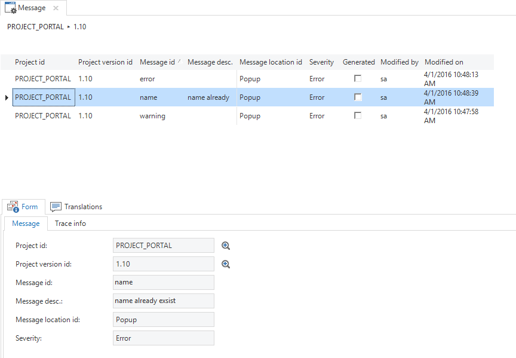
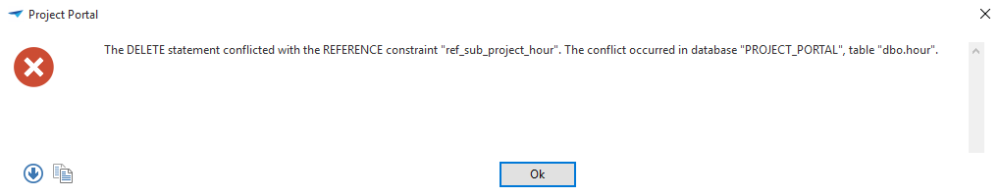

Error messages, warnings or informational error messages are also modelled in the Software Factory, with for instance the possibility to define a translation, severity and location. This applies to both messages that are transmitted from functionality (code templates) and messages that are caused by the database, such as constraints and checks.

### Modeling messages

The *Messages* screen can be found in the menu under *Development*.



*Overview of the Messages*

##### Message id

The message is given a name in the Message id field.

It is possible to clear the Info Panel with the default messages *clear_panel* and *add_separator*.

##### Message description

A brief description of the purpose of the message is given in the 'Descriptions' tab.

##### Message location id

##### It is indicated in this field how the message should be displayed. A panel (a bar at the bottom of the screen) or a popup can be selected.

##### Severity

The severity of the message is determined here. This may be an informational message, a warning or an error message.

#### Translations

In the Translations tab of the message, a translation can be specified in which parameters are defined with \\ {0 } \\ {1 } etc. Later on in this paragraph it will be explained how these parameters can be filled, for example, with a table or column name or with free text.

### Generating Messages

To generate a message from an SQL template for RDBMS projects use can be made of the *tsf_send_message* procedure.

tsf_send_message **message id*, [parameter string], [abort]*

##### Parameter string

Optional parameter string with which parameters in the translation can be filled. This is an XML string in which the various parameters are given. It is also possible to use translations of model objects, such as columns or tables.

The following XML elements with associated attributes are recognized:

- text

- tab

      - tabid

      - transl (**standard**, form, grid, plural)

- col

      - colid

      - transl

- domelement

      - domid

      - elementid

      - transl

- task

      - taskid

      - transl

      -
- taskparam

      - taskid

      - taskparmtrid

      - transl

- report

      - reportid

      - transl

- reportparam

      - reportid

      - reportparamid

      - transl

Text does not have any attributes, since only plain text is placed here, which does not need to be retrieved from another location.

>```xml
><text>Welcome</text><col tabid="customer" colid="name" transl="plural"/>
>````

##### Abort

Indicates to the GUI whether the transaction should be aborted or not. This parameter determines whether the GUI, for example when saving a row, regards this row as stored and closes the edit mode, or whether the form remains in edit mode.

For example for SQL Server:

Message_id: duplicate_customer

Translation: Note, {0} already exists in {1}.

> exec tsf_send_message 'duplicate_customer', '\<text\>''Thinkwise''\</text\>
> \<tab tabid=”customer” transl=”plural”/\>', 1;

Result: Note, *Thinkwise* already exists in *Customers*.

> It is also possible to use the XML string that is generated by the *tsf_send_message* procedure directly in a raiserror or signal, for instance:

exec raiserror('\<msg id=”duplicate”\>\</msg\>', 16, 1);

### Transactions

For SQL Server a rollback and return have to be performed to abort a transaction. This always occurs for DB2 and Oracle and therefore no informative messages can be given.

Example:

> exec tsf_send_message 'duplicate_customer', null, 1;
>
> rollback;
>
> return;

In order to still provide informational messages on DB2 in defaults (and layouts?): v_message_text + example

For Oracle the *put_line* function can be used to give informational messages. The PL-SQL code looks as follows:

dbms_output.put_line(*\<\< \<msg id=*my_multilang_message_id*\> [parameter_string]\</msg\> \>\>*);



*Example of a message as it may appear in an end product.*

.
