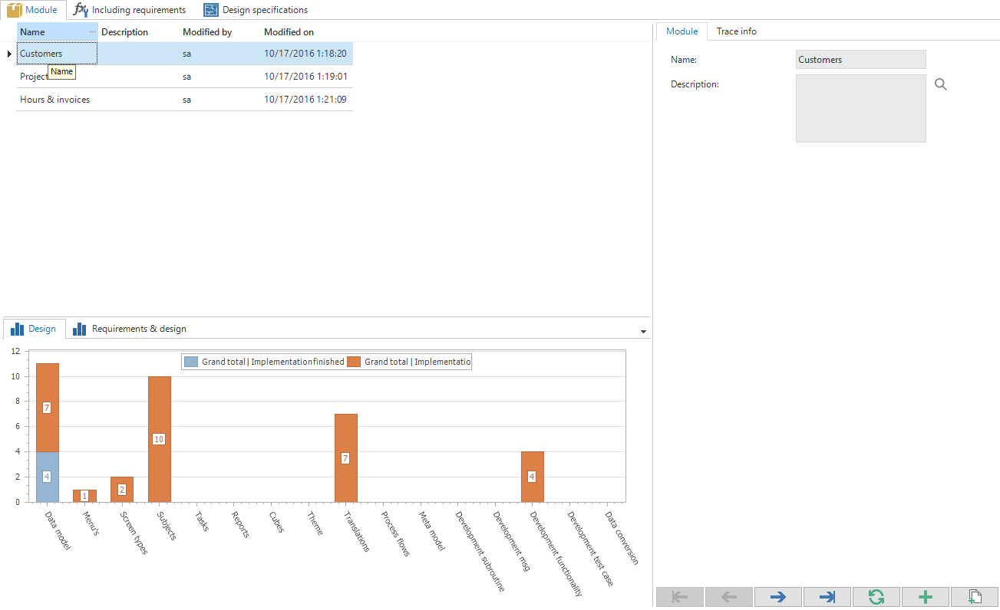

A last and optional step is setting up modules. Structure can be applied in the design specifications and requirements by creating modules. Since the design specifications and requirements can be linked to a module it can be made clear for each module how many design specifications and requirements must be developed. The progress can also be monitored. It can be seen in one overview which components are already completed and which are not. Thinkwise also uses this itself in connection with the Thinkwise Community Portal.

*Modules overview*