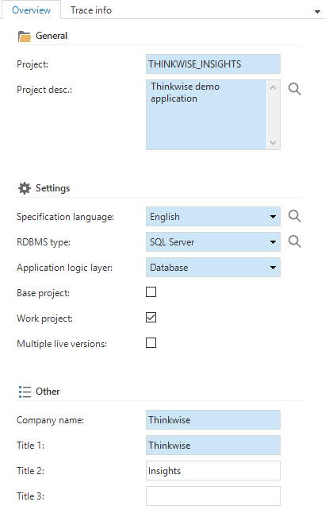
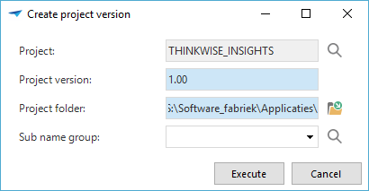

The *Project overview* screen shows a list of all projects in the Software Factory development environment and allows you create new projects and project versions. The *Project versions* tab page lists all versions of the selected project and allows you to modify the generic settings for these versions. The *Branches* tab page shows all branches of the selected project. 

## Create a new project

To create a project click on the *Add* button in the ribbon or on the form. The following screen appears:

*Add a new project*

The following information needs to be provided to create a project. Blue fields are required fields and white fields are optional fields. Grey fields cannot be modified by hand.

- A project id and a project description.

- The specification language used for requirements, data model, etcetera.

- The relational database management system (RDBMS) to use.

- The application logic layer, which determines where the application logic is stored and in which programming language to use. 

  With the application logic layer *Database*, the programming language is the SQL dialect used by the RDBMS. If *Middle tier* is chosen than the application logic is written in C\# or Java.

- If the project is a *base project*, used by another project, or a *work project* (default).
- Company name and application title, displayed on the splash screen.

After clicking *Save*, a popup appears to create the first project version for your project.

*Create project version*

* The *Project folder* determines the location on disk where files, for example reports and icons, are stored. 

* Selecting a *Sub name group* is optional. If no sub name group is selected, a new sub name group will be created for this project. For more information on sub names, see [Naming](naming). 

## Create a next project version

After deploying a project version, further development is always done in a new project version. This enables the Software Factory to analyze the differences between these versions and perform an automatic upgrade to the new version.

To create the next project version, the current version must be copied to the new version in the project version screen with the task *Copy project version* in the context menu. The new version is now exactly the same as the old version.

The *Copy project version* task allows you to update the status of the previous project version. The new version is created with status *Development*.

When copying a project version, any references to the project and version id in files and folders, for example icons and reports, are replaced with the new project and project version id and the files and folders are copied to the new location. 

## Project versions

The different versions belonging to a project are stored under project versions. In addition, it is possible to specify a number of specific things including the various application languages, platforms, linked base projects etc. These components are briefly explained in the following paragraphs.

### Project version status

To allow a project to run in a structured manner a separation is made in the Thinkwise Software Factory between the various phases in the development process using the Thinkwise Software Factory. These phases with the associated statuses are shown below.

- Development
  - Analysis
  - Data model
  - GUI model
  - Programming
- Test
- Acceptance
- Production
- Inactive
- Cancelled

This status is displayed in the status field on the project version screen. A status can always be changed. It is however advisable to keep to the order as shown in the above illustration, so that the project runs as structured as possible. The status of a project version can be changed in the Project Maintenance screen.

#### Development

The status *Development* ensures that all components of the Software Factory can be accessed. This status is particular used by projects that are carried out by one developer because, by definition, you cannot get in each other's way. To be able to work as structured as possible during the development process the choice can be made to use the statuses as described in this paragraph.

- Analysis

> A project starts with an analysis of the requirements for the system to be developed. This takes place during the analysis phase.

- Data modeling

> When a new project version is started, a start is made with setting up the data model for this project version. The status of the project version is now set to *Data modeling*.

- GUI modeling

> As soon as the data model is complete, this is *frozen* and a start can be made with modeling the GUI. The status now needs to be set to GUI modeling. The entire user interface, including tasks, reports, business intelligence and the process flows can now be set up.

- Programming

> The last step to complete the development phase is the addition of specific functionality. The status is now set to *Programming*.

#### Test

When the development phase is completed, the end product can be tested. The model may no longer be modified once this phase has started.

#### Acceptance

During the acceptance phase the users can become acquainted with the system and detect any last errors.

#### Production

When the system is accepted, then it is put into production. The project version can no longer be modified once it is put into production. To do this a new version must first be created.

#### Cancelled

This status is used for a version that was never taken into production. For example, because use was made of a newer version.

#### Inactive

This status is used for a version that has been in production and is now replaced by a newer version.

### File storage locations

Currently, there are four main storage types available in the Software Factory. Each type has unique properties to set up the configuration.

- Azure – In the cloud

- Database – As binary data in the designated column in the application database (BLOB or SQL Server FileStream)

- FTP – File Transfer Protocol

- File system – On the file system

*File storage locations*

For all storage types, except database, it is possible to add subfolders on individual columns, see the next figure. The storage location itself is specified in the Domain. Thus, a column will have the main storage location from its Domain, but files can be stored in a subfolder by setting the subfolder field inside the column properties.

*Subfolder field in column properties*

Storage locations can be set on Domains which use one of the following controls File Link, File Upload, Folder Link, Image Link, Image Upload or Signature.

#### Azure

Azure file storage will work with the Microsoft Azure*s file storage system, this has the same structure as any file system. Therefore, Azure allows for a nested folder hierarchy i.e.

https://storageaccount.file.core.windows.net/files/image/image.png.

A storage account need to be setup first for Azure file storage to work properly. First login to <https://portal.azure.com> then select the *Storage Account* service and add or use an existing storage account. To find the login settings to be used in the Software Factory, click the storage account and inside click on *Access Keys*. The *storage account name* and *key 1* values need to be set within the Software Factory as *username* and *password* respectively as shown in next figure.

*Azure Storage Location settings*

#### Database

Database storage will store the bytes directly in a storage column on the database. The field to select the storage column becomes visible when a column is set to have a database storage location. The storage column needs to be a column with the VARBINARY_MAX datatype.

Take into account that Filestream storage only available is when using a SQL server database. To use filestream storage, the storage column will need the datatype FILESTREAM. In addition, the database requires a table with a filestream column to have a ROWGUID column as well.

#### Filestorage

The path property can either be a network location or a drive. Be aware that it must be a full (rooted) path. I.e. \\\\networklocation\\files\\ or C:\\files\\.

*File upload with data column*

#### FTP

For FTP storage fill in the *username* and *password* with a user that has write access to the ftp server. The Server name field should be filled in with the server address to the ftp. Notice that opposed to Filesystem storage the Path property must be relative from the server address. For example, Servername = ftp://office.thinkwisesoftware.com/ and Path = /files/.

The configuration can differ for each application and application state by linking it to the runtime configuration.

*Runtime configuration*

### Platforms

It can be indicated here which platforms are available to start the project in (Windows, Web and/or Mobile).

### Code changelog

## Base projects

It is possible to indicate whether a project is a base project. This is a project which will be used in several other projects. The base project contains certain details that are necessary for the correct operation of a project, a supplement or an addition, such as a standard layout or a requirements model. When this check mark is checked it is possible to opt for immediate copying, this ensures that the data in the base project is immediately copied to a new work project. Furthermore, it can be indicated whether the base project must be linked as standard in all new projects.

Bear in mind that only base projects with the status *In production* are copied.

An existing base project that is not copied as standard, can be manually added to a project version.

To make the addition permanent the definition must (again) be defined by checking the *Copy base projects* check mark. The base project that is added, is then copied to the current project version.

## Application languages

It is indicated here which application languages are available to start up the GUI in. Dutch, English and German are included as standard languages. Other languages can be added manually by the developer. This is done by adding a language and then translating all GUI items under the translations tab.

## Database storage locations

## Tags 

> TODO: Move

Tags appear in various components of the Software Factory, for example, with tables, tasks and reports.

A tag is a freely definable property that can be linked to rows of a table and can be provided with a value. Tags can be used to provide control for control procedures if the required information is missing, as standard, in the Software Factory.

*Overview of the 'Tags' tab on the 'Full model' screen*

Self-defined tags and their intended use can be registered in the Thinkwise Community Portal, so that they can be formally included a following version.

