Process flows can be defined to automatically guide the user within a screen to the following action. A process flow consists of a number of process actions, which are linked together by process steps, so that the actions follow each other. Process steps can also be made conditional, so that these are or are not started depending on specific conditions.

The process flow screen is arranged in a similar manner as the data model screen. It consists of the following components:

- Status selection; where the status of the screen can be modified or a component can be created.

- Process action overview; all process actions are selected in this screen.

- Work sheet; where the process flow is presented graphically and the process actions can be created and linked together with the help of process steps.

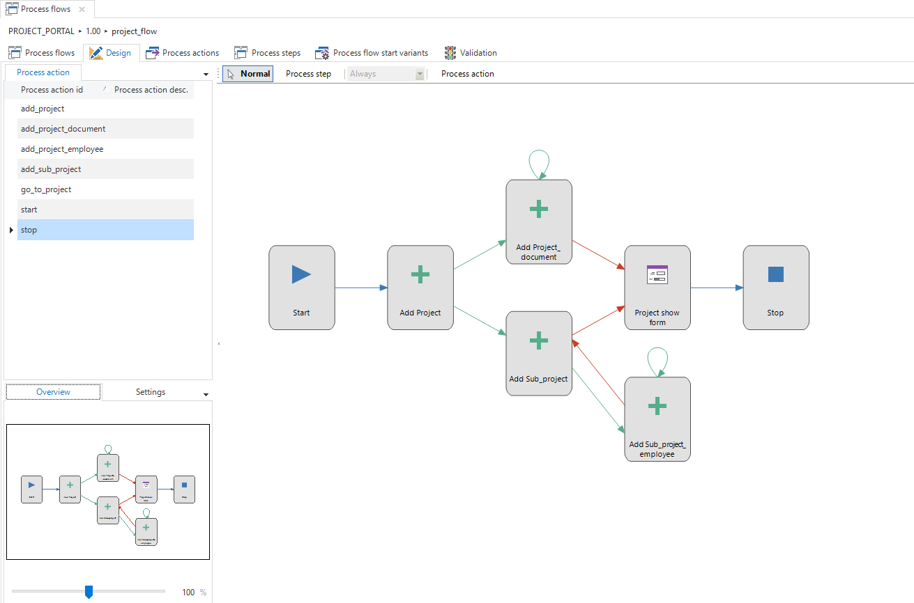

Figure 185: A process flow with various process steps

## Process actions

A process action can, for instance, be related to updating a record, executing a task, printing a report or skipping to a tab or document in the user interface.

Manual actions can also be defined. These have no effect on the user interface, but present procedural actions that must be carried out by users in the organization, such as sending a particular letter.

A process action is created by clicking on the button at the top right or via the context menu.

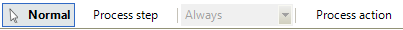

Figure 186: Screen shot of a component from the design screen in 'Process flows'

The process actions tab opens.

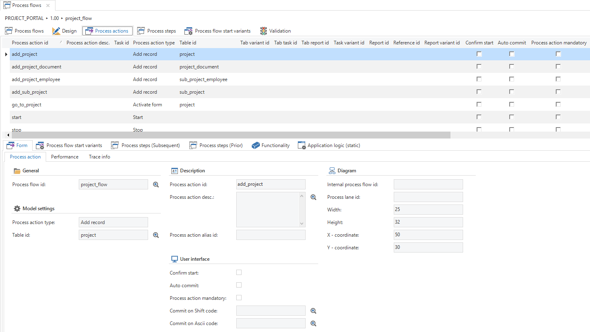

Figure 187: Overview of the process actions

If there is not yet a process flow running in the end application and the user completes an action that is included in a process flow immediately after the start flag, then this process flow becomes activated.

All process actions will return at least the current context that is provided to the associated process procedures as output parameters.

The following process actions are available:

### Activate document 

An open document can be activated with this process action. Since *tab\_id* and *tab\_variant\_id* are not sufficient to identify a document, this process action works on the basis of a document ID that is returned by the *Document open* and *Zoom in on detail* process actions, described in chapter 0 and chapter 0.

<table>
<thead>
<tr class="header">
<th>Input parameters</th>
<th></th>
</tr>
</thead>
<tbody>
<tr class="odd">
<td>activate_doc_doc_id</td>
<td>The ID of the document that must be activated. Valid IDs of documents are only returned by the process actions <em>Open document</em> and <em>Zoom in on detail</em>. It is only possible to activate documents that are open within the same process flow.</td>
</tr>
</tbody>
</table>

<table>
<thead>
<tr class="header">
<th>Output parameters</th>
<th></th>
</tr>
</thead>
<tbody>
<tr class="odd">
<td>status_code</td>
<td>
The status code of the executed action.

0 – Successful

-1 – Unsuccessful (unknown)

-2 – Unsuccessful (document not found)
</td>
</tr>
<tr class="even">
<td>[COL]</td>
<td>The value of a column of the active row. This parameter is present for every column of the subject.</td>
</tr>
</tbody>
</table>

This process action requires no specific rights, because only documents can be activated that are opened by means of *Open document* or *Zoom in on detail*.

### Go to row

With this process action the GUI can be controlled to select a specific row of a specific subject, on the basis of parameters that correspond with the columns of the subject in question. It is not necessary to link variables to all PK columns of the subject. If several rows correspond with the specified column value, then the first found row will be selected. However, if there are no variables linked to all PK columns of the subject, then a warning will be given when validating.

In addition, it is possible to control the way in which the row must be searched for. In general this will make no sense, but if it is known where the row is located then this can make a difference in performance for large data sets. This process action will return the value of the active row as an output parameter.

<table>
<thead>
<tr class="header">
<th>Input parameters</th>
<th></th>
</tr>
</thead>
<tbody>
<tr class="odd">
<td>[COL]</td>
<td>The value of a column of the subject in question. This parameter is present for every column of the subject.</td>
</tr>
<tr class="even">
<td>go_to_row_try_filter_row</td>
<td>
<strong>Optional.</strong> Indicates whether an attempt must be made to filter on the row if the row cannot be found.

<strong>row_try_filter_row_off (default)</strong>

<strong>row_try_filter_row_on</strong>
</td>
</tr>
<tr class="odd">
<td>go_to_row_search_mode</td>
<td>
<strong>Optional</strong>. The manner in which the row will be searched for.

<strong>go_to_row_search_top_down (default)</strong> – From top to bottom

<strong>go_to_row_search_bot_up</strong> – From bottom to top

<strong>go_to_row_search_cur_down</strong> – From the current row downwards

<strong>go_to_row_search_cur_up</strong> – From the current row upwards
</td>
</tr>
</tbody>
</table>

<table>
<thead>
<tr class="header">
<th>Output parameters</th>
<th></th>
</tr>
</thead>
<tbody>
<tr class="odd">
<td>status_code</td>
<td>
The status code of the executed action.

0 – Successful

-1 – Unsuccessful (unknown)

-2 – Unsuccessful (row not found)

-3 – Unsuccessful (navigation not permitted)
</td>
</tr>
<tr class="even">
<td>[COL]</td>
<td>The value of a column of the found row. This parameter is present for every column of the subject.</td>
</tr>
</tbody>
</table>

This process action requires read and navigation rights on the subject.

### Enable and disable prefilters 

With this process action the prefilters on a specific subject can be enabled and disabled. This process action will replace the status of all prefilters on the subjects by the statuses that are indicated by the input parameters of the process action.

<table>
<thead>
<tr class="header">
<th>Input parameters</th>
<th></th>
</tr>
</thead>
<tbody>
<tr class="odd">
<td>[PREFILTER]</td>
<td>
<strong>Optional.</strong> The status of a prefilter of the subject in question. This parameter is present for all prefilters of the subject.

0 = Off

1 – On
</td>
</tr>
</tbody>
</table>

<table>
<thead>
<tr class="header">
<th>Output parameters</th>
<th></th>
</tr>
</thead>
<tbody>
<tr class="odd">
<td>status_code</td>
<td>
The status code of the executed action.

0 – Successful

-1 – Unsuccessful (one or more prefilters is locked or is hidden)
</td>
</tr>
<tr class="even">
<td>[COL]</td>
<td>The value of a column of the active row. This parameter is present for every column of the subject.</td>
</tr>
</tbody>
</table>

This process action requires read rights on the subject and at least one prefilter that is not locked.

### Filter

Filter values on columns of a specific subject can be set with this process action. It can be indicated for each column which filter condition and which filter value must be used.

<table>
<thead>
<tr class="header">
<th>Input parameters</th>
<th></th>
</tr>
</thead>
<tbody>
<tr class="odd">
<td>[COL]</td>
<td><strong>Optional</strong>. The filter value that must be set on the column in question as an <em>equal to</em> filter condition. This parameter is present for every column of the subject.</td>
</tr>
<tr class="even">
<td>chg_filter_disable_prfltr</td>
<td>
<strong>Optional.</strong> Indicates whether the prefilters must be disabled for this filter action.

<strong>filter_disable_prfltr_off (default)</strong>

<strong>filter_disable_prfltr_on</strong>
</td>
</tr>
<tr class="odd">
<td>chg_filter_case_sensitive</td>
<td>
<strong>Optional.</strong> Indicates whether the filter conditions are case sensitive.

<strong>filter_case_sens_off</strong>

<strong>filter_case_sens_on</strong>

The default depends on the rdbms used.
</td>
</tr>
<tr class="even">
<td>chg_filter_ignore_diacrts</td>
<td>
<strong>Optional.</strong> Indicates whether letters with diacritics must be treated as normal letters.

<strong>filter_ignore_diacrts_off</strong>

<strong>filter_ignore_diacrts_on</strong>

The default depends on the application settings.
</td>
</tr>
<tr class="odd">
<td>chg_filter_allow_wildcard</td>
<td>
<strong>Optional.</strong> Indicates whether it is permitted to use wild cards in filter conditions.

<strong>filter_allow_wildcard_off</strong>

<strong>filter_allow_wildcard_on</strong>

The default depends on the application settings.
</td>
</tr>
</tbody>
</table>

<table>
<thead>
<tr class="header">
<th>Output parameters</th>
<th></th>
</tr>
</thead>
<tbody>
<tr class="odd">
<td>status_code</td>
<td>
The status code of the executed action.

0 – Successful
</td>
</tr>
<tr class="even">
<td>[COL]</td>
<td>The value of a column of the active row. This parameter is present for every column of the subject.</td>
</tr>
</tbody>
</table>

This process action requires read and filter rights on the subject and filter rights on at least one of the columns of the subject.

### Sort

The sorting of a specific subject can be modified with this process action. It can be indicated for each column which sorting is applied.

<table>
<thead>
<tr class="header">
<th>Input parameters</th>
<th></th>
</tr>
</thead>
<tbody>
<tr class="odd">
<td>[COL] (sort direction)</td>
<td>
The sort direction that will be applied to the column. This parameter is present for every column of the subject. For every column for which this parameter is specified the sequence number must also be specified.

0 – Ascending

1 – Descending
</td>
</tr>
<tr class="even">
<td>[COL] (sequence number)</td>
<td>Gives the sequence number of this column in the sort.</td>
</tr>
</tbody>
</table>

<table>
<thead>
<tr class="header">
<th>Output parameters</th>
<th></th>
</tr>
</thead>
<tbody>
<tr class="odd">
<td>status_code</td>
<td>
The status code of the executed action.

0 – Successful
</td>
</tr>
<tr class="even">
<td>[COL]</td>
<td>The value of a column of the active row. This parameter is present for every column of the subject.</td>
</tr>
</tbody>
</table>

This process action requires read and sorting rights on the subject and sorting rights on at least one of the columns.

### Manual

This process action is named for completeness, but will remain unchanged. This process action will not have any input parameters and always returns status code 0 as output, because the process action cannot fail.

<table>
<thead>
<tr class="header">
<th>Output parameters</th>
<th></th>
</tr>
</thead>
<tbody>
<tr class="odd">
<td>status_code</td>
<td>
The status code of the executed action.

0 – Successful
</td>
</tr>
</tbody>
</table>

### Open document (renamed)

This process action is renamed (from *Go to a document*) because this process action will always open a new document of a specific subject. The original name would become very confusing through the new process action *Activate document*, described in chapter 0.

Apart from this change of name it is also necessary that this process action returns a unique ID of the opened document as output parameter. This ensures that the new process actions for activating a document (chapter 0) and closing a document (chapter 0) can be correctly implemented. As soon as several documents of the same subject are open, it must be possible to activate or close a specific open document.

This process action has no input parameters and returns the following output parameters.

<table>
<thead>
<tr class="header">
<th>Output parameters</th>
<th></th>
</tr>
</thead>
<tbody>
<tr class="odd">
<td>status_code</td>
<td>
The status code of the executed action.

0 – Successful

-1 – Unsuccessful (unknown)
</td>
</tr>
<tr class="even">
<td>open_doc_doc_id</td>
<td>The ID of the document that is opened or NULL, if not successful.</td>
</tr>
<tr class="odd">
<td>[COL]</td>
<td>The value of a column of the active row. This parameter is present for every column of the subject.</td>
</tr>
</tbody>
</table>

### Close document

An open document can be closed with this process action. Since *tab\_id* and *tab\_variant\_id* are not sufficient to identify a document, this process action works on the basis of a document ID that is returned by the *Document open* and *Zoom in on detail* process actions, described in chapter 0 and chapter 0.

<table>
<thead>
<tr class="header">
<th>Input parameters</th>
<th></th>
</tr>
</thead>
<tbody>
<tr class="odd">
<td>close_doc_doc_id</td>
<td>
<strong>Optional</strong>. The ID of the document that must be closed. If this process action is not a start action, then the value of this parameter will be used to determine which document must be closed. Valid IDs of documents are only returned by the process actions <em>Open document</em> and <em>Zoom in on detail</em>. If empty the active document will be closed, which is the same as the current behavior of this process action.

This process action can only be used to close the initial document and documents that are opened within the same process flow.
</td>
</tr>
</tbody>
</table>

<table>
<thead>
<tr class="header">
<th>Output parameters</th>
<th></th>
</tr>
</thead>
<tbody>
<tr class="odd">
<td>status_code</td>
<td>
The status code of the executed action.

0 – Successful

-1 – Unsuccessful (unknown)

-2 – Unsuccessful (document not found)
</td>
</tr>
<tr class="even">
<td>close_doc_doc_id</td>
<td>The ID of the document that is active after closing the previous document. Only filled if the active document is opened with the <em>Open document</em> or <em>Zoom in on detail</em> process actions.</td>
</tr>
</tbody>
</table>

### Go to detail (renamed)

This process action is renamed (from *Go to tab*) to make clear that it is only possible to go to a detail tab, and not to a component tab (as is regularly requested). This process action has no input parameters and returns the following output parameters:

<table>
<thead>
<tr class="header">
<th>Output parameters</th>
<th></th>
</tr>
</thead>
<tbody>
<tr class="odd">
<td>status_code</td>
<td>
The status code of the executed action.

0 – Successful

-1 – Unsuccessful (unknown)

-2 – Unsuccessful (detail not found)
</td>
</tr>
<tr class="even">
<td>[COL]</td>
<td>The value of a column of the active row. This parameter is present for every column of the subject.</td>
</tr>
</tbody>
</table>

### Zoom in on detail (renamed)

This process action is renamed (from *Zoom in on tab*) to make clear that it is only possible to zoom in on a detail tab and not on other tabs.

This process action has no input parameters and returns the following output parameters:

<table>
<thead>
<tr class="header">
<th>Output parameters</th>
<th></th>
</tr>
</thead>
<tbody>
<tr class="odd">
<td>status_code</td>
<td>
The status code of the executed action.

0 – Successful

-1 – Unsuccessful (unknown)

-2 – Unsuccessful (detail not found)
</td>
</tr>
<tr class="even">
<td>[COL]</td>
<td>The value of a column of the active row. This parameter is present for every column of the subject.</td>
</tr>
</tbody>
</table>

### Add record

This process action receives input parameters to assign values to the columns of the subject (comparable with a default procedure). These input values have no effect if this process action is used as a start action. Since the value of a column can be set in different ways it is important to apply clear priorities. The value needs to be applied in the following sequence:

Default value Link with context Input parameters of the process action Default procedure.

Finally, this process action receives an output parameter with a status code.

<table>
<thead>
<tr class="header">
<th>Input parameters</th>
<th></th>
</tr>
</thead>
<tbody>
<tr class="odd">
<td>[COL]</td>
<td><strong>Optional</strong>. The value of a column of the subject in question. If this process action is not a start action, then this value will be entered in the column in question. This parameter is present for every column of the subject.</td>
</tr>
</tbody>
</table>

<table>
<thead>
<tr class="header">
<th>Output parameters</th>
<th></th>
</tr>
</thead>
<tbody>
<tr class="odd">
<td>status_code</td>
<td>
The status code of the executed action.

0 – Successful

-1 – Unsuccessful (unknown)

-2 – Unsuccessful (adding not permitted)

-3 – Unsuccessful (cancelled by user)
</td>
</tr>
<tr class="even">
<td>[COL]</td>
<td>The value of a column of the added row. This parameter is present for every column of the subject.</td>
</tr>
</tbody>
</table>

### Modify record

This process action will also work in combination with modifications in the list. If this process action is not a start action, then the GUI will give preference to a form to deal with the action. If there is no form present, then the GUI will try to find a grid. If a record in the grid is modified, is successfully stored and there is a follow-up action that can be called, then a possible row switch action that handles the save of the data will be prevented.

This process action receives input parameters to assign values to the columns of the subject (comparable with a default procedure). These input values have no effect if this process action is used as a start action. Since the value of a column can be set in different ways it is important to apply clear priorities. The value needs to be applied in the following sequence:

Default value Link with context Input parameters of the process action Default procedure.

Finally, this process action receives an output parameter with a status code.

<table>
<thead>
<tr class="header">
<th>Input parameters</th>
<th></th>
</tr>
</thead>
<tbody>
<tr class="odd">
<td>[COL]</td>
<td><strong>Optional</strong>. The value of a column of the subject in question. If this process action is not a start action, then this value will be entered in the column in question. This parameter is present for every column of the subject.</td>
</tr>
</tbody>
</table>

<table>
<thead>
<tr class="header">
<th>Output parameters</th>
<th></th>
</tr>
</thead>
<tbody>
<tr class="odd">
<td>status_code</td>
<td>
The status code of the executed action.

0 – Successful

-1 – Unsuccessful (unknown)

-2 – Unsuccessful (modifying not permitted)

-3 – Unsuccessful (cancelled by user)

-4 – Unsuccessful (original row no longer exists)
</td>
</tr>
<tr class="even">
<td>[COL] (old row)</td>
<td>The value of a column of the old row. This parameter is present for every column of the subject.</td>
</tr>
<tr class="odd">
<td>[COL] (new row)</td>
<td>The value of a column of the new row. This parameter is present for every column of the subject.</td>
</tr>
</tbody>
</table>

### Delete record

This process action remains unchanged, but receives an output parameter including a status code.

<table>
<thead>
<tr class="header">
<th>Output parameters</th>
<th></th>
</tr>
</thead>
<tbody>
<tr class="odd">
<td>status_code</td>
<td>
The status code of the executed action.

0 – Successful

-1 – Unsuccessful (unknown)

-2 – Unsuccessful (deleting not permitted)

-3 – Unsuccessful (cancelled by user)

-4 – Unsuccessful (row did not exist)

-5 – Unsuccessful (current row is in edit mode and could not be stored)
</td>
</tr>
<tr class="even">
<td>[COL]</td>
<td>The value of a column of the deleted row. This parameter is present for every column of the subject.</td>
</tr>
</tbody>
</table>

### Refresh (combined)

This process action is a combination of *Refresh* and *Refresh all*, because these process actions did exactly the same. This process action remains unchanged, but receives an output parameter with a status code and output parameters that contain the values of the active row after refreshing.

**  
**

<table>
<thead>
<tr class="header">
<th>Output parameters</th>
<th></th>
</tr>
</thead>
<tbody>
<tr class="odd">
<td>status_code</td>
<td>
The status code of the executed action.

0 – Successful

-1 – Unsuccessful (unknown)
</td>
</tr>
<tr class="even">
<td>[COL]</td>
<td>The value of a column of the active row. This parameter is present for every column of the subject.</td>
</tr>
</tbody>
</table>

### Execute the task from within/outside the context

These process actions receive input parameters to be able to control the input parameters of the task (comparable with a default procedure). These input values have no effect if this process action is used as a start action. Since the value of a task parameter can be set in different ways it is important to apply clear priorities. The value needs to be applied in the following sequence:

Default value Link with column Link with process flow variable Default procedure.

Finally, these process actions receive an output parameter with a status code.

<table>
<thead>
<tr class="header">
<th>Input parameters</th>
<th></th>
</tr>
</thead>
<tbody>
<tr class="odd">
<td>[PARAM]</td>
<td><strong>Optional</strong>. The value of a parameter of the task. If this process action is not a start action, then the value of this parameter will be filled with the associated task parameter. This parameter is present for each input parameter of the task.</td>
</tr>
</tbody>
</table>

<table>
<thead>
<tr class="header">
<th>Output parameters</th>
<th></th>
</tr>
</thead>
<tbody>
<tr class="odd">
<td>status_code</td>
<td>
The status code of the executed action.

0 – Successful

-1 – Unsuccessful (unknown)

-2 – Unsuccessful (task not found)

-3 – Unsuccessful (cancelled by user)
</td>
</tr>
<tr class="even">
<td>[PARAM]</td>
<td>The value of a parameter of the task. This parameter is present for each parameter of the task, input and output.</td>
</tr>
</tbody>
</table>

### Open report from within/outside the context (renamed)

These process actions are renamed (from *Print the report from within/outside the context*) to make clear that print not the any action is that carried out can be. For example, a report can also be exported.

In addition, these process actions receive input parameters to be able to control the parameters of the report (comparable with a default procedure). These input values have no effect if this process action is used as a start action. Since the value of a report parameter can be set in different ways it is important to apply clear priorities. The value needs to be applied in the following sequence:

Default value Link with column Link with process flow variable Default procedure.

Finally, these process actions receive an output parameter with a status code.

<table>
<thead>
<tr class="header">
<th>Input parameters</th>
<th></th>
</tr>
</thead>
<tbody>
<tr class="odd">
<td>[PARAM]</td>
<td><strong>Optional</strong>. The value of a parameter of the report. If this process action is not a start action, then the value of this parameter will be filled with the associated report parameter. This parameter is present for every parameter of the report.</td>
</tr>
</tbody>
</table>

<table>
<thead>
<tr class="header">
<th>Output parameters</th>
<th></th>
</tr>
</thead>
<tbody>
<tr class="odd">
<td>status_code</td>
<td>
The status code of the executed action.

0 – Successful

-1 – Unsuccessful (unknown)

-2 – Unsuccessful (report not found)

-3 – Unsuccessful (cancelled by user)
</td>
</tr>
<tr class="even">
<td>[PARAM]</td>
<td>The value of a parameter of the report. This parameter is present for every parameter of the report.</td>
</tr>
</tbody>
</table>

### Activate grid and activate form

These process actions remain unchanged, but receive an output parameter with a status code and output parameters that contain the values of the active row.

<table>
<thead>
<tr class="header">
<th>Output parameters</th>
<th></th>
</tr>
</thead>
<tbody>
<tr class="odd">
<td>status_code</td>
<td>
The status code of the executed action.

0 – Successful

-1 – Unsuccessful (unknown)
</td>
</tr>
<tr class="even">
<td>[COL]</td>
<td>The value of a column of the active row. This parameter is present for every column of the subject.</td>
</tr>
</tbody>
</table>

### Edit in grid on/off

These process actions remain unchanged, but receive an output parameter with a status code and output parameters that contain the values of the active row.

<table>
<thead>
<tr class="header">
<th>Output parameters</th>
<th></th>
</tr>
</thead>
<tbody>
<tr class="odd">
<td>status_code</td>
<td>
The status code of the executed action.

0 – Successful

-1 – Unsuccessful (unknown)

-2 – Unsuccessful (not permitted to enable edit mode or not possible to disable edit mode because the row cannot be stored)
</td>
</tr>
<tr class="even">
<td>[COL]</td>
<td>The value of a column of the active row. This parameter is present for every column of the subject.</td>
</tr>
</tbody>
</table>

### Remove filters, reset filters and default prefilters on

These process actions remain unchanged, but receive an output parameter with a status code and output parameters that contain the values of the active row.

<table>
<thead>
<tr class="header">
<th>Output parameters</th>
<th></th>
</tr>
</thead>
<tbody>
<tr class="odd">
<td>status_code</td>
<td>
The status code of the executed action.

0 – Successful

-1 – Unsuccessful (unknown)
</td>
</tr>
<tr class="even">
<td>[COL]</td>
<td>The value of a column of the active row. This parameter is present for every column of the subject.</td>
</tr>
</tbody>
</table>

### Go to first/previous/next/last row

These process actions remain unchanged, but receive an output parameter with a status code and output parameters that contain the values of the active row.

<table>
<thead>
<tr class="header">
<th>Output parameters</th>
<th></th>
</tr>
</thead>
<tbody>
<tr class="odd">
<td>status_code</td>
<td>
The status code of the executed action.

0 – Successful

-1 – Unsuccessful (unknown)

-2 – Unsuccessful (navigation not permitted)

-3 – Unsuccessful (the [first/last] row is already active)
</td>
</tr>
<tr class="even">
<td>[COL]</td>
<td>The value of a column of the active row. This parameter is present for every column of the subject.</td>
</tr>
</tbody>
</table>

## Connectors

Ten special process action types are available, called *connectors*. Connectors are different from the other process action types in that they do not expose GUI features for automation, but enable you to connect to other applications and media through various common protocols.

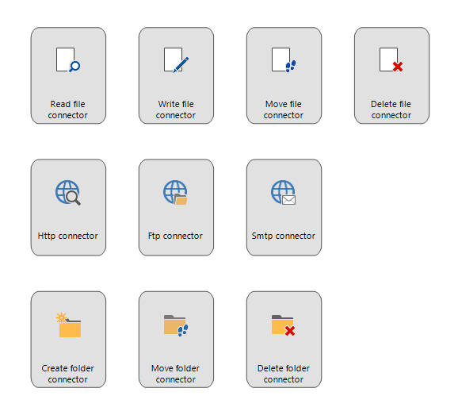

Figure 188: New connector process action type

The following connectors are available:

### HTTP(S) connector

The HTTP(S) connector provides the following input options with which several properties of an http(s) request can be controlled.

<table>
<thead>
<tr class="header">
<th>Input options</th>
<th></th>
</tr>
</thead>
<tbody>
<tr class="odd">
<td>http_con_url</td>
<td>The complete url that will be used for the request.</td>
</tr>
<tr class="even">
<td>http_con_http_method</td>
<td>The HTTP method that will be used for the request, such as GET or POST.</td>
</tr>
<tr class="odd">
<td>http_con_headers</td>
<td>
<strong>Optional</strong>. The header that will be provided with the request. This input option must be completed in the following manner:

[ header1:value1;header2:value2 ]
</td>
</tr>
<tr class="even">
<td>http_con_cookie</td>
<td><strong>Optional</strong>. A possible cookie that will be provided with the request.</td>
</tr>
<tr class="odd">
<td>http_con_content_type</td>
<td><strong>Optional</strong>. The MIME type for the content that will be provided with the request.</td>
</tr>
<tr class="even">
<td>http_con_content</td>
<td><strong>Optional</strong>. The content that will be sent with the request, for instance with a POST.</td>
</tr>
<tr class="odd">
<td>http_con_auth_type</td>
<td>
<strong>Optional</strong>. The authentication type that will be used for the request.

<strong>http_auth_none – No authentication (default)</strong>

<strong>http_auth_basic – Basic authentication</strong>

<strong>http_auth_digest – Digest authentication</strong>

<strong>http_auth_negotiate – Negotiate (NTLM/Kerberos)</strong>
</td>
</tr>
<tr class="even">
<td>http_con_username</td>
<td><strong>Optional</strong>. The user name that will be used for the authentication, if applicable.</td>
</tr>
<tr class="odd">
<td>http_con_password</td>
<td><strong>Optional</strong>. The password that will be used for the authentication, if applicable.</td>
</tr>
<tr class="even">
<td>http_con_timeout</td>
<td><strong>Optional</strong>. An integer that indicates the timeout of the request in milliseconds. Default is 100,000.</td>
</tr>
</tbody>
</table>

<table>
<thead>
<tr class="header">
<th>Output options</th>
<th></th>
</tr>
</thead>
<tbody>
<tr class="odd">
<td>status_code</td>
<td>
The status code of the executed action.

0 – Successful

-1 – Unsuccessful (unknown)

-2 – Unsuccessful (invalid URL)

-3 – Unsuccessful (invalid HTTP method)

-4 – Unsuccessful (invalid headers)

-5 – Unsuccessful (invalid cookie)
</td>
</tr>
<tr class="even">
<td>http_con_http_status_code</td>
<td>The HTTP status code of the response. For example 200, 403, 404, 500, etc.</td>
</tr>
<tr class="odd">
<td>http_con_headers</td>
<td>The headers of the response. The headers will be mutually separated by semi-colons. For each header the key and the value will be separated by a colon.</td>
</tr>
<tr class="even">
<td>http_con_set_cookie</td>
<td>The HTTP Cookie that possibly returns with the response.</td>
</tr>
<tr class="odd">
<td>http_con_content_type</td>
<td>The MIME type for the content that was returned with the response.</td>
</tr>
<tr class="even">
<td>http_con_content_enc</td>
<td>The encoding that is used for the content in the response.</td>
</tr>
<tr class="odd">
<td>http_con_content_length</td>
<td>The length of the content of the response.</td>
</tr>
<tr class="even">
<td>http_con_content_dispos</td>
<td>Possibly contains a suggestion for a file name.</td>
</tr>
<tr class="odd">
<td>http_con_content</td>
<td>The content of the response.</td>
</tr>
</tbody>
</table>

### FTP(S) connector

The HTTP(S) connector provides the following input options with which several properties of an ftp(s) request can be controlled.

<table>
<thead>
<tr class="header">
<th>Input options</th>
<th></th>
</tr>
</thead>
<tbody>
<tr class="odd">
<td>ftp_con_url</td>
<td>The complete URL that will be used for the request.</td>
</tr>
<tr class="even">
<td>ftp_con_ftp_method</td>
<td>
The FTP method that will be used for the request. For example, UploadFile, DownloadFile, DeleteFile, etc.

Complete list of options:

<a href="https://msdn.microsoft.com/en-us/library/system.net.webrequestmethods.ftp(v=vs.110).aspx" class="uri">https://msdn.microsoft.com/en-us/library/system.net.webrequestmethods.ftp(v=vs.110).aspx</a>
</td>
</tr>
<tr class="odd">
<td>ftp_con_new_file_name</td>
<td><strong>Optional</strong>. In the case of a RenameFile action this input option can be used to provide the new name for the file.</td>
</tr>
<tr class="even">
<td>ftp_con_content</td>
<td><strong>Optional</strong>. The content that will be sent with the request, for example, with an UploadFile action.</td>
</tr>
<tr class="odd">
<td>ftp_con_enable_ssl</td>
<td>
<strong>Optional</strong>. Indicates whether SSL must be used for the request.

Possible values:

<strong>ftp_ssl_on</strong>

<strong>ftp_ssl_off (default)</strong>
</td>
</tr>
<tr class="even">
<td>ftp_con_auth_type</td>
<td>
<strong>Optional</strong>. The authentication type that will be used for the request.

<strong>ftp_auth_none – No authentication (default)</strong>

<strong>ftp_auth_basic – Basic authentication</strong>
</td>
</tr>
<tr class="odd">
<td>ftp_con_username</td>
<td><strong>Optional</strong>. The user name that will be used for the authentication, if applicable.</td>
</tr>
<tr class="even">
<td>ftp_con_password</td>
<td><strong>Optional</strong>. The password that will be used for the authentication, if applicable.</td>
</tr>
<tr class="odd">
<td>ftp_con_timeout</td>
<td><strong>Optional</strong>. An integer that indicates the timeout of the request in milliseconds. Default is endless.</td>
</tr>
<tr class="even">
<td>ftp_con_use_passive</td>
<td><strong>Optional</strong>. <strong>ftp_passive_off</strong> if it is necessary to wait for a connection, <strong>ftp_passive_on</strong> if the connection itself must be established. Default is <strong>ftp_passive_on</strong>.</td>
</tr>
</tbody>
</table>

<table>
<thead>
<tr class="header">
<th>Output options</th>
<th></th>
</tr>
</thead>
<tbody>
<tr class="odd">
<td>status_code</td>
<td>
The status code of the executed action.

0 – Successful

-1 – Unsuccessful (unknown)

-2 – Unsuccessful (invalid URL)

-3 – Unsuccessful (invalid FTP method)
</td>
</tr>
<tr class="even">
<td>ftp_con_ftp_status_code</td>
<td>The FTP status code of the response. For example 2xx, 4xx, 5xx, etc.</td>
</tr>
<tr class="odd">
<td>ftp_con_status_desc</td>
<td>A description of the response status.</td>
</tr>
<tr class="even">
<td>ftp_con_last_modified</td>
<td>The date and time at which the file on the server was last modified.</td>
</tr>
<tr class="odd">
<td>ftp_con_content_length</td>
<td>The length of the content of the response.</td>
</tr>
<tr class="even">
<td>ftp_con_content</td>
<td>The content of the response.</td>
</tr>
</tbody>
</table>

### SMTP connector

The SMTP connector provides the following input options with which several properties of an SMTP request and an SMTP message can be controlled.

<table>
<thead>
<tr class="header">
<th>Input options</th>
<th></th>
</tr>
</thead>
<tbody>
<tr class="odd">
<td>smtp_con_server_address</td>
<td>The host name or the IP address of the SMTP server with which the mail will be sent.</td>
</tr>
<tr class="even">
<td>smtp_con_server_port</td>
<td>The port to which the SMTP server listens.</td>
</tr>
<tr class="odd">
<td>smtp_con_enable_ssl</td>
<td>
<strong>Optional</strong>. Whether SSL must be used for the connection.

<strong>smtp_ssl_off (default)</strong>

<strong>smtp_ssl_on</strong>
</td>
</tr>
<tr class="even">
<td>smtp_con_username</td>
<td><strong>Optional</strong>. The user name that will be used for the authentication.</td>
</tr>
<tr class="odd">
<td>smtp_con_password</td>
<td><strong>Optional</strong>. The password that will be used for the authentication.</td>
</tr>
<tr class="even">
<td>smtp_con_from_address</td>
<td>The e-mail address that will be used as sender of the e-mail.</td>
</tr>
<tr class="odd">
<td>smtp_con_from_name</td>
<td><strong>Optional</strong>. The display of the sender of the e-mail. If not specified this will be equal to <strong>smtp_con_from_address</strong>.</td>
</tr>
<tr class="even">
<td>smtp_con_to_recipients</td>
<td><strong>Optional</strong>. A list of email addresses separated by semi-colons. These addresses appear in the TO field of the e-mail.</td>
</tr>
<tr class="odd">
<td>smtp_con_cc_recipients</td>
<td><strong>Optional</strong>. A list of email addresses separated by semi-colons. These addresses appear in the CC field of the e-mail.</td>
</tr>
<tr class="even">
<td>smtp_con_bcc_recipients</td>
<td><strong>Optional</strong>. A list of email addresses separated by semi-colons. These addresses appear in the BCC field of the e-mail.</td>
</tr>
<tr class="odd">
<td>smtp_con_msg_subject</td>
<td>The subject with which the e-mail will be sent.</td>
</tr>
<tr class="even">
<td>smtp_con_msg_body</td>
<td><strong>Optional</strong>. The message of the e-mail.</td>
</tr>
<tr class="odd">
<td>smtp_con_msg_body_enc</td>
<td>
<strong>Optional</strong>. The encoding for the message of the e-mail.

<strong>smtp_enc_ascii</strong>

<strong>smtp_enc_utf8 (default)</strong>

<strong>smtp_enc_utf16</strong>

<strong>smtp_enc_utf32</strong>
</td>
</tr>
<tr class="even">
<td>smtp_con_msg_use_html</td>
<td>
<strong>Optional.</strong> Indicates whether the content of the message can be interpreted as HTML.

<strong>smtp_body_html_off (default)</strong>

<strong>smtp_body_html_on</strong>
</td>
</tr>
<tr class="odd">
<td>smtp_con_attachments</td>
<td><strong>Optional</strong>. A list of file paths separated by semi-colons. The files will be read in and added as an attachment to the e-mail.</td>
</tr>
<tr class="even">
<td>smtp_con_del_attachments</td>
<td><strong>Optional</strong>. A list of file paths separated by semi-colons. The files will be read in and added as an attachment to the e-mail. These files will be deleted after transmission of the e-mail.</td>
</tr>
<tr class="odd">
<td>smtp_con_msg_priority</td>
<td>
<strong>Optional.</strong> Gives the priority of the e-mail to be sent.

<strong>smtp_msg_priority_low</strong>

<strong>smtp_msg_priority_normal (default)</strong>

<strong>smtp_msg_priority_high</strong>
</td>
</tr>
<tr class="even">
<td>smtp_con_msg_signature</td>
<td><strong>Optional</strong>. The signature that is placed under the e-mail to be sent.</td>
</tr>
</tbody>
</table>

<table>
<thead>
<tr class="header">
<th>Output options</th>
<th></th>
</tr>
</thead>
<tbody>
<tr class="odd">
<td>status_code</td>
<td>
The status code of the executed action.

0 – Successful

-1 – Unsuccessful (unknown)

-2 – Unsuccessful (making a connection with server failed)

-3 – Unsuccessful (from address not entered)

-4 – Unsuccessful (one or more addressees could not be reached)

-5 – Unsuccessful (one or more attachments could not be deleted)
</td>
</tr>
</tbody>
</table>

### Read file from disk

Files at locations within the local network can be read using this connector. This connector works on the basis of absolute, local file paths or UNC paths, and gives as output the byte-representation of the file.

<table>
<thead>
<tr class="header">
<th>Input options</th>
<th></th>
</tr>
</thead>
<tbody>
<tr class="odd">
<td>read_file_con_file_path</td>
<td>The path to the file that must be read. The path must be an absolute local path or a UNC path.</td>
</tr>
</tbody>
</table>

<table>
<thead>
<tr class="header">
<th>Output options</th>
<th></th>
</tr>
</thead>
<tbody>
<tr class="odd">
<td>status_code</td>
<td>
The status code of the executed action.

0 – Successful

-1 – Unsuccessful (unknown)

-2 – Unsuccessful (no path specified)

-3 – Unsuccessful (the specified path is too long)

-4 – Unsuccessful (the specified path is invalid)

-5 – Unsuccessful (the specified disk could not be found)

-6 – Unsuccessful (one or more sub-folders could not be found)

-7 – Unsuccessful (the file could not be found)

-8 – Unsuccessful (access refused)
</td>
</tr>
<tr class="even">
<td>read_file_file_data</td>
<td>The byte-representation of the file.</td>
</tr>
</tbody>
</table>

### Write file to disk

Files can be written to a location within the local network using this connector. This connector works on the basis of absolute, local file paths or UNC paths, and expects the data of the file in the form of text or binary data.

<table>
<thead>
<tr class="header">
<th>Input options</th>
<th></th>
</tr>
</thead>
<tbody>
<tr class="odd">
<td>write_file_con_file_path</td>
<td>The path to the file that must be created. The path must be an absolute local path or a UNC path.</td>
</tr>
<tr class="even">
<td>write_file_con_file_data</td>
<td>The binary data (bytes) of the file.</td>
</tr>
<tr class="odd">
<td>write_file_con_write_mode</td>
<td>
The mode that determines how certain situations must be dealt with:

<strong>disk_write_mode_new (default)</strong>. There may not be a file present at the specified location.

<strong>disk_write_mode_overwrite.</strong> There may be a file present at the specified location, this will be overwritten.

<strong>disk_write_mode_append.</strong> There must be a file present at the specified location, this will be extended.
</td>
</tr>
<tr class="even">
<td>write_file_con_create_dir</td>
<td>
Indicates whether the entire folder structure of <em><strong>write_file_con_file_path</strong></em> must be created, or that all higher level folders must exist.

<strong>disk_create_all_dirs_off</strong>. All higher level folders must already exist.

<strong>disk_create_all_dirs_on (default)</strong>. The complete folder structure will be created.
</td>
</tr>
</tbody>
</table>

<table>
<thead>
<tr class="header">
<th>Output options</th>
<th></th>
</tr>
</thead>
<tbody>
<tr class="odd">
<td>status_code</td>
<td>
The status code of the executed action.

0 – Successful

-1 – Unsuccessful (unknown)

-2 – Unsuccessful (no path specified)

-3 – Unsuccessful (the specified path is too long)

-4 – Unsuccessful (the specified path is invalid)

-5 – Unsuccessful (the specified disk could not be found)

-6 – Unsuccessful (one or more sub-folders could not be found)

-7 – Unsuccessful (the file could not be found)

-8 – Unsuccessful (the file already exists)

-8 – Unsuccessful (access refused)
</td>
</tr>
</tbody>
</table>

### Move file on disk

Files from locations within the local network can be moved to other locations within the local network using this connector. The source path and the target path are provided by means of input options and must have the form of an absolute, local file path or UNC path.

<table>
<thead>
<tr class="header">
<th>Input options</th>
<th></th>
</tr>
</thead>
<tbody>
<tr class="odd">
<td>move_file_con_from_path</td>
<td>The path to the file that must be moved. This path must be an absolute local path or a UNC path.</td>
</tr>
<tr class="even">
<td>move_file_con_to_path</td>
<td>The path to the location where the file must be moved to. This path must be an absolute local path or a UNC path.</td>
</tr>
<tr class="odd">
<td>move_file_con_create_dir</td>
<td>
Indicates whether the entire folder structure of <em><strong>move_file_con_to_path</strong></em> must be created, or that all higher level folders must exist.

<strong>disk_create_all_dirs_off</strong>. All higher level folders must already exist.

<strong>disk_create_all_dirs_on (Default)</strong>. The complete folder structure will be created.
</td>
</tr>
</tbody>
</table>

<table>
<thead>
<tr class="header">
<th>Output options</th>
<th></th>
</tr>
</thead>
<tbody>
<tr class="odd">
<td>status_code</td>
<td>
The status code of the executed action.

0 – Successful

-1 – Unsuccessful (unknown)

-2 – Unsuccessful (no source path specified)

-3 – Unsuccessful (no target path specified)

-4 – Unsuccessful (one of the specified paths is too long)

-5 – Unsuccessful (one of the specified paths is invalid)

-6 – Unsuccessful (source path not found)

-7 – Unsuccessful (source disk not found)

-8 – Unsuccessful (target path not found)

-9 – Unsuccessful (target disk not found)

-10 – Unsuccessful (target path already exists)

-11 – Unsuccessful (access refused)
</td>
</tr>
</tbody>
</table>

### Copy file on disk

Files from locations within the local network can be copied to other locations within the local network using this connector. The source path and the target path are provided by means of input options and must have the form of an absolute, local file path or UNC path.

| Input options             |                                                                                                                                                                                                                                                                                                                |
| ------------------------- | -------------------------------------------------------------------------------------------------------------------------------------------------------------------------------------------------------------------------------------------------------------------------------------------------------------- |
| copy_file_con_from_path   | The path to the file that must be moved. This path must be an absolute local path or a UNC path.                                                                                                                                                                                                               |
| copy _file_con_to_path    | The path to the location where the file must be moved to. This path must be an absolute local path or a UNC path.                                                                                                                                                                                              |
| copy _file_con_create_dir | Indicates whether the entire folder structure of *copy_file_con_to_path* must be created, or that all higher level folders must exist.   *disk_create_all_dirs_off* - All higher level folders must already exist.  *disk_create_all_dirs_on (Default)* - The complete folder structure will be created. |
 

| Output options |                                                                                                                                                                                                                                                                                                                                                                                                                                                                                                                                                                                                                           |
| -------------- | ------------------------------------------------------------------------------------------------------------------------------------------------------------------------------------------------------------------------------------------------------------------------------------------------------------------------------------------------------------------------------------------------------------------------------------------------------------------------------------------------------------------------------------------------------------------------------------------------------------------------- |
| status_code    | The status code of the executed action.   0 – Successful   -1 – Unsuccessful (unknown)   -2 – Unsuccessful (no source path specified)   -3 – Unsuccessful (no target path specified)   -4 – Unsuccessful (one of the specified paths is too long)   -5 – Unsuccessful (one of the specified paths is invalid)   -6 – Unsuccessful (source path not found)   -7 – Unsuccessful (source disk not found)   -8 – Unsuccessful (target path not found)   -9 – Unsuccessful (target disk not found)   -10 – Unsuccessful (target file already exists)   -11 – Unsuccessful (access refused) |

### Delete file from disk

A file at a location within the local network can be deleted using this connector. The path to the file is provided by means of an input option and must have the form of an absolute, local file path or UNC path.

<table>
<thead>
<tr class="header">
<th>Input options</th>
<th></th>
</tr>
</thead>
<tbody>
<tr class="odd">
<td>delete_file_con_file_path</td>
<td>The path to the file that must be deleted. This path must be an absolute local path or a UNC path.</td>
</tr>
</tbody>
</table>

<table>
<thead>
<tr class="header">
<th>Output options</th>
<th></th>
</tr>
</thead>
<tbody>
<tr class="odd">
<td>status_code</td>
<td>
The status code of the executed action.

0 – Successful

-1 – Unsuccessful (unknown)

-2 – Unsuccessful (no path specified)

-3 – Unsuccessful (the specified path is too long)

-4 – Unsuccessful (the specified path is invalid)

-5 – Unsuccessful (the specified disk could not be found)

-6 – Unsuccessful (one or more sub-folders could not be found)

-7 – Unsuccessful (access refused)

-8 – Unsuccessful (the file is in use)
</td>
</tr>
</tbody>
</table>

### Create folder on disk

A folder can be created on a location within the local network using this connector. The path to the file that must be created is provided by means of an input option and must have the form of an absolute, local file path or UNC path. In addition, it can also be indicated whether the provided folder structure must exist or may be created.

<table>
<thead>
<tr class="header">
<th>Input options</th>
<th></th>
</tr>
</thead>
<tbody>
<tr class="odd">
<td>create_dir_con_file_path</td>
<td>The path to the folder that must be created. This path must be an absolute local path or a UNC path.</td>
</tr>
<tr class="even">
<td>create_dir_con_create_dir</td>
<td>
Indicates whether the entire folder structure from <em><strong>create_dir_con_file_path</strong></em> must be created, or that all higher level folders must exist.

<strong>disk_create_all_dirs_off</strong>. All higher level folders must already exist.

<strong>disk_create_all_dirs_on (default)</strong>. The complete folder structure will be created.
</td>
</tr>
</tbody>
</table>

**  
**

<table>
<thead>
<tr class="header">
<th>Output options</th>
<th></th>
</tr>
</thead>
<tbody>
<tr class="odd">
<td>status_code</td>
<td>
The status code of the executed action.

0 – Successful

-1 – Unsuccessful (unknown)

-2 – Unsuccessful (no path specified)

-3 – Unsuccessful (the specified path is too long)

-4 – Unsuccessful (the specified path is invalid)

-5 – Unsuccessful (the specified disk could not be found)

-6 – Unsuccessful (one or more sub-folders could not be found)

-7 – Unsuccessful (access refused)
</td>
</tr>
</tbody>
</table>

### Move folder on disk

Folders from locations within the local network can be moved to other locations within the local network using this connector. The source path and the target path are provided by means of input options and must have the form of an absolute, local path or UNC path.

<table>
<thead>
<tr class="header">
<th>Input options</th>
<th></th>
</tr>
</thead>
<tbody>
<tr class="odd">
<td>move_dir_con_from_path</td>
<td>The path to the folder that must be moved. This path must be an absolute local path or a UNC path.</td>
</tr>
<tr class="even">
<td>move_dir_con_to_path</td>
<td>The path to the location where the folder must be moved to. This path must be an absolute local path or a UNC path.</td>
</tr>
<tr class="odd">
<td>move_dir_con_create_dir</td>
<td>
Indicates whether the entire folder structure of <em><strong>move_dir_con_to_path</strong></em> must be created, or that all higher level folders must exist.

<strong>disk_create_all_dirs_off</strong>. All higher level folders must already exist.

<strong>disk_create_all_dirs_on (default)</strong>. The complete folder structure will be created.
</td>
</tr>
</tbody>
</table>

<table>
<thead>
<tr class="header">
<th>Output options</th>
<th></th>
</tr>
</thead>
<tbody>
<tr class="odd">
<td>status_code</td>
<td>
The status code of the executed action.

0 – Successful

-1 – Unsuccessful (unknown)

-2 – Unsuccessful (no source path specified)

-3 – Unsuccessful (no target path specified)

-4 – Unsuccessful (one of the specified paths is too long)

-5 – Unsuccessful (one of the specified paths is invalid)

-6 – Unsuccessful (source path not found)

-7 – Unsuccessful (source disk not found)

-8 – Unsuccessful (target path not found)

-9 – Unsuccessful (target disk not found)

-10 – Unsuccessful (target path already exists)

-11 – Unsuccessful (access refused)
</td>
</tr>
</tbody>
</table>

### Copy folder on disk

Folders from locations within the local network can be copied to other locations within the local network using this connector. The source path and the target path are provided by means of input options and must have the form of an absolute, local path or UNC path. 

| Input options            |                                                                                                                                                                                                                                                                                                                                               |
| ------------------------ | --------------------------------------------------------------------------------------------------------------------------------------------------------------------------------------------------------------------------------------------------------------------------------------------------------------------------------------------- |
| copy_dir_con_from_path   | The path to the folder that must be moved. This path must be an absolute local path or a UNC path.                                                                                                                                                                                                                                            |
| copy_dir_con_to_path     | The path to the location where the folder must be moved to. This path must be an absolute local path or a UNC path.                                                                                                                                                                                                                           |
| copy_dir_con_create_dir  | Indicates whether the entire parent folder structure of copy_dir_con_to_path must be created, or that all higher level folders of the target path must exist. *disk_create_all_dirs_off* - All higher level folders must already exist. *disk_create_all_dirs_on (default)* - The complete target folder structure will be created.     |
| copy_dir_conn_exist_file | Determines the strategy of dealing with existing files at the target location. *disk_exist_skip* -  Ignore existing files in the target location  *disk_exist_overwrite* - Overwrite existing files in the target location *disk_exist_abort (default)* -  Abort the process action if a file already exists in the target location. |

| Output options |                                                                                                                                                                                                                                                                                                                                                                                                                                                                                                                                                                                                              |
| -------------- | ------------------------------------------------------------------------------------------------------------------------------------------------------------------------------------------------------------------------------------------------------------------------------------------------------------------------------------------------------------------------------------------------------------------------------------------------------------------------------------------------------------------------------------------------------------------------------------------------------------ |
| status_code    | The status code of the executed action.  0 – Successful -1 – Unsuccessful (unknown) -2 – Unsuccessful (no source path specified) -3 – Unsuccessful (no target path specified) -4 – Unsuccessful (one of the specified paths is too long) -5 – Unsuccessful (one of the specified paths is invalid) -6 – Unsuccessful (source path not found) -7 – Unsuccessful (source disk not found) -8 – Unsuccessful (target path not found) -9 – Unsuccessful (target disk not found) -10 – Unsuccessful (file already exists in target folder) -11 – Unsuccessful (access refused) |

### Delete folder from disk

A folder on a location within the local network can be deleted using this connector. The path to folder is provided by means of an input option and must have the form of an absolute, local path or UNC path.

<table>
<thead>
<tr class="header">
<th>Input options</th>
<th></th>
</tr>
</thead>
<tbody>
<tr class="odd">
<td>delete_dir_con_file_path</td>
<td>The path to the folder that must be deleted. This path must be an absolute local path or a UNC path.</td>
</tr>
<tr class="even">
<td>delete_dir_con_recursive</td>
<td>
Indicates whether the process action may or may not delete sub-folders within the specified path.

<strong>disk_delete_recursive_off (default)</strong>. All higher level folders must already exist.

<strong>disk_delete_recursive_on</strong>. The complete folder structure will be created.
</td>
</tr>
</tbody>
</table>

<table>
<thead>
<tr class="header">
<th>Output options</th>
<th></th>
</tr>
</thead>
<tbody>
<tr class="odd">
<td>status_code</td>
<td>
The status code of the executed action.

0 – Successful

-1 – Unsuccessful (unknown)

-2 – Unsuccessful (no path specified)

-3 – Unsuccessful (the specified path is too long)

-4 – Unsuccessful (the specified path is invalid)

-5 – Unsuccessful (the specified disk could not be found)

-6 – Unsuccessful (one or more sub-folders could not be found)

-7 – Unsuccessful (access refused)

-8 – Unsuccessful (the specified path is ambiguous, there is a folder and a file with the same name)

-9 – Unsuccessful (the specified folder is in use, read only, or contains sub-folders)

-10 – Unsuccessful (the specified folder is in use or contains sub-folders)
</td>
</tr>
</tbody>
</table>

## Process steps

Actions are linked together with a process step. This has the effect in the end product that as soon as a user has completed the previous action, the system automatically starts the next action.

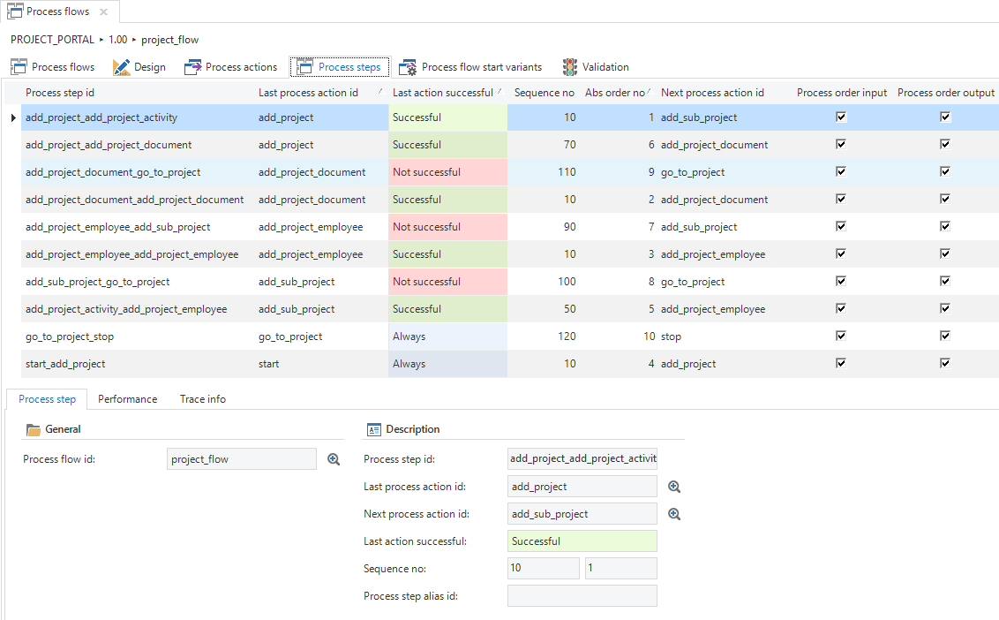

Figure 189: Overview of the process steps

A process step can be created via the *process step* component or by selecting with the Ctrl-key pressed and drawing lines from the previous to the next process action. There are three different types of process steps each of which are shown with their own colour:

- Green; the process step is executed if the last process action was successful

- Red; the process step is executed if the last process action was not successful

- Blue; the process step is always executed

A process step can be modified by double clicking on the arrow.

If a process action has been completed and several parallel process steps follow, then these process steps are executed based on the specified sequence number. A user completes one of the parallel steps first before starting the following step.

### Conditional process steps

After a process action has been executed, it can be determined on the basis of a so-called process procedure which of the specified process steps must subsequently be started and in which sequence. It is not possible to start more steps than are modelled, only fewer.

## Process flow start variants

Since it is now possible to create different variants, it is possible to add a start variant. For example, you can indicate for an action that is linked to the start action (trigger) for which variants the process flow should start.

**Example **

A process flow to correctly enter an order, must start when opening the variant *Order Entry*, but not the variant *Historical orders*.

When nothing has been defined, the variants will use the default settings. Only when an explicit choice has been made on whether or not to execute a variant as a start action, will it no longer change with the default.

**Process variables**

Variables can be used to store data produced by process actions and retain this data throughout the lifetime of the process flow.

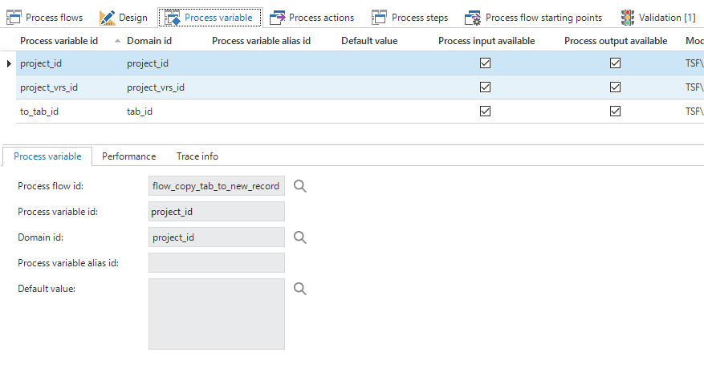

Figure 190: Process variable

## Deep linking

A deep link is a link which doesn't just point to the location of an application, but also to a location within that application. For instance, a deep link could direct a user to a specific subject, a specific record within that subject, and perhaps start a task or report for that record.

### Enable deep linking

Deep linking can be turned on for any process flow by simply selecting a process flow, navigating to the 'Deep linking' tab and checking the 'Deep linking allowed' box.

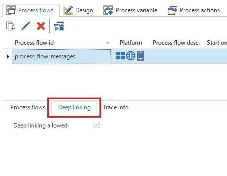

Figure 191: Deep linking

### Using variables in a deep link

It is possible to provide values for variables in the deep link, to allow more dynamic scenarios to be implemented, such as navigating to a specific record. If the variable needs to be allowed in a deep link, simply check the 'Available in deep link' box for the variable. Or the 'Mandatory in deep link' box, if deep link needs to be mandatory for all new process flows.

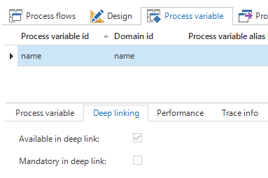

Figure 192: Process variable

**Preparing and validating deep links**

When a deep link is started, it might be necessary to validate or prepare some things before the process flow can be started. For instance, the variable values provided by the deep link might make no sense, and you might want to notify the user of this. Or perhaps the process flow requires additional variables to be set before it can start, but these variables are sensitive in nature and you do not want to put them in the deep link. To fulfill these requirements, implement the process procedure of the 'Start' action. Traditional process flows will never trigger the process procedure of this action, but deep links will. In the process procedure the values of the variables in the deep link will be received and based on these values the values of other variables can be set and determine how the process flow should continue.

**Creating a deep link**

Once a process flow for deep linking is configured, the link itself needs to be created in order to send it to someone or use it in an e-mail or report template. The format of a deep link URL is as follows:

https://\<server\>/\<web\_application\>/DeeplinkHandler.ashx?guiApplAlias=**\<**gui\_appl\_alias\>\&processFlowID=\<process\_flow\_id\>&$\<variable1\>**=**\<value1\>&$\<variable2\>**=**\<value2\>

The template above needs to be filled out as follows:

- \<gui\_appl\_alias\> needs to be replaced with the alias of the application in IAM. When starting the GUI with an SF metasource, this parameter can be removed from the URL.

- \<process\_flow\_id\> needs to be replaced with the ID of the process flow which needs to be started by the deep link.

- \<variable\> and \<value\> need to be replaced by the ID of the process variable and the value it should receive. Multiple variables can be specified in the deep link. Note that the ID of the process variable needs to be preceded by a $ sign.

## New process action Show message

A frequently requested feature for process flows is the ability to show a dialog to the user with several options and base the continuation of the flow on the option chosen by the user. As of version 2017.2 of the Thinkwise Suite, we have introduced the process action 'Show message' which makes this possible.

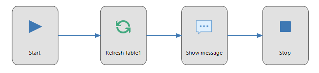

Figure 193: New process action 'Show message'

**How it works**

The process action 'Show message' works with the existing messages in the Software Factory. When creating a process action of the type 'Show message', it is necessary to choose a predefined message. Messages which are used in process flows can contain parameters in their translation which correspond to the IDs of the variables in the process flow. The GUI will replace these parameters with the current value of the corresponding variable. For example: *"The value of variable\_1 is: {variable\_1}."*.

It is possible to add message options to a message. These options represent the choices a user can make when presented with the message. For example, this configuration in the Software Factory:

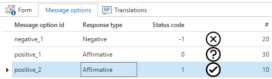

Figure 194: Message option

will result in this dialog in the GUI:

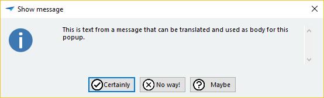

Figure 195: Message with custom buttons

When adding a message option to a message, the options are 'Affirmative' or 'Negative'. An affirmative message option will be given a unique status code of zero or higher, while a negative message option will be given a unique negative status code. These response types and corresponding status codes are directly related to the green and red arrows in the Process Flow Modeler. In some cases it might be necessary to have multiple affirmative and/or multiple negative message options which have different effects on the continuation of the process flow. To achieve this, the 'Status code' value of a message option will be passed as the 'Status code' output parameter of the process action.

Icons are optional and the sequence number of the message option (\#) determines the order of the buttons on the dialog.

**Additional changes**

Aside from deep linking and the 'Show message' process action, a few more changes have been made.

- The 'Read file' and 'Write file' process actions both have the new input parameter 'Encoding'. With this input parameter you can specify how the GUI should interpret a file or how it should write a file to disk.

- Task output parameters will now contain the values of the output parameters after the task has been executed. This makes it possible to change the value of the output parameters inside the task.

**Input and output parameters**

Each process action has its own set of input and output parameters.

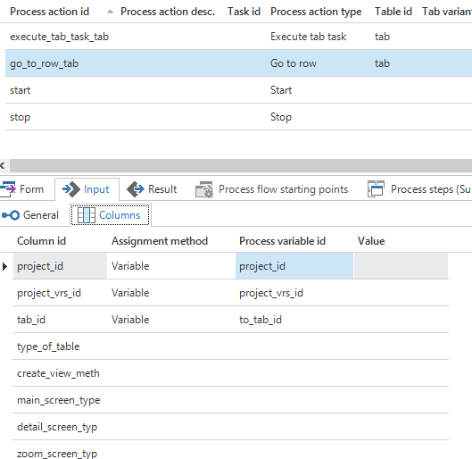

Figure 196: Input parameters

Input parameters provide a way to configure at runtime what a process action does and they can be assigned a constant value or a variable.

Output parameters provide a way to store user input and/or other data produced by the process action in variables.

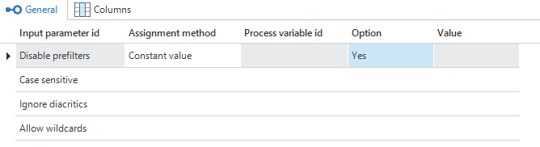

Figure 197: Output parameters

