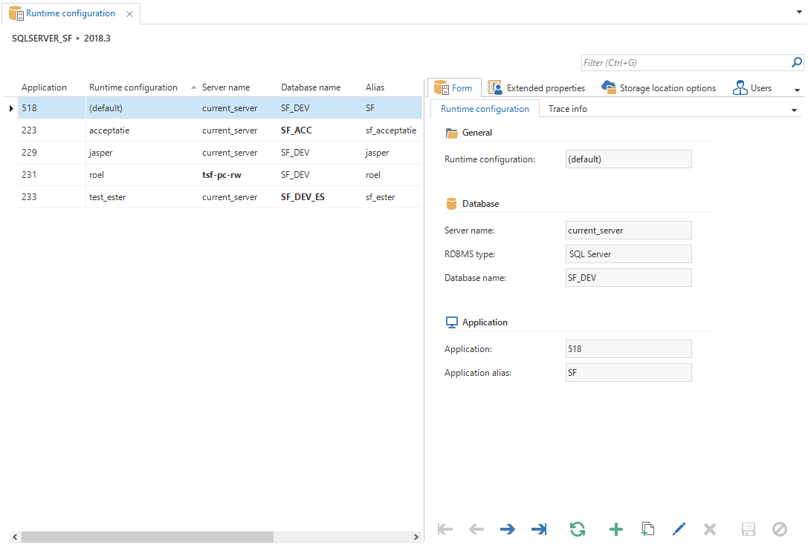

The *Runtime configuration* screen provides an overview of the available runtime configurations for the selected project. 

*Runtime configuration overview*

> TODO -->

Starting from G9.8 it is no longer necessary to enter the connection details of the end product in the ini-file. Instead of this a *Runtime configuration* is set up in the model and this is provided as ini-parameter. This is done as preparation for the official inclusion of the ini-parameters in the Software Factory metamodel.

An extra *Runtime configuration* tab has been added under project management, with project versions.

*Runtime configuration*

The old ini-parameters are still supported in G9.8, for which a warning is given. The use of the runtime configuration will be compulsory in the next version of the Software Factory.

Existing ini files can be converted with the task *Convert ini file*. This task can be found under *Runtime configuration* and in the menu under master data. The task will read in the ini-file and add the settings in the SF. Afterwards this task will remove the parameters from the ini-file and add the parameter *RuntimeConfiguration*.

*Convert Ini file task*

There is always one default configuration, containing the settings that have been entered with the project version. The other configurations as a default will take over the values and ini-parameters from this default, unless a modification is consciously made.