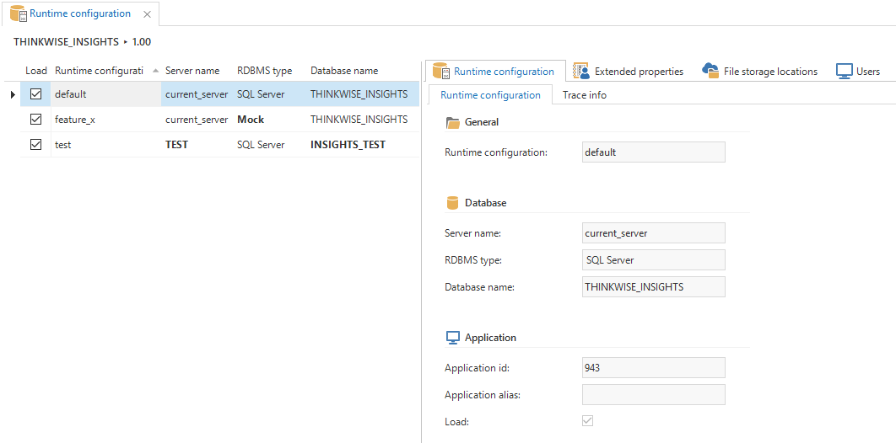

The *Runtime configurations* screen provides an overview of the available runtime configurations for the selected project.

A runtime configuration provides the environment in which an application is started, defined by the database server and database of the application. By specifying multiple runtime configurations, the same application can be started on multiple environments, for example for development and testing purposes. The runtime configuration to be used is specified in the [configuration file](configuration_file).

Runtime configurations can have different [extended properties](extended_properties) and [file storage locations](../kb/file_storage) than the default configuration. Settings that deviate from the default configuration are shown in bold.

*Runtime configuration overview*