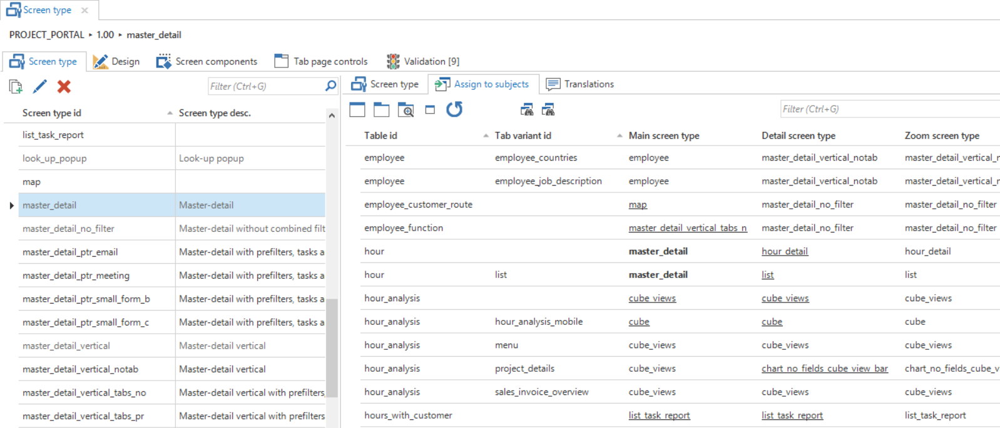
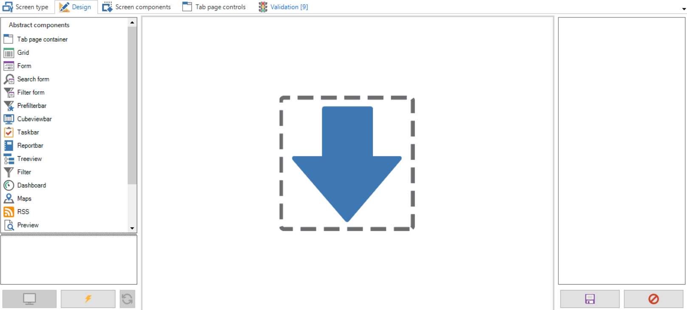
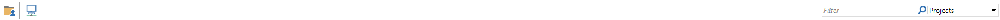
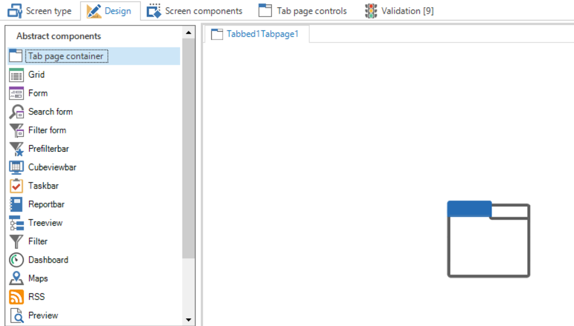
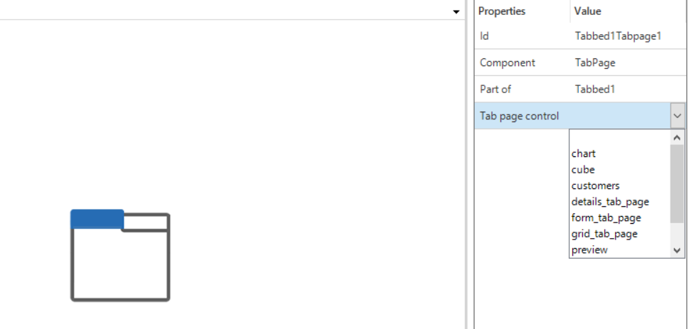
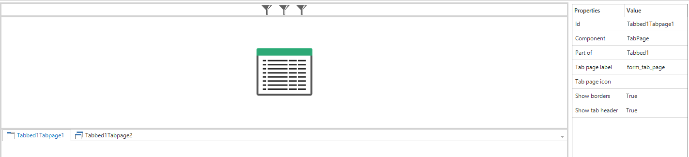
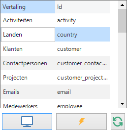
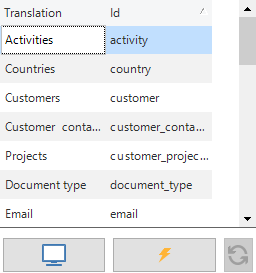
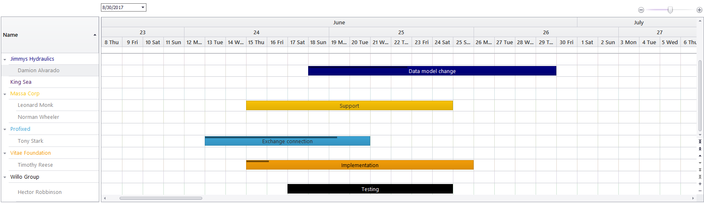

It can be indicated with each table and variant which screen type is used for the four different levels:

- Main screen: when the table is opened from the menu.

- Detail screen: when a table is a detail of another table.

- Popup screen: when a table opens as a popup.

- Zoom screen: when a detail of another table is double clicked so it opens as a main size screen.

If the screen type is left empty then the standard value for the project version is used.

### Assigning screen types

All subjects get a standard screen type from the Software Factory. It is however possible to deviate from this standard by assigning self-developed screen types to tables. Assigning is as follows.

1.  Select the screen type that must be assigned to a specific table in the left hand list of screen types.

2.  Select the relevant label and variants in the *Assign to subjects* tab to which this screen type must be assigned.

3.  As is visible here a screen type can be assigned on the Main Screen, Detail Screen or Popup Screen. Use the *Assign as main/detail/popup screen type* tasks to assign the screen type to a specific level of the selected table.

*Assigning screen types with the 'Screen type' tab*

If a screen type is assigned to a table and this screen type is selected in the list then this is displayed in a bold font. So it can be clearly seen to which tables this screen type is assigned. Underlined screen types are explicitly set up and deviate from the standard.

### Designing a screen type

To model an own screen type a new screen type must first be created in the screen type overview. The id and possibly a definition of this new screen type is specified here.

Tip

Thinkwise recommends keeping the name of the screen type abstract, since it could be used in several places. Therefore not *customer* but for instance *parallel\_detail*.

When a screen type is not abstract, but is especially developed for one process, then this screen is not suitable for use with other subjects. By turning off **Available for user preferences** this screen is not displayed in IAM when switching screen types with user preferences.

When a new screen type is created, this can be set up on the *Design* tab. This tab consists of a number of parts which are explained in more detail in the table below.

*An overview of the 'Design' screen with 'Screen type'*

1.  **Abstract components**  
    In this component an overview is presented of the available abstract screen components that can be dragged onto the work sheet.

2.  **Preview**  
    With the help of these buttons a link can be made with the existing end product to test the screen type.

3.  **Work sheet**  
    This is the work sheet on which the various components are dragged to construct a screen type.

4.  **Overview of properties**  
    The properties of the selected component are presented here. These can be manually adjusted.

5.  **Save and reset**  
    The modifications can be saved or undone using these buttons.

During the design of a screen type various abstract components are available, which can be dragged onto the work sheet.

|Icon|Component|Explanation|
|--- |--- |--- |
||Tab container|The tab container ensures that several tabs can be used under which the details or other components can be classified. Empty tabs are removed by the user interface.|
||Grid|The data is displayed under each other in the grid and it can be selected. The user interface will remove the grid if there can only be at most one line.|
||Form|Data from one row can be presented and modified in the form.|
||Form list|This component displays a form without tab pages for every row in the grid. All the forms will be stacked and a scrollbar will be created when it exceeds the screen.|
||Search form|The search form provides an overview of the (limited) search set on the screen.|
||Filter form|The filter form provides an overview of the (limited) filter set on the screen.|
||Pre-filter bar|A button for all prefilters is displayed in this bar. The user interface will remove this component if there are no (visible) prefilters.|
||Cube view bar|A button for all cube views is displayed in this bar. The user interface will remove this component if there are no cube views.|
||Task bar|A button for all tasks is displayed in this bar. The user interface will remove this component if there are no tasks.|
||Reports bar|A button for all reports is displayed in this bar. The user interface will remove this component if there are no reports.|
||Tree structure|Displays a tree structure. The user interface will remove the structure if there can only be at most 1 row.|
||Filter|The filter can be used for quick filtering on several columns.|
||Dashboard|Displays the data in a Dashboard form. The user interface will remove the component if there is no maps definition for the table. At the time of writing this can only be created with an object model extender[9].|
||Maps|The Maps component displays a folder in which data can be viewed. The user interface will remove the component if there is no maps definition for the table. At the time of writing this can only be created with an object model extender.[10]|
||RSS|Displays an overview in which RSS feeds can be presented. The user interface will remove the component if there is no RSS definition for the table. At the time of writing this can only be created with an object model extender.|
||Preview|Displays the first column of a table that contains a path (for instance URL or file upload control).|
||Pivot table|Provides the possibility to display a pivot table. The user interface will remove the pivot table if there is no cube definition for the table.|
||Pivot table fields|Provides the possibility to display fields that can be dragged and dropped in a pivot table. The user interface will remove the pivot table fields if there is no cube definition for the table.|
||Graph|Displays a graph on the screen. The user interface will remove the pivot table if there is no cube definition with a graph for the table.|
||Scheduler|The scheduler displays a graphical planning. The user interface will remove the component if there is no scheduler definition for the table. At the time of writing this can only be created with an object model extender.|
||Detail tiles|This component shows the details of a subject in tiles. Clicking on a tile will open a new document.|

Table 2: Overview of the abstract components for designing a screen type.

> The maps component has a restriction of maximum of 2,500 geo locations retrievals pera customer per day.

All these components can be dragged to and dropped on the work sheet to compose the required screen. When the first component is dragged onto the work sheet this will fill the complete page. When another component is subsequently dragged onto the work sheet a frame will appear at the position where this is dragged to. The components on the work space can be freely moved by dragging them.

It is possible to display several button bars and the filter next to each other instead of under each other. This allows more efficient use of the available space. White space between the various components (prefilter, report, tasks and filter) is added automatically.

*An example bar with prefilters, reports, tasks and a filter option*

#### Tab container

The tab container has two functions:

- Tab for components

- Tab for details

*An empty 'Design' screen with 'Screen type'*

Tabs can be added via the context menu of the tab container.

##### Component tab

To drag components in a component tab the status of the tab needs to be set to *Edit tabs* via the context menu (right mouse button). On the right-hand side of the screen it is indicated for each screen component whether the size of the component must remain fixed when changing the size of the screen.

By setting up a tab control for a component tab it is possible to influence the translation and the icon of the tab. New controls can also be added via the *Tab controls* tab. The standard can be overwritten by adding an own icon and translation.

##### Detail tab

When use needs to be made of a tab container containing the details of the subject then the status of the tab on *Detail tab* needs to be set with the help of the *Change component tab page to detail* option in the context menu (right mouse button). The tab then becomes grey and the details will be initialized on the basis of the definitions of the subject. It also needs to be indicated which details are displayed on this detail tab by selecting a tab control for the detail tab on the right-hand side of the screen.

As standard, there is a choice from the options *A*, *B* and *C*, but new *detail* controls can also be added under *Tab controls*. An own icon can also be added here.

In the *Subjects* screen the details of subjects can be distributed across the various detail tabs that are present in a screen. If a set tab control is not present on the chosen screen type then the detail is placed on the first detail tab.

*The drop down menu with the tab controls*

#### Screen Components

##### Hiding tab headers and lines in the screen type modeler

This option enables the user to hide the tab header completely, or only hide the line. These are:

- Showtabheader

- Showborders

These properties can both be set to false to hide their respective properties.

*Set Show borders in screen types*

#### Preview

When the screen is developed according to your wishes, it is possible to display a preview of the screen in the Software Factory.

- Firstly connect with the end product. 

- Then select the table which needs to be connected to.

- By now clicking on *Preview*  a preview is presented of the selected table with the new screen type.

*Component from the 'Design' screen where preview tables can be selected*

The model is re-loaded with the *Refresh* button.

**Tip: Use mock database **

When making the connection use the *Thinkwise Mock Database* provider to display a preview without the end product. The preview is then displayed with dummy data.

**Tip: Screen components**

The *Screen components* tab displays an overview of the components on the selected screen type in a tree structure. A number of advanced settings of the screen type can be adjusted in this overview.

The height or width of components can be set to a fixed number of pixels or a percentage. Depending on the orientation of the component, the width or height including units (pixels or percentage) needs to be modified and the option *Fix on resize* needs to be on.

### Mobile GUI

The screen types that are set up for the Windows and Web GUIs are also used for the Mobile platform. The Mobile GUI converts the screen types to a version that is suitable for smartphone or tablet by analyzing which components are used in the screen type.

- Detail tab present detail buttons

- Form next to grid card list, otherwise grid with columns

### Set up extenders 

As has already been indicated with the components a number are only available as extender object.

The current components are Maps, Scheduler, Dashboard and RSS. What the components can do will be explained in the following paragraphs. Setting up these components will always take place with the help of a Thinkwise employee. So contact Thinkwise when setting up an extender.

#### Maps

What does the Map component offer:

1.  The visualization of coordinates from a table or view as locations, routes or other shapes on a map.

2.  Linking these objects on the map to the rows from the table or view, so that navigating through rows and selecting objects on the map are synchronized back and forth and tasks/reports can be executed based on the selected objects on the map (just as in the grid).

3.  The conversion of addresses to coordinates (longitude and latitude). This is called geocoding.

4.  Retrieving *tiles*, given a scroll position and zoom level, and displaying this on the Maps component. This is necessary for the background map, but can also be used, for example, to place traffic information and such like over the map.

It is important that the GUI is dependent on a third party for points 3 and 4, a so-called Maps provider. The Maps component for these points is only a communication line between the user and the Maps provider in question. Users must themselves enter into an agreement with such a third party and are in turn dependent on the restrictions that this party imposes on them with regard to the permitted number of requests etc. These restrictions are therefore not fixed, but depend on the Maps provider with which the customer wants to work.

Thinkwise currently provides support for the following Maps providers.

Geocoding:

- Google Maps

- Here Maps

- MapQuest

Tiles:

- Here Maps

- MapQuest

#### Scheduler

The scheduler component offers the possibility to compare agreements against resources. The resources can be, for example, employees or projects. The agreements can then be presented through time, as in the example below:

*Scheduler*

Various colors can be assigned for different components; the resources, agreements and working hours, each of which respectively require their own view.

Resources  
The resources are shown on the left in a list and can have a foreground and background color. In addition, they can have a so-called parent/child relationship, for which the parent resources can be expanded and collapsed to display or hide the child resources.

It is also important to know that the resource table is the table to which the entire scheduler is linked in the SF (and the extender). This means that the context menu that is visible across the entire scheduler always applies for the resources shown on the left, and therefore not for the agreements. Any linked detail tables will also all be in the context of this resource table.  
Agreements  
The agreements are the bars that are displayed through time. These can have their own text, color, length and tooltip that can be controlled from the view. The agreements can also have a progress bar that indicates how far the agreement has progressed. A number of default tasks can be carried out on these agreements, namely:

- Move an agreement (possible between time as well as resource)

- Resize an agreement

- Double click on an agreement

- Double click on an empty time cell

These tasks can be linked in the extender to tasks from the SF, for which a number of values (such as the appointment\_id, resource\_id or new date) can be filled.

Working hours  
The working hours are beginning and end dates that are linked to a resource, and can have a color. This color is used in the scheduler to give color to the background color of a time cell, with which for instance the working hours of an employee or the duration of a project can be visualized.

Other set-ups  
Along with the 3 required views, global settings can also be defined, such as the timescales that are used, the start time of the scheduler, or the current time must be presented as a red line etc.

#### Dashboard

#### With the dashboard component it is possible to display speedometers in the Software Factory. A speedometer gives a quick and simple summary about a KPI. It is possible to indicate a target (indicated below as a thick tick mark). The needle shows the current value. In addition, it is possible to indicate and give color to ranges to indicate whether this value is good or bad. 

*Example of a dashboard component*

The dashboard needs the following values in the database:

1.  The KPI name

2.  The target value

3.  The current value

4.  The maximum value

5.  Null or more ranges, with for each range
    
    1.  The begin value
    
    2.  The end value

Furthermore there are innumerable settings about the appearance of the speedometer, the appearance of the needle, dimensions, fonts and colors.

#### RSS

With the RSS component a feed can be presented, for instance, news from the company or to keep track of the competition.

*Example of RSS*

Two things are necessary in the data for RSS:

1.  The URL of the feed;

2.  A title for the feed.

Furthermore it can be indicated in the extender what the dimensions of each item are. It is important for this that the height is not less than 250.
