> Deprecated in favor of the runtime [Indicium Application Tier](indicium_api)

## Project Version settings

This chapter describes the settings that fall under the **Service tier** and the **IAM Service tier** groups in the project version of a work project.

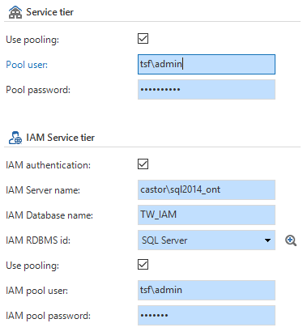

Figure 244: Screen shot of the 'Project Version' screen for specifying the Service Tier.

##### Use pooling

When this is checked, connection will be made between the service tier and the database via one central account.

##### Pool user

This is the user name for the user that is used to establish a connection from the service tier to the database, when it is chosen to do this via a central account.

##### Pool password

This is the password specified for this Pool User account.

**Note**

This password is placed unencrypted in the SF development database.

IAM authentication

If this is checked, the service tier will go to the specified IAM database to authenticate the user.

IAM Server name

The IAM is installed on this server. The IAM will use the service tier to authenticate users.

IAM Database name

This is the database name of the IAM. The IAM will use the service tier to authenticate users.

IAM RDBMS id

This is the RDBMS id of the IAM. The IAM will use the service tier to authenticate users.

Use pooling

When this is checked, connection will be made between the service tier and the IAM database via one central account connection.

IAM Pool User

This is the user name for the user that is used to establish a connection from the service tier to the IAM database, when the choice is made to do this via a central account.

IAM Pool password

This is the password specified for this Pool User account.

**Note**

This password is placed unencrypted in the SF development database.

## Java service tier 

The Java service tier consists of a Java JAX-WS Web Service and is built using the Apache Maven project management system. The project can be imported with an Eclipse IDE that is compatible for Java EE.

The Hibernate persistence framework is used for communication from the Web service to the database.

### 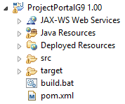Project layout

The default directory structure in a Maven project is that all source files should fall under the **.\\src\\main** directory. This directory has the following structure for the service tier project:

##### Java

The Java directory contains the Java code files (contracts, entities, services, etc.) of the project.

##### Resources

The other files required by the source code to function, are in the resources directory. This includes, for instance, the persistence.xml file that Hibernate needs to establish a connection with the database.

##### Webapp

The webapp directory contains the files that describe how the web service should be deployed on the web server. For the service tier these are the web.xml and sun-jaxws.xml files containing information about the servlet configuration for the services.

When the project is opened in Eclipse, **.\\src\\main\\java** and **.\\src\\main\\resources** on **Java Resources** and **.\\src\\main\\webapp** fall under **Deployed Resources**.

The pom.xml file describes for Maven how the project should be built. This includes, for instance, the libraries on which the project is dependent and from where these must be retrieved.

The directory called **target** is the default location where Maven places its results. Here you will find the .war archive of the Java service tier, after building the structure.

The built.bat is a batch script for Maven to execute a clean and package of the project. As a result, it is not necessary that Eclipse is installed to build the service tier.

### Compile

To compile the Java service tier, a JDK version 1.6 or higher is required.

#### Build.bat

To build using the build.bat batch script, a Maven installation must be available on the system. The bin directory of the installation must be accessible from the command prompt. The easiest way to do this is to add the path of the bin directory to the Path environment variable of the system. Eclipse has the m2e plug-in for a Maven Project. This cannot be used by the script.

If this is present, the script can be executed so that Maven can execute a clean and package. After a successful execution, the .war archive of the service tier, for instance for Tomcat, can be found in the **target** folder.

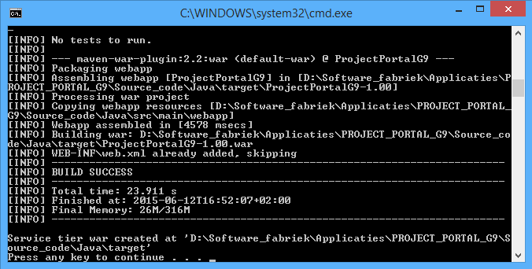

Figure 246: Script which is executed by compiling the Java service tier

#### Eclipse

No separate Maven installation is required to develop with Eclipse. However, the m2e plug-in must be present. This is included with the Eclipse IDE for Java EE applications.

Following the next steps ensures the same result as the build.bat script.

1.  Import the project into Eclipse.

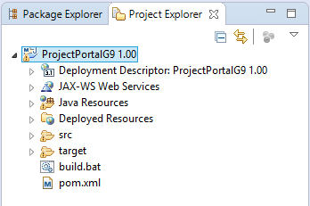

Figure 247: Eclipse

2.  Right-click on the pom.xml and go to *Run as -\> Maven build*.

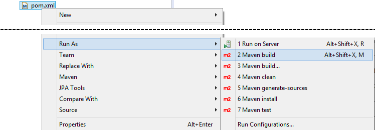

Figure 248: Run as -\> Maven build

3.  When this option is selected, a screen appears where the Run configuration of the project can be specified. Think of a name for the configuration and enter the value *clean package *in *Goals:*.

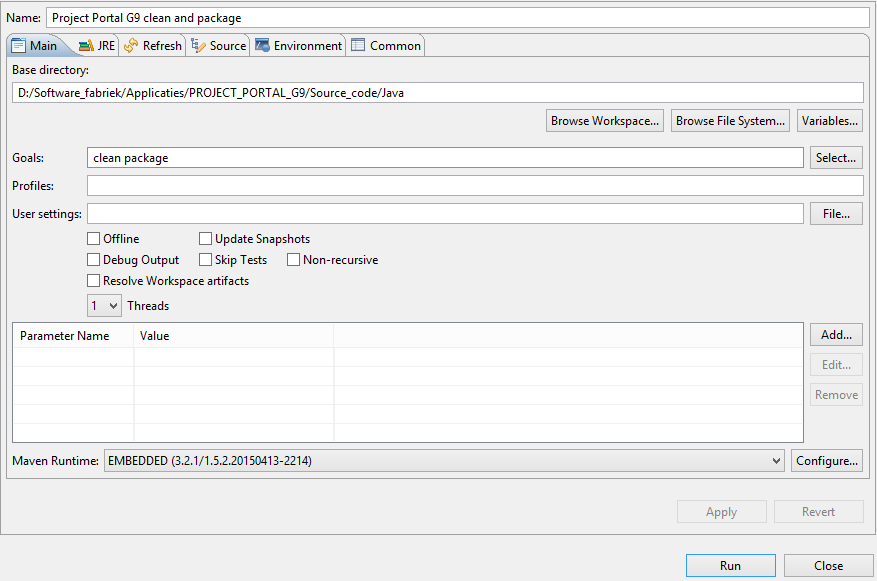

Figure 249: Run configuration of the specified project.

4.  When this configuration is executed, a .war archive will be created in the **target** directory, just as with the build.bat script.

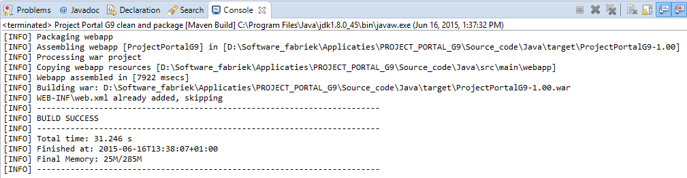

Figure 250: Target Folder

Of course, the built.bat script can also be executed from Eclipse, on the condition that a Maven installation is available in the Path variable.

### Custom libraries

It is possible in the Software Factory to add additional libraries or repositories to the pom.xml of the service tier. This can be done by means of adding control procedures in the work project.

When creating control procedures, select the following values:

|Field|Value|
|--- |--- |
|Type|Program object item|
|Assign type|Static|
|Codegroep id|JAVA_LIBRARIES|

Table 10: Custom library values in Java.

The templates that are added to this control procedure, can be assigned to the following program objects:

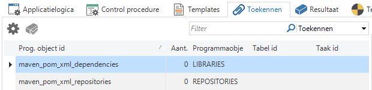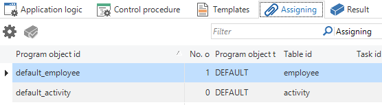

Figure 251: Screen shot of the 'Assign' tab in the 'Control procedure' screen

|Program object|Description|
|--- |--- |
|Maven_pom_xml_dependencies|The templates that are woven into this end up in the <dependencies> block of the pom.xml file.|
|Maven_pom_xml_repositories|The templates that are woven into this end up in the <repositories> block of the pom.xml file.|

Table 11: Program object possibilities in Java.

Maven repositories can be placed in several ways and at different locations. This could be somewhere on a web server, but also, for example, on a network. For more information see the Maven documentation on dependencies and repositories:

- <https://maven.apache.org/guides/introduction/introduction-to-dependency-mechanism.html>

- <https://maven.apache.org/guides/introduction/introduction-to-repositories.html>

## C\# service tier

The C\# service tier consists of a WCF WebService that can be used with ASP.NET as an IIS application. The required external libraries are retrieved using the NuGet package manager. To build the service tier, version 4.5 or later of the .NET Framework must be present on the system. A Visual Studio solution file is present to open the project. It is recommended to install at least Visual Studio 2013. Because the project is configured to operate with IIS, it must be opened with administrative rights.

The Fluent NHibernate framework is used for communication from the Web service to the database.

### Project layout

The following can be found in the root of the C\# service tier folder generated by the Software Factory:

- A folder with the same name as the name of the service tier. It contains the csharp project with all the .cs code files and IIS/ASP.NET configuration files, such as the Web.config.

- A solution file with the same name to open the project in Visual Studio.

- A *.nuget* folder with the configuration files for the NuGet package manager.

- A build.bat batch script to build the service tier, without opening Visual Studio.

When the solution is opened (with administrative rights) in Visual Studio, the project will look as follows

- 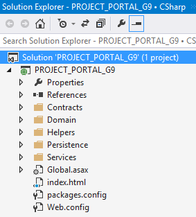The solution has an ASP.NET project with the specified service tier name.

- Within this project there are various folders with the C\# source code files of the WCF web service.

For example: Contracts contains all the data contracts, Services contains all the services with end points and Persistence contains the Fluent NHibernate entities and database mapping of the project.

- The root of the project contains the Global.asax where among other things are registered the services on URL paths, the packages.config, so that NuGet knows which packages it must retrieve and the Web.config with among other things the information that needs to be used to establish a connection with the end database.

### Compile

At least .NET Framework v4.5 is required to compile the C\# service tier.

#### Build.bat

If version 4.5 of the .Net Framework is installed the build.bat script can be executed. All required packages will be downloaded by NuGet and the solution is built with MSBuild. When this is completed successfully the required components to deploy the service tier on IIS are copied to a folder named **service\_tier**.

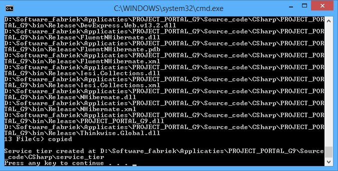

Figure 253: Compiling the built.bat script

#### Visual Studio

If the build.bat script does not work, the choice can be made to build the service tier with Visual Studio. Take the following steps:

1.  Open the solution (with administrative rights).

2.  Change the **Solution Configuration** to **Release**.

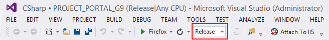

3.  Build the solution.

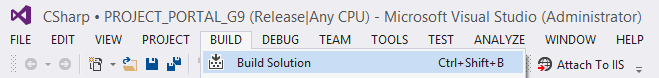

4.  Copy the following files to another directory:
    
    1.  Global.asax.
    
    2.  Web.config.
    
    3.  Index.html.
    
    4.  The dll files in bin\\Release must be placed in a bin sub-folder.

### Custom libraries

It is possible in the Software Factory to add additional libraries or repositories to the NuGet configuration and the C\# project of the service tier. This can be done by means of adding control procedures in the work project.

When creating control procedures, select the following values:

|Field|Value|
|--- |--- |
|Type|Program object item|
|Assign type|Static|
|Codegroep id|CSHARP_LIBRARIES|

Table 12: Custom library values in C\#.

Templates, which can be assigned to this control procedure, are added to the following program objects:

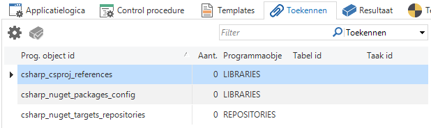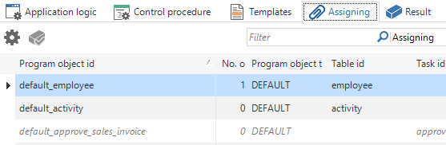

Figure 254: Screen shot of the 'Assign' tab in the 'Control procedure' screen

|Program object|Description|
|--- |--- |
|Csharp_csproj_references|The templates that are woven into this, are placed in the block with project references of the service tier csproj.
NuGet packages can add references to the project. For this reason, custom libraries must be added to this program object to be able to use any libraries in the csproj.|
|Csharp_nuget_packages_config|The templates that are woven into this, are placed in the packages.config file of the csproj van de service tier.
This file keeps track for NuGet of the packages that need to be included for the project.|
|Csharp_nuget_targets_repositories|The templates that are woven into this, are placed in the block with repositories in the nuget.targets file of the service tier.
The repositories that NuGet uses can be specified here.|

Table 13: Program object possibilities with C\#.

Below is an example with which the Json.NET package is added to the project.

1.  Install the package in Visual Studio via the **Manage NuGet Packages screen** (to be accessed via the context menu of the service tier project in the solution explorer).

> 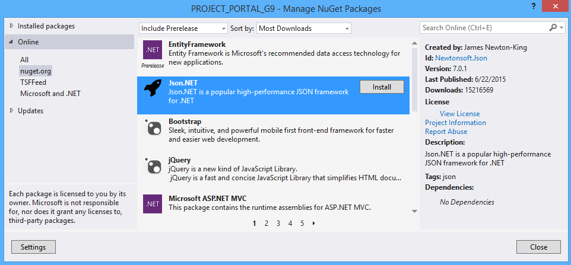

Figure 255: Visual Studio

2.  Retrieve the reference from **\[service\_tier\_name\]\\\[service\_tier\_name\].csproj**.

> 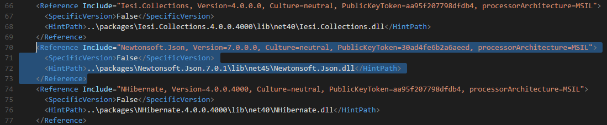

Figure 256: Visual Studio overview

3.  Weave this information via a control procedure template in the functionality screen of the Software Factory in the **csharp\_csproj\_references** program object.

> 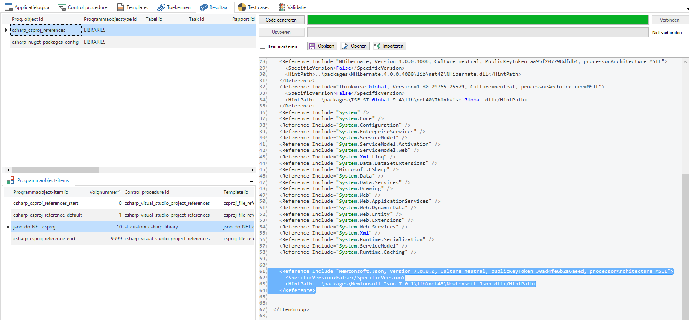

Figure 257: Weave control procedure into the Software Factory

4.  Expand the NuGet configuration from **\[service\_tier\_name\]\\packages.config**.

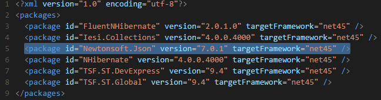

Figure 258: NuGet configuration

5.  Weave this information via a control procedure template in the functionality screen of the Software Factory in the **csharp\_nuget\_packages\_config** program object.

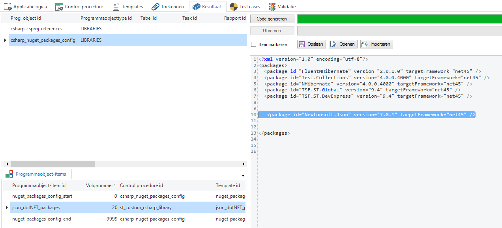

Figure 259: Weave control procedure into the Software Factory

When the Library is part of an internal project the choice can be made to use an internal NuGet repository. This can be set up, for example, as an IIS application or on the file system of a network location. For more information about this see the NuGet documentation:

- <http://docs.nuget.org/create/hosting-your-own-nuget-feeds>

The location of this repository must be woven into the **csharp\_NuGet\_targets\_repositories** program object to be able to use it in the service tier.

Libraries, which are not distributed via NuGet, can also be added. In this case the reference must be added to the generated project via Visual Studio. Afterwards, just as in the explanation above, the reference from the csproj file must be woven into the **csharp\_csproj\_reference** program object via a template.

## Synchronize offline changes after an upgrade

To ensure that following an upgrade any open offline modifications can still be synchronized it is possible to generate an extra service layer from the new project version that is compatible with the previous version (based on version management). We call this a *stale sync* service layer.

The Mobile GUI, as soon as it signals that an application has been modified or has become inactive, will first attempt to synchronize the offline modifications to the old address before the new application is loaded. The *stale sync* service layer transforms these modifications to the new data model and implements them on the database.

### Set up

When setting up the stale sync service layer we assume in the manual that there is a project version 1.00 and project version 2.00.

To obtain a stale sync:

- The user links for project version 2.00 the base project CSHARP\_SERVICE\_TIER\_UG.

- After that the definition and source code have to be generated and the build.bat has to be run.

This results in the folder service\_tier\_stale\_sync, which is written to the same location where the service\_tier folder also resides.

The service\_tier\_stale\_sync is a replacement for the old service layer of version 1.00. This should then therefore run on the old web address as this is known in IAM.

The service\_tier of 2.00 must run on another address. This must therefore also be registered in IAM. Mobile always sends the 1.00 data for the stale sync mechanism to the address where 1.00 ran.

The stale sync service layer can receive messages directed to version 1.00, transform them and execute them on the 2.00 database. The web.config of the stale sync service layer therefore also refers to 2.00. The default transformation takes place on the basis of version management and on the basis of nomenclature. How this is regulated is shown in the table below.

|Service|Operation|Behavior|
|--- |--- |--- |
|Task|Default|Does nothing|
||Layout|Does nothing|
||Execution|Selects the task in 2.00 on the basis of task nomenclature. Transforms the 1.00 record to a 2.00 record on the basis of parameter nomenclature. Executes a 2.00 default with default mode = Import. Executes a 2.00 task.|
|Table|Default|Does nothing|
||Layout|Does nothing|
||Context|Does nothing|
||Insert|Selects the table in 2.00 on the basis of version management. Transforms the 1.00 primary key to a 2.00 primary key on the basis of version management. Transforms the 1.00 record to a 2.00 record on the basis of version management. Executes a 2.00 default with default mode = Import. Executes a 2.00 insert. Transforms as default the resulting primary key back to 1.00 on the basis of version management.|
||Update|Selects, as default, the table in 2.00 on the basis of version management. Transforms the 1.00 primary key to a 2.00 primary key on the basis of version management. Transforms the 1.00 record to a 2.00 record on the basis of version management. Executes a 2.00 default with default mode = Import. Executes a 2.00 update.|
||Delete|Selects, as default, the table in 2.00 on the basis of version management. Transforms the 1.00 primary key to a 2.00 primary key on the basis of version management. Executes a 2.00 service delete.|
|View|Default|Does nothing|
||Layout|Does nothing|
||Context|Does nothing|
||Insert|Selects, as default, the table in 2.00 on the basis of table nomenclature. Transforms, as default, the 1.00 record to a 2.00 record on the basis of column nomenclature. Executes a 2.00 default with default mode = Import. Executes a 2.00 insert. Transforms, as default, the resulting primary key back to 1.00 on the basis of column nomenclature.|
||Update|Selects, as default, the table in 2.00 on the basis of table nomenclature. Transforms, as default, the 1.00 primary key to a 2.00 primary key on the basis of version management. Transforms, as default, the 1.00 record to a 2.00 record on the basis of column nomenclature. Executes a 2.00 default with default mode = Import. Executes a 2.00 update.|
||Delete|Selects, as default, the table in 2.00 on the basis of table nomenclature. Transforms, as default, the 1.00 primary key to a 2.00 primary key on the basis of column nomenclature. Executes a 2.00 delete.|

This means that the target entities must be present in the 2.00 service layer, otherwise the stale sync service layer has no back-end to react against. To offer this it is possible to manually tag the target tables that are still necessary in version 2.00 with PROXY\_REQUIRED.

If the 1.00 entity cannot be found in 2.00 (e.g. a table is deleted or a task is renamed) an error message is displayed. If a 1.00 column or parameter cannot be found in 2.00, then this is ignored.

Messages from the 2.00 service layer (triggers, defaults) are possibly not correctly picked up by the GUI because the message ID is possibly not yet known.

It is possible to personally intervene on the transformation, overwrite the default transformation. This concerns the choice for the target entity, the transformation of a record from 1.00 to 2.00, the transformation of a primary key from 1.00 to 2.00 and the transformation of the primary key back from 2.00 to 1.00 (with identity, for detail records). This is C\# code and can be woven via the CSHARP\_TRANSFORMATION code group. When making assignments the *Exclude framework* prefilter needs to be disabled.

StaleSync is activated during sign in:

- If the GUI-application is made inactive

- If the rights are changed (a new model is loaded)

- If the web address of the GUI application is changed.

Mobile will then send all offline modifications to the the old known address of the 1.00 service layer.
