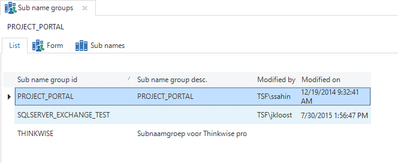
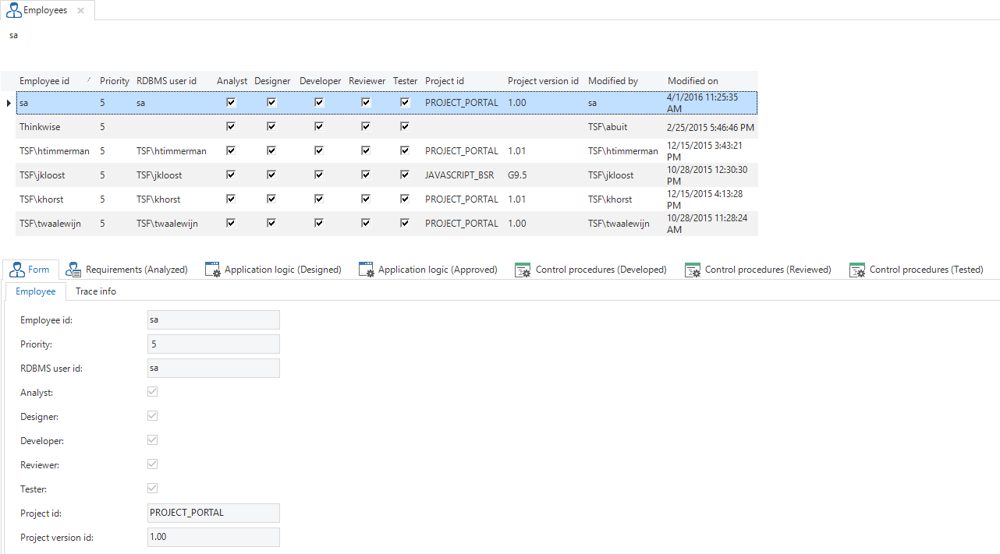

## Subname groups

All Subname Groups are displayed in the *Subname Groups* component. The corresponding subnames can be found under each subname group. By default only the unapproved subnames are displayed.

The subnames can be approved by means of a task. It is important that the subnames are carefully checked for inconsistencies and possible typing errors.

*Subname groups*

## Employees

In this component employees are registered who make use of the Software Factory. The last project and the last project version used is saved for each employee. This is used in the project version selector. In addition to their details, their roles in the process can also be specified here. When an employee is a developer and logs in with the correct RDBMS user, the correct name will be automatically entered when creating control procedures.

*Overview of registered employees with their role in the 'Employees' screen*

## Supplement workshop

This component is intended for training purposes.

## Optimize indexes

Using this task, the indexes and statistics in the Software Factory database can be optimized if it appears that the performance of the Software Factory is no longer optimal. Thinkwise recommends doing this periodically, for instance every night, through an SQL Server Maintenance Plan.
