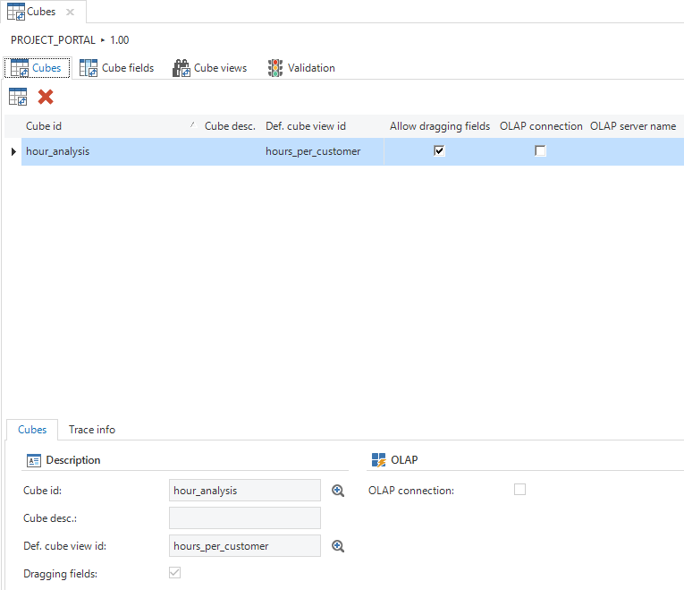
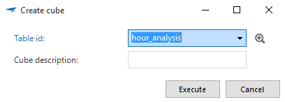
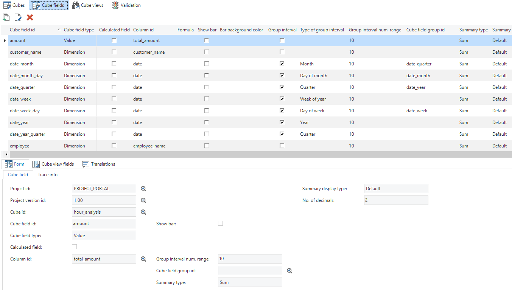
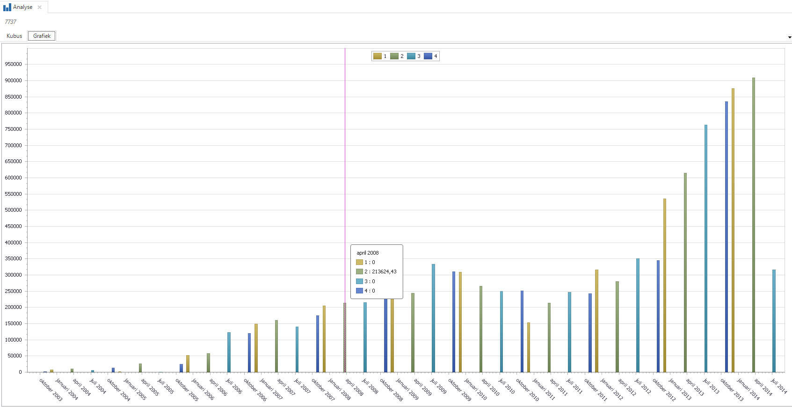
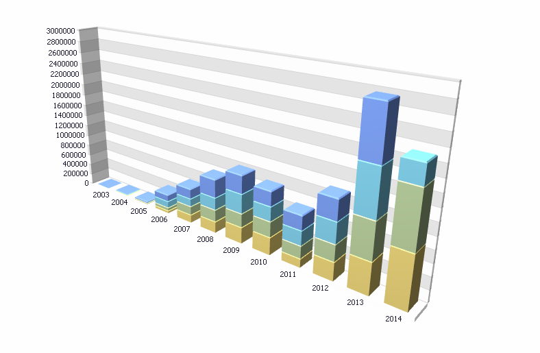

The user interface features cube technology, which allows you to make online and interactive analyses. These can be presented both numerically and graphically.

A cube is linked to a table or a view. Since the table name and the cube name are the same, only one cube can be created for each table. The references of this table or view determine for which main subjects the cube is displayed as a detail tab.

**Tip**

It is also possible to link tasks to a cube table. In that case, it is important that the PK of the table is unique, since the GUI uses this to identify the rows in the pivot table. Even if a view is being used, the PK should be set as a unique key.

Figure 157: Overview of the 'Cubes' tab in the 'User Interface'

### Creating a Cube

Creating a cube is done with the *Create cube* task. This task automatically adds measuring values and dimensions and the screen type is changed to *cube*.

Figure 158: Popup for creating a cube

If the data source is an OLAP cube, the *OLAP connection* check mark must be checked on the form. Three new fields will appear: *OLAP server name*, *OLAP database name* and *OLAP cube name*. The first field refers to the SQL Server instance on which Analysis Services runs. The OLAP database name should be entered in the second field. The third field is the name of the OLAP cube.

### Cube Fields

A cube is made up of cube fields that can be applied by the user. There are two types of fields:

  - Value; these are fields for which the value is determined by an aggregation (sum, average, maximum, minimum, etc.)

  - Dimension; these are fields for which the values can be plotted on the axes and on which can be filtered.

The task with which a cube can be created makes the best possible proposal, but the field definitions will still need to be verified. In any case, all id columns that have no semantic value for the user, must be removed from the cube. They then just provide the connection to the other subjects.

Figure 159: Adding Cube Fields to the 'Cube Fields' tab

It is also important that the measured value(s) that are used in the cube are derived from the *Fact Table*. This is the data that provides the most detail.

**Example**

When an order is calculated, the order lines, which are added up in the cube, must be used and not the order itself.

#### Defining OLAP\[13\] Cube Fields

In contrast to cubes where the source data is derived from a table or view, the source data here comes from various tables. Since it is not possible to change the table name in the cube fields, a special syntax has to be entered in the cube field id in order to still be able to select the data from multiple tables. The syntax is as follows: **table\_name.column\_id*.*

Configuration requirements:

  - All tables used in the cube have to be available in the model.

  - If the box *OLAP connection* is checked, the *table id* is hidden. This happens because this field is not required from a technical point of view. However, when the OLAP cube is being used as a detail screen, it is convenient to use a dummy table. The dummy table must contain every primary key of every table that is used by the cube. After this the references can be drawn between the tables from the cube and the dummy table. The table id of the cube must be entered before the *OLAP connection* box is checked.

  - Every primary key column of the source tables of the cube (the above-mentioned dummy table) must have a cube field in the cube definition. The table id must refer to the dummy table and the column id must refer to the column in the dummy table.

Technical requirements/points of attention:

  - The Microsoft Analysis Services OLE DB Provider must be installed on the client computer to communicate with OLAP cubes.

  - Only cubes created with Microsoft Analysis Services are supported by the GUI.

  - Only OLE DB Data Provider is supported to retrieve data from the OLAP cube.

  - Calculated fields are not supported in an OLAP cube.

  - Group interval fields are not supported in an OLAP cube.

#### Cube field grouping

It is possible to group cube fields. A group can be collapsed and expanded.

A cube field can be directly linked to another cube field, for example, project activity to project. A project activity will then be shown as a dimension under the project. The project activity is then no longer available as an independent dimension.

In addition, it is possible to create a group interval. For example, a cube field of the *dimension* type for names in an alphabetical interval. In this way, all names starting with an *A* are shown in one group.

The possible group interval types are:

  - Alphabetical; grouping by initial letter

  - Numeric; interval for a numerical range (for example, per 100 or per 1000)

  - Date; the date of a date or timestamp

  - Year; the year of a date or timestamp

  - Quarter; the quarter of a date or timestamp

  - Month; the month of a date or timestamp

  - Week no. of the year; week no. of the year for a date or timestamp

  - Week of the month; the week of the month for a date or timestamp

  - Day of the year; the day of the year for a date or timestamp

  - Day of the month; the day of the month for a date or timestamp

  - Year age; age in years based on the current date. For this purpose the numerical range can be used, for instance an age group per year of per 10 years (0-9, 10-19 etc.).

  - Month age; see year age, but then for the age in months.

  - Week age; see year age, but then for the age in weeks.

  - Day age; see year age, but then for the age in days.

### Cube displays

Apart from defining cubes, which the user can work with, the cube views can also be specified in the Software Factory. These can be accessed by the user through the context menu, the ribbon or the cube view bar. A cube view is essentially a predefined format, which the user can adapt to his own wishes for personal use.

A cube view consists of a number of mandatory and optional components.

  - Cube view

  - Cube view fields

  - Constant lines (optional)

  - Filters (optional)

  - Field totals (optional)

  - Conditional formatting (optional)

Create a cube view by adding it. Specify a cube view id and optionally a group. Subsequently you can specify a number of things that determine the appearance of the view.

  - Icon

  - Display totals

  - Default view
    
      - Cube
    
      - Graph

  - Labels

  - Legend

Fields can then be added to the cube view. it can be specified for each field in which area in the cube it should appear.

  - Values

  - Row

  - Column

  - Filter

  - Menu

The last settings that can be added relate to:

  - Sort sequence

  - Display top X

  - Totals

  - Expand
    
      - For example, for dates (year/month/day)

Once the cube view has been created and the fields have been added, they are available in the cube of the final product After this, the cube can be further embellished with constant lines, filters, totals, and conditional formatting.

Using the cube view toolbar, the available cube views can be displayed in a bar on the screen, in the same way as prefilters, tasks and reports. In combination with the new cube components, screens can be developed for example with only graphs and a toolbar to select the view.

### Graphs

Each overview can be displayed graphically in a two or three-dimensional graph. Dimensions can also be linked to each other so that a hierarchy is created.

**Example**

Customer – Project

Year – Month – Day

The last example requires 3 dimensions that are linked via the same date field. Such a field is defined as a group interval with the respective type. This is done automatically for dates.

Figure 160: Example of a graph

Figure 161: Example of a 3D graph display

##### Graph type per measured value

In order to combine different types of charts in a graph measured value can be linked to a particular type of graph. This is done by including the name of the type of graph in the name of the measured value, separated by an underscore.

**Example**

number of\_hours\_spline3d

Available graph types are:

||||
|--- |--- |--- |
|Area2D|CandleStick2D|RangeArea2D|
|Area3D|Doughnut2D|RangeArea3D|
|AreaFullStacked2D|Doughnut3D|RangeBar2D|
|AreaFullStacked3D|FullStackedLine2D|RangeSideBySideBar2D|
|AreaStacked2D|FullStackedLine3D|ScatterLine2D|
|AreaStacked3D|FullStackedSplineArea2D|Spline2D|
|Bar3D|FullStackedSplineArea3D|Spline3D|
|BarFullStacked2D|Funnel2D|SplineArea2D|
|BarFullStacked3D|Funnel3D|SplineArea3D|
|BarGrouped3D|Gantt2D|StackedLine2D|
|BarSideBySide2D|GanttSideBySide2D|StackedLine3D|
|BarSideBySideFullStacked2D|Line2D|StackedSplineArea2D|
|BarSideBySideFullStacked3D|Line3D|StackedSplineArea3D|
|BarSideBySideStacked2D|Pie2D|StepArea2D|
|BarSideBySideStacked3D|Point2D|StepArea3D|
|BarStacked2D|RadarArea2D|StepLine|
|BarStacked3D|RadarLine2D|StepLine3D|
|Bubble2D|RadarPoint2D|Stock2D|
|||SwiftPlot2D|

##### Areas in graphs

To model an area in a graph, you can use a constant line, the name of which starts with *area\_*. The minimum value can be specified with the *Value* field and the height or width of the area with *Thickness*.
