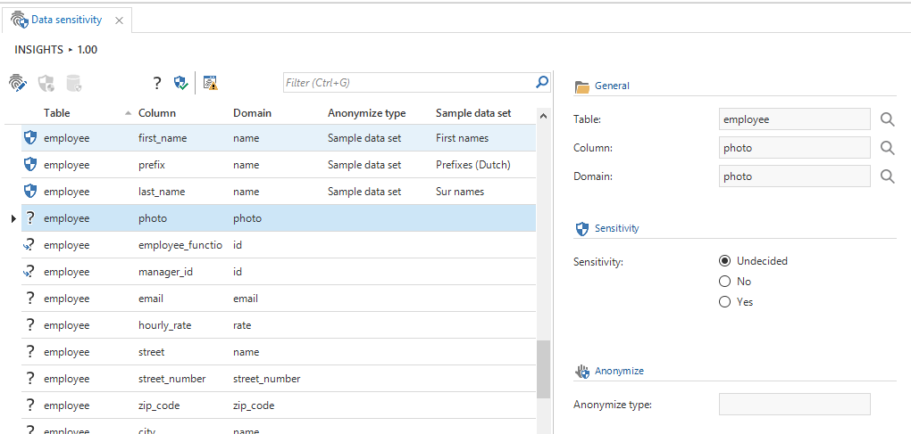
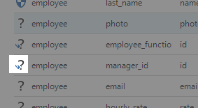
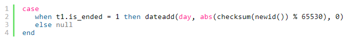
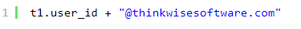
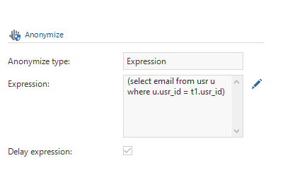
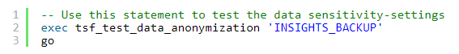
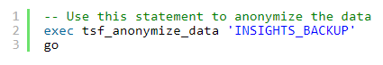

With the introduction of Europe*s General Data Protection Regulation, it is more important than ever for companies that their IT environment is secure and meets the legal requirements for privacy protection. To help comply with this new legislation it*s possible to use the tab page “Data sensitivity” to anonymize personal data in the Thinkwise application. This feature can not only be used for personal data, but also for other sensitive data like passwords or credit card numbers.

It is possible to set the sensitivity for each data column of the application. View-columns, calculated fields, and identity fields are not data columns and therefore are not shown. A prefilter is provided to suggest which columns are sensitive, based on keywords or because columns with the same name or domain are also marked sensitive.

Figure 79: Data sensitivity

For sensitive columns, it is mandatory to select an anonymization type. There are 3 options:

  - Sample data set

  - Random value

  - Expression

Foreign key columns are automatically anonymized based on the settings of the source column. They can be recognized by the icon as shown in below figure and are hidden by the “undecided columns” prefilter.

Figure 80: Foreign key columns

#### Sample data set

There are default sample data sets available that can be used to anonymize the data. Upon anonymization, a random value from the set will be picked, taking into account the domain of the column.

#### Random value

When this option is used to anonymize the data, a random value is generated that meets the domain specifications. This is not user-friendly, therefore it is not recommend to use this for acceptance test data. Note that when a random date is selected, this date can be *in the future* or *in the past*. If there are business rules that ensure a date in the past is used, it is better to select “Expression” and write your own query or use “Sample data set” and add a set with random dates in the past.

#### Expression

In certain cases, a value dependents on the value of other columns or has to meet specific requirements. In that case, the option “Expression” can be used. For instance, if *end\_date *is mandatory when *is\_ended* is true, then a random *end\_date *can be generated with the following query:

When the expression is dependent on a column that needs to be anonymized first, use the checkbox “Delay expression”. For example, if an email address  is based on a username:

Figure 81: Delayed expression

#### Production

The easiest way to corrupt data is to execute the anonymization-task on production. To comply with the legislation, Thinkwise uses techniques where it is not possible to restore the original data. Therefore, the task must always be executed on a backup. There is no rollback once the task has started.

To prevent mistakes there are two checks:

1.  Database name check; The database name that is provided as a parameter must match the current database.

2.  Single user mode; The database needs to be in single user mode.

#### Anonymization

Based on the data sensitivity-settings, the Software Factory will generate two stored procedures:

1.  Stored procedure “tsf\_test\_data\_anonymization” to test the data sensitivity-settings and sample data

2.  Stored procedure “tsf\_anonymize\_data” to actually anonymize the data

