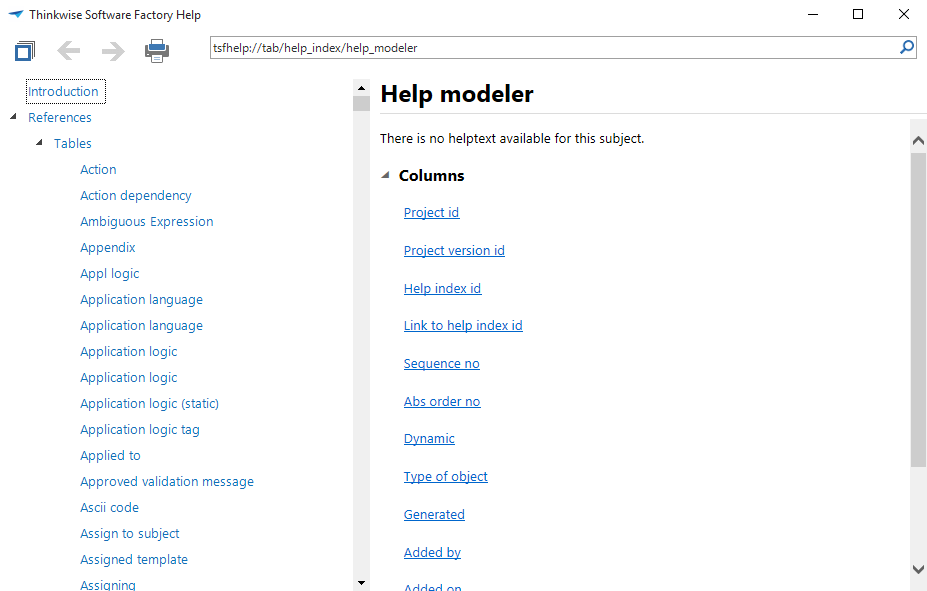
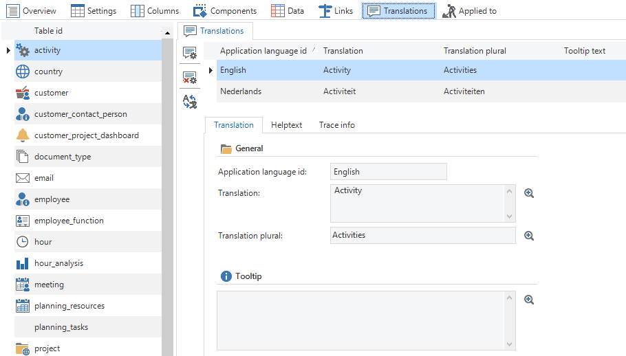

The Software Factory also generates Microsoft HTML Help. This ensures that users and developers can make use of help documentation in both the Software Factory and the end product. This is called up with the F1 key.

Figure 226: Example of the help function by pressing the F1 key

Since the help functionality is generated at the moment when it is called, it will be controlled via the Intelligent Application Manager, just as the model itself. The advantage of this is that authorization rights are also being used. If an employee has no rights to a particular table, he will not be able to access the corresponding help text.

#### Creating help texts

Help texts are written on the translation tab in the table, task or report to which this help text applies. A help text therefore consists of short paragraphs of text, instead of long passages of text.

Figure 227: Adding help texts for a specific table in 'Subjects'.

The input fields of the help texts is a *rich text* data type, providing the possibly to use formatting options such as **bold**, *italic* and underlined. But adding colour, hyperlinks (including links to other components in the help document) and images is also possible. Images will be stored in the text. Various types of fonts are not supported. The Software Factory will automatically adjust all font types to a standard size.

Figure 228: An example of a help text

When the help texts have been filled for all tables, tasks and reports, the help documents can be created on the *Help* tab in *Documentation*, which is available via the menu.

The creation of his document is built as a tree structure. Headings can be added manually and provided with text. Adding texts from the tables, tasks and reports can be done by adding a new component and then ticking the *Dynamic* checkbox. The option whether to add tables, tasks or reports will then appear. By pressing a button, a help document can be generated for all tables, tasks or reports.

Figure 229: Creating a dynamic help document for 'Documentation'
