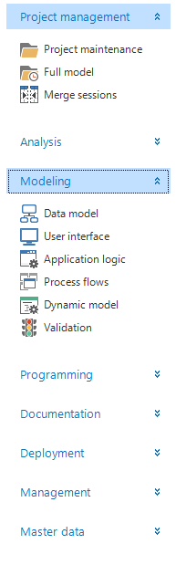
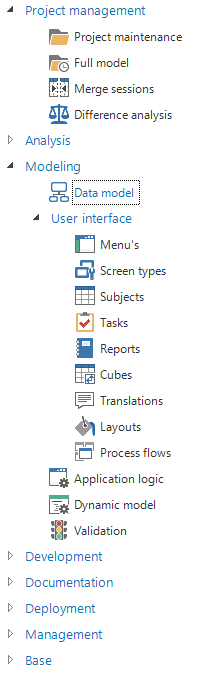
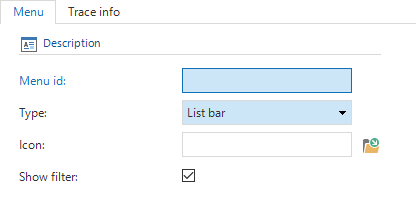
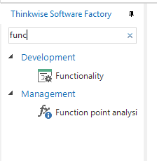
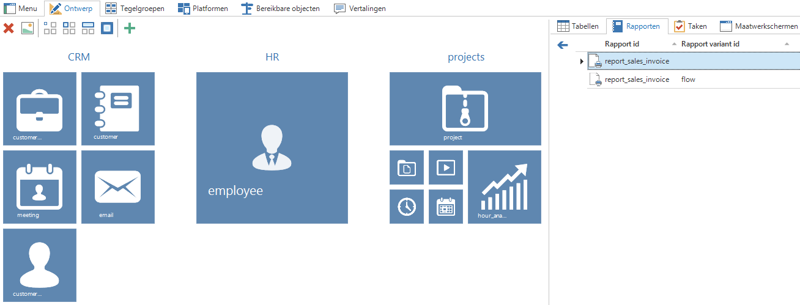
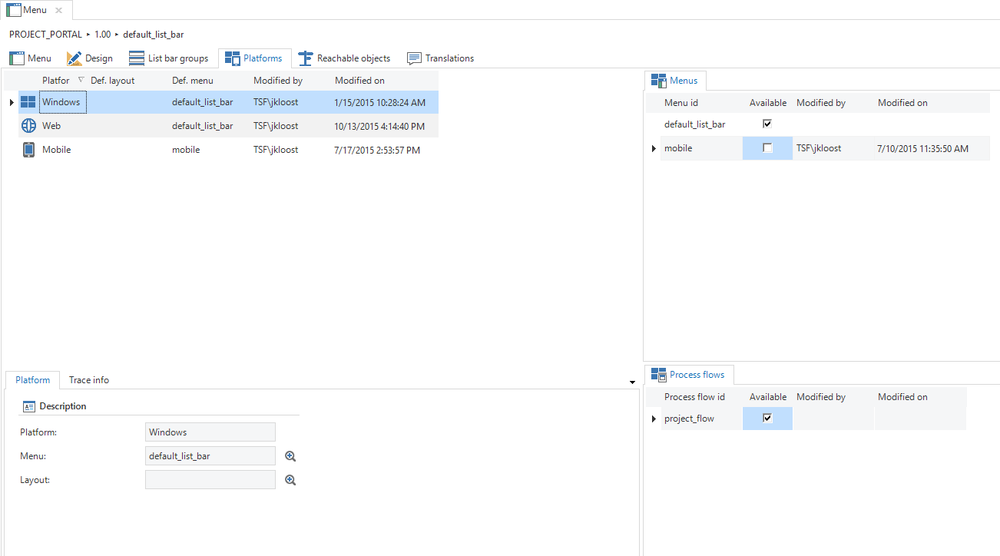
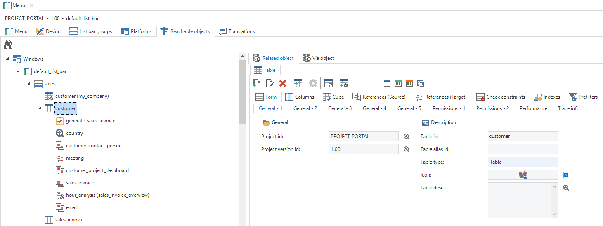
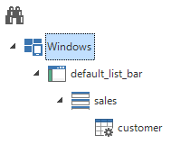
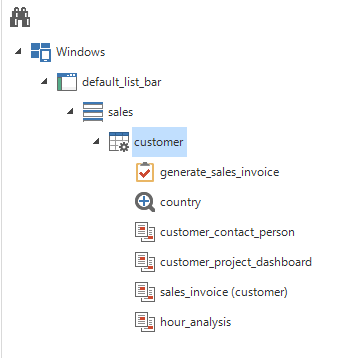
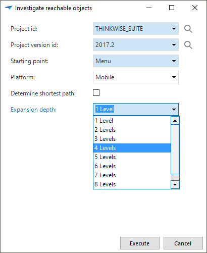

The menu is displayed on the left-hand side of the end product, except the tile type menu, and offers the user the possibility to access different parts of the application. It is possible to create different menus for different platforms. For these different menus it can indicated which components are or are not available for which platform (Windows, Web and Mobile).

There are three different kinds of menus available, a quick launch toolbar, a tree structure and a tiles menu.

The differences between the quick launch toolbar and tree structure toolbar: Where a quick launch toolbar only goes one level deep, a tree structure can have several levels. When a new menu is created, menu groups must first be created within this menu. These groups work as headings for the underlying menu items. These groups are filled with menu-items which refer to a specific table (variant), task (version), report (version) or customized screen\[8\].

It can be indicated in the layout settings whether the icons of the items must also be displayed in the menu or only in the document tabs.

In the figure below is an example of a quick launch toolbar on the left and a tree structure on the right.

 

Figure 82: Overview of the quick launch and tree menu structures

By setting the *Show filter* checkbox in the Menu tab to true it is possible to show a filter bar on these menus. This makes it is easy to search for a desired menu item in the menu.

Figure 75: Setting the filter option

Figure 83: filter in the menu

#### Tiles menu

On the tiles menu, along with creating the groups with items, the size at which the items must be displayed can also be defined. A choice can be made from 4 variants. See the figure below for the four variants.

Figure 84: Tile styles

During set up the groups and items are created and it is indicated how large the items have to be and, in addition, a different image can be selected for each tile. This can be done add the *subject* page. Subsequently, the GUI will itself organize the items from top left to bottom right according to the room that the screen has available.

##### Platforms

This component provides the possibility to create platform configurations for Windows, Web and Mobile. It can be indicated for each platform:

  - whether this platform may be started up,

  - what the standard layout is,

  - what the standard menu is,

  - which menus are available,

  - which process flows are available.

In this way, for example, a different menu can be created for Mobile for which the menu items, where necessary, use variants that are specifically made for Mobile.

The platforms are initially determined in the Software Factory, but can also be authorized later in the Intelligent Application Manager. It is therefore possible to make a GUI application for specific user groups available via Windows, Web or Mobile.

Figure 85: 'Platform' screen within the 'User interface'

### Accessible objects

Via the tab *Accessible objects* the developer can see via which routes a specific object, task or report can be accessed in the system. This can also support the developer when checking authorization rights. For instance, it can be seen whether a table is accessible, that should not be accessible.

Figure 86: 'Accessible objects' tab with 'Menu'

By clicking on the  *Investigate accessible objects…* task the popup below opens. It can be indicated here for which platform the shortest path must be determined to a table, report, task or variant.

Figure 87: Popup to determine the shortest path to an object

The result then shows via which steps the object can be accessed.

Figure 88: Steps when determining the shortest path

By clicking on the table, information about this table appears on the right and this can be modified. An additional function that becomes available when this table is selected is the  *Expand* task. By clicking on this the following tasks, details, look-ups and reports of the selected table are displayed.

Figure 89: 'Footsteps' when determining a path

Sometimes you know until what level you want to expend. If this is the case it is possible to insert the depth in the pop-up.

It is possible to expand to up to 9 levels. However, when a new level would cause the amount of nodes introduced in the tree to be more than 1000, the expansion will be stopped at the current level.

Figure 90: Investigate reachable objects
