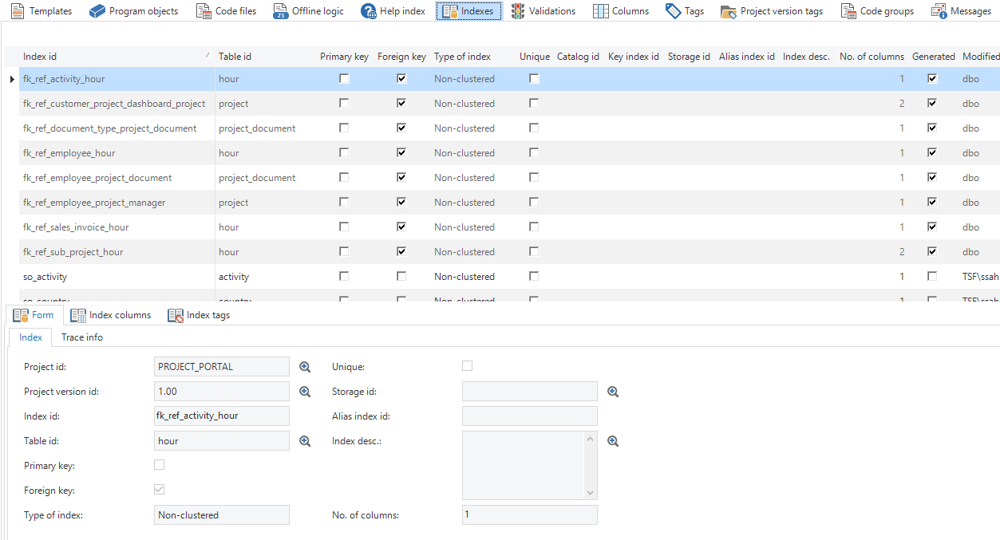

Below are a number of recommendations to improve performance and make the resource usage more efficient. The recommendations are split into three parts:

1. Configuring the blueprint
1. Ini file of the GUI
1. Use of SQL

## The blueprint

### Indexes

An index in a database is a (part) file in which a table is sorted on an indicated column (or several columns). The objective of such an index is to increase the search speed.

Sometimes different indexes are necessary for different queries on a table. However, when writing data to the table all indexes of this table must be updated. It is therefore important to add specific indexes. More is here not always better.

As default the Software Factory generates indexes for all primary keys, foreign keys and sort sequences. Indexes can be created automatically by writing a control procedure for this. Indexing on the presentation field can therefore be useful. Certainly with large tables.

In addition, indexes can also be added manually. This can be done with Data Model under the Tables tab and then the Indexes tab.

There is support for *clustered and nun-clustered indexes, full-text indexes* (SQL Server) and *Encoded Vector indexes* (DB2). It can also be indicated whether an index must be unique;.

Figure 260: Overview of the 'Indexing' tab in the 'Full model'

Most database management systems have analysis tools that recommend indexes on the basis of an analyzed period. These recommended indexes can then be given within the Software Factory.

### Calculations

There are various possibilities for the use of calculated data in the application. Consider the following possibilities:

  - Physically stored in the database, with Default logic calculation

  - Physically stored in the database, with Trigger logic calculation

  - Physically stored in the database with the help of an MQT or MV (DB2, Oracle)

<!-- end list -->

  - Physically stored in the database with the help of an extra table and Task logic

  - Calculated during selection with the help of a view

  - Calculated during selection with the help of a calculated column (SQL Server)

  - Calculated during selection with the help of a calculated column function (SQL Server)

  - Calculated during selection with the help of an expression

A number of aspects are important when selecting possible solutions: Maintainability, timeliness, reusability, performance and storage.
|Name|Maintainability|Topicality|Reusability|Performance|Storage|
|--- |--- |--- |--- |--- |--- |
|Physically stored in the database, with Default logic calculation|Only the default logic determines the calculation.|The data that is displayed is from the moment that the row was added and therefore historical.|It is not easy to use default logic in, for example, triggers or tasks. The calculation will only be easily applied when the user adds or modifies a record in the table from the GUI. When the calculation depends on other subjects (order totaal for the order, based on order lines) then this option is not applicable.|The calculation is only carried out when adding or modifying a record. Selecting the calculated data does not cost any additional computing power. The calculated result can be indexed.|Minimum effect.|
|Physically stored in the database, with Trigger logic calculation|Only the trigger logic determines the calculation. This must possibly be woven on several subjects and/or in insert, update and delete triggers. Default logic is possibly necessary to obtain a clear view of the result of the calculation, also during the addition or modification of data.|The data that is displayed is from the moment that the row was added and therefore historical.|Trigger logic is automatically applied by the RDBMS, no further action is necessary.|The trigger will play a role with every update. It is important that the code is so written that it only performs (significant) calculations when this is necessary, when data is modified that impacts the result of the calculation. Selecting the calculated data does not cost any additional computing power. The calculated result can be indexed.|Minimum effect.|
|Physically stored in the database with the help of an MQT or MV (DB2, Oracle)|The MQT or MV usually contains data from other entities. The MQT or MV also need to be checked when there are modifications in the other entities. Any triggers for the propagation of modifications or tasks for refreshing the MQT or MV need to be developed. Default logic is possibly necessary to obtain a clear view of the result of the calculation, also during the addition or modification of data.|There is a great deal of control about the timeliness of the data. The choice can be made to refresh the MQT or MV periodically, in which case the data lags behind until the moment it is refreshed. When this becomes too outdated, the option can be taken to update the data with triggers at the moment that something changes in the parameters of the calculation.|The MQT or MV is reusable in the back-end logic.|Depending on the settings, the calculating power is necessary during the refresh moments of the MQT or MV. With an MQT or MV it is possible to greatly influence the timing of the calculation. Selecting the calculated data does not cost any additional computing power. The calculated result can be indexed.|An MQT or MV can take up a great deal of space in the database. This naturally depends on the volume.|
|Physically stored in the database with the help of an extra table and Task logic|Comparable with an MQT or MV, with as addition a task for refreshing, as a replacement for the MQT or MV code.|Comparable with an MQT or MV.|The table is reusable in the back-end logic.|Comparable with an MQT or MV.|Comparable with an MQT or MV.|
|Calculated during selection with the help of a view|A view mainly contains data from other entities. The view also needs to be checked when there are modifications in the other entities. Any instead-of-triggers for the propagation of modifications need to be developed. Default logic is possibly necessary to obtain a clear view of the result of the calculation, also during the addition or modification of data.|The calculation is executed at the time of the request. The data is therefore always up to date and can differ from the moment at which data was first entered.|The view is reusable in the back-end logic.|The calculation is executed at the time of selection. Depending on the situation this can require a lot of computing power and time. A view with complex calculations that is frequently consulted is less suitable because of this. Views that make use of other views are advised against. Views that are accessed with a filter on columns that are a result of a function are strongly advised against, because the function must be calculated for all rows to be able to filter the view.|No physical storage.|
|Calculated during selection with the help of a calculated column (SQL Server)|A calculated column may only make use of the row in question. Sub-queries are not allowed. A calculated column cannot be applied with a view. A calculated column can be deployed, in contrast to a trigger, to make use of non-deterministic data at the time of the selection, such as the current date to determine someone's age. Maintainability: A calculated column is part of the data model and requires an upgrade of the database when the calculation is modified. Default logic is possibly necessary to obtain a clear view of the result of the calculation, also during the addition or modification of data.|The calculation is executed at the time of the request. The data is therefore always up to date and can differ from the moment at which data was first entered.|The calculated column is reusable in backend logic.|The calculation is executed at the time of selection. When the result of the calculation almost never changes, but is often selected, it is worth considering the use of a trigger.|No physical storage.|
|Calculated during selection with the help of a calculated column function (SQL Server)|A calculated column function, as supplement to a normal calculated column, may also make use of subqueries. Maintainability: Comparable with a calculated column.|Comparable with a calculated column.|The calculated column is reusable in backend logic.|The calculation is executed at the time of selection and is the result of a function call. This means that the calculation is performed for each row , not at once for the complete set. When the result of the calculation almost never changes but is often selected it is strongly advised to use triggers.|No physical storage.|
|Calculated during selection with the help of an expression|An expression can be used, in contrast to a trigger, to make use of non-deterministic data at the time of the selection, such as the current date to determine someone's age. Furthermore an expression can be applied to display additional data for a subject without affecting the database. Maintainability: The expression is automatically executed by the GUI both during selection as well as when adding or modifying a record. No additional Default-logic is necessary.|Comparable with a calculated column.|The expression is not usable in the back-end logic and in other applications (for example, reports)|The calculation is executed at the time of selection and during modification. When selecting several rows, in contrast to a calculated column function, this is calculated for each set. When the result of the calculation almost never changes, but is often selected, it is worth considering the use of a trigger.|No physical storage.|

### Standard prefilters

By enabling prefilters as default, the amount of data on the screen can be kept under control. For instance, as default only display the open orders of the last year or the employees who are currently employed.

### Start empty with filter

With this option a screen is opened without data and the filter popup is automatically activated. This is intended for screens with a lot of data, for which, for example, the number of rows cannot be reduced to a smaller set via a prefilter, such as with customers or articles. In such a screen the user will often first filter so that it is unnecessary that the application first retrieves all the data.

The screen starts much faster with this option because no data needs to be retrieved from the database. Furthermore, the server is not overloaded.

### No combo box at look-up fields with a large dataset

A look-up value is a value that is looked up in another table. This value can be looked up via a popup and/or via a combo box. The use of combo boxes is strongly advised against when the look-up table contains many records. This is because the combo box must load the entire dataset to give the user a choice between the items. This worsens the performance and also uses a great deal of the workstation's memory.

Of course, this also depends greatly on the hardware being used. When using a PC, Thinkwise recommends to only use the combo box with tables with at most a few thousand records. If combo boxes are used then the number of elements needs to be restricted to at most a few dozen. It is also advisable here to enable a default prefilter, to simplify the selection for the user.

Moreover, *Autocompletion* continues to work also without a combo box. The user can also type in a part of the value and then go to the popup with Ctrl+L, where the grid is immediately filtered on this value with the default filter condition of the field.

With regard to combo boxes the above also applies for use in combination with the Web GUI. Rule of thumb here is that a combo box with more than a thousand rows is too large, but it is often advantageous to switch to a look-up text field starting from a few dozen rows. The number of combo boxes in the form also impacts the performance. Indeed, a number of smaller combo boxes make use of the same resources as one large one.

### No combo box at a hidden or read only look-up field

It makes no sense to define a combo box for look-up fields of the *Read only* or *Hidden* type, since in that case the user cannot make a selection.

This can be checked with a validation.

### Whether or not a presentation field

The presentation field of a table is the field that is displayed with a foreign key relation to the table. For example the field *Description* of a table with an autonumber field as key. This value is determined for each cell and costs some performance mainly in the grid.

One option is to use a semantic key whereby no look-up field is necessary. In that case the look-up table does not have to be queried.

### Limited number of columns in a grid

As default all fields of a table are displayed in the grid and the form. Because the grid will display a large number of records, every additional field means more data processing. It is an option to limit the number of fields in the grid. Apart from this it is possible to filter and search on fields that are not displayed in the grid.

Incidentally, restricting the number of fields in the grid does not result in less data traffic. All fields are necessary, for example, for default and layout mechanisms. There is certainly less screen processing necessary and furthermore presentation fields no longer have to be translated when they are no longer visible. This has the greatest effect on performance.

Limiting the number of fields in the form has hardly any effect on performance.

### File links and icons

File links and icons can have a negative effect on performance, mainly if the file or the machine cannot be found.

### Cubes

The cubes are built up in runtime on the basis of the results of the underlying query, for which aggregation takes place to the dimensions. The construction of a cube can be primarily accelerated by:

  - > Limiting the number of dimensions and measurements.
    
      - > Preferably two smaller cubes than one large cube.

<!-- end list -->

  - > Running the cube against a limited dataset, for example by:
    
      - > Displaying as detail of a main subject.
    
      - > Making use of a prefilter.

  - > If dimensions are dependent on each other then they must also be defined as such. Single dimensions provide many more theoretical possibilities and thereby the system has to aggregate far more. This takes more time to construct the cube.
    
      - > The dimension *Month* can be linked to *Year*.
    
      - > The dimension *Town* can be linked to *Country*.

## SQL

### Functions

Functions undermine the sets approach character of SQL, because these must be processed row by row. The use of one or more functions in the SELECT or WHERE clause ensures that the SQL engine must process the records one by one to be able to execute the function.

The use of functions often already results in a poor performance and a heavy load on the server. If a function still must be used, it is recommended to keep the set on which that takes place as small as possible.

If it is not possible to work without the use of functions, it is recommended to disable sorting and filtering on these columns at a meta-level. The sorting and filtering function must often be executed on the entire dataset.

With DB2, through the use of the UPPER and LOWER functions, the *old* SQL engine is used, which is appreciably slower.

### CASE statements 

The same applies here as for the use of functions (see previous paragraph). Also with the use of case statements, the dataset on which this takes place must be as small as possible.

### Cursors

A cursor, by definition, ensures processing for each row. If the desired functionality can be written for sets, then this is definitely preferable. This provides a better performance.

The use of cursors cannot always be avoided, but it also applies here that it is important that the dataset on which the cursor is placed is as small as possible.

### Row/set triggers

Some RDBMSs offer the choice between ROW and SET triggers. A ROW trigger is often easier to write for a programmer, certainly when he or she does not have much experience with a set approach. A ROW trigger may certainly be applied when one or more records are updated at the same time in the table with one SQL statement, such as via the Thinkwise user interface.

However, with tables for which thousands of records can be affected by one SQL statement (for instance from a trigger on another table) it is recommended to include the functionality in the SET trigger.

These triggers must often also exist alongside each other. This option is applicable to DB2 and not to SQL Server. Everything within SQL Server is processed in sets.

### Update triggers

As an option in DB2 an update trigger can only be executed when modifying specific columns. This prevents the trigger always being executed, while on the modified columns there is no functionality that is applicable in the trigger.

To do this the *Update trigger on columns* field with the table must be checked and then the *trigger for modifying* field with every column that the update trigger must be able to activate.

### EXISTS statement

A SELECT statement often follows after an EXISTS statement for which the result determines whether the EXISTS is or is not true. It makes no sense to include several columns in the SELECT statement because it is about whether at least 1 record satisfies the WHERE clause or not. Therefore one constant suffices (for instance, 1).

EXISTS (SELECT 1 FROM TABLE WHERE…)

### ORDER BY in views and MQT*s

A view is a logical table that can be accessed via a query. The desired sort sequence can be provided in this query. Sorting within a view is thereby superfluous and leads to poor performance and a high load on the server.

### Views over views

It must be attempted to avoid the use of views within the query of a view. Most RDBMSs have trouble optimizing this situation. This results in poor performance. In this case it is better to write a separate view that only makes use of tables.

### IBM System i 

The performance of ODBC connections and SQL on an IBM System i can be improved with the following settings:

1.  Prestarted Jobs – Creating connections (jobs) takes a relatively long time on an IBM System i. By using *Prestarted jobs* these connections are prepared in advance. Set up the System i so that enough prestarted jobs are always available. See: <http://pic.dhe.ibm.com/infocenter/iseries/v7r1m0/index.jsp?topic=%2Fddp%2Frbal1usepsj.htm>

2.  Separate sub-system - Query plans remain applicable as long as the environment variables (load, disk space, free memory) remain stable. It therefore makes sense to place the QZDASOINIT tasks in a separate sub-system, on the basis of, for example, an IP address. See: http://pic.dhe.ibm.com/infocenter/iseries/v7r1m0/index.jsp?topic=%2Fddp%2Frbal1usepsj.htm

3.  Plan cache – Increase the plan cache with the QQQOOOCACH command so that query plans remain available sufficiently long in the cache. See <http://pic.dhe.ibm.com/infocenter/iseries/v7r1m0/index.jsp?topic=%2Fddp%2Frbal1usepsj.htm>

