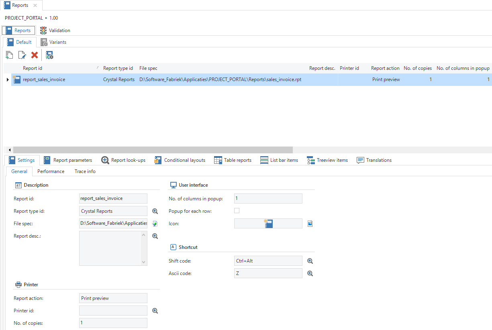
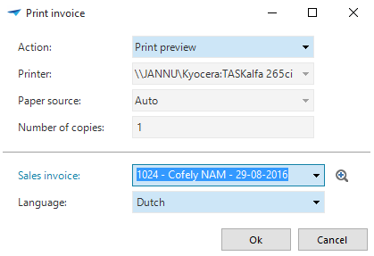
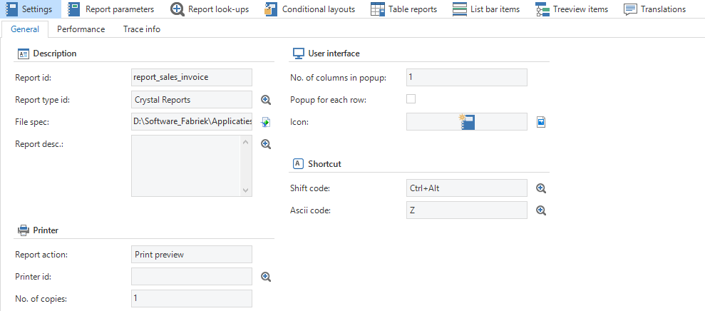
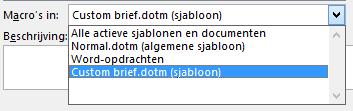
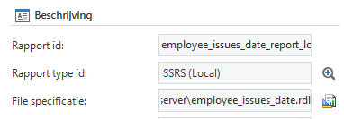
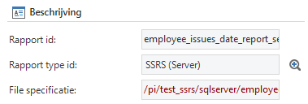
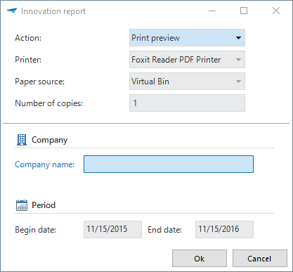
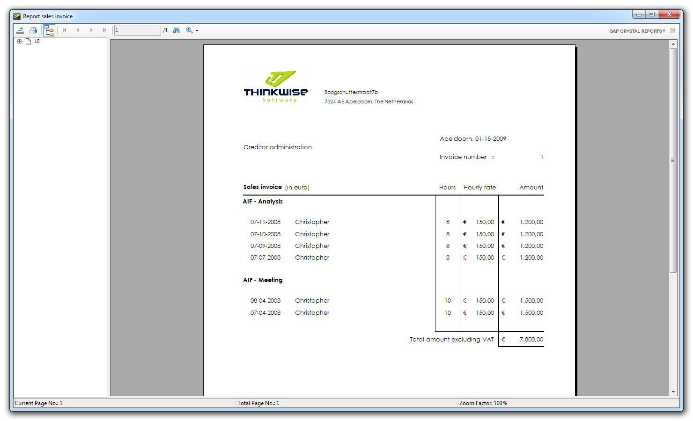

Reports have a similar structure to tasks, but instead of starting a task, a report is printed or displayed on the screen (preview). The reports themselves can be created with a reporting tool, such as DevExpress Reports, Crystal Reports, AIA ITP, SQL Server Reporting Services (SSRS) or Word.

Figure 149: 'Reports' tab in the 'User interface'

The structure of reports is analogous to that of tasks. Parameters are defined for a report and look-up functionality is provided through references.

Figure 150: Popup that appears in the end product when a report is generated

### Settings

The basic data for a report can be entered in the settings, such as the type of report that is used. The following types are supported by the Software Factory.

  - Crystal Reports

  - DevExpress Reports

  - SQL Server Reports

  - External program

  - GUI function

  - Microsoft Word

#### Crystal Reports

A report in Crystal Reports can make use of views, but SQL queries can also be specified in the report. CR reports can be developed with the Crystal Reports Designer or with Visual Studio.

#### DevExpress Reports

DevExpress Reports can display any styled and formatted text, such as RTF and HTML, from your end product. The DevExpress Report Designer is free of charge and can be downloaded from TCP.

#### External program

The same as for tasks, but with the name of the parameter in the *File specification* field. For example to link in an existing pdf as a report.

Figure 151: General settings when creating a report

#### GUI function

This options allows *custom tasks*, such as the TSFReportMailer, to be linked in as a report. The name of the custom task should be entered in the *File specification* field.

#### Microsoft Word

To generate reports in Word, a macro and a template have to be created in Word. Word does not work in web and is not always reliable because of the macros.

*Creating a template:*

  - Open Microsoft Word

  - Go to the *Mailing Lists* tab

  - Click *Select Addresses*

  - Click *Use existing list*

  - Click *New source*

  - Select *Microsoft SQL Server* and click Next

  - Enter the server name and logon credentials and click Next

  - Select the correct database

  - Select the correct table and click Next

  - Save the file anywhere on your system and click Finish

  - Set up the document with the desired merge fields

  - Click the *Start Mail Merge* button

  - Click *Normal Word Document*

*Create macro:*

  - Go to the *View* tab

  - Click *Macros*

  - Select your document under *View Macros*

  - Type the text field under *macro name* TSFReport\_+ your report\_id

  - Select the correct document to which the Macro must be linked:

Figure 152: Available options of macros in a drop down list

  - Click on the *Create* button
    
      - The Visual Basic editor will open.

  - Copy and paste the macro code as displayed on the next page to the Visual Basic editor.

  - Modify the macro with respect to the following points
    
      - strFolder
    
      - strQuery

  - Close the Visual Basic editor by pressing the X button.

  - Save the Word document to your system, choose a file type: *Word Macro-Enabled Template (.dotm)*.

  - Place the file in the designated folder on the server.

  - Create the report in the Software Factory.

Macro code:

> *Dim strODCFile As String*
> 
> *Dim strConnection As String*
> 
> *Dim strQuery As String*
> 
> *' Use your folder name...*
> 
> *strFolder = *C:\\your\_folder\\Reports\\**
> 
> *' Use your .odc name...*
> 
> *strODCFile = strFolder & *thinkwise.odc**
> 
> *' Build the connection string*
> 
> *' You may well need moe here, but I am following*
> 
> *' your ADO connection string*
> 
> *strConnection = Environ(*TSFTOWORD\_CONN*)*
> 
> *' Build the Query string*
> 
> *strQuery = *SELECT \* FROM **your\_table** where * + Environ(*TSFTOWORD\_SQL*)*
> 
> *' Open the data source*
> 
> *With ActiveDocument.MailMerge*
> 
> *'.MainDocumentType = wdNotAMergeDocument*
> 
> *.MainDocumentType = wdFormLetters*
> 
> *.OpenDataSource \_*
> 
> *Name:=strODCFile, \_*
> 
> *Connection:=strConnection, \_*
> 
> *SQLStatement:=strQuery*
> 
> *'ActiveDocument.ResetFormFields*
> 
> *End With*
> 
> *ActiveWindow.Visible = False*
> 
> *ActiveDocument.MailMerge.Execute*
> 
> *Application.Quit (False)*

#### SSRS

SSRS stands for “SQL Server Reporting Services” and is a (server-based) report generation system of Microsoft SQL Server. Reports can be drawn up with this system so that information from tables from one or more databases can be presented in an orderly fashion.

Reports are described in the Report Definition Language (RDL). This is a file format that is built up in XML. RDL reports can be created with the SQL Server Report Builder application.

There are two ways to deploy the RDL files:

  - Locally on the client computer

  - Server side on a server on which SQL Server Reporting Services is installed

Depending on the environment in which the reports are generated, these can be exported in various formats.

##### SSRS (Local)

Local reports work in the same way as other report types such as Crystal Reports. The report is generated on the basis of the RDL file that is specified for the report in the file specification field, for which use is made of the end application database connection. This means that the connection string that is specified as Datasource for any Data Sets is ignored in the RDL file.

Figure 153: Specify SSRS (local) file specification

##### SSRS (Server)

In this variant the reports are generated on a report server. The relative path to the report on the server must be specified in the file specification field. The location of the report server must be passed on to the GUI via the INI parameter “ssrsreportserver”.

The report server can run in *native mode* or *SharePoint*. Native mode is the default for this. These default models have been tested by Thinkwise, those for SharePoint not yet, in the current release. For now it is therefore expected that the report server is in native mode.

Reports that are generated on a report server use the connection string that is assigned for each Datasource to retrieve the Data Seta. Ensure that the reports that are used in a test environment have the correct connection string when this is rolled out to the live environment.

Figure 154: Specify SSRS (Server) file specification

*Report actions*

Local SSRS reports in an SF application support the following report (export) actions:

  - Print preview

  - Print (Only in the Windows GUI)

  - Pdf

  - CSV

  - Xml

  - Doc

  - Docx

  - Xls

  - Xlsx

  - Tiff

##### Installation

To use reports that are created for SSRS using the Thinkwise Software Factory with a GUI version 2017.1.11 or lower, the following software must be installed on the computer of the user for the Windows GUI or the webserver on which the ASP GUI runs:

  - Microsoft SQL Server CLR Types (SQLSysClrTypes.msi)  
    <https://www.microsoft.com/en-us/download/details.aspx?id=42295>

  - Microsoft Report Viewer 2015 Runtime  
    <https://www.microsoft.com/en-us/download/details.aspx?id=45496>

The SQLSysClrTypes installer needs to be implemented before the report viewer runtime is run. If the computer on which the work is done contains its own SQL Server instance the CLR types can be omitted.

The above is not necessary when use is made of a GUI with version 2017.1.12 or higher. With these versions the runtime for SSRS is included as default with the GUI itself.

##### Oracle and DB2

Reports made with SSRS can also retrieve data from Oracle and DB2 databases, provided that the correct software is available for this on the system on which the report is generated.

*Oracle*

For Oracle connections the Oracle Client needs to be present on the system.

**NOTE**

When using the Oracle Client together with the Microsoft SQL Server Report Builder it is necessary to have the 32 bit version of the Oracle Client installed. The 64 bit version will unfortunately not work, because the report Builder itself is a 32 bit application. Use can be made of the 64 bit Oracle Client for end applications.

*DB2 *

Connections to DB2 databases are created in SSRS via OLE DB. The ADO.NET bindings, which can be installed via the IBM Client Access, are required for this.

##### Report Builder

The Microsoft SQL Server Report Builder software to develop reports can be downloaded from this page:

  - <https://www.microsoft.com/en-us/download/details.aspx?id=42301>

|Component|Description|
|--- |--- |
|Built-in Fields|A number of pre-defined calculated fields such as the current page number or the user that has called the report.|
|Parameters|Parameters within the report that can be used when retrieving a Data Set or the calculation of an expression. Depending on the type of connection that is used, this is generated by the Report Builder or this must be added manually.|
|Images|Illustrations that can be used within the report.|
|Data sources|A Data source describes a connection to a database. A connection string can even be typed in or one can be built via a dialogue. Furthermore, for example, an inlog method can be selected to be used when setting up the connection.|
|Data Sets|A Data Set contains the resulting set of a query or stored procedure on a Data source. These can be used, for instance, to fill tables and graphs within the report. When using a stored procedure parameters are automatically added to the report for both SQL Server and Oracle and DB2 connections. For a query within the Data Set itself a parameter name with the correct prefix (“@”/”:”) can be indicated with SQL Server and Oracle connections. During the testing of the query the Report Builder will automatically add these parameters to the report. With DB2, use is made of an OLE DB connection. Therefore, the user must mark parameters in the query with a question mark. This must then be assigned to a parameter within the report on the Parameters screen of the Data Set.|

A report consists of the following basic components:

### Report parameters

Creating report parameters works the same as creating task parameters. See paragraph 0.

### Report look-ups

A report reference defines the look-up table of a particular parameter

The underlying column comparison (Report reference columns) is created automatically.

### Conditional formatting

Just as with columns, the task parameters can be given a background color or a different font. Since a task does not have a grid, this will only be applied to form parameters.

### Table reports

The report can be linked to one or more tables. The report is displayed in the context menu for these tables. Columns in the table can also be linked to parameters of the report. The value of the field of the active record is passed on to the parameter as a default value.

*Grouping of reports*

Reports within a table can be grouped together to display them logically. Both the groups and the reports within a group can be sorted sequentially. This works the same as grouping tasks.

### Quick launch toolbar items and Tree structure items

A report can be included in several menus. If a report is linked to a table, it appears in the ribbon and the context menu of this table. A report can also be included in the menu. This way the user can print the report directly without having to first open a window.

### Report parameters

Creating report parameters works the same as creating task parameters. See paragraph 0.

Another possibility when executing a report in the GUI is to display several parameters to specify the properties of the report (for instance the action, printer and export location).

Figure 155: GUI example of report parameters

Under the “Report parameters” tab under “Reports” a property can be linked to a report parameter. These report parameters can then be used in the defaults and layouts and also be placed on the right location in the correct group.

A choice can be made from the following properties within Windows:

|Property|Description|Domain|
|--- |--- |--- |
|Action|This is the default action that must be carried out for the report, e.g. print preview or export to pdf. These parameters receive as default the value as specified with the report.|Integer|
|File specification|A report can even be specified with this. So, for example, in the default, depending on the current row, another report can be opened.|String|
|Printer name|The printer name can be filled automatically here.|String|
|Paper tray name|Paper tray name can be filled automatically here.|String|
|Number of copies|The number of copies to be printed can be specified here.|Integer|
|Compress|This indicates whether the file must be compressed or not.|Boolean|
|Open after export|This indicates whether the file must be opened after export.|Boolean|
|Export location|This is the location where the file is stored when the choice is made for the action 'export to…'|String|

The web only supports the *Action* and *Compress* properties.

When a report does not have any property parameters, then all properties will be displayed as this was also the case in previous versions. When at least 1 property parameter is modeled, then only the modeled properties will be displayed. The others are hidden.

For “action”, “printer name” and “paper tray name” the control of the domain is ignored and the control will be used that belongs with the property.

TIP

Look in the end product under the default properties for filling the default value of printer and paper tray name.

### Report look-ups

A report reference defines the look-up table of a particular parameter

The underlying column comparison (Report reference columns) is created automatically.

### Conditional formatting

Just as with columns, the task parameters can be given a background color or a different font. Since a task does not have a grid, this will only be applied to form parameters.

### Table reports

The report can be linked to one or more tables. The report is displayed in the context menu for these tables. Columns in the table can also be linked to parameters of the report. The value of the field of the active record is passed on to the parameter as a default value.

*Grouping of reports*

Reports within a table can be grouped together to display them logically. Both the groups and the reports within a group can be sorted sequentially. This works the same as grouping tasks.

### Menu items

A report can be included in several menus. If a report is linked to a table, it appears in the ribbon and the context menu of this table. A report can also be included in the menu. In this way the user can print the report directly without having to first open a window.

### Printing a report

When the report is fully defined within the Software Factory, a preview can be viewed on the screen in the user interface.

Figure 156: Example of a generated report

### TSFReportMailer

Thanks to the TSFReportMailer, delivered with the Software Factory, it is possible to export reports and/or send e-mails from the Software Factory.

It is produced by creating a task that has *Function* as a type. The Object name must be entered with *TSFReportMailer*. Use can be made of the following table for creating parameters.

#### Parameters

An overview of the parameters that can be used is given on the following page.

|Parameter|Default Value|Data type|Description|
|--- |--- |--- |--- |
|report_id||string|Name of the report|
|export_file_spec||string|Export file name (for example to be filled from a default)|
|export_file_extension|pdf|string|With this parameter, the file format can be selected of the report that will be generated. The parameter value is not case sensitive. Possible values;  rtf csv xml xls xls_data xlsx_data doc word_rtf pdf|
|overwrite_old|false|boolean|Overwrites the file if it already exists and if this parameter is set to true.|
|send_mail|true|boolean|Tries to send an email if this parameter is set to true .|
|open_in_outlook|false|boolean|Tries to open the email if this parameter is set to true .|
|save_mail|false|boolean|Tries to save the email in the Drafts folder if this parameter is set to true . NOTE: If open_in_outlook is also set to true then this parameter will be ignored!|
|html|false|boolean|This parameter converts the format of the email to HTML if it is set to true.|
|priority|1|integer|This parameter indicates the urgency of the email. Possible values: 0 = low urgency, 1 = normal urgency, 2 high urgency.|
|e-mail||string|Email address to which the email must be sent. (The TSFReportMailer can be sent to multiple email addresses, which have to be separated by a semicolon.)|
|cc||string|CC email address for the email. (The TSFReportMailer can be sent to multiple email addresses, which have to be separated by a semicolon.)|
|bcc||string|BCC email address for the email. (The TSFReportMailer can be sent to multiple email addresses, which have to be separated by a semicolon.)|
|body||string|If HTML tags are used for the actual message of the email, then the html parameter must be set to true.|
|subject||string|The subject of the email.|
|use_signature|false|boolean|If this parameter is set to true, the standard signature is used that is configured in Outlook.|
|signature_text||string|Set this parameter if you want to use a different signature text.|
|signature_image||string|Set the parameter if you want to use an image in the signature of the email.|
|account||string|Set this parameter if the email should be sent from a different account than the default account that is installed on the PC.|
|delete_file|false|boolean|Set this parameter to true if the report, which is used as an attachment should be deleted after sending the email.|
|smtp_only|false|boolean|Set this parameter to true if you just want to mail with SMTP and do not want to mail with Outlook.|
|smtp_username||string|User name of the SMTP.|
|smtp_password||string|Password of the SMTP.|
|smtp_host||string|Host address of the SMTP|
|smtp_port|0|integer|The port to which the SMTP server listens. If this is not set, port 465 will be used for SSL, without SSL port 25 will be used|
|smtp_from_mail||string|Email address where the email comes from.|
|smtp_use_ssl|false|boolean|Set this parameter to true if the SMTP server expects an SSL connection.|
|extra_attachments||string|This can be used to add extra attachments to the email. If more than one file is to be added, they must be separated by means of a semicolon. For example: C:/mijn-bestand.txt;C:/mijn-andere-bestand.txt|
|smtp_from_displayname||string|With this parameter the display of the sender's name in an email can be modified. This parameter is optional.|

Table 5: Report parameters

If no values are entered, these fields are considered to be empty text fields and will be treated as such in the GUI. Initially all parameters are optional, however, some of them are linked to each other.

#### Reports

To generate a report in PDF format with the TSFReportMailer, at least the following parameters must be entered.

##### Mandatory

  - report\_id

  - export\_file\_spec

##### Optional

  - overwrite\_old

  - export\_file\_extension (default *pdf*)

#### Email via Outlook

To send an email with Outlook via the TSFReportMailer, at least the following parameters must be entered and the parameter *send\_mail* should be set to *true*, which is the default value.

##### Settings

  - send\_mail = true

##### Mandatory

  - e-mail

**Note**: this is not mandatory if the parameter *open\_in\_outlook* is set to *true*, the default value of this is *false*.

##### Optional

  - smtp\_only

  - send\_mail

  - open\_in\_outlook

  - save\_mail

  - html

  - priority

  - e-mail

  - cc

  - bcc

  - body

  - subject

  - use\_signature

  - signature\_text

  - signature\_image

  - account

  - extra\_attachments

#### Email via SMTP

The TSFReportMailer tries as much as possible to revert to SMTP as it would otherwise become too much for the server. If this requires an alternative configuration, at least the mandatory parameters should be entered, otherwise the SMTP parameters will be ignored.

##### Settings

  - send\_mail = true

  - smtp\_only = true

##### Required fields

  - smtp\_username

  - smtp\_password

  - smtp\_host

  - smtp\_from\_mail

  - e-mail

##### Optional fields

  - smtp\_port

  - smtp\_from\_displayname

  - smtp\_use\_ssl

It is also possible to specify (part of) the SMTP settings using parameters in the configuration file, so that these are the same for all users.
