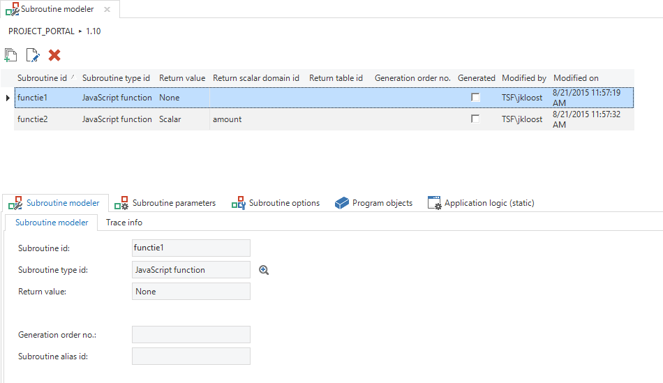

In the subroutines component, program components, which do not appear in the user interface, can be created to weave into the application. These are for instance functions, stored procedures and services.

Figure 200: Overview of the *Subroutines* tab.

The subroutines can be called both within other logic concepts and external applications.

The subroutine is similar in structure to a task. An id is first specified and subsequently a type. This type depends on the platform of the project version.

See the table below for the types for each platform.

|Type|Description|Platform|
|--- |--- |--- |
|CLR procedure|Common Language Runtime|SQL Server|
|DLL assembly|Assembly Library|SQL Server|
|Function|Function (CREATE FUNCTION)|All SQL|
|Operation|WebService operation|Java/C#|
|Procedure|Procedure (CREATE PROCEDURE)|All SQL|
|Static method|Static method|Java/C#|

Table 7: Subroutine types.

Depending on the selected subroutine the following result values can be specified:

  - None

  - Scalar: The result is a single value. If you select this, the column *Return scalar domain id* is displayed. A domain can be selected that determines the characteristics of the result value.

  - Table: The result is a table containing multiple rows. If this option is selected, then in the *Interface result columns* tab, the columns can be named that will be displayed as the result in the table. These columns also refer to a domain.

The result values are not applicable for every program object.

After the subroutine is created, the parameters that are to be used can be specified. The functionality can be woven into the program object items within the Development component.

### Parameters

The parameters that are used to call a subroutine are specified under the *Parameters* tab.

A parameter will have the characteristics of the domain that has been selected. In addition, the sequence of the parameters is indicated and whether it is an input and/or an output parameter.

### Program objects

It can be requested via the *Program Objects* tab which program object is associated with the subroutine and which program object items (templates) are linked to it. These program object items may make use of parameters.
