The theme (style) of the user interface is also defined in the model. This used to be called a layout. The theme is related to:

  - Colours

<!-- end list -->

  - Gradients

  - Fonts

  - Images

The theme is defined for the following subjects:

  - General

  - Tree structure

  - Quick launch toolbar

  - List

  - Form

  - Cube

These components will be explained further in the following paragraphs.

To apply themes that transcend a project it is possible to import  or export styles  by means of two tasks. The export task generates the XML of the theme, the import task can import this XML or read the theme from another project version in the same Software Factory.

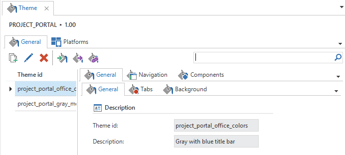

Figure 163: Overview of the *Themes' menu

The theme has been divided as such:

  - General
    
      - General (theme id)
    
      - Tabs
    
      - Background

  - Navigation
    
      - Ribbon
    
      - Quickbar
    
      - Tree
    
      - Tiles
    
      - Title bar

  - Components
    
      - Grid
    
      - Form
    
      - Cube

These sections will be explained further in the remainder of this chapter.

### General

The general theme settings, such as the background colour and the scroll bar, are defined in the *general* component.

Whenever a colour can be selected, there is always the possibility to also set up *colour 2* besides *colour 1* When colour 2 is entered, this will be interpreted as a colour gradient from colour 1 to colour 2. An extra field will now appear, in which the type of gradient can be selected.

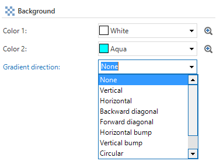

Figure 164: Setting the colour gradient

#### Theme

The name (theme id) and the description of the theme are defined here. All components, made in the theme, are stored under a theme id, so that they can be exported to other projects.

#### Document tab

When tabs are opened from the menu, they can be active (selected) or inactive (not selected). The tab colours in this instance and the colours when you move over the tab can be set here.

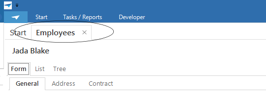

Figure 165: Tab in theme

#### Tab

Where in the document component, the tab colour can be set for colours opened from the menu, the colours for the background of the tabs within these main tabs are set here. Shown in turquoise in the figure below.

**  
**

**Tab header height**

There can be chosen from the following options:

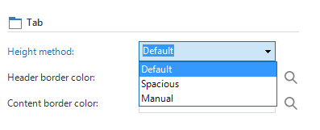

Figure 166: header method options

  - Default – The default is unchanged.

  - Spacious - Extra padding based on font size.

  - Manual - Manual padding in pixels around the header text.

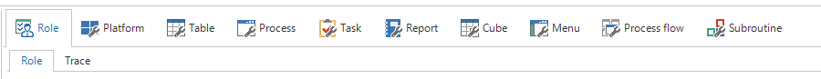

Figure 167: Tab with manual height

**Tab lines**

It's possible to set the color of tab content lines and tab header lines.

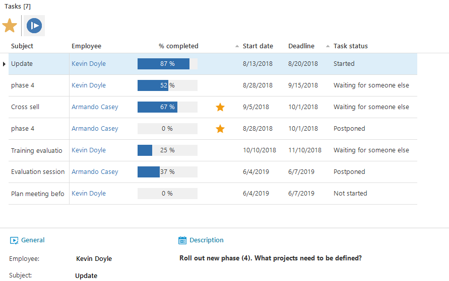

Figure 168: Tab with transparent lines

**  
**

**Disabled tabs**

Disabled tabs are styled by the GUI, by default. It*s possible to manually style these tabs in the SF.

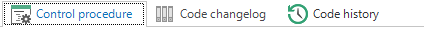

Figure 169: Disabled tab 'Code changelog'

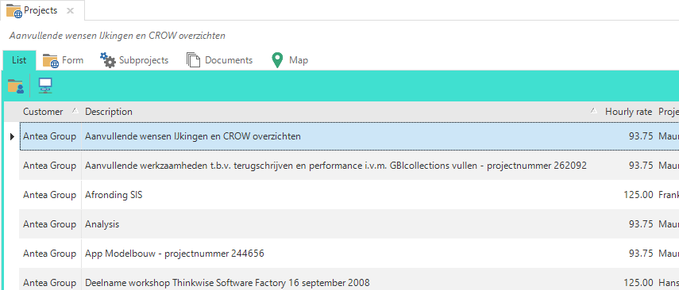

Figure 170: Tab colour settings theme

The colours for the lines surrounding the tabs can be modified here. It*s for example possible to make the tab header color a dark gray, and the content border white (same as the background color). This significantly reduces the amount of lines on the screen in nested tabs.

#### Background

The colour is set for the background of the application on the background tab. This background is displayed when no tabs are open. You can also set an image as a full screen background image by expanding it to full screen size. Be aware that this might cause some distortion of the image.

Figure 171: Add an image in the theme

#### Document

The background colours, which are displayed when a tab is opened, can be defined here. Shown in violet in the figure below.

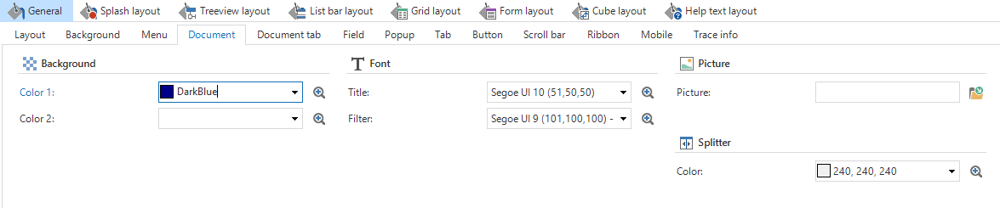

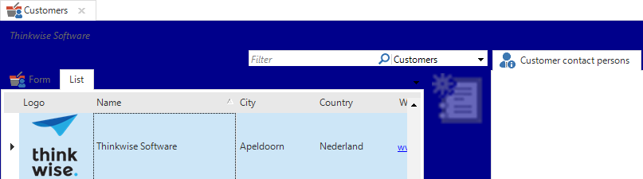

Figure 172: Document theme settings and the result

The splitter colour, which is visible for example between a grid and a form and an image can also be set here.

#### Popup

This is where the background colour of a popup field is modified.

#### Scrollbar

This is used to indicate the background colour and the colour of the scrollbar.

#### Header and footer

The colours for the top and bottom of the application can be selected for the mobile application.

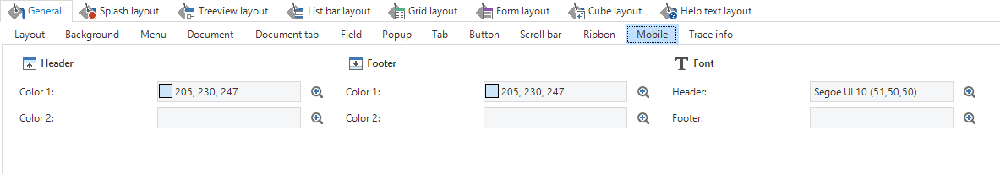

Figure 173: Setting the theme for mobile

#### Application list

This is where the colors of the applications at the bottom of the menu are styled.

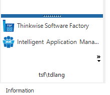

Figure 174: Application list style

#### Splash screen

Setting the colours and logo for the splash screen is something that takes place in the IAM. The reason for this is that when opening an application, this does not necessarily mean that only one application is opened. The splash screen does therefore not refer to one particular application.

However, you can specify here which components should and should not be displayed on the splash screen. The 'Button' component has not yet been implemented in the current Software Factory generation.

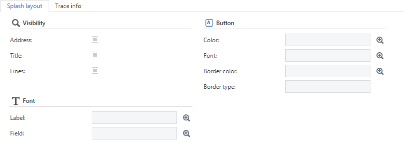

Figure 175: Setting splash theme

#### Badge

This section has been added to give the option to style the font and background colour of badges.

### Navigation

In the navigation section, it*s possible to set every style option related to navigation.

#### Ribbon

When the colours are set for the ribbon, you can choose to set a general background colour. In addition, you can set a mouseover colour for a segment or for just a button

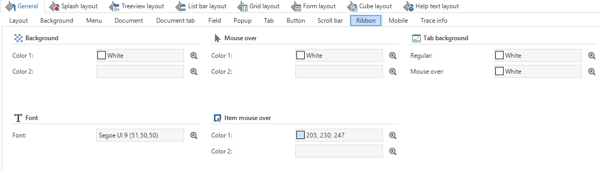

Figure 176: Theme settings for the ribbon

**Comment**

The colour that is selected for the ribbon will appear behind an icon of a task, pre-filter, etc. in the ribbon within the work area.

#### Quickbar

If the menu is displayed as a quickbar, the theme settings can be specified here. For example, a background can be set, the groups and items can be given a colour and an image can be displayed at the bottom of the menu.

#### Tree

If the menu is displayed as a tree view, the theme settings can be specified here. For example, a background can be set, the groups and items can be given a colour and an image can be displayed at the bottom of the menu.

If users can switch between these types of menus, then both menus have to be set up.

#### Tiles

The settings for the tile menu, tile groups and individual tiles can be specified here. The tiles menu can be given a background color or image. Single tiles can be given a normal, selected and mouse over style.

#### Title bar

The changes made in the menu component will affect the bar above the ribbon of the application which hold the name of the application.

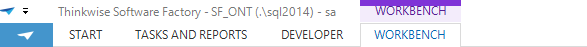

Figure 177: Bar above the ribbon of the application

### Components

In this section it*s possible to style the different components: grid, form and cube.

#### Grid

When setting up the grid, various components can be modified for a grid view. For example, the general grid theme can be set up, including the background colour.

**Tip**

If transparent is chosen in the 'line' component, the rows in the grid will be coloured alternately in the colour of the background and in a shade darker.

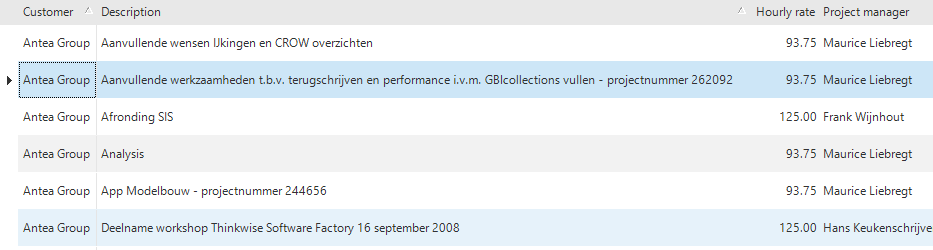

Figure 178: Grid view with alternating colours

In the following sub tabs you can specify the group colours, row colours and the focus cell colours. These can be set for the active row, the selected row and for a mouse over.

**  
**

**Grid aggregation style**

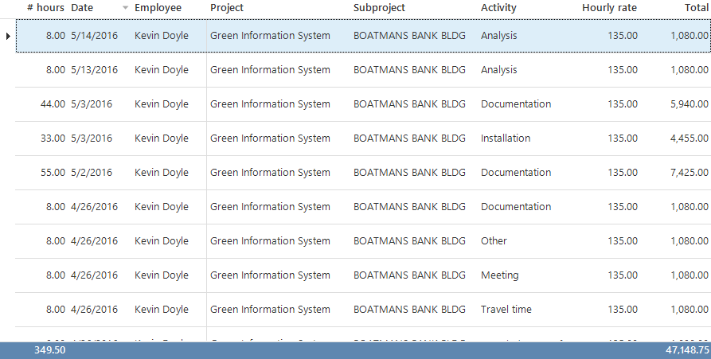It is possible to style the grid aggregation (summary), for example:

#### Form

A colour can be set for the background and the border of the form. In addition, the lines that appear under a group label can also be modified.

**Form in non-edit mode **

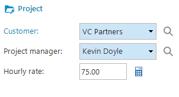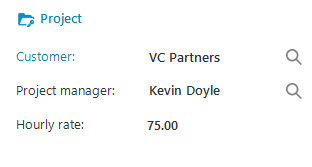Theme has been extended with new settings to style field editors in non-edit mode in a form. It is possible to set border color, background color and font.

In the field component, the settings can be changed for the colour of the mandatory, editable and read-only field. If the application is not in a modify or add mode, all fields will adopt the colour of the read-only fields.

**Show buttons on hover**

An option to only show form buttons when hovering over the form with the mouse has been added.

#### Cube

All settings for the cube can be modified in the cube theme component. This component is divided into three sub tabs. The general settings for the cube, such as the background colour and the cube colour, can be specified on the first tab. You can also define a colour for the graph here. This colour is displayed behind the graph and the surrounding border can also be modified.

The field settings can be modified on the second tab. The background can be specified here and the totals and the border can be assigned a colour.

The colours for the areas, rows, columns, fields and cells can be specified in the third tab, *area*,

As shown in previous paragraphs, there are many different options available when it comes to setting up the theme. The theme is obviously a personal matter and provides the application with the look and feel that suits the organization. Thinkwise recommends adjusting the theme in line with the colours of the company, but to keep it neutral. A theme that is too prominent distracts and will not benefit productivity. When the colours of a theme are underexposed, this can be confusing because it is then not clear where one tab ends and the other begins. A correct theme supports the application and benefits productivity.

The figures below show an example of a strong visual theme and a minimalist theme.

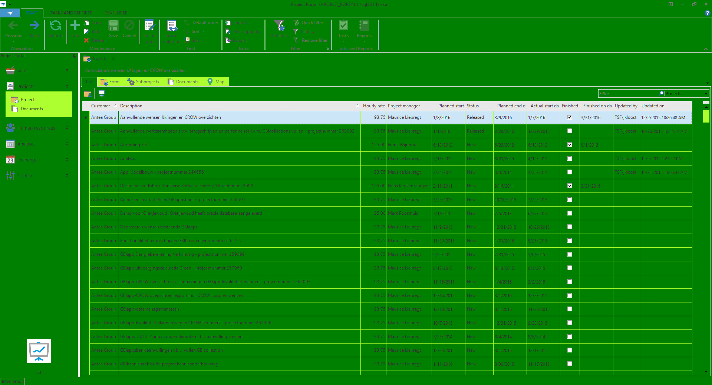

Figure 182: A theme that is out of balance.

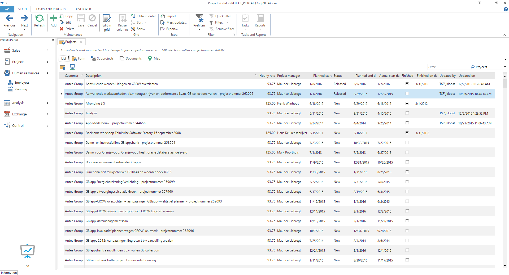

Figure 183: A minimalist theme

### Colors and Fonts used

When creating a theme, it is recommended to use a limited set of colors. In the *Colors used* tab page it is possible to see with colors are used and where they are used.

A color can be changed using the *Update color* task or by dragging the column to the preferred color.

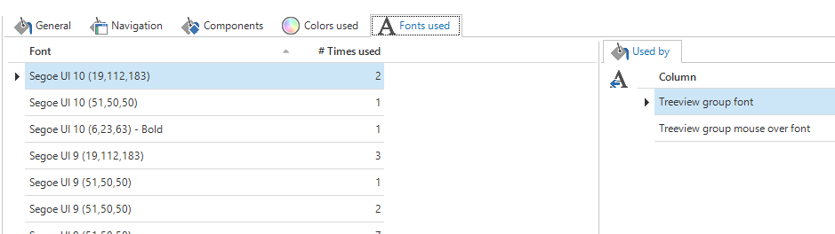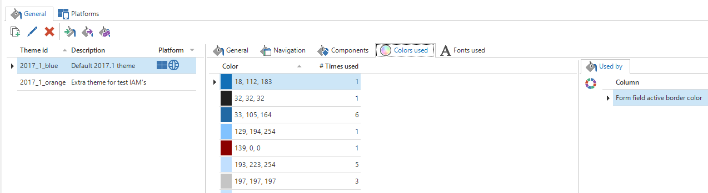

Figure 184: Colors used in Theme

The same overview is available for the fonts used.
