In the *Subjects* screen every table or view can be fully set up for the user interface. These settings are specified on various tabs that are described in the following paragraphs.

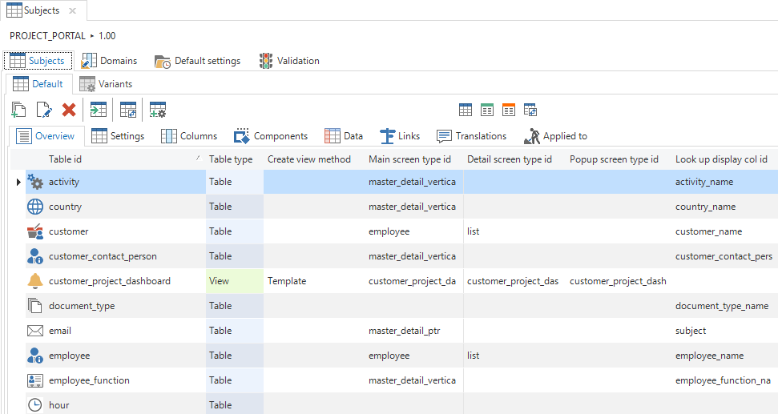

Figure 101: Overview of the *Subjects' screen

### Settings

Options that are applicable on the table itself, are specified in this tab.

#### General

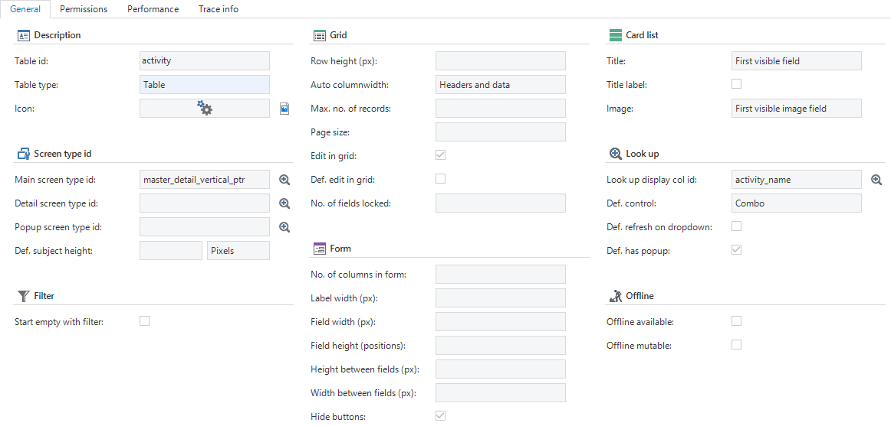

Figure 102: General settings on the 'Subjects' screen

##### Icon

Icons that are given with a table are displayed with the title of a screen in the quick launch toolbar and on the (detail) tabs. Most of the standard defaults, with the exception of .ico are supported by the GUIs. Thinkwise itself makes use of the Axialis PureFlat 2013 series for the selection of icons.

Which icon format is expected with which subject is described in the table below.

|Subject|Format|
|--- |--- |
|Quick launch toolbar and tree structure menu groups|24x24|
|Tables/Views|20x20|
|Detail page (taken over from the table)|20x20|
|Component form groups|16x16|
|Task/Report/Prefilter Context Menu and ribbon|16x16|
|Task/Report/Prefilter bar (in the work screen)|16x16/24x24/32x32/48x48 (Adjustable)|


Table 3: Overview of icon formats

##### Start empty with filter

With this option the screen is opened without retrieving the data and the filter popup is first displayed for the user or the focus, if present, is placed on the combined filter. This option is intended for large data sets such as the number of articles or relations in an ERP system. Filtering normally takes place first in these situations. By not first retrieving all the data the screen starts faster.

##### Row height

The standard row height can be specified here. If, for instance, images must be displayed in the grid it can be practical to increase the row height.

##### Auto resize columns

This indicates that the width of columns in the grid is automatically determined on the basis of data, headers or both.

##### Page size

The Windows and Web GUI have other standard settings for the retrieval of data of a subject. The Web GUI is a multi user application and uses standard pagination to relieve memory usage. The Windows GUI is only limited as standard by the maximum number of records.

The Web GUI uses pagination for the retrieval of data from the database. In contrast to the *Maximum number of records*, it is possible to access all the records in one large set since only an x number of records can be displayed in the GUI at the same time. The number of rows that is presented can be changed with the *Page size* field.

##### Maximum number of records

It can be indicated for each subject the maximum number of rows that the GUI must retrieve from the database. When a subject contains more records than the specified limit this is displayed to the user with an icon on the left at the top of the grid.

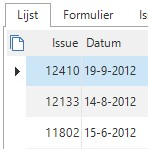

Figure 103: Screen shot of 'Maximum number of records' in an end product

Setting a maximum number of records for all subjects is possible via the parameter *MaxNoOfRecords* in the configuration file or in the Intelligent Application Manager. By entering 0 for a subject as the maximum number of records the parameter is generated for that subject.

##### Add in grid

When this box is checked it is possible to add new records in the grid.

##### Add row visibility

There are two options available. *Always* and *When adding*. When the status is *Always* the add in grid row is always visible. When the status is *When adding* this row is only visible when the GUI is in edit mode.

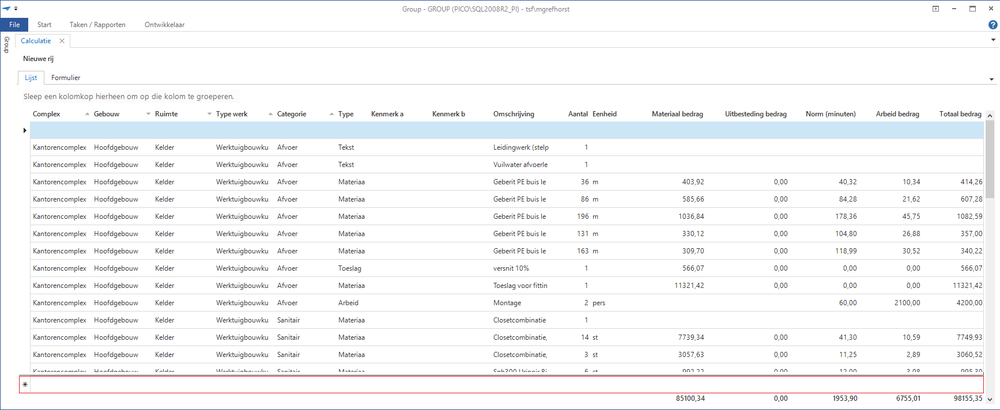

Figure 104: Add in grid

##### Grouping in Grid

To enable grouping, check the *Group* option in the *Permissions* tab page. Users can group columns using the grid column menu, the sort dialog or by dragging columns to the group box. The visibility of the group box can be modified using the *Group box visibility* grid setting.

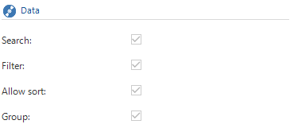

Figure 105: Allow group

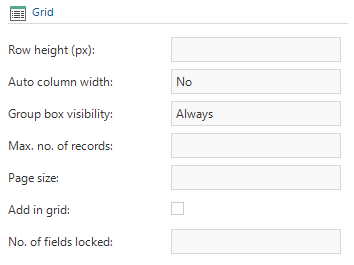

Figure 106: Group settings

The figure below shows an example of grouped columns in a grid.

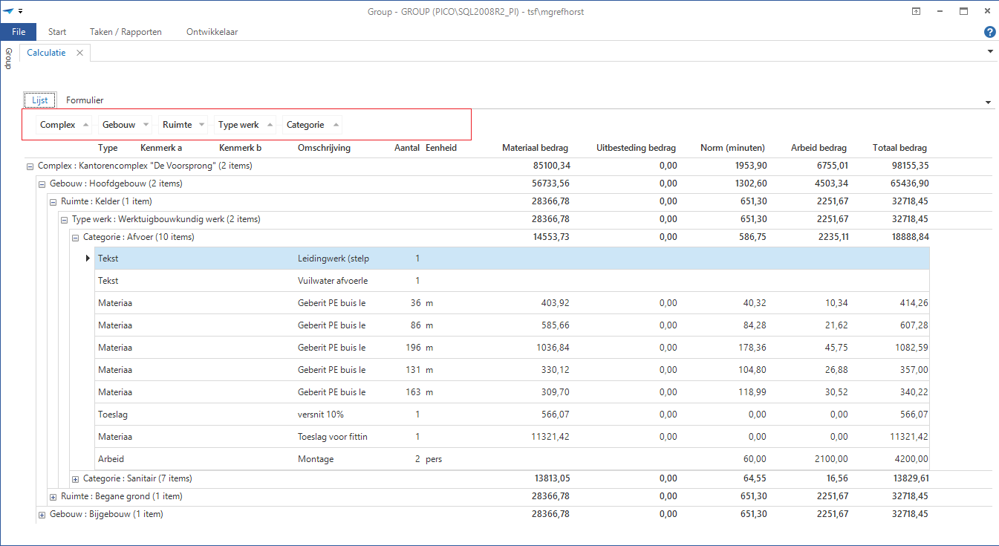

Figure 107: Group in grid

##### Number of columns fixed in a grid

When a grid contains so many columns that these cannot be displayed on the screen, a horizontal scrollbar is automatically added. It is sometimes desirable that a number of columns remain in view, such as a definition or a name. Note that the columns that are hidden in the grid also count when determining this number.

##### Number of columns in the form

The maximum number of columns to be displayed in a form can be indicated before tabs are created. When 0 is entered, then the GUI will display as many columns as possible on the screen.

##### Label width/Field width/Horizontal space

The combined width of the above fields determines the space that is reserved for form columns. An explicit value can be defined for each field with the column. If this value for the column is empty, then the value for project version is used as the default value. The value for the table is therefore **not** used as the default value for all fields and is only used for determining the width of the columns on the form.

##### Field height/Vertical space

This sets the height of fields and the vertical space between fields.

##### Hide buttons

The navigation and update buttons in the form can be hidden with this option. The actions are then only accessible in the ribbon and via shortcuts.

##### Look-up

The field that must be presented if this table is used as a lookup table can be specified for a table. This automatically applies for all target tables that refer to this source table.

> For example, a table *employee* has *name* as its look-up-presentation field, while the primary key is a number.

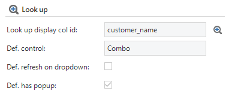

Figure 108: Screen shot from the 'Settings' tab for 'Subjects', where the Look-up can be entered

When no presentation field is given, the last reference column is displayed. When no presentation field is entered and the source column itself is also a look-up, the presentation field of this look-up is displayed (this works recursively until an explicitly set up presentation field or modified presentation field is reached). In this way a link table is automatically correctly translated.

Example

If for planning the field employee\_id has a look-up to sub\_project\_employee and the associated presentation field is empty, the translation of employee\_id with sub\_project\_employee is applied. This draws from the employee table, from which the name is chosen. You can see in planning the name from employee, but the available grid is limited to data in sub\_project\_employee.

This system is known within Thinkwise as *joining through*.

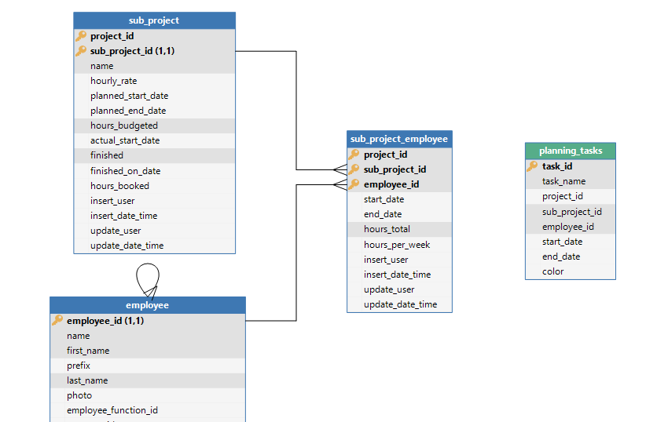

Figure 109: Example of joining through

It can be indicated how a look-up presentation field must be displayed:

- Auto complete; when typing the next record that satisfies what is being typed is displayed automatically.

- Combo box; a value from a grid can be selected.

- Suggestion (contains); this option is still being developed and is currently only available for mobile.

- Suggestion (starts with); this option is still being developed and is currently only available for mobile.

- Source (read only); the field is read only and a value cannot be entered manually.

Furthermore, it can be indicated whether the data must be refreshed when opening the combo box.

##### Working offline

When a user with Mobile goes offline, then the online functionality and data is no longer available. To prevent this the data from certain subjects can be downloaded so that this can also be accessed and modified when the connection falls away and Mobile is therefore offline.

Since downloading subjects costs performance it is important that only the necessary subjects are available offline. For this reason, when modeling, a number of things can be provided for each table.

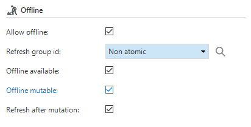

Figure 110: Offline details

###### Available offline

This indicates whether the table or one of the variants can be available offline (can only be set up at table level).

###### Refresh groups

To ensure refreshing data runs correctly use is made of refresh groups. It can be indicated for each group when this must be refreshed and whether this group is atomic. With atomic groups changes in the offline details are only carried out if the synchronization of all tables in the group is successful. When, for instance, a (connection) fault occurs during the synchronization of an order, then it makes no sense to synchronize the order lines.

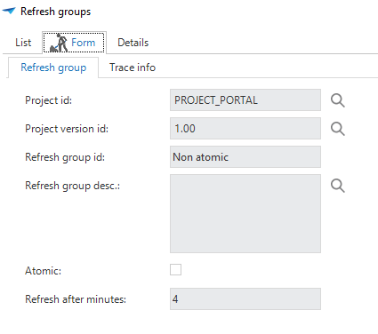

Figure 111: Offline details of refresh groups

With non-atomic groups all tables are synchronized, irrespective of whether a (connection) fault has occurred.

The effects of synchronizing offline modifications following an upgrade is described in chapter 14.4.

The refresh group can also be filled for tables that are only available online. After updating such an online table all offline tables from the same refresh group are refreshed.

###### Available offline

Available offline indicates whether the data from the table or variant is available offline (can be set up for the table as well as for the variant). Offline data is stored for each table, not for each variant. If 'Available offline' is enabled it is compulsory to select a refresh group.

###### Updatable offline 

It is indicated here whether an *available offline* table can also be updated offline; for instance, this can be disabled if the required logic (defaults, layouts) is only available online.

###### Offline refreshing after an update

This indicates whether an *offline updatable* table following an update must be immediately refreshed (including all other tables from the same refresh group)

When creating prefilters it can be indicated with the 'Filter for offline data' option whether a prefilter must be applied when retrieving the offline data. In this way a smaller set of data can be worked with offline than online. Due to performance considerations it is recommended to keep the amount of offline data as small as possible.

##### Display badges

Badges are numbers that can attract the attention of the user. Badges are displayed in the menu and on tabs.

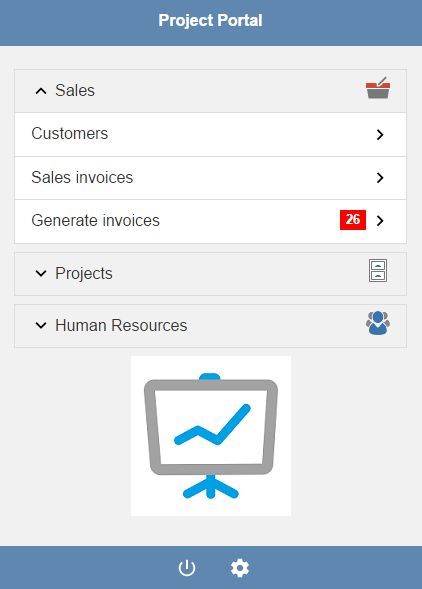

Figure 112: Example of badges

The developer can decide for himself how the number must be calculated by adding the logic for this to the Badges concept of the table or variant. An empty number or numbers below 0 are not displayed in the user interface.

Set up Badges

To use a Badge the check mark Display Badge must be checked with subjects, tasks or reports. This can be done for the default and/or for the variant. Subsequently an interval can be specified in seconds. If no value is entered then the Badge interval for the project version is used, this default is set to 300 seconds. Note that the performance can deteriorate when there are too many badges or when the badges are refreshed too often.

The Badge logic must then be developed. A new logic concept has been introduced for this, comparable with defaults and layouts (these concepts will be explained in more detail in chapter 8). A badge procedure has a variant\_id as parameter, a badge value and the foreign-key-columns of all references to the table. In this way a different badge value can be calculated for each detail and variant.

The value that is entered for badge\_value will be displayed on the badge. When the badge\_value is NULL, then the badge will not be displayed.

#### Rights

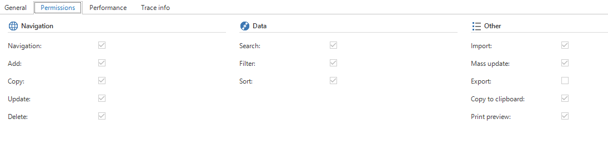

##### Figure 113: Overview of the 'Rights' tab with subject settings

##### Adding/copying/modifying/deleting is permitted

This indicates which actions the user may carry out in the screen of the table.

##### Data navigation/sorting/filtering/looking up/edit grid/importing/exporting permitted

These settings indicate which actions may be carried out.

##### Importing/exporting/updating

It is possible to import data into and export data from an end product and at the same time update several rows (with fixed values or on the basis of an import file).

Which actions are permitted on this table can be set with the *Allow import*, *Allow export* and *Allow update* check marks.

#### Performance

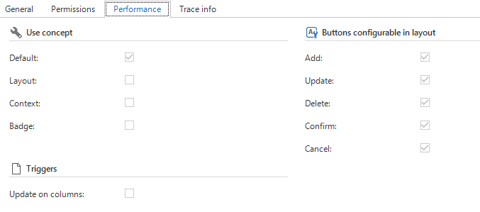

Figure 114: Overview of the Performance options with subject settings

Using the option in the *Performance* tab it can be indicated in detail which mechanisms and concepts are used for a subject. In this way it can be ensured that there are no unnecessary calls to the logic layer and the user interfaces are as efficient as possible.

##### Auto refresh

Auto-refresh activates the ability to automatic refresh the subjects and variants every x minutes. How often the refresh happens is decided by the interval timer. Be aware that refreshing can lead to performances issues. This can be done add *subject settings* and *variant settings*.

### Columns

The options that are applicable for a column are given below.

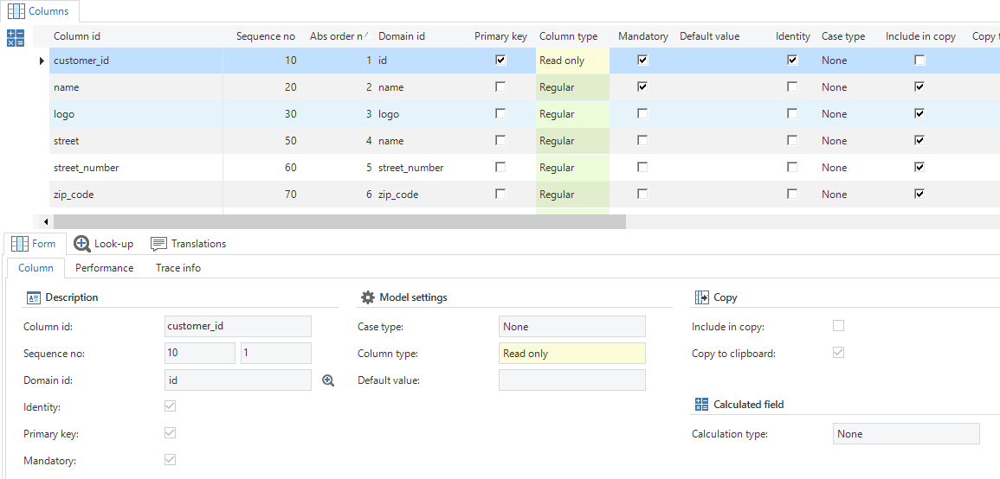

Figure 115: Overview of the 'Columns' tab on the 'Subjects' screen

Column

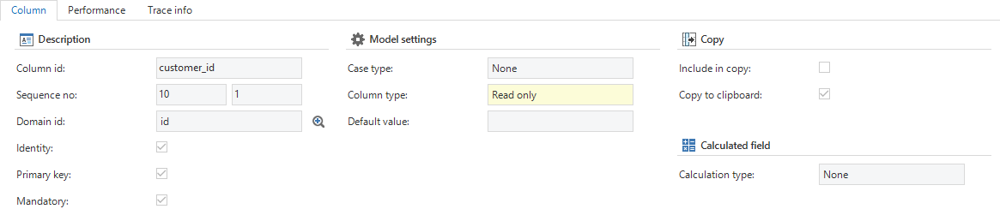

Figure 116: Overview of the standard column settings

##### Case type

This indicates, for instance, whether only capitals are permitted for the field.

##### Type of column

With this field it is determined for a column whether the field is presented as:

- > Normal

- > Read only

- Hidden

The type can be defined differently in the grid and the form. However, this can never be more freely than the definition with column.

> The field *added\_by* is set to read only. It is possible to hide this in the grid. It is however not possible to make this normal in the form.

##### Use when copying

A record can be easily copied with (Ctrl+Alt+Plus), only this is sometimes not desired for all fields. For example with identity fields, status fields and trace columns. It can be indicated with this option which fields are transferred when copying a row.

##### Copying to the clipboard

When copying rows from the grid with Ctrl+C only columns are copied for which this option is turned on. Also, as standard, when exporting data only the columns for which this option is turned on will be exported.

Performance

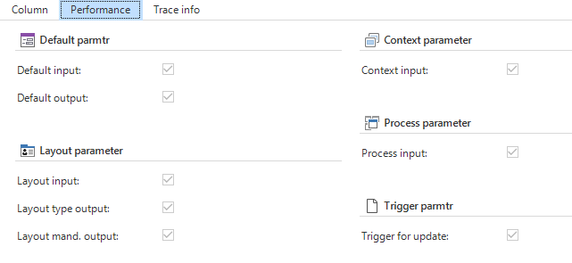

Figure 117: Performance settings with 'Columns'

When a choice is made to use certain logic mechanisms in Settings, then all columns are automatically given as a parameter. With the performance tab it is possible to exclude certain columns if they are not required for the mechanisms.

> In each default the *Modified by* field is filled with the current user. However, for some tables the default is completely empty. The default cannot be turned off, because *Modified by* is then no longer filled, but the unused fields can be turned off. Less data will be transmitted during the execution, so that the performance will increase.

#### Look-up 

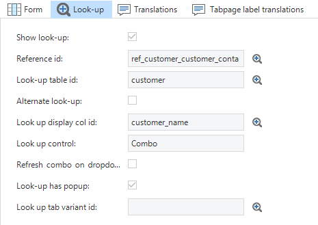

Figure 118: Overview of the 'Look-up' settings for the 'Tables'

It can be indicated for each field whether a look-up must be displayed and which reference is used for this. It is indicated, as default with the look-up table, how this must be presented. It is however possible to deviate from this for each column (reference). Furthermore, it can be indicated for each field whether the look-up presentation field must be displayed with a combo box, a popup window or both. When the look-up table is displayed with a popup window, this can be the standard, but a variant can also be displayed.

**Tip**

When display look-up is checked, but there is no reference id filled, than two (or more) references are created, both of which want to fill the field. Select the correct table/reference for yourself.

### Components

The settings for the grid, form and card list can be changed in the components section.

#### Grid

Below you will find the options to configure the grid of a table.

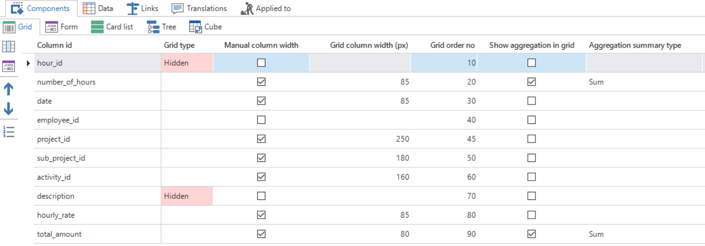

Figure 119: Overview of a 'Grid' within 'Components' for a selected table

##### Sequence of fields

The sequence of the fields may differ from the physical definition. For each grid a different sequence can be defined by placing them in sequence by means of the tasks on the side of the screen. If the sequence must be the same as the table or the form view, this can also be set with the task at the side of the screen.

##### Grid column type

This option determines whether a column in the grid is normal, read-only or hidden. Normal only applies if the user switches the grid to *edit mode* (in other words if he selects the option *Edit in grid*). grid

In addition, this option can never be set more freely than the definition in the column itself. For an example, see column type in columns.

##### Grid column width

In principle, the column width is automatically determined by the Thinkwise list component. However, this width can also be adjusted manually by checking the *manual column width* box and specifying the width in pixels.

##### Aggregation 

With the option *Display aggregation* and *Aggregation type* the totals in the grid can be displayed, such as the number of rows, minimum and maximum values and the sum or average of a column. These will be displayed in the end product under the corresponding list.

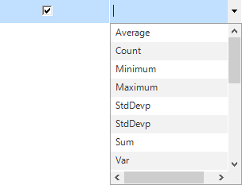

Figure 120: Drop down list with the aggregation options

#### Form

Below you will find the options for configuring the form for a table. These options are also available when looking at the FromList, except the ones about the tab pages.

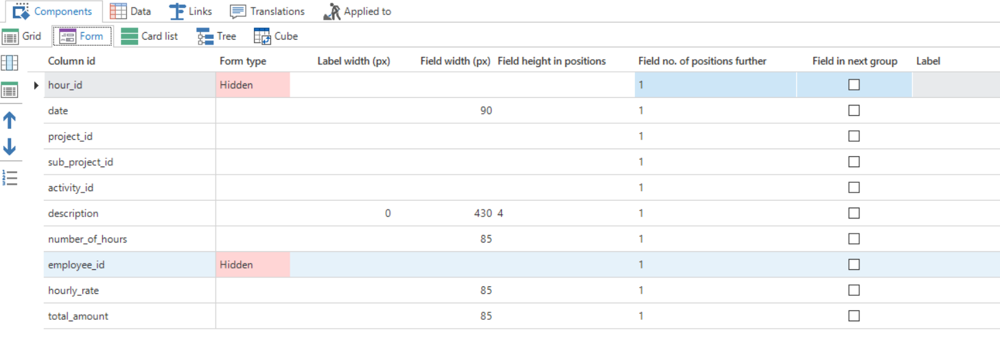

Figure 121: Overview of a 'Form' within 'Components' for a selected table

##### Sequence of fields

Just as in the grid view, the sequence of the fields can be entered by means of the tasks at the side of the screen.

##### Form field type

This option determines whether a field in the form is normal, read-only or hidden. This option can never be set more freely than the definition in the column itself. For an example, see type of column in columns.

##### Field number of positions further

It is possible to place more than one field on a single line or to create blank spaces. This is done by entering the value *0* for *Field number of positions further*. This field and its label will now be on the same line as the previous field.

To remove the corresponding label, the value *0* must also be entered for *Label width*.

##### Field in next group

Fields that logically belong together can be grouped on the form. In that case, the box for *field in next group* must be checked in the first field of the new group. This group can subsequently be given a label and icon. This label can then be translated into several languages in translations.

##### Field in next column

Forced insertion of field and groups in a next column can also be done in the Software Factory. This is done by check marking *field in next column* for the first field to be displayed in the next column. All the following fields will be displayed in the next column (including any groups).

##### Fields on next tab

Fields (with groups) can also be placed on a next tab. For this the check mark for *field on next tab* must be checked. The label that is used here, will be the heading of the tab page. If the data does not fit on one tab, renumbering will be applied from the new tab with the new label.

> In the screen shot below, the table is translated with Project version. Subsequently halfway a column is placed on the next tab with the name Default settings.
> 
> 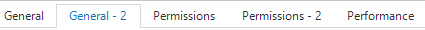

Figure 122: Example of tab bar with multiple tabs

#### Card list

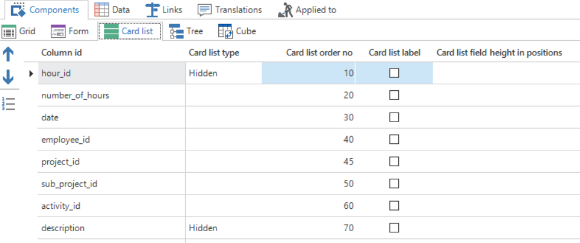

Figure 123: Overview of a 'Card list' within 'Components' for a selected table

Mainly, but not only for Mobile, the screen type for column display is called *card list*. On the left, card list has room for data such as a photograph (see image) with three lines for extra information. This allows for more text to be displayed on a smaller area.

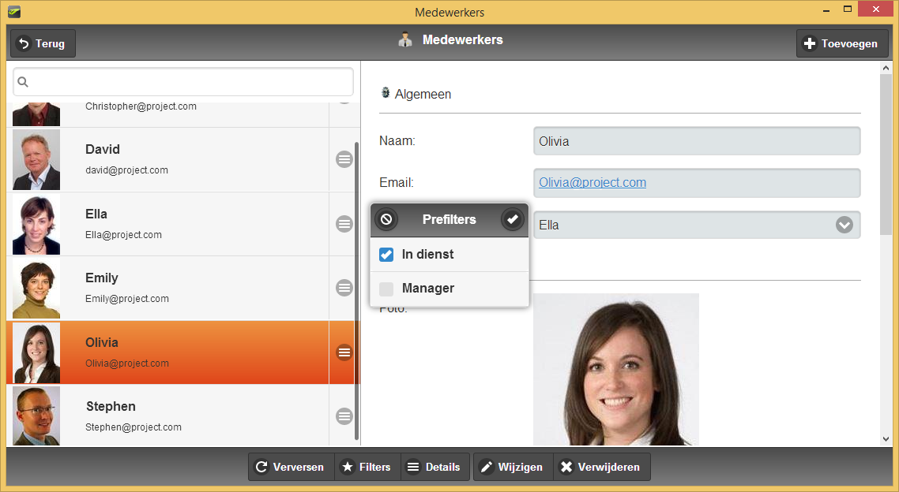

Figure 124: Example of a card list screen type

#### Trees

A tree view can be created, just by using a screen type which contains a 'TreeView' component and alter some settings for the subject.

##### Tree properties

Just like setting some properties for the grid or form the tree is available for some modifications. The tree display column is the text presentation for the tree. When leaving blank, the look-up display column will be shown and the icon column will present the icon in front of the display column. There are two types to choose for the tree type, hierarchical and column, these will be explained later. A new feature is the default expanded property, the tree will automatically expand to the provided level of nodes.

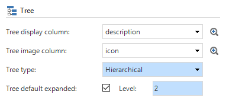

Figure 125: Tree properties

##### Hierarchical

To create a hierarchical tree, it was previously necessary to create a self-reference which included all primary key values. The self-reference is not necessary anymore and the only thing to do now is specifying the parent column as seen in the next figure.


Figure 126: Hierarchical tree on manager\_id

##### Column grouping

If a tree is needed based on column grouping, the sorting was used to group the data on the sorted columns to create a tree. In the new version, it is possible to model on which sorted columns the tree has to group, this is done in the sorting modeler. A checkbox 'Group until' can be checked on a sorted column and all underlying sorted columns including the checked one will be grouped.

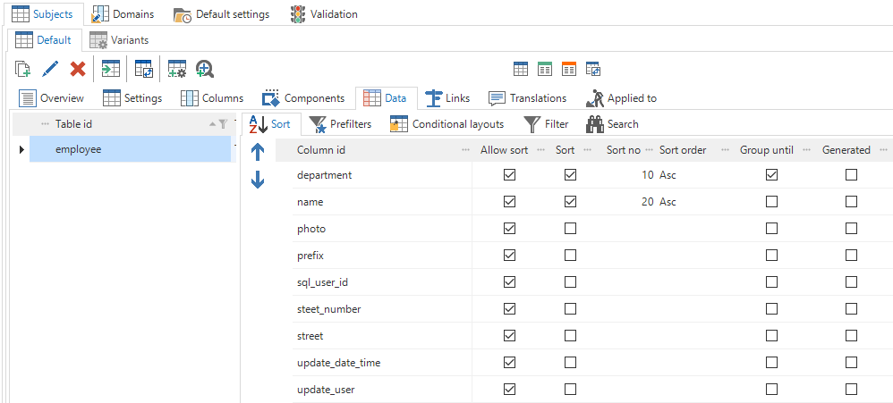

Figure 127: Group data in a tree

There are also some changes to the user interface with regard to trees. These can be found in the chapter “Graphical User Interface (GUI)”

#### Cubes

This indicates whether a table or view is a cube and which options this offers. Creating a cube is explained in chapter 7.8.

### Data

In the data component it can be determined what must happen with searching, filtering, sorting, prefilters and conditional formatting.

#### Search and Filter

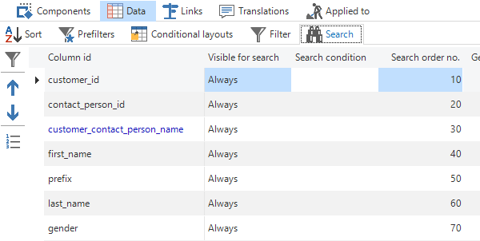

Figure 128: Setting search values for a table in 'Data'

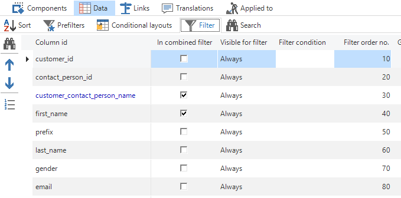

Figure 129: Setting filter values for a table in 'Data'

For filter and search the options are *Always*, *Advanced* or *Never*. The *Advanced* option affects the expansion of the search/filter screens.

The search and filter functionality can be optimized by just setting frequently used search terms to *Always* and the other fields to *Advanced*.

The following five steps must be followed to optimize these functions.

1.  Gives frequently used terms the visibility *Always*

2.  Gives never-used terms the visibility *Never*

3.  Gives the remaining terms the visibility *Advanced*

4.  Drag the columns to get the desired sequence

5.  If necessary, select a different search or filter condition

#### Sort

A default sort can be specified for each table. You can sort on one or more columns. You can indicate for each column if it should be sorted in ascending or descending order.

Additionally, you can specify on which columns sorting may and may not be allowed. For example, because it concerns a large text column for which no index is defined.

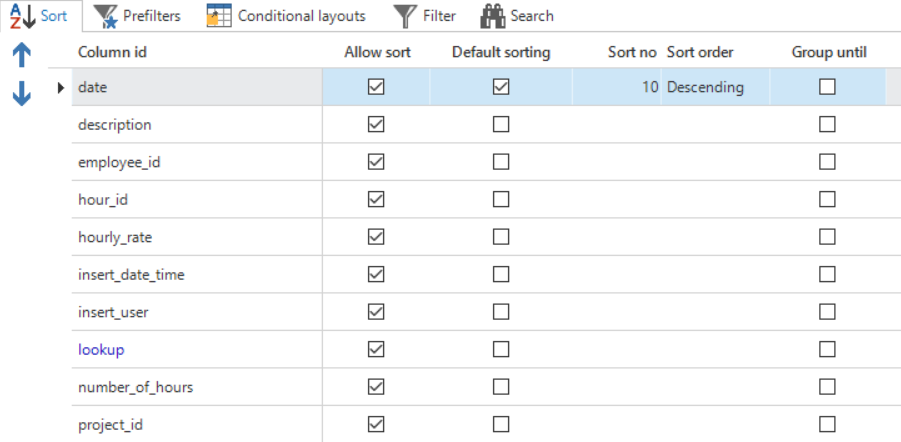

Figure 130: Setting sort values for a table in 'Data'

#### Prefilters

Prefilters are predefined filters that a user can select. Prefilters have their own name and appear in the ribbon, the context menu and possibly a prefilter bar.

Prefilters are linked to a table. Prefilters can be defined in two ways.

- To attach conditions to columns

- With the help of a query (where clause)

When creating a prefilter some standard things can be defined:

##### Prefilter group

Prefilters within a table can be grouped together to display them logically. Both the groups and the prefilters within a group can be put in a sequence. When prefilters are grouped, they can be displayed in two ways in the context menu:

- > Via a sub-menu in the context menu.

- Through the use of separators in the context menu.

Only separators are used in the ribbon, also for the sub-menus.

It is possible to indicate for each group which icon this group should be given and whether the prefilters in this group are mutually exclusive.

> A user cannot simultaneously filter on *Available* and *Not available*. If *Available* and *Not available* were both a status of one record, the user would never see any data when both prefilters would be switched on.

##### Default prefilter

It is possible to specify for the following components, by means of a combo, what the default of the prefilter should be (hidden, off, on, on & locked, on & hidden). The last two are actually a way to add authorization.

##### Shortcut

Each prefilter can be linked with a shortcut by specifying the Shift code and ASCII code. When a user presses the shortcut, the prefilter will be switched on or off respectively.

**Note**

Make sure that no shortcuts are used that are already in use, such as Ctrl C.

##### Icon and sequence number

An icon may be linked to the prefilter in order to present the prefilter more intuitively to the user. The sequence number determines the sequence if the table has several prefilters.

##### Query or prefilter columns

Subsequently there is the choice of whether the prefilter should work based on a query or whether conditions have been specified based on columns. When opting for a query this needs to be entered into the corresponding field

The query is placed in the where-clause by the GUI. The current table can be accessed using the alias 't1'.

> ```sql
> t1.order_date < getdate()
> ````

When conditions have to be assigned to columns, this is done on the *prefilter columns* tab. The developer indicates on this tab which column ID is added to the prefilter and which condition and value the prefilter should have. This concerns the database value and not the translation.

Of course, multiple columns can be specified for each prefilter in order to make the prefilter work in more detail.

**Tip**

If the application is started in developer mode, the result query can be viewed in the debug screen.


Figure 131: Setting a new prefilter with a query

#### Conditional formatting

In the grid and the form, the format of a cell or a row may be affected by specified conditions. Conditional formatting refers to the font and the colour of the font and background.

Under conditional formatting it is indicated how the cell or row will look if all conditions are met. You can choose to modify the background colour and/or the font. The definitions then still need to be configured.

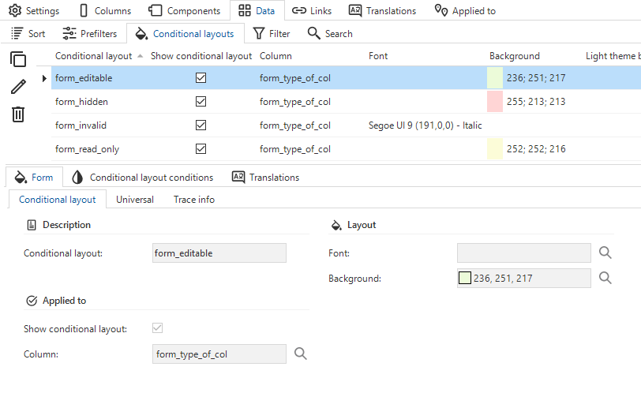

Figure 132: Set conditional formatting for a table in 'Data'

**Tip**

Expression fields can be used to model conditional formatting based on queries, for example by checking whether a date has expired.

### Links

#### Table Look-ups 

You can indicate for each reference whether it may or may not be used as a look-up. This can be different for each column. In addition, in the case of a specific look-up, the table settings, such as the look-up type, the column view, etc. can be overwritten.

Recursive look-up presentation resolving is done automatically by the GUI. When the last reference field in the look-up table itself has a look-up and the previous reference field is left blank, the presentation field of this field is used (recursive).

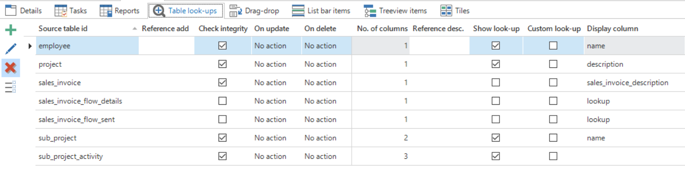

Figure 133: Overview of 'Table Look-ups' in 'Links'

#### Details

Detail tabs for references can be turned on and off with the following screen. The subjects are included as detail tabs by means of a check mark. Also, the detail tabs can be put in sequence by using the tasks on the side.

Furthermore, you can specify the tab control id. You have the choice from the tab controls that were specified in screen type.

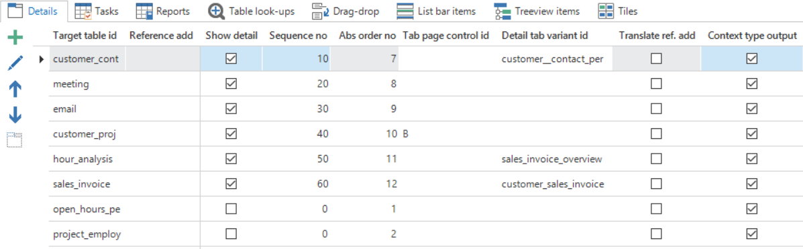

Figure 134: Overview of 'Details' in a table

#### Tasks

This is where the tasks are linked to a table. How to create tasks is described in paragraph 0.


Figure 135: Overview of the links for a task

#### Reports

This is where the reports are linked to a table. How to create reports is described in paragraph 7.7.

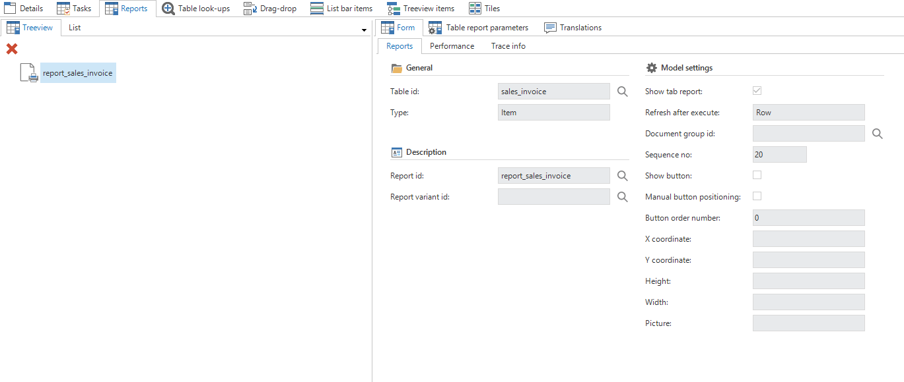

Figure 136: Overview of report links for a table

#### Drag drop

Drag-drop functionality can be modeled for products. This way, you can allow users to drag records from a grid or tree. The target can be another subject or the same subject.

 

Drag-drop links can be modeled in the Software Factory at subject configuration. A drag-drop link requires a from-table, a to-table and a task on the to-table.

The task will use the mapped parameters from the to-table, based on the tab-task mapping. The developer can map columns from the from-table, the dragged rows, to parameters of this task. When multiple rows are dragged, the task will be executed multiple times. Settings regarding to pop-up per row at the task will be applied.

Task parameters that are mapped by both the to-table (using the tab-task mapping) and the from-table will be checked for equality. If the values are not equal, drag-drop will be prevented by the GUI.

By default, the drag-drop link is <span class="underline">not active</span>. The developer must decide on which combination of from-variants and to-variants the drag-drop should be available. This is specified at drag-drop interaction.

The user interface normally selects multiple rows in a grid or tree when dragging over the component. To change this behavior, a context-menu option is available to enable drag-drop. Drag- drop can be enabled by default in the model at the from-table or from-variant.

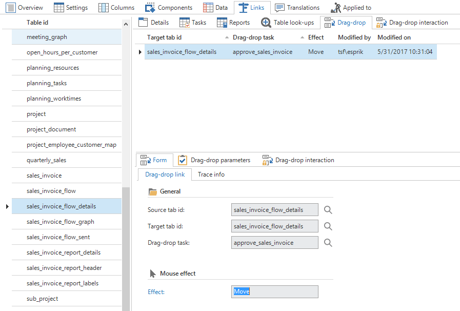

Figure 137: Drag & Drop

The GUI will allow rows to be dropped on any component of the target subject. However, when the user hovers over a multirow-component of the target subject during drag-drop, the GUI will apply one of the following behaviors:

- When the drag-drop task has variable input, depending on the selected row of the target subject, the GUI will navigate to the hovered row.

- When drag-drop task only has one unique set of input, and the selected row will not change the input of the drag-drop task, the GUI will treat the grid or tree like any other component and will not navigate to the hovered row.

> A task is bound on *Sales invoice line* and has the *sales\_invoice\_id* mapped as input. This task is used as a drag-drop target task. The subject *Sales invoice line* is shown as a detail of *Sales invoice*. Since the active row in this detail will not affect the input of the task, hovering different rows during drag-drop will not cause navigation.

Context procedures are executed during the hovered navigation, after a short delay. During this time, the cursor might display a question mark.

#### Menu items

This is a display of the links between tables and menu items. This displays which menu items are linked to a table. It is possible to modify this.


Figure 138: Display of the menu item links for each table

### Variants

It is possible to display the same table in different ways in the Software Factory by adding a variant. This offers for example the possibility to set up different prefilters for a specific menu item without having to create a view.

> Along with a menu item called *Orders* in which all active orders are displayed with a grid and form, a menu item can be added based on the variant *Historical orders*. This contains only a grid with other enabled prefilters. A task-based screen can be set up quickly in this way without having to first create a view.

It is also possible to optimize a variant for a specific platform, for example, by displaying fewer columns in the Mobile GUI than in the Windows GUI.

All GUI settings may be overwritten in a variant. Consider screen types, sorting, list views and form views. When a variant is created, it will, as a standard, use all the default data. Settings will only become visible when modified manually. When the settings are modified in the default, the variant also changes with the default, provided this variant has not been modified manually.

There are two options for modification:

- > At set level
    
      - > Applies to Grid, Form, Details, Sorting, Filtering and Searching.
    
      - > As default, these options are hidden and the default is followed. Only when they are turned on with a task, will they be applicable as a set. A *snapshot* is taken, as it were. The entire set remains as it is, even if the default changes.
    
    <!-- end list -->
    
      - > New fields will be applied automatically as little as possible in the default. For example, a new field will be automatically hidden in the form if there is a form snapshot. The same applies for a detail if there is a detail snapshot.

<!-- end list -->

1.  At field level

<!-- end list -->

- Applies to all other settings, such as screen type.

- If a setting is modified, this setting remains valid, even if the default changes. However, non-modified settings will change.

> The variant 'Outstanding orders' has been set so that only order number, customer and date are in the grid. If the field "total quantity" is added to the order table, it will not be added to the outstanding order variant.
>
> The new prefilter *large customers* will, however, be added to the variant because no snapshots are made of prefilters.

The rights for variants are always equal to or more limited than in the standard. A hidden field cannot be made visible again, but a regular field can however be hidden. This applies to add/modify/delete, whether field are mandatory and visible, and locked prefilters. Modifications to the default (for instance: 'add' is switched off) are also applied in all the variants.

Variants can be applied to menu items, details, look-ups, table tasks, table reports and in process flows.

The applicable variant will be used in the process flows. When for instance the action *Go to tab* is used, the variant that belongs to this tab is used. However, there are a few exceptions where an extra variant can be specified:

- In the process action types: *Open Document*, *Execute Task* and *Run Report* you must indicate which screen should be opened or on which screen a task or report should be performed. You can specify which variant should be used.

- For actions to start process flows you can specify for which variants the start action applies. For example, should the process flow *Enter order* also start when opening the *Orders* table, with the *Historical orders* variant?

### Domains

The domains that are configured in the data model can be enriched under the *Domains* tab. A domain describes the data type of all the columns that are linked to the domain; these cannot be modified in this component; only the options that have an effect on the user interface can be modified here.

In domains, under the *Applied to* tab, you can see in which columns and parameters a domain is used.

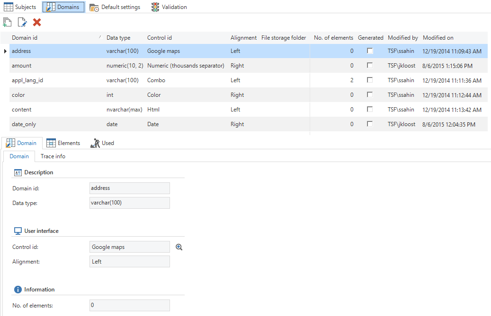

Figure 139: The 'Domains' tab in 'User interface'

#### Control

Using a control you can specify how a column should be displayed in the user interface. The following options are available for this: (See next page)
|Control|Description|Platform|SQL|ORACLE|DB2|
|--- |--- |--- |--- |--- |--- |
|CALCULATOR|Displays a calculator for carrying out a calculation.|Windows/Web|INT, NUMERIC|INT, NUMERIC|INT, NUMERIC|
|CHECK BOX|Gives the possibility to check a *check mark*. The value can be *on*, *off* or *unknown*.|All|BIT, TINYINT, SMALLINT|SMALLINT|SMALLINT|
|CODE EDITOR|Internal use.|Windows/Web||||
|COLOR|Selecting a colour:|Windows/Web|INT|INT|INT|
|COMBO|Selecting a value from a list.|All|Depending on elements|Depending on elements|Depending on elements|
|CURRENCY|For compatibility, use NUMERIC.|All|NUMERIC|NUMERIC|NUMERIC|
|DATE|Displays a calendar in which a date can be entered.|All|DATE, DATETIME|DATE, TIMESTAMP|DATE, TIMESTAMP|
|DATETIME|Displays a calendar for selecting the date and a time format in hours, minutes and seconds.|All|DATETIME|TIMESTAMP|TIMESTAMP|
|EMAIL|Opening an e-mail program with e-mail address as *send to*.|All|VARCHAR|VARCHAR2|VARCHAR|
|FILE|When entering or modifying a file location can be selected.|All|VARCHAR|VARCHAR2|VARCHAR|
|FILE_UPLOAD[11]|Uploading and downloading a file.
The default value of the column is the standard file location for the Windows GUI. The File storage folder is used for the Web GUI if files are uploaded.|All|VARCHAR|VARCHAR2|VARCHAR|
|FOLDER|Selecting and opening a folder.|Windows/Web|VARCHAR|VARCHAR2|VARCHAR|
|FONT|Selecting a font.|Windows/Web|VARCHAR|VARCHAR2|VARCHAR|
|GOOGLE_MAPS|Opening Google maps based on a location.|Windows/Web|VARCHAR|VARCHAR2|VARCHAR|
|HTML|Text is displayed as HTML.|Windows/Web|NVARCHAR|NVARCHAR2/NCLOB|VARGRAPHIC/DBCLOB|
|IMAGE_COMBO|Selecting an image from a list.|Windows/Web|Depending on elements|Depending on elements|Depending on elements|
|IMAGE_LINK|Selecting and displaying a photo.|All|VARCHAR|VARCHAR2|VARCHAR|
|IMAGE_UPLOAD|Uploading a photo.|All|VARCHAR|VARCHAR2|VARCHAR|
|MULTILINE|Editing a text with several lines, possibly via a separate popup screen.|All|VARCHAR|VARCHAR2|VARCHAR|
|NUMERIC|Display numbers with a comma for thousands.|All|NUMERIC|NUMERIC|NUMERIC|
|PASSWORD|The text is replaced by an asterisk.|All|VARCHAR|VARCHAR2|VARCHAR|
|PERCENTAGE|Displays numbers as a percentage.|All|INT|INT|INT|
|RADIO HORIZONTAL|Displays a horizontal list with various options.|All|TINYINT|SMALLINT|SMALLINT|
|RADIO VERTICAL|Displays a vertical list with various options.|All|TINYINT|SMALLINT|SMALLINT|
|RTF|Text is displayed as RTF.|All|NVARCHAR_MAX|NVARCHAR2|VARCHAR|
|SIGNATURE|Field to enter a signature.|Mobile|VARCHAR|VARCHAR|VARCHAR|
|SQLEDITOR|Internal use.|Windows/Web||||
|TIME|Time format in hours, minutes and seconds. The time can possibly be selected with an up and down button.|All|TIME|TIMESTAMP|TIME|
|GROUP HEADER LABEL|Creates a header label from your own data|All|VARCHAR|VARCHAR2|VARCHAR|
|GROUP HEADER ICON|Create an icon in front of the group header label|All|VARCHAR|VARCHAR2|VARCHAR|
|LABEL|Creates an label without a field|All|VARCHAR|VARCHAR2|VARCHAR|
|URL|Opening URL in the active browser.|All|VARCHAR|VARCHAR|VARCHAR|

Table 4: Overview of the possible domain controls.

Control elements have to be defined when a choice is made for the *COMBO*. The user can choose from these elements for a column with this domain. The element id is the description and is used in the translation module to translate the elements. The database value is the value that is stored in the database (often numerically, but this is not mandatory).

> The domain *gender* has the elements *man* and *woman*. Instead of displaying this as text in a combo box, an icon of a man and woman can now be displayed in the combo box.

If you select the 'IMAGE\_COMBO' control, an image must be added to the elements. This replaces the text.

**Note**

If the password control is used, the field has not yet been encrypted. The value will therefore still be visible in the database when it is stored and can also be passed on to the defaults and layouts.

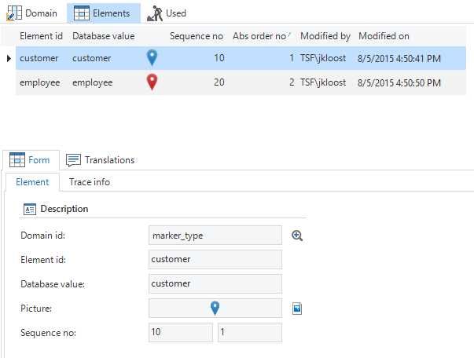

Figure 140: An example of using images in domain elements

### Default settings

In the default settings component, the settings are as they were specified for the tables when they were created, but not yet modified for each table individually. These defaults can be modified here.

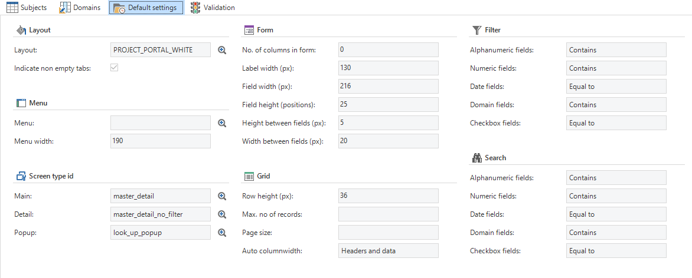

Figure 141: 'Default settings' for the tables tab
