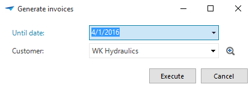
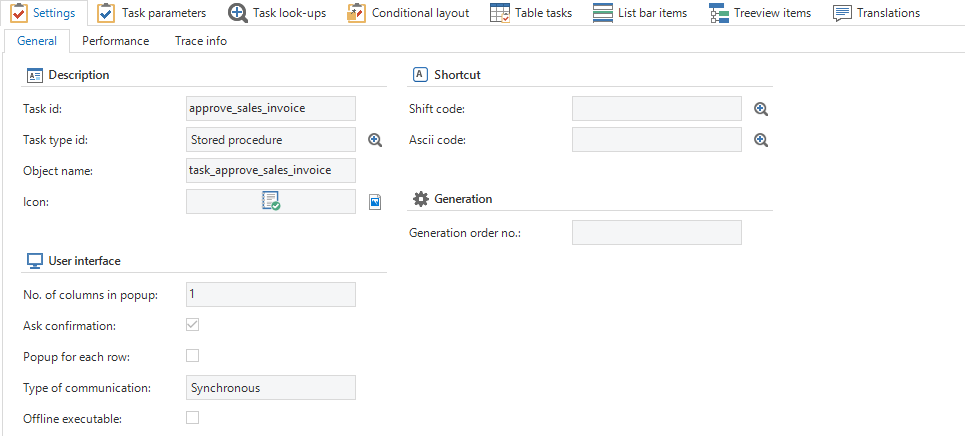
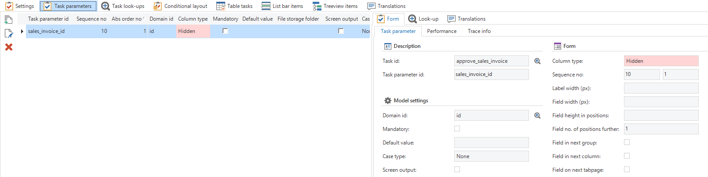
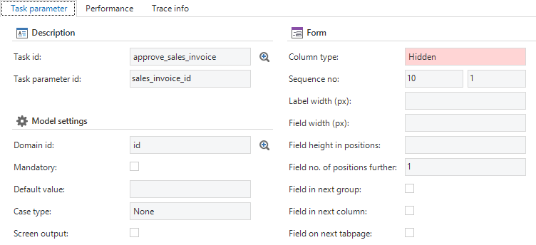
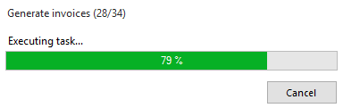
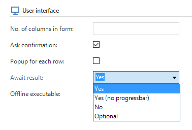
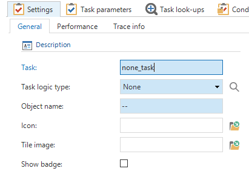

A task is a procedure (possibly with a number of parameters) that can be started up by the user. A task can be linked to one or more tables, and will be displayed in the ribbon, the context menu and possibly in the task bar. Columns of the table can be linked to the parameters of the task. The values of the linked columns of the active record are then passed on to the relevant parameters.

Figure 142: A task popup that may be visible in the final product if the task is executed.

In addition, a reference can be established from a parameter to a look-up table. In this way a parameter gets a dropdown list and a button in order to be able to select another value in the popup.

A task has a default and a layout mechanism, just as a table or a view. A shortcut combination can also be defined with which the task can be started.

If a confirmation must be requested when executing a task, the *Request confirmation* option can be checked.

**Tip**

The translation of the confirmation can be modified by creating a translation object with id *gui\_confirmexecutetask\_* + task\_id

### Settings

When creating a new task you have to select the type of task to be created. The following types are supported in the Software Factory.

- External program

- GUI function

- Stored procedure

#### External program

Tasks can be used to call an external program or to open a network or web address. The location of the external program or the network or web address must be entered in the *Object name* field. Any parameters that are added to the task, will be passed on to the call of the external program. However, this only works with external programs and not with network or web addresses.

With the use of parameters it is also possible to create dynamic external program tasks. This can be used in situations, in which the external program, network or web address to be opened is not always the same, but changes depending on the situation. In these cases a parameter must be added to the task with the location of the external program or network or web address. The *task parameter id* of this parameter must subsequently be specified between square brackets in the *Object name* field of the task (e.g. \[URL\]). For dynamic external program tasks, all other parameters are ignored.

**Example**

Paint can be started by entering *mspaint* in the object name (Windows GUI only).

Figure 143: General settings when creating a task

#### GUI function

This options allows *custom C\# tasks*, such as the TSFReportMailer, to be linked in. The name of the custom task should be entered in the *Object id* field.

#### Stored procedure

This is the standard value. This creates a stored procedure in the database.

### Task confirmation

If *Ask confirmation* is checked, it is possible to decide what type of message will be displayed. Choose in the *Confirmation message id* which message id need to be displayed.

Figure 144: Task with confirmation message

### Task parameters

After specifying which variant of a task is to be created, parameters can be added to the task. Parameters are in a specific sequence and are linked to a domain for the data type and the control.

Figure 145: Parameter settings when creating a task

##### Form

Task parameters can be formatted in the same way as forms of table are formatted. Column type, sequence number, label width, field width, field height, number of positions further, field in next group, field in next column and field in next tab are available for this. These are described under form in Subject components.

Figure 146: 'Task parameter' settings for a form in 'Tasks'

### Look-ups

By specifying a task reference (between task and table and corresponding column comparison) it can be determined in which table the value for a field should be looked-up and entered.

### Conditional formatting

Just as with columns, the task parameters can be given a background colour or a different font. Since a task does not have a grid, this will only be applied to form parameters.

### Table tasks

A task can be linked to one or more tables. In these tables the task will be displayed in the ribbon, the context menu and possibly the task bar. Columns in the table can also be linked to parameters of the task. The value of the field of the active record is passed on to the parameter as a default value.

#### Grouping of tasks

Tasks within a table can be grouped together to display them logically. Both the groups and the tasks within a group can be put in a sequence. When tasks are grouped, they can be displayed in two ways in the context menu:

- Through a submenu

- Separated by separators

### Menu structure items

A task can be included in several menus. If a task is linked to a table, it will appear in the ribbon and the context menu of this table. A task can also be included in the quick launch bar, a the tree view or a tiles menu. In this way the user can immediately start the task without first having to open a screen.

### Progress

When performing long-running tasks or tasks in combination with multi-selection, a progress dialogue is displayed. In addition, the progress percentage can also be displayed from (SQL Server) stored procedures while a procedure is being executed.

Figure 147: Progress Percentage of executing a task

To display the percentage, the procedure 'tsf\_send\_progress' should be called from the SQL code:

tsf\_send\_progress *\[message id\], \[parameterstring\], \[percentage\]*

##### Message id

Optional parameter with which text above the progress bar (default *Run task ...*) can be changed by the translation of a message\_id.

##### Parameter string

Optional parameter with which parameters in the translation can be filled when use is made of a specific message\_id. It is also possible to use translations of model objects, such as columns or tables. For more information see paragraph 8.2.

For example for SQL Server:

> exec tsf\_send\_progress 'copy\_customer', '\<text\>Thinkwise\</text\>', 82;

##### Percentage

The progress in percentages. By setting the percentage to *-1*, the progress bar remains in the marquee position.

### Await result

Tasks can take a long time to process. There are four options to give instructions about what to do with these tasks.

Figure xxx: Task with await result options

1.  Yes – The user must wait for the result and a progress indicator is shown.

2.  Yes (no progress indicator) – The user must wait for the result (de GUI freezes and hourglass is shown).

3.  No – The action is executed in background and the user can continue working.\[12\]

4.  Optional – The user must wait (option 1), but has the possibility to continue the action in background (option 3).1 Reports executed in background could be monitored in a new “Async action” dialog (TODO screenshot…).

For Web, this means that the long-term actions no longer cause a request timeout from IIS. (Default after 90 seconds)

### Functionality

When generating, a program object is created for the task. The associated default and layout program objects are also created. The application logic can be modelled and described in the application logic component. The actual source code is written in the programming component and is then woven into the application.

### Variants

Just as variants can be created from tables, tables can also be created from tasks. This works the same as for tables.

### Dummy task

A special type of task is the dummy task. With this task it is possible to create a task without logic. This can be used as a dummy-task to start a process flow, show some information with task parameters or ask a confirmation message, and will not result in a database call.

Figuur 148: Task without logic
