The 2018.3 release of the Thinkwise Platform features a lot of improvements and additions, and over 100 feature requests and issues have been addressed.
The most important changes are listed in this post. A complete list of all changes can be found in the [Thinkwise Community Portal](https://office.thinkwisesoftware.com/tcp).

<!--truncate-->

- **[Important upgrade notes](#upgrade-notes)**
- [Software Factory](#software-factory)
  - [New](#new-sf)
  - [Changed](#changed-sf)
  - [Fixed](#fixed-sf)
- [Intelligent Application Manager](#intelligent-application-manager)
  - [New](#new-iam)
  - [Changed](#changed-iam)
  - [Fixed](#fixed-iam)
- [Data model changes](#data-model-changes)
  - [Software Factory](#software-factory-datamodel)
  - [Intelligent Application Manager](#intelligent-application-manager-datamodel)

## Upgrade notes

### SQL Server and .NET Framework support

The 2018.3 release of the Thinkwise Platform takes advantage of the latest the .NET Framework and SQL Server features regarding storage, security, performance, and more.
The Software Factory development environment and the Intelligent Application Manager therefore require SQL Server 2012 or higher.

This also applies to the Windows and Web userinterfaces, which additionally need version 4.7 of the .NET Framework (4.7.**2** is advised for Web).

The Indicium application tier requires SQL Server 2012 or higher, .NET 4.7.2 and .NET Core 2.1.5.

For more information about supported technologies, see the Thinkwise [Lifecycle Policy](/docs/docs/kb/lifecycle_policy.html).

### Extenders

A range of new settings and model extenders have been introduced to configure for instance grid column groups, maps components, schedulers, editable cubes and more.

A message is shown if a component configured using a user interface model extender is now configurable through the model. This message is only shown only to Developers and IAM Administrators.

### Lazy model loading

To reduce the load time of large application-models, especially on mobile devices, the model API has been improved to allow for lazy model loading. By using views instead of stored procedures, Indicium and the new Universal user interface (more on that soon!) can now lazy load the model per subject or even per component and will startup instantly, even with extremely large models.

These views are exactly the same for both the Software Factory and the Intelligent Application Manager, making it completely transparent for Indicium and the Universal user interface which meta-source is used.

To make this possible we have extended the [Runtime Configurations](/docs/docs/sf/runtime_configuration.html) in the Software Factory with an *Application ID* and *Application Alias*, similar to IAM.

To connect to a 2018.3 Indicium application tier, the Mobile user interface needs to provide this ID or alias

### Smart upgrades

This release fixes an issue where tasks removed in a new version were not dropped correctly for SQL Server.

It is therefore recommended to execute the full tasks script with the next upgrade to delete any obsolete stored procedures from the database.

  

---

## Software Factory

### New 

#### Upgrade report

After upgrading the Software Factory to version 2018.3, an *upgrade report* is shown, providing an overview of pending upgrade validations.
Developers can either resolve the upgrade validations, skip the message or hide the message until the next upgrade.

The report is also accessible from the *Advanced* menu.

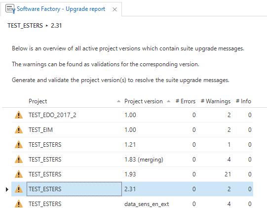

#### Menu

This release features an improved menu, designed in close collaboration with our UI/UX specialists and Academy trainers.

To improve the useability we:

- Switched to a list bar menu to limit the nesting depth.
- Added group icons (and hid the item icons).
- Rearranged the items in new groups.
- Merged the different code overview screens.
- Added menu items for [Domains](/docs/docs/sf/domains.html), [Custom screens](/docs/docs/sf/custom_screens.html) and [Runtime configurations](/docs/docs/sf/runtime_configuration.html).

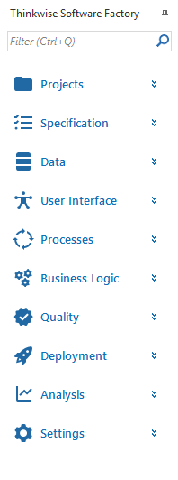

> Can't find the item you're looking for? Use Ctrl+Q to search the menu!

#### Improved Azure support

Several changes are made to the Software Factory and the Deployer to better support [Azure SQL Database](https://azure.microsoft.com/en-us/services/sql-database/):

- Added the option to use an existing (empty) database.
- Added Azure support for DevExpress reports.
- Added support for current_server and current_database.
- Improved Azure File Storage support.
- Improved support for the `tsf_user` function.
- Removed USE statements from scripts.
- Fixed drop scripts trying to drop system tables and views.
- Fixed the create database script trying to set the recovery mode and database file storage.
- Added support for Azure [SQL Data Sync](https://docs.microsoft.com/en-us/azure/sql-database/sql-database-sync-data)

#### Code search

A [Code search](/docs/docs/sf/code_search.html) feature has been added to search for string occurrences in code. This includes template code and control procedure code, but also prefilter, expression and validation code.

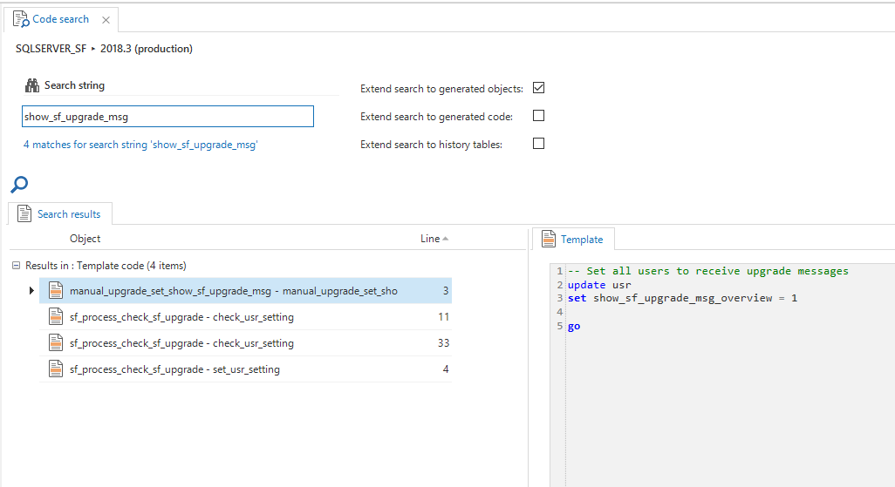

#### Create upgrade scripts

Upgrades of end-products are performed automatically by the Software Factory. With the integrated [data conversion](/docs/docs/sf/data_conversion.html) feature is possible to specify and data transformations.
Sometimes, however, you need more granular control over the upgrade process, which can be achieved using code scripts. To better facilitate this, new program objects are created to use during an upgrade.

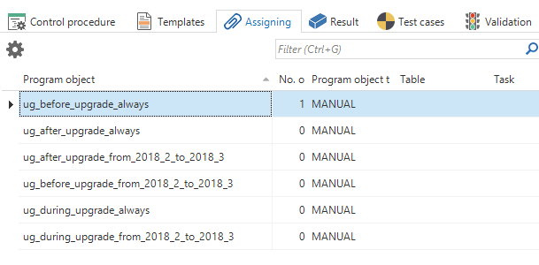

At the start of the upgrade:

- `before_upgrade_always`
- `before_upgrade_[from_version]_to_[to_version]`

While old and new tables both exist, before the old tables with the old data are dropped. Data has already been migrated to the new tables using the version control settings:

- `during_upgrade_always`
- `during_upgrade_[from_version]_to_[to_version]`

At the end of the upgrade, after 'old_' tables are dropped:

- `after_upgrade_always`
- `after_upgrade_[from_version]_to_[to_version]`

The program objects with id's ending with `_always` will retain the assigned templates on every upgrade.

The program object with the id's containing the from- and to project versions can be used for code that is specific for an upgrade between the specified versions.
When version control is set to a new from- or to version, the code will no longer be executed.

To assign a template to any of these program objects, use the `UPGRADE` code group in a control procedure.

#### Application icon

It is now possible to set the application icon in the Software Factory (previously only possible in the Intelligent Application Manager).

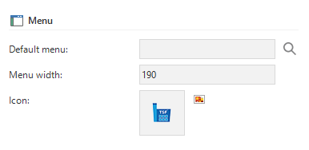

When an application in IAM does not have an icon, the project version icon will be used.

#### Hide icons

In addition to icons in the list bar menu and tree menu, it is now also possible to indicate whether icons are shown in the document tab pages and the container and detail tab pages.

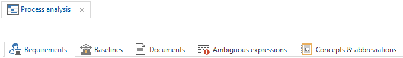

#### Copy file and folder connectors

Two new process action connectors have been added to copy files and folders.

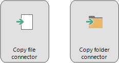

#### XML-JSON transformation connectors

Process action connectors have been added to convert XML to JSON and vice versa.

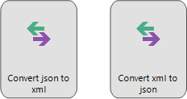

#### Validations

Several new validations are added to help create secure applications. For instance by checking if authorization prefilters are provided for tables containing sensitive data,
and checking if authorization prefilters are correctly propagated to references tables.

#### Assign validations

Validations can now be assigned to specific developers.

In the validation screen, prefilters are available to show all validations assigned to the current developer or all unassigned validations.

#### Refresh subjects

It is now possible to configure the refresh behavior of the user interfaces. Per subject, te desired refresh option can be specified for insert, copy, update and delete actions. These options are:

- None
- Row
- Subject
- Document

The refresh option can be set in the *Performance* tab page of the *Subject* and *Variant* settings.

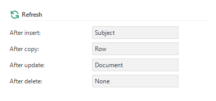

#### Memory optimized

It is now possible to specify if the database management system used should keep a table into memory to optimize performance.
Available options are:
- No
- Yes (durable)
- Yes (transient) - *only available for SQL server projects*

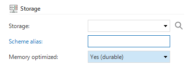

More information about memory optimized tables in SQL server can be found see [here](https://docs.microsoft.com/en-us/sql/relational-databases/in-memory-oltp/defining-durability-for-memory-optimized-objects).

For DB2 projects, the property KEEPINMEM will be used. More information about this property can be found [here](https://www.ibm.com/support/knowledgecenter/en/ssw_ibm_i_73/cl/chglf.htm).

For Oracle project, the option CACHE will be used. More information about this option can be found [here](https://docs.oracle.com/cd/B28359_01/server.111/b28286/statements_7002.htm#i2215507).

#### Indexes

Unique indexes can now be configured to exclude null values.

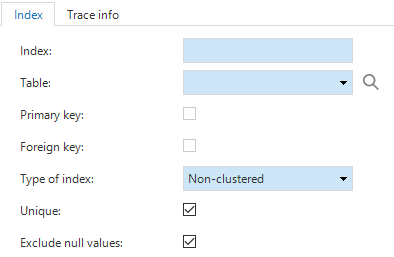

#### Execute-as option

An *EXECUTE AS* option is added for SQL Server procedures, functions, clr procedures and clr-functions.

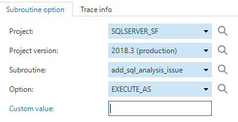

#### Source code obfuscation

By tagging a project version with the `OBFUSCATE_LOGIC` tag, all logic will be applied using the *with encryption* clause.

This causes the source code of all stored procedures, functions views and triggers functions to be obfuscated. This feature is only available for SQL server projects.

#### Stored procedure transactions

It is now possible to mark a task or subroutine to execute as an atomic transaction for SQL Server and DB2. This will affect the generated code for this stored procedure.

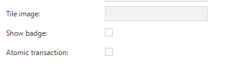

#### Project selection warning

To prevent accidental changes in an inactive or live project version, a warning is shown when a non-work project is chosen in the project selector.

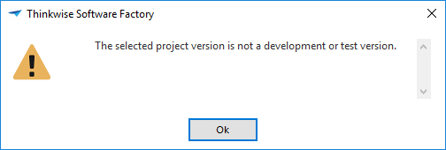

#### Constant lines in charts

Added support for constant lines in charts.

#### Conditional layout in cubes

It is now possible to create conditional layouts for cube fields using the values of other fields.

#### Grid column groups

Grid columns can now be grouped using the *Next group* and *Group label* column options. Multiline column headers are also supported.

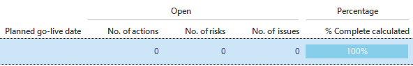

#### Test automation

It is now possible to add and copy grid rows in a test case.

#### Filter and search conditions

Options to filter or search on strings using *ends with* and *does not end with* conditions are added.

#### Deploying offline code

Offline code can now be deployed using the *Execute* button in the *Functionality modeler*.

### Changed 

- **Branch deactivation** - After a branch is merged to the trunk, the branch project is deactivated. After merging, a new branch should be created from the freshly merged trunk to prevent unneccesary delta actions.
- **Branching performance optimizations** - Several performance optimisations have been realised to speed up the branching and merging process.
- **Azure subfolders** - The option to set a subfolder with a column is now implemented for Azure file storage.
- **Copying columns** - Renamed the 'Primary key' option when copying a column to 'Copy primary key settings' to be more clear.
- **Gradients** - Gradient theme settings are now hidden by default to discourage the their use.
- **Rename tile groups** - A task was added to rename a tile group.
- **Copy project version** - This task now also copies the project version folder (using the new process actions).

### Fixed 

- **Deleting cube fields** - Deleting a cube field that is used by another fields (group or sort) will no longer try to delete those referenced items but will clear the group or sort setting instead.
- **Renaming a table** - Tables used by process actions or containing references with column-tags will no longer cause the rename action to fail.
- **Deleting generated domains** - Generated domains are now deleted properly when they are only used by generated columns, tasks etc.
- **Calculated fields** - Calculated fields can no longer be set as a primary key or identity value.
- **Theme import performance** - Importing a theme from another project is improved.
- **Copying linked projects** - If domain elements are changed in the base project, they will be updated during generation.
- **Publishing offline logic** - When only the casing of offline logic has changed, this change will now be picked up correctly on publishing.
- **Code review comments** - The tasks to change the status of a comment will now update the trace columns.
- **Copying tables** - When a table is copied, the generated indexes and constraints will remain generated.
- **Removing unused font** - The task to remove unused fonts now also checks if `tab_disabled_header_font_id` and `ribbon_font_id` are using the font.
- **Model loading performance** - Task parameters and report parameters now load faster.
- **Expression dependencies** - When an expression column uses an alias in the expression query, this column now has the correct expression dependencies.
- **Renaming control procedures or templates** - Fixed bug where generated parameter was not updated.

---

## Intelligent Application Manager

### New 

#### Menu

The IAM menu has been redesigned using new colors and icons.

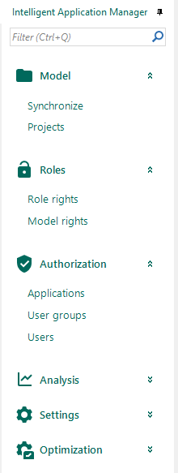

#### Create deployment scripts

A task is added to automatically create a the scripts for the Thinkwise Deployment Center.

This task performs the following actions:

- Copy the *install* and *upgrade* scripts to create or upgrade the application database
- Create scripts to provide IAM with the model, roles, user groups and application
- Create scripts to apply the rights to the application database

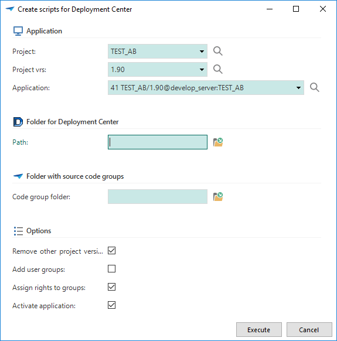

#### Password strength

The minimum password strength for IAM authenticated users can be set in the global settings.

The following calculation is used to determine the password strength:

- The total password length gives up to 3 points (at 10 characters)
- Two uppercase characters and two lowercase characters gives 0.6 points
- Two numbers gives 0.6 points
- Two symbols gives 0.8 points

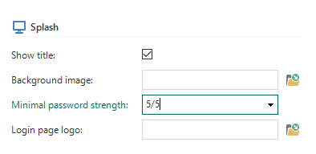

Setting the minimum password strength to **5** will require the user to match all the password requirements.
Setting the minimum password strength to **4** allows the user to skip either symbols, numbers or varying casing.

When the user attempts a password change and the password strength is insufficient, the user will be notified of the shortcomings of the desired password.

Password strength requirements for RDBMS accounts or Windows accounts is delegated to the database server or active directory.

The extended property `min_password_strength` can no longer be used for this purpose.

> #### Login limitation
> Indicium no longer accepts more than 5 consecutive wrong passwords in a 15-minute window. When this threshold is reached, the user name cannot be used for authentication for 5 minutes. Existing authenticated sessions using this user name are not affected by the lock-out.

### Changed 

- **User with duplicate email adresses** - Added email address and user id to the message indicating an email address is already in use by another user.
- **Update existing users** - The first name, last name and email address of existing users is updated when executing the *Update Active directory Group* task.
- **Logging of role table** - The *Role* table is added to logging concept to log inserts, updates and deletes, including renames and all rights.
- **Translation of a new application** - When an application is copied, and the old translation mentions a project or version in the translation or tooltip, the value is replaced by the new project or version automatically.
- **Set rights task** - The task to set table rights has been extended to include the new grid features.

### Fixed 

- **Assigning rights to database** - When a user uses the task to assigning rights to the database, this task check whether the user has the correct permissions to assign rights.
- **Software Factory & IAM default upload path** - Files uploaded to IAM using the Web user interface will now be stored in the installation directory.
- **Orphaned prefilter status** - When a custom prefilter is deleted, the status of that prefilter (on/of) is also deleted.

## Data model changes

Data model changes for the Software Factory and IAM meta-models are listed here. This overview be used as reference to fix dynamic control procedures, dynamic model code or custom validations after an upgrade.

### Software Factory 

#### Table changes

| Old table | New table                 |
| --------- | ------------------------- |
| employee  | usr                       |
|           | code_search               |
|           | code_search_result        |
|           | usr_runtime_configuration |
|           | validation_msg_assigned   |

#### Column changes

| Old table             | Old column           | New table             | New column                   | State   |
| --------------------- | -------------------- | --------------------- | ---------------------------- | ------- |
| change_log            |                      | change_log            | control_proc_code            | New     |
| change_log_template   |                      | change_log_template   | template_code                | New     |
| col                   | field_in_next_grp    | col                   | form_field_in_next_grp       | Changed |
| col                   | next_grp_label       | col                   | form_next_grp_label          | Changed |
| col                   | next_grp_icon        | col                   | form_next_grp_icon           | Changed |
| col                   |                      | col                   | grid_field_in_next_grp       | New     |
| col                   |                      | col                   | grid_next_grp_label          | New     |
| dttp                  |                      | dttp                  | default_input_default        | New     |
| dttp                  |                      | dttp                  | default_output_default       | New     |
| dttp                  |                      | dttp                  | default_input_layout         | New     |
| dttp                  |                      | dttp                  | default_input_context        | New     |
| extender_enum_value   | value                | extender_enum_value   |                              | Deleted |
| extender_enum_value   | db_value             | extender_enum_value   | value                        | Changed |
| indx                  |                      | indx                  | ignore_null                  | New     |
| project_vrs           | db_name              | project_vrs           |                              | Deleted |
| project_vrs           | mobile_proxy_address | project_vrs           |                              | Deleted |
| project_vrs           | rdbms_type           | project_vrs           |                              | Deleted |
| project_vrs           | server_name          | project_vrs           |                              | Deleted |
| project_vrs           |                      | project_vrs           | default_icon                 | New     |
| report                |                      | report                | display_parmtr_id            | New     |
| report_parmtr         | field_in_next_grp    | report_parmtr         | form_field_in_next_grp       | Changed |
| report_parmtr         | next_grp_label       | report_parmtr         | form_next_grp_label          | Changed |
| report_parmtr         | next_grp_icon        | report_parmtr         | form_next_grp_icon           | Changed |
| report_variant        |                      | report_variant        | apply_display_parmtr_id      | New     |
| report_variant        |                      | report_variant        | display_parmtr_id            | New     |
| report_variant_form   | field_in_next_grp    | report_variant_form   | form_field_in_next_grp       | Changed |
| report_variant_form   | next_grp_label       | report_variant_form   | form_next_grp_label          | Changed |
| report_variant_form   | next_grp_icon        | report_variant_form   | form_next_grp_icon           | Changed |
| runtime_configuration |                      | runtime_configuration | gui_appl_id                  | New     |
| runtime_configuration |                      | runtime_configuration | gui_appl_alias               | New     |
| runtime_configuration |                      | runtime_configuration | default_configuration        | New     |
| sf_configuration      |                      | sf_configuration      | default_appl_lang_id         | New     |
| subroutine            |                      | subroutine            | single_transaction           | New     |
| tab_variant_form      | field_in_next_grp    | tab_variant_form      | form_field_in_next_grp       | Changed |
| tab_variant_form      | next_grp_label       | tab_variant_form      | form_next_grp_label          | Changed |
| tab_variant_form      | next_grp_icon        | tab_variant_form      | form_next_grp_icon           | Changed |
| tab_variant_grid      |                      | tab_variant_grid      | grid_field_in_next_grp       | New     |
| tab_variant_grid      |                      | tab_variant_grid      | grid_next_grp_label          | New     |
| task                  |                      | task                  | single_transaction           | New     |
| task                  |                      | task                  | display_parmtr_id            | New     |
| task_parmtr           | field_in_next_grp    | task_parmtr           | form_field_in_next_grp       | Changed |
| task_parmtr           | next_grp_label       | task_parmtr           | form_next_grp_label          | Changed |
| task_parmtr           | next_grp_icon        | task_parmtr           | form_next_grp_icon           | Changed |
| task_variant          |                      | task_variant          | apply_display_parmtr_id      | New     |
| task_variant          |                      | task_variant          | display_parmtr_id            | New     |
| task_variant_form     | field_in_next_grp    | task_variant_form     | form_field_in_next_grp       | Changed |
| task_variant_form     | next_grp_label       | task_variant_form     | form_next_grp_label          | Changed |
| task_variant_form     | next_grp_icon        | task_variant_form     | form_next_grp_icon           | Changed |
| theme                 |                      | theme                 | document_show_document_icons | New     |
| theme                 |                      | theme                 | tab_show_detail_icons        | New     |
| theme                 |                      | theme                 | grid_grp_border_color        | New     |
| theme                 |                      | theme                 | grid_grp_text_alignment      | New     |
| employee              | employee_id          | usr                   | usr_id                       | Changed |
| employee              | employee_name        | usr                   | usr_name                     | Changed |
| employee              |                      | usr                   | appl_lang_id                 | New     |
| employee              |                      | usr                   | show_sf_upgrade_msg_overview | New     |

### Intelligent Application Manager 

#### Table changes 

*There are no name changes or new tables for IAM.*

#### Column changes 

| Old table             | Old column        | New table             | New column                   | State   |
| --------------------- | ----------------- | --------------------- | ---------------------------- | ------- |
| col                   | field_in_next_grp | col                   | form_field_in_next_grp       | Changed |
| col                   | next_grp_label    | col                   | form_next_grp_label          | Changed |
| col                   | next_grp_icon     | col                   | form_next_grp_icon           | Changed |
| col                   |                   | col                   | grid_field_in_next_grp       | New     |
| col                   |                   | col                   | grid_next_grp_label          | New     |
| global_settings       |                   | global_settings       | min_password_strength        | New     |
| project_vrs           |                   | project_vrs           | default_icon                 | New     |
| report                |                   | report                | display_parmtr_id            | New     |
| report_parmtr         | field_in_next_grp | report_parmtr         | form_field_in_next_grp       | Changed |
| report_parmtr         | next_grp_label    | report_parmtr         | form_next_grp_label          | Changed |
| report_parmtr         | next_grp_icon     | report_parmtr         | form_next_grp_icon           | Changed |
| report_variant        |                   | report_variant        | display_parmtr_id            | New     |
| report_variant_parmtr | field_in_next_grp | report_variant_parmtr | form_field_in_next_grp       | Changed |
| report_variant_parmtr | next_grp_label    | report_variant_parmtr | form_next_grp_label          | Changed |
| report_variant_parmtr | next_grp_icon     | report_variant_parmtr | form_next_grp_icon           | Changed |
| tab_variant_col       | field_in_next_grp | tab_variant_col       | form_field_in_next_grp       | Changed |
| tab_variant_col       | next_grp_label    | tab_variant_col       | form_next_grp_label          | Changed |
| tab_variant_col       | next_grp_icon     | tab_variant_col       | form_next_grp_icon           | Changed |
| tab_variant_col       |                   | tab_variant_col       | grid_field_in_next_grp       | New     |
| tab_variant_col       |                   | tab_variant_col       | grid_next_grp_label          | New     |
| task                  |                   | task                  | display_parmtr_id            | New     |
| task_parmtr           | field_in_next_grp | task_parmtr           | form_field_in_next_grp       | Changed |
| task_parmtr           | next_grp_label    | task_parmtr           | form_next_grp_label          | Changed |
| task_parmtr           | next_grp_icon     | task_parmtr           | form_next_grp_icon           | Changed |
| task_variant          |                   | task_variant          | display_parmtr_id            | New     |
| task_variant_parmtr   | field_in_next_grp | task_variant_parmtr   | form_field_in_next_grp       | Changed |
| task_variant_parmtr   | next_grp_label    | task_variant_parmtr   | form_next_grp_label          | Changed |
| task_variant_parmtr   | next_grp_icon     | task_variant_parmtr   | form_next_grp_icon           | Changed |
| theme                 |                   | theme                 | document_show_document_icons | New     |
| theme                 |                   | theme                 | tab_show_detail_icons        | New     |
| theme                 |                   | theme                 | grid_grp_border_color        | New     |
| theme                 |                   | theme                 | grid_grp_text_alignment      | New     |
| usr                   | sur_name          | usr                   |                              | Deleted |
| usr                   | name              | usr                   |                              | Deleted |
| usr                   | name_prefix       | usr                   |                              | Deleted |
| usr                   |                   | usr                   | sur_name                     | New     |
| usr                   |                   | usr                   | name                         | New     |
| usr                   |                   | usr                   | usr_type                     | New     |
| usr                   | allow_change_totp | usr                   | allow_fallback_to_email      | Changed |