The 2019.1 release of the Thinkwise Platform features a lot of improvements and additions, and over 100 feature requests and issues have been addressed.
The most important changes are listed in this post. A complete list of all changes can be found in the [Thinkwise Community Portal](https://office.thinkwisesoftware.com/tcp).

<!--truncate-->

- [Upgrade notes](#upgrade-notes)
  - [SQL Server and .NET Framework support](#sql-server-and-net-framework-support)
  - [Smart upgrades](#smart-upgrades)
- [Unit testing](#unit-testing)
- [Roles in the Software Factory](#roles-in-the-software-factory)
  - [Access Control](#access-control)
    - [Roles](#roles)
    - [Model rights](#model-rights)
  - [Creation](#creation)
    - [Synchronize to IAM](#synchronize-to-iam)
    - [Deployment package](#deployment-package)
    - [History](#history)
- [Software Factory](#software-factory)
  - [New ](#new-sf)
    - [Renumber tasks](#renumber-tasks)
    - [Appendices on requirement report](#appendices-on-requirement-report)
    - [Sorted look-up combo's](#sorted-look-up-combos)
    - [Copy project version after upgrade](#copy-project-version-after-upgrade)
    - [Card list translation](#card-list-translation)
    - [Translations for renamed object](#translations-for-renamed-object)
    - [Starting order of Universal applications](#starting-order-of-universal-applications)
    - [CLR functions return value](#clr-functions-return-value)
    - [Approve validation messages](#approve-validation-messages)
    - [Extenders](#extenders)
  - [Validations](#validations)
  - [Changed ](#changed-sf)
  - [Fixed ](#fixed-sf)
- [Intelligent Application Manager](#intelligent-application-manager)
  - [New ](#new-iam)
  - [Changed ](#changed-iam)
  - [Fixed ](#fixed-iam)
- [Data model changes](#data-model-changes)
  - [Changes Software Factory](#changes-software-factory)
    - [Table changes](#table-changes)
    - [Column changes](#column-changes)
  - [Changes Intelligent Application Manager](#changes-intelligent-application-manager)
    - [Table changes ](#table-changes-iam)
    - [Column changes ](#column-changes-iam)

## Upgrade notes

### SQL Server and .NET Framework support

No changes were made here, so the required SQL Server and .NET Framework support remain the same as in the 2018.3 version.
- The Software Factory development environment and the Intelligent Application Manager require SQL Server 2012 or higher.
- This also applies to the Windows and Web userinterfaces, which additionally need version 4.7 of the .NET Framework (4.7.**2** is advised for Web).
- The Indicium application tier requires SQL Server 2012 or higher, .NET 4.7.2 and .NET Core 2.1.5.

For more information about supported technologies, see the Thinkwise [Lifecycle Policy](/docs/docs/kb/lifecycle_policy.html).

### Smart upgrades

This release changes some basic templates using a generated *SET NOCOUNT ON* statement. This statement is now followed by a semicolon (;). This makes it possible to write certain statements, for example a with-statement, without having to use a semicolon first. 

---

## Unit testing

This release contains the first version of unit tests in the Software Factory. Unit tests can be written for the following logic concepts: defaults, layouts, contexts and badges. The following image shows the unit test screen. This is the place to create, maintain and execute unit tests.

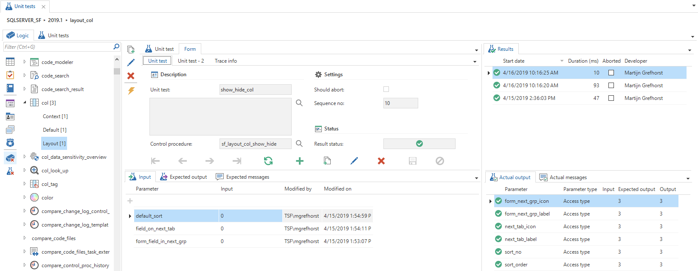

The list on the left side shows all the objects for which unit tests can be written. Badges are used to show the amount of existing unit tests. After selecting the correct object and logic type a unit test can be created. A title and description can be filled even as if the unit test should succeed or not with the checkbox *Should abort*. After saving, parameters can be added. A distinction has been made between input and output parameters because the output parameters will be checked after the unit test has been executed. In addition, the expected messages can be specified. These will also be checked after performing a unit test.

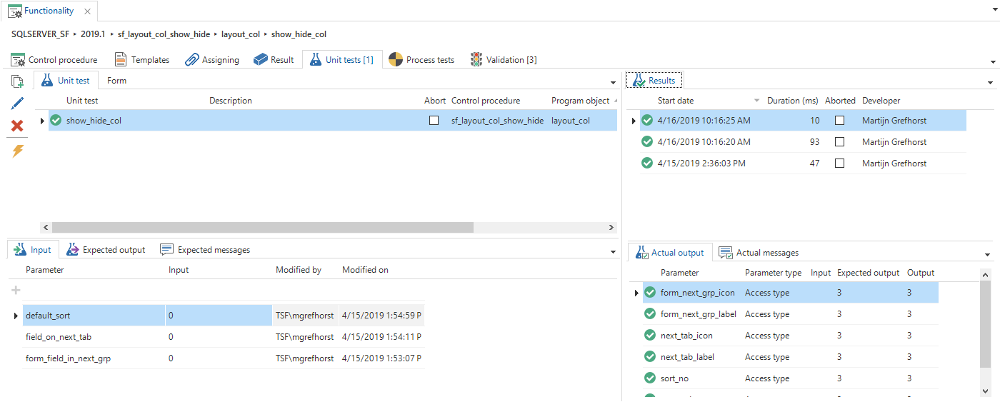

Unit tests can also be created, maintained or executed from the Functionality modeler. The list is filled with all the unit tests that are directly connected with the program objects on the result page. For example, when a default procedure is created for *Employee* to combine the first and last name to display name, the written unit test that validates the email address is also shown in the list. Also, all unit tests are shown that have the selected control procedure linked as primarily.

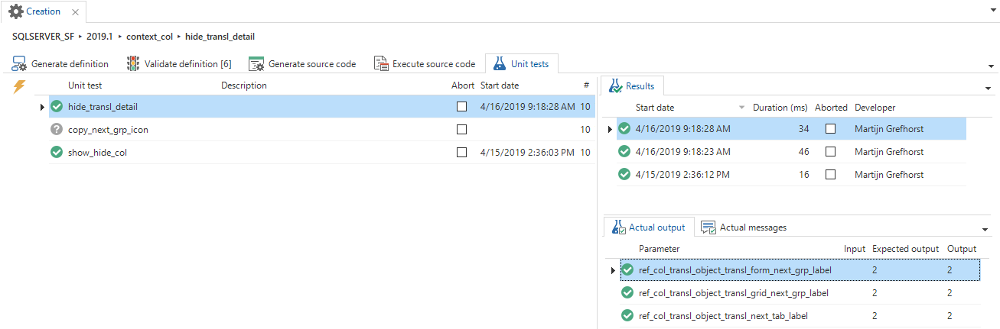

After a product upgrade from the creation screen all unit tests can be executed again as a regression test. This to ensure that further changes have not broken any units that were already tested. By selecting one or multiple rows the unit tests can be executed.

---

## Roles in the Software Factory

### Access Control

The configuration of roles is moved out of IAM, into the Software Factory. The new screens for this feature can be found in the menu under the new menu group *Access control*.

#### Roles
The first screen present in this menu group is *Roles*. Here, it is possible to execute a task to import the roles out of IAM, to the Software Factory. This needs to be done for one time only. So when upgrading to the 2019.1 version, is is not necessary to import the roles again in the 2019.2 version. When skipping the upgrade to the 2019.1 version, upgrading directly to the 2019.2 verion, it still is necessary to import the roles for one time. Make sure this is done before synchronizing your project version to IAM. It is also possible to create or copy new roles, or to delete roles. Assigning role rights to objects can be done in the same way as it was done in IAM. 

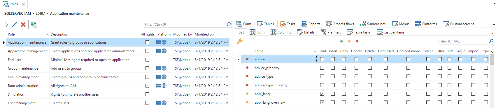

#### Model rights
The second screen in this menu group is called *Model rights*. This screen is optimized by using another screen type, which makes better use of the available space. 

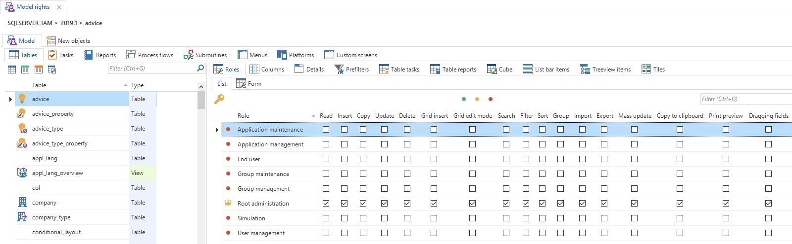

This screen also contains the tab page *New objects*, which shows all new objects created in the project version. There is a *Go to object* task available, which leads to the corresponding record in the *Model rights* screen.

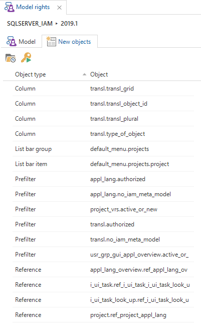

### Creation

The action of synchronizing between the Software Factory and IAM has been moved to the Software Factory. Therefore two list bar items have been added to this menu group.

#### Synchronize to IAM

One of the screens present in this menu group is *Synchronize to IAM*. 

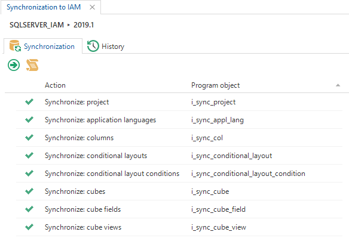

Not only is it possible to start a synchronization to IAM, but also to write a file to disk. Before starting the synchronization there will be a couple of checks. In some cases, this will lead to a warning (for example, not all validations are solved), and in other cases, it won't even be possible to execute the synchronization (for example, no roles are present in the project version).

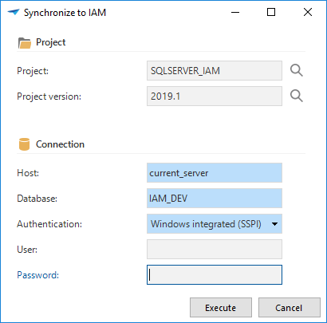

#### Deployment package

The second new screen in this menu group is *Deployment package*. This screen looks a lot like the *Synchronize to IAM* screen, only here a deployment package can be created. After execution, the following actions will be executed:
* The project version will be generated
* The project version will be validated
* The source code will be created for the install (full) and for the upgrade (smart)
* A synchronization script will be created
* A manifest will be made to use in the deployment center
* All icons and reports that are in the project folder will be copied

#### History

Both screens contain a tab page in which the history can be found. Should it occur that a synchronization or deployment session gets locked by staying active for too long, it is possible to reset the lock using a *Reset lock* task.

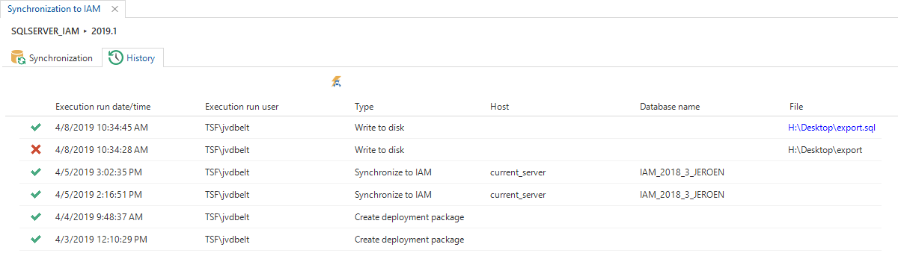

---

## Software Factory

### New 

#### Renumber tasks
Created tasks to renumber task parameters and report parameters.

#### Appendices on requirement report
The appendices are shown on the requirements report per requirement.

#### Sorted look-up combo's
Look-up control can now be set to *Combo (sorted)*. This will present the values in the combo using the sorting of the look-up table. The look-up control type *Combo* has been renamed to *Combo (alphabetical)* to reflect the difference between the two combos.

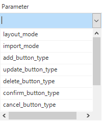

#### Copy project version after upgrade
After a project upgrade there will be asked if a new project version must be created.

#### Card list translation
The translations have been extended with translations for the card list.

#### Translations for renamed object
Translations will be copied automatically when renaming an object.

#### Starting order of Universal applications

It is now possible to determine the starting order of applications (runtime configurations) when starting Universal against the Software Factory, without setting specific applications (runtime configurations).

#### CLR functions return value
CLR functions can now be defined and generated as table-valued.

#### Approve validation messages
It is now possible to set if a validation may be approved or not. By default it is not possible to approve errors, but this can be changed. 

This also goes the other way around. By default it is possible to approve information messages or warnings, but this can also be changed. This is already done for some validations, mostly because there already is a task available to solve the validation (for example the approve subname task). This is done for the following validations:
* Roles are not present
* Role description should no longer be "generated by upgrade"
* Columns with undecided sensitivity
* Suggested columns with undecided sensitivity
* Subname is not assessed
* Non numeric datatype used in a domain with progress bar control
* Control procedure is not reviewed
* Object is untranslated

#### Extenders
Added the following extenders:
* **Use detail null comparison extender** - Allows a list of detail values to be populated even when the main subject has null values.
* **Grid link task extender** - Allows a task to be executed by clicking on a field in the grid.
* **Disable multirow select extender** - Disables multi-row selection for the grid and tree view.
* **Activity scheduler** - A configurable task based scheduler.

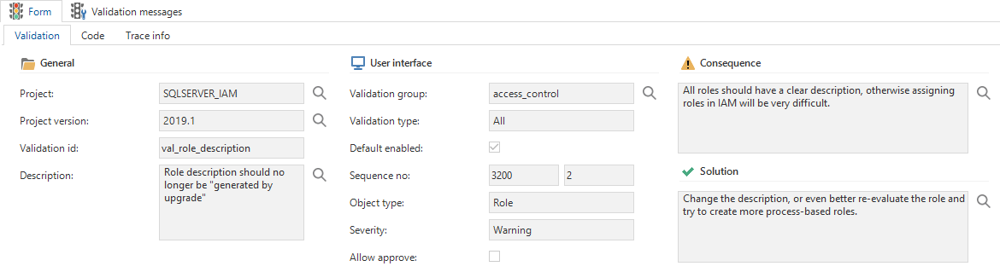

### Validations
Added the following validations:
* Datamodel: FILESTREAM or ROWGUID columns/domains use a column type/allow sort/visible for filter/visible for search that is not supported
* Datamodel: Domain has a file/image link control while using an incorrect file storage
* Datamodel: Non numeric datatype used in a domain with progress bar control
* Datamodel: Invalid datatype used in primary key columns
* Functional definitions: Control procedure or template with database message function instead of tsf_send_message
* Functional definitions: Control procedure does not contain templates
* Functional definitions: View has one or more indexes/check constraints
* Functional definitions: Control procedure is disapproved during review
* GUI definitions: Table/report/task look-up reference can point towards multiple records in the look-up table
* GUI definitions: Multiple prefilters/reports/tasks on table using the same shortcut
* GUI definitions: There are objects without icons, such as prefilters, tasks or reports

### Changed 

* **Variant type of column** - Added conditional layouts to variant columns, variant form columns and variant grid columns to indicate the type of column.
* **Prefilters, tasks and report menu configuration** - Prefilters, tasks and reports are now available in a grouped grid. This also applies to the corresponding variants. The grid is default editable and provides the option to use drag-drop.
* **Process action tab** - Added a *Process actions* tab page in the tasks and reports screens.
* **My projects** - Added a prefilter that only shows your own projects in the project screen and project version selection ribbon tab. By default this prefilter is activated, but it can be deactivated to show all projects.
* **Code review prefilter** - Added prefilter *Originated in current version* to code review screen.
* **Unused domains** - Added prefilter *Not used* to domain screen.
* **Process action ID** - All process actions now show the ID it belongs to, so when multiple process actions of the same type are used they can be easily distinguished in the designer.
* **Icons screen** - The icons screen has been moved to the User Interface menu group. Here it has been made possible to alter multiple icons at once with a task.
* **Template sort order** - Templates in the *Available Templates* tab page under *Functionality* are no longer alphabetically sorted, but sorted by the order number of the templates.
* **Editable** - Changed the translation for the column type domain element *Regular* to *Editable* to more easily distinguish them from *Readonly* for autocomplete purposes.
* **Process action** - A task is added to rename a process action.
* **Conditional layout** - Added a copy, rename and delete task to the conditional layout screen.
* **Deleting a project version** - Project versions that are used as a base for another project cannot be deleted with the task *Delete project version*. Delete the branch first and after that the base.
* **Copying a prefilter to a table** - An error message will be shown when attempting to copy a prefilter to a table that does not have one of the columns used by the prefilter.
* **Sub names** - Sub names will now be generated for domains and subroutines.
* **Drop CLR assembly before create** - Added a drop statement for the CLR assembly before the create statement.
* **Valid input check for labels** - Labels, for example the field on next group label, can only be lowercase and will be checked for invalid characters. During editing they are automatically corrected if needed.
* **Change type of table to a view or snapshot** - Excluded views and snapshots in generation of indexes, when changing the type of table from a table to a view or snapshot.
* **Trace columns when renaming** - Only update the *Modified by* and *Modified on* fields when renaming an object, and not the *Added by* and *Added on* fields.
* **Start objects** - Badges and icons are now shown with start objects.
* **Copy table link when copying task or report** - When copying a task or report the table link will now also be copied. A badge has been added to the table tasks and table reports table to show when a task or report has table links.
* **Behaviour when changing prefilter type** - Delete the prefilter columns when the prefilter type is *Query*. Empty the query when the prefilter type is *Prefilter columns*.
* **Expression columns default output/layout mand. output** - The fields *Default output* and *Layout mand. output* are now turned off for expression columns.

### Fixed 

* **Drag-drop** - Some scenarios of reordering using drag-drop and multi-selection did not work properly. This has been resolved.
* **Comments in concept requirements report** - The comments are now shown above the diagram.
* **Reference order numbers** - New references will now get a new order number assigned, highest reference order number + 10. Validations will no longer complain about duplicate order numbers. Also the drag-drop of details will work ok when adding a new reference.
* **Validating after upgrade** - Executing validations after a platform upgrade could cause problems when the definition of the project version had not yet been generated. The project would still have validations of the previous platform version. This could cause errors during validation. Instead, a message is now shown that the project version must be generated before validations can be executed.
* **Renaming and translations** - When renaming an object using the rename task, the translation will be copied as well (if possible).
* **Subname validation fixes** - The validation identifying disapproved subnames now works properly when validating for the first time after definition generation and when error-level validations are executed during synchronisation.
* **Hotfix ERD modeler - check integrity reference checkbox** - In the ERD modeler the check integrity reference checkbox was always false. Especially when modifying a reference which check integrity was enabled this checkbox was set to false so the reference intergrity will be changed.
* **Possible to create a branch with an old branch name** - After renaming a branch, it is now possible to use the old branch name for a new branch.
* **Copy runtime configuration** - When a runtime configuration is copied, the alias is no longer included because this gave a constraint error.
* **Validation assignments in a new project version** - Validation assignments to a developer no longer disappear when a new project version is created.
* **Report address info** - Updated all reports with new address info.
* **Special characters displayed incorrectly in treeview** - Special characters will from now on replace in the right way. Also added support for extra special characters.
* **Layout error at User preferences: GUI advices** - The error message has been resolved.
* **Checks, indexes and constraints for file tables** - Before checks, constraints and indexes are being dropped, there will be checked if these objects are part of a filetable. If this is the case, the objects will not be dropped since this is not possible for file tables.
* **Test coverage cube** - The *Status total* in the test coverage cube (menu group *Analysis*, item *Test coverage*) is now being aggregated correctly.

---

## Intelligent Application Manager

### New 

There are no new IAM features implemented in this release.

### Changed 

* The configuration of roles is moved out of IAM, into the Software Factory. 
* The action of synchronizing between the Software Factory and IAM has been moved to the Software Factory.
* The tab pages *Project administrator* and *Project owner* under *Users*, *Administrators* have been removed. This can now be done in the Software Factory.

### Fixed 

* **Fixed incorrect view name for advices** - Generated UP advices are displayed correctly again, without an error message.

* **No cancel-option for task Apply user roles to database** - When being asked for confirmation if the task *Apply user roles to database* should be executed, is it possible again to say yes or no, instead of only OK.

---

## Data model changes

**Domain col_access_type in IAM** - The order of the elements has been changed for the col_access_type domain in IAM. This domain is being used for columns, task parameters and report parameters. From now on, the order is the same as for the same domain in the Software Factory.

| 2018.3 Element | 2018.3 Value | 2019.1 Element | 2019.1 Value |
| -------------- | ------------ | -------------- | ------------ |
| hidden         | 0            | hidden         | 3            |
| read_only      | 2            | read_only      | 1            |
| regular        | 3            | regular        | 0            |

In the 2019.1 situation there is also a value 2. This value is not displayed in this table because it is only used as a parameter in layout functionality.

Further data model changes for the Software Factory and IAM meta-models are listed here. This overview be used as reference to fix dynamic control procedures, dynamic model code or custom validations after an upgrade.

### Changes Software Factory

#### Table changes

| Old table                     | New table                      |
| ----------------------------- | ------------------------------ |
| project_vrs_extended_property | -                              |
| -                             | execution_run                  |
| -                             | execution_run_step             |
| -                             | role                           |
| -                             | role_col                       |
| -                             | role_cube_view                 |
| -                             | role_list_bar_grp              |
| -                             | role_list_bar_item             |
| -                             | role_menu                      |
| -                             | role_module_grp                |
| -                             | role_module_item               |
| -                             | role_platform                  |
| -                             | role_process                   |
| -                             | role_process_flow              |
| -                             | role_ref                       |
| -                             | role_report                    |
| -                             | role_report_parmtr             |
| -                             | role_subroutine                |
| -                             | role_tab                       |
| -                             | role_tab_prefilter             |
| -                             | role_tab_report                |
| -                             | role_tab_task                  |
| -                             | role_task                      |
| -                             | role_task_parmtr               |
| -                             | role_tile                      |
| -                             | role_tile_grp                  |
| -                             | sub_name_excluded_object       |
| -                             | unit_test                      |
| -                             | unit_test_col_input            |
| -                             | unit_test_col_output           |
| -                             | unit_test_col_type             |
| -                             | unit_test_fixed_parmtr_input   |
| -                             | unit_test_fixed_parmtr_output  |
| -                             | unit_test_msg                  |
| -                             | unit_test_preparation          |
| -                             | unit_test_ref_output           |
| -                             | unit_test_report_parmtr_input  |
| -                             | unit_test_report_parmtr_output |
| -                             | unit_test_report_parmtr_type   |
| -                             | unit_test_result               |
| -                             | unit_test_result_msg           |
| -                             | unit_test_result_parmtr        |
| -                             | unit_test_result_parmtr_type   |
| -                             | unit_test_tab_report_output    |
| -                             | unit_test_tab_task_output      |
| -                             | unit_test_task_parmtr_input    |
| -                             | unit_test_task_parmtr_output   |
| -                             | unit_test_task_parmtr_type     |

#### Column changes

| Old table                 | Old column                       | New table                 | New column
| ------------------------- | -------------------------------- | ------------------------- | -----------------
| control_proc_template     | no_of_characters_code            | control_proc_template     | -
| control_proc_template     | no_of_characters_comment         | control_proc_template     | -
| dttp                      | has_precision                    | dttp                      | -
| prog_lang                 | middle_tier_lang                 | prog_lang                 | -
| project                   | appl_logic_layer                 | project                   | -
| project                   | middle_tier_prog_lang_id         | project                   | -
| sf_configuration          | default_appl_logic_layer         | sf_configuration          | -
| sf_configuration          | default_middle_tier_prog_lang_id | sf_configuration          | -
| tab                       | card_list_title_label            | tab                       | -
| tab_variant               | card_list_title_label            | tab_variant               | -
| transl_object             | check_transl                     | transl_object             | -
| transl_object             | deleted                          | transl_object             | -
| transl_object_transl      | -                                | transl_object_transl      | verified
| transl_object_transl      | -                                | transl_object_transl      | transl_card_list
| usr_runtime_configuration | -                                | usr_runtime_configuration | order_no
| validation                | -                                | validation                | allow_approve
| validation                | -                                | validation                | verified

### Changes Intelligent Application Manager

#### Table changes 

| Old table                   | New table
| --------------------------- | -------------------
| -                           | appl_lang
| -                           | role_col
| -                           | role_cube_view
| -                           | role_list_bar_grp
| -                           | role_list_bar_item
| -                           | role_menu
| -                           | role_module_grp
| -                           | role_module_item
| -                           | role_platform
| -                           | role_process
| -                           | role_process_flow
| -                           | role_ref
| -                           | role_report
| -                           | role_report_parmtr
| -                           | role_subroutine
| -                           | role_tab
| -                           | role_tab_prefilter
| -                           | role_tab_report
| -                           | role_tab_task
| -                           | role_task
| -                           | role_task_parmtr
| -                           | role_tile
| -                           | role_tile_grp
| -                           | transl
| appl_lang                   | -
| cube_view_grp               | -
| iam_sync                    | -
| list_bar_grp                | -
| role_col                    | -
| role_cube_view              | -
| role_list_bar_grp           | -
| role_list_bar_item          | -
| role_menu                   | -
| role_module_grp             | -
| role_module_item            | -
| role_platform               | -
| role_process                | -
| role_process_flow           | -
| role_ref                    | -
| role_report                 | -
| role_report_parmtr          | -
| role_subroutine             | -
| role_tab                    | -
| role_tab_prefilter          | -
| role_tab_report             | -
| role_tab_task               | -
| role_task                   | -
| role_task_parmtr            | -
| role_tile                   | -
| role_tile_grp               | -
| sf_get_gui_proc             | -
| sf_get_gui_proc_iam_mapping | -
| sf_get_gui_proc_parmtr      | -
| tab_prefilter_grp           | -
| tab_report_grp              | -
| tab_task_grp                | -
| tile_grp                    | -
| transl_full                 | -
| transl_nav                  | -

#### Column changes 

| Old table                                | Old column                 | New table                                | New column
| ---------------------------------------- | -------------------------- | ---------------------------------------- | --------------------------
| col                                      | look_up_source_tab_id      | col                                      | -
| col                                      | look_up_source_col_id      | col                                      | -
| cube_view                                | -                          | cube_view                                | sub_menu
| cube_view                                | grp_has_sub_menu           | cube_view                                | -
| global_settings                          | min_severity               | global_settings                          | -
| list_bar_item                            | -                          | list_bar_item                            | list_bar_grp_icon
| list_bar_item                            | -                          | list_bar_item                            | list_bar_grp_abs_order_no
| msg                                      | generated                  | msg                                      | -
| project                                  | project_desc               | project                                  | -
| project                                  | base_project               | project                                  | -
| project                                  | work_project               | project                                  | -
| project                                  | cmpy_name                  | project                                  | -
| project                                  | title_1                    | project                                  | -
| project                                  | title_2                    | project                                  | -
| project                                  | title_3                    | project                                  | -
| project                                  | icon                       | project                                  | -
| project                                  | last_used_sf_host          | project                                  | -
| project                                  | last_used_sf_db_name       | project                                  | -
| project                                  | insert_user                | project                                  | -
| project                                  | insert_date_time           | project                                  | -
| project                                  | update_user                | project                                  | -
| project                                  | update_date_time           | project                                  | -
| project_vrs                              | project_vrs_desc           | project_vrs                              | -
| project_vrs                              | sf_host                    | project_vrs                              | -
| project_vrs                              | sf_db_name                 | project_vrs                              | -
| project_vrs                              | max_no_of_concurrent_users | project_vrs                              | -
| project_vrs                              | previous_project_id        | project_vrs                              | -
| project_vrs                              | previous_project_vrs_id    | project_vrs                              | -
| project_vrs                              | insert_user                | project_vrs                              | -
| project_vrs                              | insert_date_time           | project_vrs                              | -
| project_vrs                              | update_user                | project_vrs                              | -
| project_vrs                              | update_date_time           | project_vrs                              | -
| ref                                      | ref_desc                   | ref                                      | -
| report                                   | report_desc                | report                                   | -
| report_parmtr                            | look_up_source_tab_id      | report_parmtr                            | -
| report_parmtr                            | look_up_source_col_id      | report_parmtr                            | -
| report_variant_report_conditional_layout | show_conditional_layout    | report_variant_report_conditional_layout | -
| role                                     | log_actions                | role                                     | -
| role                                     | invalidate_role_sets       | role                                     | -
| role                                     | update_available_columns   | role                                     | -
| role                                     | insert_user                | role                                     | -
| role                                     | insert_date_time           | role                                     | -
| role                                     | update_user                | role                                     | -
| role                                     | update_date_time           | role                                     | -
| tab                                      | type_of_table              | tab                                      | -
| tab                                      | work_flow_tab_id           | tab                                      | -
| tab                                      | tab_desc                   | tab                                      | -
| tab                                      | card_list_title_label      | tab                                      | -
| tab_prefilter                            | -                          | tab_prefilter                            | tab_prefilter_grp_icon
| tab_prefilter                            | -                          | tab_prefilter                            | grp_has_sub_menu
| tab_prefilter                            | -                          | tab_prefilter                            | grp_prefilter_exclude
| tab_report                               | -                          | tab_report                               | sub_menu
| tab_report                               | grp_has_sub_menu           | tab_report                               | -
| tab_task                                 | -                          | tab_task                                 | sub_menu
| tab_task                                 | grp_has_sub_menu           | tab_task                                 | -
| tab_variant                              | card_list_title_label      | tab_variant                              | -
| task_parmtr                              | look_up_source_tab_id      | task_parmtr                              | -
| task_parmtr                              | look_up_source_col_id      | task_parmtr                              | -
| task_variant_task_conditional_layout     | show_conditional_layout    | task_variant_task_conditional_layout     | -
| theme                                    | theme_desc                 | theme                                    | -
| tile                                     | -                          | tile                                     | tile_grp_abs_order_no
| tile                                     | -                          | tile                                     | tile_grp_icon
| tile                                     | tile_desc                  | tile                                     | -                           
