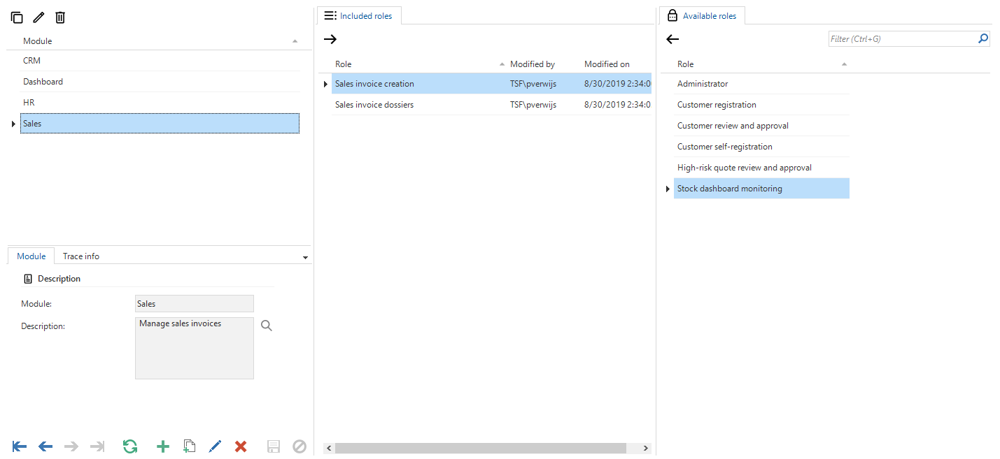

The 2019.2 release of the Thinkwise Platform features a lot of improvements and additions, and over 70 feature requests and issues have been addressed.
The most important changes are listed in this post. A complete list of all changes can be found in the [Thinkwise Community Portal](https://office.thinkwisesoftware.com/tcp).

<!--truncate-->

- [Upgrade notes](#upgrade-notes)
  - [SQL Server and .NET Framework support](#sql-server-and-net-framework-support)
- [Projects](#projects)
  - [Requirements & Design 3.0](#requirements--design-30)
  - [Unit testing & Mock data](#unit-testing--mock-data)
- [Software Factory](#software-factory)
  - [New ](#new-sf)
    - [Tags in modelers](#tags-in-modelers)
    - [Conditional layout help text](#conditional-layout-help-text)
    - [Module authorization](#module-authorization)
    - [Show the number of parameters for assigned templates](#show-the-number-of-parameters-for-assigned-templates)
    - [Mandatory exclusive prefilter groups](#mandatory-exclusive-prefilter-groups)
    - [Cubes in menu](#cubes-in-menu)
    - [Validation and review assignments tab page](#validation-and-review-assignments-tab-page)
    - [Change path to UNIX format](#change-path-to-unix-format)
    - [Create task to claim a code review](#create-task-to-claim-a-code-review)
    - [Universal Theme](#universal-theme)
    - [Universal Theme - Conditional layout](#universal-theme---conditional-layout)
    - [New icons in SF](#new-icons-in-sf)
    - [Validations](#validations)
  - [Changed ](#changed-sf)
  - [Fixed ](#fixed-sf)
- [Intelligent Application Manager](#intelligent-application-manager)
  - [New ](#new-iam)
    - [Concurrent access limitations](#concurrent-access-limitations)
    - [New icons in IAM](#new-icons-in-iam)
    - [Grouped tab pages for Applications](#grouped-tab-pages-for-applications)
  - [Changed ](#changed-iam)
  - [Fixed ](#fixed-iam)
- [Data model changes](#data-model-changes)
  - [Changes Software Factory](#changes-software-factory)
    - [Table changes ](#table-changes-sf)
    - [Column changes ](#column-changes-sf)
  - [Changes Intelligent Application Manager](#changes-intelligent-application-manager)
    - [Table changes ](#table-changes-iam)
    - [Column changes ](#column-changes-iam)

## Upgrade notes

### SQL Server and .NET Framework support

No changes were made here, so the required SQL Server and .NET Framework support remain the same as in the 2019.1 version.

- The Software Factory development environment and the Intelligent Application Manager require SQL Server 2012 or higher.
- This also applies to the Windows and Web userinterfaces, which additionally need version 4.7 of the .NET Framework (4.7.**2** is advised for Web).
- The Indicium application tier requires SQL Server 2012 or higher, .NET 4.7.2 and .NET Core 2.1.5.

For more information about supported technologies, see the Thinkwise [Lifecycle Policy](/docs/docs/kb/lifecycle_policy.html).

---

## Projects

### Requirements & Design 3.0

Requirements & Design got a massive overhaul. A couple of highlights:

- User requirements are formally changed to a process overview
- An overview is added to categorize requirements and work into features
- An overview is added to categorize requirements and work into iterations
- Requirements can be placed anywhere in these views and are categorized into various types
- Design specifications are split into either requirements or work
- Logging and tracing is added without the need to create baselines
- All specifications and work reside outside of the project versions

### Unit testing & Mock data

Unit testing now supports processes and tasks. Data sets can be selected as mock data for the unit test.
The mock data can be created in the *Data sets* screen. In this screen tables can be chosen to be mocked, and rows can be filled as test data.

It is now also possible to use an *Assertion query* to check the unit test results for expected outcome.

---

## Software Factory

### New 

#### Tags in modelers

Tags are now visible in the modelers for tables, columns, tasks, task parameters, reports and report parameters.

#### Conditional layout help text

The explanation of conditional layout can now be shown in the help, by generating translation objects for conditional layout.
When the help text is filled with an explanation of the conditional layout, it will be shown in the help.

#### Module authorization

This is a new feature that allows the creation of modules comprised of one or more roles, that can be deployed individually. Modules can be defined in the role moduler under the *Module* menu item under *Access control*. Roles can be added to modules by dragging and dropping them onto the modules. Once created, a module can be selected on the *Synchronize to IAM* or *Deployment package* screens. This will synchronize or deploy only the roles in the selected modules.

#### Show the number of parameters for assigned templates

When there are parameters present for assigned templates, a badge will be shown with the amount of parameters.

#### Mandatory exclusive prefilter groups

Exclusive prefilter groups can now be marked as mandatory. One prefilter within this prefilter group must be enabled in order to see data.
The user cannot turn off the active prefilter manually and can only activate a different prefilter instead.

Exclusive prefilter groups have also been improved:

- When a locked/hidden prefilter is active, other regular prefilters will be turned off and locked or hidden.
- When multiple locked/hidden prefilters are active, no data will be returned.
- When multiple regular prefilters are active, only the first prefilter will be activated (based on the order number)

It is possible that the user adds a record that is not present within the current mandatory exclusive prefilter group selection.
The GUI will then not change the currently activated mandatory exclusive prefilters.
The GUI is not yet able to determine which one of the available mandatory exclusive prefilters should be activated to find the record.
This will be added in a future release. Keep this in mind when designing process flows that assume the record is selected after adding or updating the record.

#### Cubes in menu

Based on feedback from our users, we dediced to reintroduce the cube modeler in the menu. The screen is placed on its old place in *User Interface*.

#### Validation and review assignments tab page

An *Assignments* tab page is added in the *Validations* and *Code review* screen.
Here the statistics are shown of how many validations or code reviews are assigned to a developer.

#### Change path to UNIX format

UNIX format is now supported for the task to change a path.

#### Create task to claim a code review

A task is added to the *Code review* screen to claim a changelog as reviewer. It is also possible to appoint a reviewer other than yourself.

#### Universal Theme

A new type of theme is introduced for Universal applications. This theme is very lean and easy to use.

Universal Themes can start dark or light. Users are then able to switch from the default to the other style.
Therefore background picture, main color, accent color and warn color is set for both Dark theme and Light theme.

#### Universal Theme - Conditional layout

The definition of conditional layouts is extended to support colors for Universal. For Universal applications, it is no longer possible to set a complete font.
It is only possible to modify the color, bold or italic of the font. This makes it easier to create a uniform application with the same font face and font size.  
A user can choose between the Light theme or the Dark theme.

#### New icons in SF

The Software Factory has got a new look by replacing all used icons for new SVG icons. These icons are in the Material style to better suit the Universal GUI in the future.  

#### Validations

We have added the following validations to help you further improve the quality of your applications:

- Thinkwise concepts
  - The default main, detail or popup screen type is empty
  - Dark/light theme picture is outside the project folder
- Datamodel
  - Domain length is smaller than the scale
  - Primary key column is a file storage column
- GUI definitions
  - The look-up chain is circular
  - The cardinality of the look-up is invalid
  - Mandatory prefilter group does not have a main/detail/look-up subject prefilter active by default/by default in a variant
  - Table with a prefilter/task/report uses a main/detail screen type without the corresponding component
- Process flows
  - Combined length of process flow and process action is too long (may not exceed the maximum length of 120 characters)
  - Process action tries to activate or zoom in on an unreachable detail
- Performance
  - HTML or RTF column in variant is used for default sorting
  - HTML or RTF column with default/layout/context input/output is not used in corresponding logic
- Logic layer
  - Unit test failed
  - Unit test is not executed
  - Unit test is not linked to a control procedure
- Access control
  - All process actions are available, but the process flow is not granted
  - API subroutine/List bar item/Process flow/Report/Table/Task/Tile/Treeview item is not assigned to a role
  - Exclusive prefilters group with data authorization prefilter
  - Module has no assigned roles
  - Process flow is granted, but not all process actions are available
  - Report is available and granted, but no visible parameters are available or granted
  - Role contains multiple menu items
  - Role is not assigned to any objects
  - Table selection is granted, but no visible columns are editable or read only
  - Task is available and granted, but no visible parameters are available or granted

### Changed 

- **Longer processflow name possible** - Processflow names can now be 100 characters long instead of 50. What is important to keep in mind is that the combined length of the process flow and process action may not exceed the maximum length of 120 characters. We have also added a validation to check this.
- **Push code changes directly to the changelog** - While a control procedure status is equal to *Ready for review*, all changes made to the code will now be pushed directly to the changelog and a changelog comment will be added as an update message.
- **Restrictions on role names in SF** - Illegal characters in role names are replaced by an underscore (_) because these characters cause problems when the roles are effectuated on the database.
- **Linked base project version for branches** - When deleting a branch also delete the linked base project version if it is not used by other branches.
- **Data conversion - identity seed** - The identity seed in a table will now always remain the same, or will be set to a higher value, after an upgrade of the table on the SQL Server database platform. This prevents identity values of deleted rows from being reused. This could occur when a record with the highest identity value was deleted before the upgrade.
- **Validations** - Changed the following validations:
  - HTML or RTF column in variant is visible in the grid - The validation has been adjusted so that it checks whether the basis is stricter than in the variant. This means that if the column is hidden in the main table, but regular in the variant, it will not be a result in the validation. After all, the column will not be shown in the GUI.
  - Accessible task has no icon (drag & drop) - The validation that a accesible task has no icon, will no longer look for drag & drop tasks. These are automatically hidden by the GUI.

### Fixed 

- **New project versions now contain the last code history** - The last code history will now be copied to the new project version with the copy project version task.
- **Performance validation drag-drop link enabled** - Improved the performance of the validation which checks whether a drag-drop is enabled.
- **Changed validation - Domain is not used (performance)** - Fixed performance by excluding references with ref_add *all_projects*. These are references that are not in context of a project/project_version. They should not be present in this function.
- **Rename table fix when linked to process action** - When renaming a table, the reference will also be renamed. This means that the places where this reference is used also must be renamed. This is fixed for the table *Process actions* which uses *Reference id*.
- **Create cube - Table ID** - When using the create cube task, the table id will now be set correctly.
- **Recreate deleted task with the same name** - It is made possible again, that after deleting a task, the task can be recreated using the same name as it did before.

---

## Intelligent Application Manager

### New 

#### Concurrent access limitations

A new feature is added to restrict the number of concurrent sessions per account. This can be set per application.

Current users with sessions can still use the application. Only new sessions are blocked when the maximum number of sessions is exceeded.

#### New icons in IAM

IAM has got a new look by replacing all used icons for new SVG icons. These icons are in the Material style to better suit the Universal GUI in the future.

#### Grouped tab pages for Applications

The *Preferences* and *Effective rights* tab pages in the *Applications* screen are now grouped tab pages. Both show a *Group* tab page (new for *Effective rights*) and a *User* tab page (new for *Preferences*).

### Changed 

- **Show newest project version first** - In the combo of the task to copy applications, the list of project versions is sorted based on the newest version first.
- **Enlarged log fields** - The maximum capacity of log fields has changed from 1000 to 4000, so changes on users with long first names, last names, etc can be correctly facilitated.
- **IAM Sync dates** - IAM now tracks deployment date and deployment package creation date seperately for project versions.
- **Replaced icons in IAM** - The Intelligent Application Manager has got a new look by replacing all used icons for new SVG icons. These icons are in the Material style to better suit the Universal GUI in the future.

### Fixed 

- **Custom prefilters and status issues resolved** - Issues regarding table prefilter status in IAM are resolved, as well as conversion errors while modifying custom user prefilters.
- **Task to set theme (at group preferences)** - The task *Set theme (at group preferences)* would give an error when the application supports more than one platform. This error is fixed to support multiple platforms as well.

---

## Data model changes

### Changes Software Factory

#### Table changes 

| SF - From table       | SF - To table                               |
| --------------------- | ------------------------------------------- |
| -                     | acceptance_status                           |
| -                     | business_process                            |
| -                     | business_process_diagram_link               |
| -                     | business_process_diagram_link_control_point |
| -                     | business_process_diagram_node               |
| -                     | business_process_html                       |
| -                     | business_process_tag                        |
| -                     | data_set                                    |
| -                     | data_set_tab                                |
| -                     | deployment_module                           |
| -                     | deployment_module_role                      |
| -                     | feature                                     |
| -                     | feature_tag                                 |
| -                     | forbidden_word                              |
| -                     | iteration                                   |
| -                     | iteration_tag                               |
| -                     | process_flow_schedule                       |
| -                     | report_parmtr_tag                           |
| -                     | requirement                                 |
| -                     | requirement_attachment                      |
| -                     | requirement_comment                         |
| -                     | requirement_log                             |
| -                     | requirement_tag                             |
| -                     | specification_status                        |
| -                     | tab_data                                    |
| -                     | tab_data_col                                |
| -                     | task_parmtr_tag                             |
| -                     | unit_test_data_set                          |
| -                     | unit_test_process_step_input                |
| -                     | unit_test_process_step_output               |
| -                     | unit_test_process_variable_input            |
| -                     | unit_test_process_variable_output           |
| -                     | unit_test_result_assertion                  |
| -                     | unit_test_result_mismatch                   |
| -                     | work                                        |
| -                     | work_attachment                             |
| -                     | work_log                                    |
| -                     | work_status                                 |
| -                     | work_tag                                    |
| role_platform         | -                                           |
| unit_test_preparation | -                                           |

#### Column changes 

| SF - From table           | SF - From column         | SF - To table             | SF - To column                     |
| ------------------------- | ------------------------ | ------------------------- | ---------------------------------- |
| conditional_layout        | -                        | conditional_layout        | background_type                    |
| conditional_layout        | -                        | conditional_layout        | background_color_light             |
| conditional_layout        | -                        | conditional_layout        | background_color_dark              |
| conditional_layout        | -                        | conditional_layout        | font_color_light                   |
| conditional_layout        | -                        | conditional_layout        | font_color_dark                    |
| conditional_layout        | -                        | conditional_layout        | bold                               |
| conditional_layout        | -                        | conditional_layout        | italic                             |
| design_module             | -                        | design_module             | feature_id                         |
| design_spec               | -                        | design_spec               | work_id                            |
| report_conditional_layout | -                        | report_conditional_layout | background_type                    |
| report_conditional_layout | -                        | report_conditional_layout | background_color_light             |
| report_conditional_layout | -                        | report_conditional_layout | background_color_dark              |
| report_conditional_layout | -                        | report_conditional_layout | font_color_light                   |
| report_conditional_layout | -                        | report_conditional_layout | font_color_dark                    |
| report_conditional_layout | -                        | report_conditional_layout | bold                               |
| report_conditional_layout | -                        | report_conditional_layout | italic                             |
| req                       | -                        | req                       | business_process_id                |
| req                       | -                        | req                       | requirement_id                     |
| sf_configuration          | -                        | sf_configuration          | default_cmpy_name                  |
| sf_upgrade_validation_msg | -                        | sf_upgrade_validation_msg | pk_hash                            |
| tab_prefilter_grp         | -                        | tab_prefilter_grp         | mand                               |
| task_conditional_layout   | -                        | task_conditional_layout   | background_type                    |
| task_conditional_layout   | -                        | task_conditional_layout   | background_color_light             |
| task_conditional_layout   | -                        | task_conditional_layout   | background_color_dark              |
| task_conditional_layout   | -                        | task_conditional_layout   | font_color_light                   |
| task_conditional_layout   | -                        | task_conditional_layout   | font_color_dark                    |
| task_conditional_layout   | -                        | task_conditional_layout   | bold                               |
| task_conditional_layout   | -                        | task_conditional_layout   | italic                             |
| test_run                  | runned_by_user           | test_run                  | -                                  |
| theme                     | -                        | theme                     | theme_type                         |
| theme                     | -                        | theme                     | universal_theme_type               |
| theme                     | -                        | theme                     | universal_header_font              |
| theme                     | -                        | theme                     | universal_body_font                |
| theme                     | -                        | theme                     | universal_main_color_light         |
| theme                     | -                        | theme                     | universal_main_color_dark          |
| theme                     | -                        | theme                     | universal_accent_color_light       |
| theme                     | -                        | theme                     | universal_accent_color_dark        |
| theme                     | -                        | theme                     | universal_warn_color_light         |
| theme                     | -                        | theme                     | universal_warn_color_dark          |
| theme                     | -                        | theme                     | universal_background_picture_light |
| theme                     | -                        | theme                     | universal_background_picture_dark  |
| unit_test                 | -                        | unit_test                 | use_assertion_query                |
| unit_test                 | -                        | unit_test                 | assertion_query                    |
| unit_test                 | unit_test_preparation_id | unit_test                 | -                                  |
| unit_test_msg             | msg_id                   | unit_test_msg             | expected_msg_id                    |
| unit_test_result_msg      | msg_id                   | unit_test_result_msg      | expected_msg_id                    |

### Changes Intelligent Application Manager

#### Table changes 

| IAM - From table               | IAM - To table                      |
| ------------------------------ | ----------------------------------- |
| -                              | appl_claim                          |
| -                              | process_flow_schedule               |
| -                              | process_flow_schedule_log           |
| -                              | usr_pref_model_tab_prefilter_status |
| -                              | usr_pref_tab_prefilter_status       |
| role_platform                  | -                                   |
| usr_pref_tab_prefilter_status  | -                                   |

#### Column changes 

| IAM - From table           | IAM - From column     | IAM - To table            | IAM - To column                     |
| -------------------------- | --------------------- | ------------------------- | ----------------------------------- |
| conditional_layout         | -                     | conditional_layout        | background_type                     |
| conditional_layout         | -                     | conditional_layout        | background_color_light              |
| conditional_layout         | -                     | conditional_layout        | background_color_dark               |
| conditional_layout         | -                     | conditional_layout        | font_color_light                    |
| conditional_layout         | -                     | conditional_layout        | font_color_dark                     |
| conditional_layout         | -                     | conditional_layout        | bold                                |
| conditional_layout         | -                     | conditional_layout        | italic                              |
| gui_appl                   | -                     | gui_appl                  | max_concurrent_sessions_per_account |
| gui_appl                   | -                     | gui_appl                  | claim_timeout                       |
| project_vrs                | -                     | project_vrs               | sync_date_time                      |
| project_vrs                | last_sync_date_time   | project_vrs               | sync_creation_date_time             |
| report_conditional_layout  | -                     | report_conditional_layout | background_type                     |
| report_conditional_layout  | -                     | report_conditional_layout | background_color_light              |
| report_conditional_layout  | -                     | report_conditional_layout | background_color_dark               |
| report_conditional_layout  | -                     | report_conditional_layout | font_color_light                    |
| report_conditional_layout  | -                     | report_conditional_layout | font_color_dark                     |
| report_conditional_layout  | -                     | report_conditional_layout | bold                                |
| report_conditional_layout  | -                     | report_conditional_layout | italic                              |
| tab_prefilter              | -                     | tab_prefilter             | grp_prefilter_mand                  |
| task_conditional_layout    | -                     | task_conditional_layout   | background_type                     |
| task_conditional_layout    | -                     | task_conditional_layout   | background_color_light              |
| task_conditional_layout    | -                     | task_conditional_layout   | background_color_dark               |
| task_conditional_layout    | -                     | task_conditional_layout   | font_color_light                    |
| task_conditional_layout    | -                     | task_conditional_layout   | font_color_dark                     |
| task_conditional_layout    | -                     | task_conditional_layout   | bold                                |
| task_conditional_layout    | -                     | task_conditional_layout   | italic                              |
| theme                      | -                     | theme                     | universal_theme_type                |
| theme                      | -                     | theme                     | universal_header_font               |
| theme                      | -                     | theme                     | universal_body_font                 |
| theme                      | -                     | theme                     | universal_main_color_light          |
| theme                      | -                     | theme                     | universal_main_color_dark           |
| theme                      | -                     | theme                     | universal_accent_color_light        |
| theme                      | -                     | theme                     | universal_accent_color_dark         |
| theme                      | -                     | theme                     | universal_warn_color_light          |
| theme                      | -                     | theme                     | universal_warn_color_dark           |
| theme                      | -                     | theme                     | universal_background_picture_light  |
| theme                      | -                     | theme                     | universal_background_picture_dark   |
| usr                        | -                     | usr                       | gender                              |
| usr                        | -                     | usr                       | profile_picture                     |
