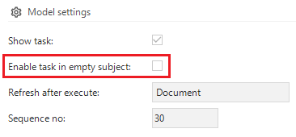

The 2020.1 release of the Thinkwise Platform features a lot of improvements and additions, and over 50 feature requests and issues have been addressed. The most important changes are listed in this post.

<!--truncate-->

- [Upgrade notes](#upgrade-notes)
  - [SQL Server and .NET Framework support](#sql-server-and-net-framework-support)
- [Projects](#projects)
  - [Requirements and Design](#requirements-and-design)
    - [Possibility to sort in Specification module](#possibility-to-sort-in-specification-module)
    - [Specification review improvements](#specification-review-improvements)
    - [Work linking &amp; history](#work-linking-amp-history)
- [Software Factory](#software-factory)
  - [New](#new)
    - [[BREAKING CHANGE] Domain element sorting](#breaking-change-domain-element-sorting)
    - [Automatically map process variables](#automatically-map-process-variables)
    - [Choose upgrade type when deploying your end product](#choose-upgrade-type-when-deploying-your-end-product)
    - [Conditional layout for disabled program objects](#conditional-layout-for-disabled-program-objects)
    - [Data conversion: columns](#data-conversion-columns)
    - [Disable a task when no row is selected: setup for SF &amp; IAM](#disable-a-task-when-no-row-is-selected-setup-for-sf-amp-iam)
    - [OpenID configuration](#openid-configuration)
    - [Set Control Procedure status from Review back to Development](#set-control-procedure-status-from-review-back-to-development)
    - [System flow scheduling - SF](#system-flow-scheduling---sf)
    - [Task and subroutine description](#task-and-subroutine-description)
    - [Temporal table support](#temporal-table-support)
    - [Temporarily approve validations](#temporarily-approve-validations)
    - [Unit test triggers](#unit-test-triggers)
  - [Changed](#changed)
  - [Fixed](#fixed)
- [Intelligent Application Manager](#intelligent-application-manager)
  - [New](#new-1)
    - [Delete user group user](#delete-user-group-user)
    - [Application preferences in IAM](#application-preferences-in-iam)
    - [System flow scheduling - IAM](#system-flow-scheduling---iam)
  - [Changed](#changed-1)
  - [Fixed](#fixed-1)
- [Data model changes](#data-model-changes)
  - [Changes Software Factory](#changes-software-factory)
    - [Table changes](#table-changes)
    - [Column changes](#column-changes)
  - [Changes Intelligent Application Manager](#changes-intelligent-application-manager)
    - [Table changes](#table-changes-1)
    - [Column changes](#column-changes-1)

## Upgrade notes

### SQL Server and .NET Framework support

Thinkwise Platform version 2020.1 will no longer officially support SQL Server 2012 and SQL Server 2014. The official minimum supported version of SQL Server will be 2016.

Version 2020.1 of the Software Factory will leverage temporal tables. This immediately brings the minimum required version of SQL Server to 2016 upon release. The Deployment Center will prevent installation or upgrade of the Software Factory to version 2020.1 when the SQL Server version is below 2016 or the database compatibility of the Software Factory database is below SQL Server 2016.

For more information about this change, see <https://community.thinkwisesoftware.com/blogs-21/end-of-sql-server-2012-2014-support-820>.

The required .NET Framework support remains the same as in the 2019.2 version.

- The Software Factory development environment and the Intelligent Application Manager require SQL Server 2016 or higher.
- This also applies to the Windows and Web userinterfaces need version 4.7 of the .NET Framework (4.7.**2** is advised for Web).
- The Indicium application tier requires SQL Server 2012 or higher, .NET 4.7.2 and .NET Core 2.1.5.

For more information about supported technologies, see the Thinkwise [Lifecycle Policy](/docs/docs/kb/lifecycle_policy.html).

---

## Projects

### Requirements and Design

#### Possibility to sort in Specification module

In the following subjects in module Specification it is now possible to sort the objects:

- Business processes
- Features
- Iterations
- Requirements
- Work

#### Specification review improvements

Baselines can again be defined. A baseline does not have to match the time of creation but can also be defined for an arbitrary point in time.

The baseline can be used in specification review. Stakeholders reviewing the specifications can now be configured to view the specifications at a baseline or point in time. Furthermore, specific business processes, features or iterations can now be selected for review for a stakeholder.

Comments can be added during specification review by stakeholders. Comments now have a status flow.

#### Work linking & history

Work can now be attributed to a certain project version. The history of any object in the model can now be viewed using Ctrl-H. When showing the history of any object throughout project versions, the related work will be shown.

Work can be distributed over project versions in advance. Planned project versions can be specified for work and created on demand.

---

## Software Factory

### New

#### [BREAKING CHANGE] Domain element sorting

For each domain with elements, one can choose between lexical ordering (by translation) and order by order number. Dropdowns and sorting in the grid both honor this new setting. This means it will be a breaking change for domains where both orders are different.

Best performance will be to match the order of database values with the order as defined by the order number, and then choosing to order by order number. Clients then omit the `case` statement from generated select SQL queries.

#### Automatically map process variables

Process variables are now automatically mapped on input/output parameters or columns.

#### Choose upgrade type when deploying your end product

It is now possible to choose if the deployment package should perform a full upgrade or a smart upgrade.

#### Conditional layout for disabled program objects

It can occur that a program object is not enabled, but does have an template assignment because of the control procedure code. In this case the program object will be highlighted red, in the same way as with *Static assignments*.

#### Data conversion: columns

You can now also find an overview of all the (changed) columns in *Data conversion*. These columns are not in the context of a table.

#### Disable a task when no row is selected: setup for SF & IAM

It is now to possible to specify that a table task should be hidden when there is no data shown in the screen. This can occur when there really is no data present or when a (pre)filter has no data for output. This way, no functionality needs to be written in a context procedure to hide the task for the table.

For this reason, the following validation has also been added in the GUI definitions group: *Task without linked parameters is disabled for table when screen is empty*.

#### OpenID configuration

OpenID can be configured in IAM. OpenID allows you to use an existing account to sign in to multiple websites, without
needing to create new passwords. These websites can be configured in OpenID clients.

You may choose to associate information with your OpenID that can be shared with the websites you visit, such as a name
or email address. With OpenID, you control how much of that information is shared with the websites you visit. This
information can be set as OpenID resources.

With OpenID, your password is only given to IAM, IAM then confirms your identity to the websites you visit.  Other than
IAM, no website ever sees your password, so you don’t need to worry about an unscrupulous or insecure website
compromising your identity.

#### Set Control Procedure status from *Review* back to *Development*

A new task has been added to the functionality screen that changes the status of control procedures in review back to
development. This allows for canceling the review status when more development is needed. The changelog and any comments
will still be available.

#### System flow scheduling - SF

The execution of process flows can be planned. Multiple schedules for a process flow can be defined in the Software
Factory. These are then synchronized to the Intelligent Application Manager where the application manager can choose the
desired schedule. Indicium then asks IAM which process flows are planned to be executed. Because the execution is done
by Indicium, the process flow may not contain any user actions, since no user interface is used. In the Software Factory
there are validations to prevent this or other faulty model settings, for example there may not be multiple start nodes
in the flow.

#### Task and subroutine description

Added a description field for tasks and subroutines.

#### Temporal table support

From SF 2020.1 it is possible to set up temporal tables in the SF. Currently this is only supported for SQL Server. In the future there will be determined if this support should be expanded for DB2 and Oracle.

For this reason, the following validations have also been added in the Datamodel group: *Table name is reserved for a system version table* and *Column name is reserved for a system version table*.

#### Temporarily approve validations

Validation messages can now be temporarily approved. This can be done for the whole branch or the next project version.

#### Unit test triggers

Unit Test has been expanded with the possibility to test triggers. Triggers can be tested for insert, update and delete.
The input values are used to set the input for the insert and update and the row filter values are used in the where
clause. The Unit Test is performed within a transaction and end with a rollback after the unit test has been performed.
Within this transaction, an assertion query can be performed to check whether the trigger has done what it was supposed
to do. When creating a Unit Test for triggers, an example assertion query is shown by default.

### Changed

- **Default value of conditions for prefilter columns and conditional layout conditions** - Prefilter columns have now a default condition that is *equal to* instead of *contains*. This is because equal to is faster than contains (which will result in a like).  The same applies for conditional layout conditions for tasks, reports and tables.
- **Description when copying a project version** - It is now possible to directly fill the project version description when using the *Copy project version* task, which saves a lot of unnecessary clicks after the project version has been copied.
- **Default height for HTML and RTF fields** - Both HTML and RTF fields now have a standard height of 5 lines.
- **Start journal after table upgrade** - The smart upgrade now turns on the journalling when at least 1 table is included in the upgrade.
- **CLR assembly creation** - The CLR assembly codegroup will first completely drop all assemblies and dependencies before creating the assemblies to avoid conflicting dependencies.
- **Label and icon for form groups** - With form groups, the label and icon are emptied when you uncheck the box. Similar behavior has now also been applied to the grid, and to the form and grid of the tab / task / report variant.
- **Sorting for tiles** - Tiles are now sorted the same as list bar items and module items.
- **Unit test - Create unit test in functionality modeler** - Unit Tests can be created in the functionality modeler. Because the control procedure templates can be assigned to multiple program objects the Unit Test will be linked with the control procedure id. A Unit Test can be bound to every program object in the model, not just the assigned program objects.
- **Unit test - Show message for aborted unit tests** - When a unit test is aborted due a error and this was not expected or when a unit test is not aborted while this was expected, a message is thrown to let the developer know whats wrong with the unit test execution.

### Fixed

- **Auto copy domain properties** - Fixed domain properties not getting copied correctly for task and report parameters when the domain id was autofilled.
- **Data anonimyzation is incorrect with multiple unique items** - Fixed a situation where data anonymization would incorrectly assume the chosen data set had enough unique values when the table contained a unique constraint on one or more of the columns.
- **File storage in base projects** - Configuring file storage in a base project will now copy that configuration to all linked projects.
- **Comparisment always shows branch and merge** - In merge sessions a Comparison tab page is shown. In some cases this tab page would show a base or snapshot version instead of the trunk or the branch. Now the trunk and the branch version are always shown.
- **Conversion errors in Anonymize data** - Conversion errors in Anonymize data task are now solved
- **Performance of synchronization to IAM script** - Formatted the XML in the sync script so that each row is 1 block, and every value in that row begins on a new line. The script opens quickly again and is a lot more readable.
- **Synchronization host** - Only when the host cannot be retrieved from the sync history, and the field is empty in the task, the host from the default runtime configuration will be used. It is now no longer incorrectly overwritten.
- **Unit test fixes** - The following fixed have been made:
  - Button types can be used with unit test.
  - Task parameters can be defined and not be used by the task (stored procedure) itself. These parameters should not be used when executing the stored procedure.
  - The return values for BIT datatypes or converted from false and true to 0 or 1 for consistency.
  - Numeric values are no longer rounded to a int when using mock data.
  - Expected messages should not be deleted when the message is deleted.

---

## Intelligent Application Manager

### New

#### Delete user group user

Task created to:

- From user group approach: remove multiple users from the user group
- From user perspective: remove the user from multiple user groups

#### Application preferences in IAM

The concept of application preferences has been introduced. It is now possible to hide columns, task parameters and report parameters application wide. This therefore applies to all users in all user groups.

#### System flow scheduling - IAM

When a process flow consists only of actions that do not require user input, Indicium can perform this itself. We call
this a system flow. For system flows, one or more schedules can be made in the Software Factory. The application manager
can set in IAM which schedule is active for a system flow. Indicium retrieves this schedule and executes the desired
system flow.

### Changed

- **Innovation fee report end date selection and extra info** - The user can now pick an end date, and extra info (amount of current active users) is added to the report.

### Fixed

No fixes were made for IAM.

---

## Data model changes

Data model changes for the Software Factory and IAM meta-models are listed here. This overview be used as reference to fix dynamic control procedures, dynamic model code or custom validations after an upgrade.

### Changes Software Factory

#### Table changes

| SF - From table | SF - To table                       |
|-----------------|-------------------------------------|
| -               | future_project                      |
| -               | future_project_vrs                  |
| -               | specification_baseline              |
| -               | unit_test_col_filter                |
| -               | unit_test_type                      |
| -               | unit_test_type_fixed_parmtr         |
| -               | unit_test_type_object               |
| -               | usr_business_process                |
| -               | usr_feature                         |
| -               | usr_iteration                       |
| -               | validation_msg_approved_branch      |
| -               | validation_msg_approved_project_vrs |
| printer_type    | -                                   |

#### Column changes

| SF - From table                   | SF - From column              | SF - To table                     | SF - To column                  |
|-----------------------------------|-------------------------------|-----------------------------------|---------------------------------|
| business_process                  | -                             | business_process                  | order_no                        |
| business_process_comment          | -                             | business_process_comment          | comment_status                  |
| business_process_comment          | -                             | business_process_comment          | point_in_time                   |
| dom                               | -                             | dom                               | sort_order_elemnt               |
| execution_run                     | -                             | execution_run                     | upgrade_method                  |
| feature                           | -                             | feature                           | order_no                        |
| iteration                         | -                             | iteration                         | order_no                        |
| printer                           | printer_type_id               | printer                           | -                               |
| process_flow                      | -                             | process_flow                      | default_schedule_id             |
| project_vrs                       | -                             | project_vrs                       | previous_project_id             |
| project_vrs                       | -                             | project_vrs                       | previous_project_vrs_id         |
| requirement                       | -                             | requirement                       | order_no                        |
| requirement                       | -                             | requirement                       | order_no_in_business_process    |
| requirement                       | -                             | requirement                       | order_no_in_feature             |
| requirement                       | -                             | requirement                       | order_no_in_iteration           |
| requirement_comment               | -                             | requirement_comment               | comment_status                  |
| requirement_comment               | -                             | requirement_comment               | point_in_time                   |
| role_tab                          | allow_dragging_fields_granted | role_tab                          | dragging_fields_granted         |
| subroutine                        | -                             | subroutine                        | subroutine_desc                 |
| tab                               | -                             | tab                               | use_system_versioning           |
| tab_task                          | -                             | tab_task                          | enable_tab_task_when_empty      |
| task                              | -                             | task                              | task_desc                       |
| unit_test                         | -                             | unit_test                         | type_of_object                  |
| unit_test                         | prog_object_id                | unit_test                         | -                               |
| unit_test                         | object_id                     | unit_test                         | -                               |
| unit_test                         | prog_object_type_id           | unit_test                         | unit_test_type_id               |
| unit_test_col_input               | prog_object_id                | unit_test_col_input               | -                               |
| unit_test_col_input               | object_id                     | unit_test_col_input               | -                               |
| unit_test_col_output              | prog_object_id                | unit_test_col_output              | -                               |
| unit_test_col_output              | object_id                     | unit_test_col_output              | -                               |
| unit_test_col_type                | prog_object_id                | unit_test_col_type                | -                               |
| unit_test_col_type                | object_id                     | unit_test_col_type                | -                               |
| unit_test_data_set                | prog_object_id                | unit_test_data_set                | -                               |
| unit_test_fixed_parmtr_input      | prog_object_id                | unit_test_fixed_parmtr_input      | -                               |
| unit_test_fixed_parmtr_output     | prog_object_id                | unit_test_fixed_parmtr_output     | -                               |
| unit_test_msg                     | prog_object_id                | unit_test_msg                     | -                               |
| unit_test_process_step_input      | prog_object_id                | unit_test_process_step_input      | -                               |
| unit_test_process_step_input      | object_id                     | unit_test_process_step_input      | -                               |
| unit_test_process_step_output     | prog_object_id                | unit_test_process_step_output     | -                               |
| unit_test_process_step_output     | object_id                     | unit_test_process_step_output     | -                               |
| unit_test_process_variable_input  | prog_object_id                | unit_test_process_variable_input  | -                               |
| unit_test_process_variable_input  | object_id                     | unit_test_process_variable_input  | -                               |
| unit_test_process_variable_output | prog_object_id                | unit_test_process_variable_output | -                               |
| unit_test_process_variable_output | object_id                     | unit_test_process_variable_output | -                               |
| unit_test_ref_output              | prog_object_id                | unit_test_ref_output              | -                               |
| unit_test_ref_output              | object_id                     | unit_test_ref_output              | -                               |
| unit_test_report_parmtr_input     | prog_object_id                | unit_test_report_parmtr_input     | -                               |
| unit_test_report_parmtr_input     | object_id                     | unit_test_report_parmtr_input     | -                               |
| unit_test_report_parmtr_output    | prog_object_id                | unit_test_report_parmtr_output    | -                               |
| unit_test_report_parmtr_output    | object_id                     | unit_test_report_parmtr_output    | -                               |
| unit_test_report_parmtr_type      | prog_object_id                | unit_test_report_parmtr_type      | -                               |
| unit_test_report_parmtr_type      | object_id                     | unit_test_report_parmtr_type      | -                               |
| unit_test_result                  | prog_object_id                | unit_test_result                  | -                               |
| unit_test_result_assertion        | prog_object_id                | unit_test_result_assertion        | -                               |
| unit_test_result_mismatch         | prog_object_id                | unit_test_result_mismatch         | -                               |
| unit_test_result_msg              | prog_object_id                | unit_test_result_msg              | -                               |
| unit_test_result_msg              | msg                           | unit_test_result_msg              | actual_msg                      |
| unit_test_result_parmtr           | prog_object_id                | unit_test_result_parmtr           | -                               |
| unit_test_result_parmtr_type      | prog_object_id                | unit_test_result_parmtr_type      | -                               |
| unit_test_tab_report_output       | prog_object_id                | unit_test_tab_report_output       | -                               |
| unit_test_tab_report_output       | object_id                     | unit_test_tab_report_output       | -                               |
| unit_test_tab_task_output         | prog_object_id                | unit_test_tab_task_output         | -                               |
| unit_test_tab_task_output         | object_id                     | unit_test_tab_task_output         | -                               |
| unit_test_task_parmtr_input       | prog_object_id                | unit_test_task_parmtr_input       | -                               |
| unit_test_task_parmtr_input       | object_id                     | unit_test_task_parmtr_input       | -                               |
| unit_test_task_parmtr_output      | prog_object_id                | unit_test_task_parmtr_output      | -                               |
| unit_test_task_parmtr_output      | object_id                     | unit_test_task_parmtr_output      | -                               |
| unit_test_task_parmtr_type        | prog_object_id                | unit_test_task_parmtr_type        | -                               |
| unit_test_task_parmtr_type        | object_id                     | unit_test_task_parmtr_type        | -                               |
| usr                               | -                             | usr                               | use_specification_authorization |
| usr                               | -                             | usr                               | specification_point_in_time     |
| work                              | -                             | work                              | order_no                        |
| work                              | -                             | work                              | order_no_in_requirement         |
| work                              | -                             | work                              | order_no_in_business_process    |
| work                              | -                             | work                              | order_no_in_feature             |
| work                              | -                             | work                              | order_no_in_iteration           |
| work                              | -                             | work                              | planned_project_id              |
| work                              | -                             | work                              | planned_project_vrs_id          |
| work_comment                      | -                             | work_comment                      | comment_status                  |
| work_comment                      | -                             | work_comment                      | point_in_time                   |
| work_log                          | -                             | work_log                          | planned_project_id              |
| work_log                          | -                             | work_log                          | planned_project_vrs_id          |
| work_status                       | -                             | work_status                       | inactive                        |

### Changes Intelligent Application Manager

#### Table changes

| IAM - From table          | IAM - To table                        |
|---------------------------|---------------------------------------|
| -                         | gui_appl_pref_col                     |
| -                         | gui_appl_pref_report_parmtr           |
| -                         | gui_appl_pref_task_parmtr             |
| -                         | iam_process_flow                      |
| -                         | openid_client                         |
| -                         | openid_client_default_resource_transl |
| -                         | openid_client_post_logout_redirect    |
| -                         | openid_client_redirect                |
| -                         | openid_client_resource                |
| -                         | openid_client_secret                  |
| -                         | openid_resource                       |
| -                         | openid_resource_claim                 |
| -                         | openid_resource_claim_value_usr       |
| -                         | openid_resource_claim_value_usr_grp   |
| -                         | openid_resource_transl                |
| -                         | process_flow_schedule                 |
| -                         | process_flow_schedule_log             |
| process_flow              | sf_process_flow                       |
| process_flow_schedule     | -                                     |
| process_flow_schedule_log | -                                     |

#### Column changes

| IAM - From table | IAM - From column             | IAM - To table | IAM - To column                 |
|------------------|-------------------------------|----------------|---------------------------------|
| elemnt           | -                             | elemnt         | sort_order_elemnt               |
| role_tab         | allow_dragging_fields_granted | role_tab       | dragging_fields_granted         |
| tab_task         | -                             | tab_task       | enable_tab_task_when_empty      |
| usr_grp          | -                             | usr_grp        | usr_grp_resource_claim_priority |
